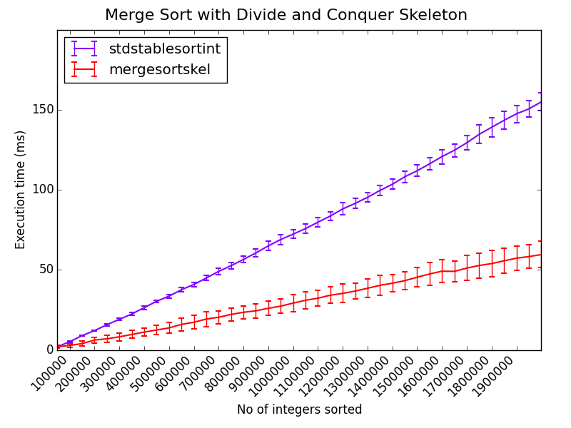

# September 2014

## Friday 12th

### Notes for next supervisor meeting:

 * Weekly (?) meetings with Pavlos
 * Need to know convenient times
 * Logbook / meeting notes:
   * Same as undergrad project: [Markdown log hosted on GitHub](https://github.com/ChrisCummins/pip-db/blob/master/Documentation/Log.md)?
 * MSc project
   * LLVM good, GCC bad
   * [Algorithmic Skeletons: Structured Management of Parallel Computation](https://www.google.co.uk/url?sa=t&rct=j&q=&esrc=s&source=web&cd=2&ved=0CCkQFjAB&url=http%3A%2F%2Fhomepages.inf.ed.ac.uk%2Fmic%2FPubs%2Fskeletonbook.ps.gz&ei=2f0WVNfmF47saNyigIAN&usg=AFQjCNGcrR6rY75gPqfz7y4Dr_Ztj48_dg&sig2=SNZO8I1r1oor05uXABraUA&bvm=bv.75097201,d.d2s&cad=rja)
     * Extended version of PhD thesis
     * "Increase raw performance by replication as well as by
       miniaturisation"
   * Similarities to HOF in functional languages
   * C++ Templates
     * What advantages over function pointers in C?
   * Compiled languages vs runtimes
     * There are some interesting lesser used languages with features
       that would simplify the task of auto parallelising.
     * E.g. Clojure: "For the concurrent programming future,
       pervasive, unmoderated mutation simply has to go".
     * Supposedly Haskell is even more "pure" and so capable of
       implicit parallelisation.

### Courses

Deadline 22/9/14, although choices are "not binding at this stage".

 * [Compiler Optimisation](http://www.inf.ed.ac.uk/teaching/courses/copt/)
   * Michael O'Boyle / Hugh Leather ?
   * 10 credits
   * Semester 2

 * [Probabilistic Modelling and Reasoning](http://www.inf.ed.ac.uk/teaching/courses/pmr/)
   * Amos Storkey
   * 10 credits
   * Semester 2

 * [Advances in Programming Languages](http://www.inf.ed.ac.uk/teaching/courses/apl/2014-2015/)
   * Ian Stark
   * 10 credits
   * Semester 1

 * [Machine Learning and Pattern Recognition](http://www.inf.ed.ac.uk/teaching/courses/mlpr/)
   * Chris Williams and Iain Murray
   * 10 credits
   * Semester 1
   * Tuesdays and Fridays, 10-10:50 am

 * [Parallel Design Patterns](http://www.epcc.ed.ac.uk/education-training/training/course-portfolio/parallel-design-patterns)

 * [Advanced Parallel Programming](http://www.epcc.ed.ac.uk/education-training/training/course-portfolio/advanced-parallel-programming)


## Monday 15th

Could we perform static analysis in JIT runtime?
[Relevant discussion](https://www.usenix.org/legacy/event/jvm02/yu/yu_html/node3.html).

**Persistent data structure:** a data structure that always preserves
the previous version of itself when modified. Thus effectively
immutable, as operations do not update the structure in-place, but
yield a new updated structure.

### TODO:

1. Decide on courses
1. Investigate MSc project options
1. Read [Hacker's guide to LLVM](http://www.aosabook.org/en/llvm.html)
1. Work through machine learning maths preliminaries
1. Work through a practical MPI tutorial
1. Read up on C++ templating
1. Concurrent programming pattern: Actor
1. Become familiar with Haskell, Scala, and Erlang
1. Take out relevant library books:
   * Mathematics for Engineers - Croft and Davison
   * Data Mining: Practical Machine Learning Tools and Techniques

### Notes from meeting with Pavlos & Hugh

Google hangout 9pm

 * The HOF component of Skeletons becomes less interesting/relevant as
   the complexity of skeletons grow. So something simple like divide
   and conquer could be implemented in a small amount of code, but
   complexity comes from the mechanics of parallelising, adding
   robustness, coordinating heterogeneous devices etc.

 * It may be more difficult to get work published for "non-standard"
   languages:
   * E.g. If the majority of published work is in C++, then an
     implementation in Clojure would be compare unfavourably in terms
     of performance.

 * Get organised about making notes on papers when reading them. There
   will be a *lot* of reading, so a good database of notes is
   essential. There are applications to help manage these.

 * It's important to get an understanding of the conferences and
   competitors in your field, so as to know *who* and *what* to keep
   an eye on.

 * **TODO:** In 2 months, create a spreadsheet of relevant competitors
   and conferences. Include paper submission deadlines, dates for
   publishing proceedings, etc.

 * **TODO:** Re-implement the memory read/write instrumentation from
   the programming assessment for LLVM, or implement something of
   comparable interest.

 * **TODO:** Implement a simple sequential divide and conquer skeleton
   in C++.

 * The reading club will restart at some point. Non-mandatory since
   MSc but relevant/useful.

 * **TODO:** At some point, I should pick a paper to critically
   analyse for Pavlos and Hugh. Same as reading club but on one-to-one
   basis.


## Tuesday 16th

There are weekly lectures for Pervasive Parallelism module on Tuesdays
and Thursdays, 15:10-16:00 in the Faculty Room South, David Hume
Tower.

Reference management software to test:

 * Mendeley 7
 * Zotero 6
 * Jabref 4
 * BibDesk 3 (only runs on Mac)
 * Endnote 1
 * Refworks 1

TODO:

 * Read The Researcher's Bible - DONE
 * Find one relevant conference / competitor and note details - DONE
 * Follow a practical tutorial on MPI
 * Find an up-to-date paper on Skeletons - DONE
 * Begin working through MLPR background maths sheet - DONE

### Notes on "[Learning from Data: Supplementary Mathematics](http://www.inf.ed.ac.uk/teaching/courses/mlpr/notes/mlpr-supplementary-maths.pdf)" (D Barber)

Scalar - a quantitity which "has magnitude but which is not related to
any definite direction in space."

Vectors - "It has magnitude and is also related to a definite
direction in space." When representing vectors as letters, they are
often underlined. In print, the are represented using either boldface
or a directional arrow above the letter.

Norm - another term for the length/magnitude of a vector.

Vector addition - using parallelogram law. Commutative and
associative.

Coplanar - in the same plane.

Position vectors - "The point *P* can be represented by the position
vector **p**, which is a vector whose initial point is the origin of
the coordinate system."

Unit vectors along the direction of the coodinate axes *X, Y, Z* are
commonly denoted as **i** = (1, 0, 0), **j** = (0, 1, 0), **k** = (0,
0, 1).

There's a bunch of mathematical symbols (esp. regarding set theory)
which I'm unfamiliar with. Should be sure to work through
[the list](http://en.wikipedia.org/wiki/List_of_mathematical_symbols).


### Notes on [The Researcher's Bible](http://homepages.inf.ed.ac.uk/bundy/how-tos/resbible.html)

 * The thesis + viva is to prove:

> that the student is capable of pursuing original research making a
> significant contribution to knowledge or understanding in the field
> of study, relating particular research projects to the general body
> of knowledge in the field, and presenting the results of the
> research in a critical and scholarly way.
> ([regulation 40](http://www.drps.ed.ac.uk/14-15/regulations/postgrad.php#Grounds))

 * American PhD students spend 5/6 years studying.
 * Read the literature and talk to fellow workers to find out what the
   state of the art is. In particular, check the further work section
   of papers for ideas for research.
 * After choosing a topic:
   * Read the literature.
   * Talk to people.
   * Tackle a simplified version of the problem.
   * Write down ideas in a working paper.
   * Give a talk to a small group.
 * "Your program must be explainable at a higher level than code, for
   it to make a real contribution to knowledge. Try to plan your
   program theoretically before going to the terminal."
 * Set aside a part of the week for reading reviews and abstracts and
   skimming papers.
 * Pick a "non-threatening, attractive task" to start each day with.
 * Do not underestimate the importance of being enthusiastic about
   your research topic.
 * "Beginning students tend to underestimate the worthiness and
   overestimate the doability of projects".
 * Do not focus on implementation and performance at the expense of
   vauge assumptions and principles.
 * Make writing a regular part of your life. Document:
   * Ideas you have
   * Documentation of programs
   * Lecture notes
   * Notes on papers
 * [Edinburgh publications](http://www.ed.ac.uk/schools-departments/informatics/research/publications/)
 * Advice for writing:
   * A paper should have a clear message that you understand and is
     repeated in the title, abstract, introduction, conclusion, and
     structure.
   * Think of your audience as intelligent, but (a) ignorant and (b)
     given to wilful misunderstanding.
   * A reader should get the main idea of the paper from the first
     page. Long rambling introductions should be pruned ruthlessly.
   * The basic framework for a scientific paper is: what
     claim/hypothesis am I making and what is the evidence for this
     claim.
   * Have a particular reader in mind to keep the technical standard
     of the paper uniform.
   * Clearly state what is new or better about what you have done.
   * A bi-directional combination of top down and bottom up writings
     styles is the most successful.
 * Advice for reading:
   * Think of the work of others as arranged in concentric circles
     around your own.
   * Outer circle - skim papers and abstracts to achieve appropriate
     level of familliarity with this circle. Set aside an hour each
     week to skim the latest arrivals.
   * Middle circle - Read some papers right through and discuss with
     others. Write a paragraph on each paper as you read it.
   * Inner circle - deep understanding, requiring several reads of a
     paper. Work through examples. Talk to the author about it. Write
     to them with a list of queries and/or criticisms. Teach it to
     others.
  * Have a succinct answer prepared for the question "what do you
    consider to be the key contributions in your thesis?"


### Notes from Ppar Lecture

3:10pm Murray Cole

Lecture Notes: http://www.inf.ed.ac.uk/teaching/courses/ppar/

 * Read ahead lecture material and course texts.
 * **14/10/14** - I give Davide Pinato's presentation about 2
     scientific papers.
 * **21/10/14** - Martin Ruefenacht presents my material about 2
     scientific papers.
 * You should aim to read 10-20 papers per week
   (abstract+conclusions).
 * **TODO:** Read through miscellaneous resources section of lecture
     slides.
 * **TODO:** Pick 2 interesting papers within the "inner circle" and
   discuss with Pavlos.
 * Read project proposals, in order to learn how to write better
   project proposals.

First presentation content:

 * Context
 * Key contribution
 * Impact
 * Critical reflection

Today's relevant conference was PLDI (see google doc).


## Wednesday 17th

Have set up Mendeley account to use for tracking notes on acadaemic
papers.

Skeletons:

> structured parallel programming abstraction that provide programmers
> with a predefined set of algorithmic templates that can be combined,
> nest and parameterized with sequential code to produce complex
> programs.
> ([Reference](http://homepages.inf.ed.ac.uk/hleather/publications/2012_autotuneparallelskeletons_ppl.pdf))

[Monte Carlo methods](http://en.wikipedia.org/wiki/Monte_Carlo) -
class of algorithms that rely on repeated random sampling to obtain
numerical results. Often used when it is difficult or impossible to
obtain a closed-form expression, or unfeasible to apply a
deterministic algorithm.

### Second Ppar lunch

Pavlos' advice on finding relevant literature:

 * Start with google scholar searches.
 * Search by keyword, rank by number of citations.
 * Once you find relevant papers, look at related reading.
 * If you have an important paper, look for other papers which cite
   it. E.g. for algorithmic skeletons, almost every paper cites
   Murray.

Pavlos is away from 2-12th October, so must organise around that.

For the machine learning courses, it may not be required to go into a
deep mathematical understanding for most uses, although it would
obviously help when things go wrong. A important field of maths is
statistics for researchers.

[Confidence interval](http://en.wikipedia.org/wiki/Confidence_interval)
- a measure of reliability of an estimate. If confidence intervals are
  constructed across many separate data analyses of repeated
  experiments, the proportion of such intervals that contain the true
  value of the parameter will match the confidence level.

### Notes on [What is a Literature Review](https://www.wiki.ed.ac.uk/pages/viewpage.action?title=What+is+a+Literature+Review&spaceKey=irrirpwiki)

> a summary and critical evaluation of all the knowledge pertaining to
> a specific research question, which has already been established by
> other researchers.

 * Identifies gaps in the field
 * Critically comments on the methods of the previous research
 * May group the research into themes or topics.
 * Start out broad, then become more specific (inverted pyramid).

```
-----------------------------
 \                         /      Broad issues
  \                       /
   \---------------------/
    \                   /         Studies which overlap
     \                 /          with your research
      \               /
       \-------------/
        \           /             Studies that are directly
         \         /              related to your investigation
          \       /
           \     /
            \   /
             \ /
              X
```

 * First briefly explain the broad issues.
 * Then narrow the focus to deal with the studies related to the
   subject area of your question.
 * Finally, hone in on research which is directly related to the
   specific research question.

[Further reading](http://www.ais.up.ac.za/med/tnm800/tnmwritingliteraturereviewlie.htm).


## Thursday 18th

 * Added skeleton LaTeX files for project proposal, based on pip-db
   report.
 * Started working through C++ template and MPI examples and programs,
   staring simple while gaining familiarity with syntax/paradigms
   (what happened to all the pointers??).

### Differences between C++ Templating engine and C pre-processor

 * There are superficial similarities between the goals of C++
   templates and some C libraries (E.g. GLib).
 * The major difference between the two is that templates are a
   *compile time* feature, whereas the pre-processor is purely textual
   substitution.
 * This means that Templates are type aware, and (to a greater or
   lesser extent) capable of performing more advanced optimisation and
   verification than would be possible purely with the
   pre-processor. E.g. "If a function is passed in as a template
   parameter, you can't tell how complex it is or transform it in any
   white box way."

Today's relevant conference was HiPEAC (see google doc).


## Friday 19th

## Notes on [Statistics Tutorial](https://explorable.com/statistics-tutorial)

```
statistical_methods(raw_data) = data_set
```

Calculations of central tendency (mean - arithmetic or geometric,
media, or mode) assume normal distribution of data.

Statistics for research involves understanding:

1. the relationship between probability and statistics.
1. the two major branches of statistics: descriptive statistics and
   inferential statistics.
1. how statistics relates to the scientific method.

[Reentrant](http://en.wikipedia.org/wiki/Reentrancy_(computing)) - A
subroutine is reentrant if it can be interrupted during its execution
and then safely called again before its previous invocations complete
execution. E.g.

[Simulated annealing](http://en.wikipedia.org/wiki/Simulated_annealing) -
A generic probabilistic metaheuristic for the global optimization
problem of locating a good approximation to the global optimum of a
given function in a large search space.


### Notes on Divide and Conquer skeleton

Some early thoughts on how I think a generic divide and conquer
template would behave:

```
User defined functions:

   bool  Dac::isIndivisble(T)  - Determine whether to split "T" or solve
   T ... DaC::split(T)         - Split a "T" into 2 or more "T" subcomponents
   T     DaC::process(T)       - The "solution" function (e.g. in merge sort,
                                 return the single element sorted list)
   T     DaC::merge(T, T, ...) - Combine 2 or more "T"s into a single T
```

The constructor for the skeleton would accept these functions as
arguments, as well as a dataset. There would need to be a getter
function for returning the processed (divided and conquered) data:

```
   DaC(isIndivisible, split, process, merge, data)
   Dac::get()
```

The getter could behave in one of two ways, depending on when we start
to process the data:

 * If the skeleton were to begin processing the data *immediately*
   upon construction, then the getter would simply return the
   processed data (if available), else block.
 * If the skeleton deferred processing of the data until the data is
   requested, then invoking the getter method would begin this
   process, and block until completion.

The former method seems much more intuitive, although it would be
simple enough to add a flag to the constructor which enabled the lazy
evaluation of data if the user desired.


### Notes from Ppar Lecture

3:10pm Hugh - How to give a conference presentation

 * Conference presentation comes *after* paper is published, but
   shouldn't be derivative of.
 * Presentation is advert for paper.
 * complicated != smart.
 * Memorise speech for first few slides and stick to a slow tempo.
 * Lead with important message, but intro sets context and should get
   audience thinking about problem.
 * Ask Murray about joining CArD mailing list.


I've implemented a simple Divide and Conquer template skeleton in C++,
will make a couple of specialisations for it on Monday (I've only got
MergeSort atm) and have a play around with it.


## Monday 22nd

I spent a little bit of time at the weekend (too eager) adapting the
divide and conquer template to a fixed depth (FDDC) design.

I need to critically consider memory allocation before going any
further, since the hacked-together implementation from Friday no-doubt
leaks memory like a sieve. Should the muscle functions be responsible
for allocating data? Possibilities include:

 * Muscle functions are responsible for allocating new memory when
   processing data, and releasing old data.
 * The skeleton is responsible for allocating *all* memory, and the
   muscle functions accept out parameters and write to them (not
   possible for `split()` unless the skeleton knows the size of the
   split data ahead of time).
 * Muscle functions operating *in-place* where possible (not possible
   for something like `split()`.

### First attempt at designing a DC skeleton

Here's the basic skeleton template (just the muscle function
declarations):

```
DC<T> {
    bool isIndivisible(T)
    T[]  split(T)
    T    solve(T)
    T    merge(T[])
}
```

And here's pseudo-code for the `divide_and_conquer()` function, which
does the actual work:

```
divide_and_conquer(T) {
    if isIndivisible(T):
        return solve(T)
    else:
        return merge(map(divide_and_conquer, split(T)))
}
```

Note that we can use the C++
[transform](http://www.cplusplus.com/reference/algorithm/transform/)
function to perform the `map(divide_and_conquer, split(T))`
transformation.


### Questions and thoughts on DaC

 * Could a `split()` operation ever produce *more* data than goes into
   it? For a merge sort, it simply splits a list in two.
 * Could a divide and conquer algorithm ever transform the *type* of
   data? For merge sort, it's `merge_sort(list<A>) : list<A>`. Could
   there be a DaC algorithm where the `solve()` function had a
   different data type for its input and output?
 * Is there a divide and conquer algorithm which *can't* be expressed
   using a fixed depth? E.g. for merge sort, `split()` always returns
   2 lists. Could there be a `split()` which returns *n* lists, where
   the value of *n* is dependent on the input data?
 * Similarly, is there any divide and conquer algorithm for which the
   `split()` function *doesn't* perform an even split? E.g. in merge
   sort, a split operation on a list of 100 items will return two
   lists, each containing 50 items. Are there split operations that
   would return lists of different length? (excluding of course when
   the input size is odd).
 * Is there a divide and conquer algorithm for which the input *T*
   *can't* be expressed using vectors? E.g. for merge sort, we use
   list<A>. Does any DaC algorithm *not* perform on
   lists/arrays/vectors?
 * Would it be useful to augment the `divide_and_conquer()` function
   with a parameter which indicates it's *depth*? E.g. adding a
   integer `depth` parameter:

```
divide_and_conquer(T, depth) {
    if isIndivisible(T):
        return solve(T)
    else:
        return merge(map(divide_and_conquer, split(T), depth++))
}
```

```
struct data {
    void  *data;
    size_t element_size;
    int    length;
};

FDDC<T> {
    bool isIndivisible(T*)
    T**  split(T*)
    T*   solve(T*)
    T*   merge(T**)
}
```

To see examine the size of individual functions in a C++ executable:

```
$ nm -CSr --size-sort a.out
0000000000400c35 00000000000001c8 T merge(vector<int>*, vector<int>*, vector<int>*)
0000000000400dfd 0000000000000130 T divide_and_conquer(vector<int>*, vector<int>*, int)
0000000000400a9f 0000000000000115 T split(vector<int>*, vector<int>*, vector<int>*)
00000000006016c0 0000000000000110 B std::cout@@GLIBCXX_3.4
0000000000400f2d 00000000000000ef T main
...
```

Testing the new dac implementation, sorting 1,000,000 integers:

```
$ valgrind --max-stackframe=4000040 ./dac
...
==544== HEAP SUMMARY:
==544==     in use at exit: 16 bytes in 1 blocks
==544==   total heap usage: 4,999,998 allocs, 4,999,997 frees, 235,611,352 bytes allocated
==544==
==544== LEAK SUMMARY:
==544==    definitely lost: 16 bytes in 1 blocks
==544==    indirectly lost: 0 bytes in 0 blocks
==544==      possibly lost: 0 bytes in 0 blocks
==544==    still reachable: 0 bytes in 0 blocks
==544==         suppressed: 0 bytes in 0 blocks
```

And the DC template implementation:

```
$ valgrind --max-stackframe=4000040 ./dc-merge-sort
...
==599== HEAP SUMMARY:
==599==     in use at exit: 0 bytes in 0 blocks
==599==   total heap usage: 2,131,044 allocs, 2,131,044 frees, 83,934,244 bytes allocated
==599==
==599== All heap blocks were freed -- no leaks are possible
```

Time comparison:

```
./dac
Time to sort  100000 integers:   34 ms
./dc-merge-sort
Time to sort  100000 integers:  606 ms
./fddc-merge-sort
Time to sort  100000 integers:  636 ms
```

DC merge sort after optimising the vector usage in `merge()`:

```
$ valgrind --max-stackframe=4000040 ./dc-merge-sort
...
==1690== HEAP SUMMARY:
==1690==     in use at exit: 0 bytes in 0 blocks
==1690==   total heap usage: 1,899,990 allocs, 1,899,990 frees, 73,281,312 bytes allocated
==1690==
==1690== All heap blocks were freed -- no leaks are possible
```

Comparison of timings as of commit 03f2b01:

```
./dac
Time to sort  200000 integers:   58 ms
Time to sort  400000 integers:   97 ms
Time to sort  600000 integers:  145 ms
Time to sort  800000 integers:  197 ms
Time to sort 1000000 integers:  268 ms
Time to sort 1200000 integers:  297 ms
Time to sort 1400000 integers:  363 ms
Time to sort 1600000 integers:  401 ms
Time to sort 1800000 integers:  505 ms
Time to sort 2000000 integers:  515 ms
./dc-merge-sort
Time to sort  200000 integers:  144 ms
Time to sort  400000 integers:  284 ms
Time to sort  600000 integers:  421 ms
Time to sort  800000 integers:  555 ms
Time to sort 1000000 integers:  706 ms
Time to sort 1200000 integers:  855 ms
Time to sort 1400000 integers:  989 ms
Time to sort 1600000 integers: 1197 ms
Time to sort 1800000 integers: 1308 ms
Time to sort 2000000 integers: 1443 ms
./fddc-merge-sort
Time to sort   25000 integers:   12 ms
Time to sort   50000 integers:   31 ms
Time to sort   75000 integers:   42 ms
Time to sort  100000 integers:   57 ms
Time to sort  125000 integers:   70 ms
Time to sort  150000 integers:   84 ms
Time to sort  175000 integers:   90 ms
Time to sort  200000 integers:  105 ms
./lib-sort
std::sort:
Time to sort  200000 integers:    8 ms
Time to sort  400000 integers:   19 ms
Time to sort  600000 integers:   30 ms
Time to sort  800000 integers:   45 ms
Time to sort 1000000 integers:   54 ms
Time to sort 1200000 integers:   61 ms
Time to sort 1400000 integers:   74 ms
Time to sort 1600000 integers:   86 ms
Time to sort 1800000 integers:   97 ms
Time to sort 2000000 integers:  107 ms
std::sort_stable:
Time to sort  200000 integers:   11 ms
Time to sort  400000 integers:   22 ms
Time to sort  600000 integers:   47 ms
Time to sort  800000 integers:   57 ms
Time to sort 1000000 integers:   63 ms
Time to sort 1200000 integers:   75 ms
Time to sort 1400000 integers:   89 ms
Time to sort 1600000 integers:  103 ms
Time to sort 1800000 integers:  117 ms
Time to sort 2000000 integers:  136 ms
```


## Tuesday 23rd

Comparing profiles of `dac` with `dc-merge-sort`:

```
$ gprof dac gmon.out | less
...
 %   cumulative   self              self     total
 time   seconds   seconds    calls  ms/call  ms/call  name
 79.23      0.98     0.98 10999990     0.00     0.00  merge(vector<int> const&, vector<int> const&, vector<int>*)
  8.89      1.09     0.11                             test_dac_sort(unsigned long)
  6.47      1.17     0.08       10     8.02   112.78  divide_and_conquer(vector<int>*, vector<int>*, int)
  4.45      1.23     0.06 10999990     0.00     0.00  split(vector<int>*, vector<int>*, vector<int>*)
  0.81      1.24     0.01 11000000     0.00     0.00  solve(vector<int>*, vector<int>*)
  0.40      1.24     0.01                             isIndivisible(vector<int>*)
...
$ gprof dc-merge-sort gmon.out | less
...
  %   cumulative   self              self     total
 time   seconds   seconds    calls  ms/call  ms/call  name
 38.59      1.33     1.33       10   133.14   325.35  DC<std::vector<int, std::allocator<int> > >::_dac(std::vector<int, std::allocator<int> >)
 34.82      2.53     1.20 10999990     0.00     0.00  DC<std::vector<int, std::allocator<int> > >::merge(std::vector<std::vector<int, std::allocator<int> >, std::allocator<std::vector<int, std::allocator<int> > >
 20.89      3.25     0.72 10999990     0.00     0.00  DC<std::vector<int, std::allocator<int> > >::split(std::vector<int, std::allocator<int> >)
```

Wheres the `dac` implementation spends most of it's time in the
(understandably) expensive `merge()` operation, the DC skeleton
implementation has a much more even distribution of execution times
across the merge, split, and recursive functions. Possible reasons for
this:

 * The DC skeleton uses `sdt::vector<int>` objects instead of a custom
   vector class, and copying operations are more expensive.
 * Values are passed and returned by value, rather than out
   parameters. This could be cause for lot of additional memory
   copying.

Interestingly, a refactoring the `dac` implementation into a
skeleton-style template class provided a modest speedup:

```
dac
Time to sort  200000 integers:   62 ms
Time to sort  400000 integers:  111 ms
Time to sort  600000 integers:  163 ms
Time to sort  800000 integers:  220 ms
Time to sort 1000000 integers:  278 ms
Time to sort 1200000 integers:  332 ms
Time to sort 1400000 integers:  391 ms
Time to sort 1600000 integers:  441 ms
Time to sort 1800000 integers:  499 ms
Time to sort 2000000 integers:  569 ms
DC<int>
Time to sort  200000 integers:   58 ms
Time to sort  400000 integers:   96 ms
Time to sort  600000 integers:  150 ms
Time to sort  800000 integers:  217 ms
Time to sort 1000000 integers:  259 ms
Time to sort 1200000 integers:  306 ms
Time to sort 1400000 integers:  352 ms
Time to sort 1600000 integers:  411 ms
Time to sort 1800000 integers:  532 ms
Time to sort 2000000 integers:  514 ms
```

To recurse using a separate thread (C++ thread lib):

```
std::thread left(&DC<T>::divide_and_conquer, this, in_left, out_left, next_depth);
```

Number of nodes (*N*) in tree of depth *d*:

```
N = 1 + 1^2 + 2^2 ... d^2
```


## Wednesday 24th

Advice from Pavlos on finding relevant conferences:

 * There are websites which collate conferences and let you perform
   key word searches on them.
 * See where relevant researchers are publishing their work (e.g. look
   up Hugh's publication list).
 * Getting a reasonable list of relevant conferences shouldn't take
   more than 3-4 hours.

Weekly meetings with Pavlos organised for Friday 12pm.

### Notes on dac parallelisation

The number of threads spawned for each parallelisation depth:

```
parallelisation_depth  thread_count  (thread_count(d)-thread_count(d-1))
0                      1
1                      3             2
2                      7             4
3                      15            8
4                      31            15  <---  (!? not a power of 2)
5                      63            32
6                      127           64
7                      255           128
8                      511           256
```

So the series is:

```
n = 1 + 1^2 + 2^2 + 3^2 + ... + d^2
```

Which means that for a 4 core machine, we'd expect the optimum
parallelisation depth to be 2.


## Thursday 25th

### Notes for meeting with Pavlos

 * Skeleton implementation:
   * Fixed degree divide and conquer skeleton using C++ templates.
   * Muscle functions operate in-place (using out functions).
      * Some memory allocated by "worker" function (lots of heap
        thrashing).
      * split() and merge() function actually do majority of the heavy
        lifting, since we don't assume to know the size of the split /
        merged data. (could we predict this?)
   * Naive multi-threading using depth limit.
      * Lock free since we allocate memory in the parent thread.
   * Example merge sort implementation.
      * Testing on example data set.
      * Results of tests:
         * Non-linear performance (why?).
 * Next week: LLVM, and picking papers for Ppar presentation
 * Is there a budget for text books?


## Friday 26th

Cooley and Tukey's 1964 paper "An Algorithm for the Machine
Calculation of Complex Fourier Series" introduced the Fast Fourier
Transform. Improved discrete Fourier transform performance from O(n^2)
to O(n log n).

### Notes from meeting with Pavlos

 * DaC skeleton:
   * The skeleton provides an *interface* for the programmer to write
     solutions, so it should allow enough flexibility for the user to
     "do what they want" within the muscle functions, which could
     include:
     * Transforming data types within `solve()`.
     * Performing uneven `split()` operations, or even returning more
       data than went in.
     * Producing variable sized results for `split()` and `merge()`.
   * "Optimising" a skeleton doesn't mean improving memory allocation,
     so much as dividing the job into work for different devices,
     servers, cores, etc (perhaps using MPI).
   * I should look at
     [eSkel](http://homepages.inf.ed.ac.uk/mic/eSkel/) for a possible
     "real" skeleton implementation to examine.
   * We can assume that all DaC algorithms operate on vectors.
   * For this simple implementation exercise, the important thing
     isn't to produce something *better* than the existing solutions,
     but to understand the faults and be able to explain what
     does/doesn't work from my own attempt, and *why*.
   * gprof provides a good starting point for profiling. The three
     factors that will affect performance are:
     1. The size of the input problem.
     1. Allocating memory.
     1. The cost of creating new threads.
   * I should investigate the non-linear performance of my merge sort,
     looking particularly at the points in which the gradient of the
     execution time changes. This is a lot of heap thrashing, so we
     can expect shifts in performance to occur around points at which
     the system spends more time allocating memory (e.g. it may the
     same amount of time to allocate 7Kb as 4Kb, but twice as long to
     allocate 8Kb).
 * There is budget for "small research related purchases". Pavlos is
   going to ask Murray if that covers textbooks. I should make a list
   of the books I need.
 * Writing an LLVM phase should not take too long, and isn't beyond
   the scope of people without compiler knowledge.
 * Pavlos will be out of contact from next Thursday, so I should chase
   up any questions before then.


### Notes from meeting with Hugh and Pavlos

 * In C++, virtual functions are stored in v tables, so when a class
   is instantiated and a virtual function invoked, the program must
   first dereference the vtable, look up the function pointer, then
   dereference this in order to execute the function. C++ templates
   support passing in functions as parameters, so it may be possible
   to optimise out these layers of redirection and get rid of the need
   for virtual muscle functions.
 * When designing a skeleton, some things to consider:
   1. How much can the compiler optimise.
   1. Ease of use for the user/caller.
   1. What do other skeleton implementations do? How does yours
      compare against those?
 * I should consider how to representation the skeleton abstraction to
   the user. For ease of use, it would be better if the DaC skeleton
   was a function call, so that the merge sort would have the same
   usage as the stdlib sort functions.
 * Merge sort should be in-place.

TODO:

 * Modify the backend of the skeleton so that it performs in-place.
 * Redesign the front-end of the skeleton so that it is a simple
   function call.

Memory usage during test program for `std::stable_sort`:

```
==6177== HEAP SUMMARY:
==6177==     in use at exit: 7,804 bytes in 1 blocks
==6177==   total heap usage: 121 allocs, 120 frees, 328,008,444 bytes allocated
```

And the same test using my merge sort:

```
==6110== HEAP SUMMARY:
==6110==     in use at exit: 6,740 bytes in 1 blocks
==6110==   total heap usage: 168,500,601 allocs, 168,500,600 frees, 8,659,562,260 bytes allocated
```

So the bottleneck is pretty clear. Make the skeleton perform in-place.


## Sunday 28th

I've revisited "Introduction to Algorithms" sections 2.3.1 (merge
sort):

 * Terminology: divide, conquer, combine (instead of split, solve,
   merge).
 * Merge sort using sentinels and array indices `left`, `mid`,
   `right`:

```
Merge(A, left, mid, right):
    n1 = mid - left + 1   // Length of left subarray
    n2 = right - mid      // Length of right subarray

    // Copy left subarray and append sentinel
    L[] = new array(n1+1)
    for (i = 0; i < n1; i++):
        L[i] = A[left + i]
    L[n1] = sentinel()

    // Copy right subarray and append sentinel
    R[] = new array(n2+1)
    for (i = 0; i < n2; i++):
        R[i] = A[right + i]
    R[n2] = sentinel()

    l = 0, r = 0
    for (i = mid; i < right; i++):
        if L[l] <= R[r]:
            A[i] = L[l++]
        else:
            A[i] = R[r++]
```

 * Terminology: *recursion case* - when the problem can be divided and
   conquered recursively, *base case* - when the problem can be solved
   directly.
 * It is often profitable to "bottom out" before the problem size
   reaches 1, resorting to insertion sort for small enough
   vectors. This could be an optimisation worth exploring in the merge
   sort skeleton.


## Monday 29th

### Merge Sort Skeleton execution times

#### 14.09.26-10.00.00 and 14.09.26-15.47.20

 * Merge sort with lots of heap thrashing, no insertion sort
   optimisation.


#### 14.09.29-11.53.00

 * In-place merge sort, no insertion sort optimisation.


#### 14.09.29-13.07.59

 * In-place merge sort, with insertion sort being used to sort lists
   of 100 elements or less.


### 14.09.29-16.24.00

 * In-place merge sort using a *function template* skeleton, instead
   of an object orientated class based skeleton.




## Tuesday 30th

Task classification of skeletons:

 * Data-parallel skeletons
 * Task-parallel skeletons
 * Resolution skeletons

Functional classification of skeletons:

 * Coordination
 * Functional
 * Object-oriented
 * Imperative

TODO:

 * Optimise `merge()` to use only n/2 memory allocations (only copy
   left list to temporary memory).
 * Look up ITA's parallel merge algorithm.


# October 2014

## Wednesday 1st

Adam sent me a link to a
[parallel in-place merge sort](http://www.drdobbs.com/parallel/parallel-in-place-merge-sort/240169094)
implementation in C++ which could be useful for comparing against my
merge sort skeleton.

Papers *about* Skeletons:

 * Algorithmic Skeletons: Structured Management of Parallel Computation (Cole)
 * Bringing skeletons out of the closet (Cole)
 * A survey of algorithmic frameworks (Gonz)

Papers *using* Skeletons:

 * Auto-Tuning Parallel Skeletons (Collins)
 * Parallel Programming Using Skeleton Functions (Darlington)

Papers about Skeleton *implementations*:

 * Skil: an imperative language with algorithmic skeletons (Botorog)
 * Skandium: Multi-core Programming with Algorithmic Skeletons (Leyton)
 * Prototyping a Library of Algorithmic Skeletons (Javed)
 * HDC: a higher-order language for divide-and-conquer (Herrmann)
 * Flexible Skeletal Programming with eSkel (Benoit)
 * Shared Memory Multiprocessor Support for Functional Array Processing in SAC (Grelck)


### Notes from meeting with Pavlos

PPar presentation:
 * A good portion of the 15 minutes will be spent providing background
   to skeletons.
 * Start by explaining the horrors of parallel programming on modern
   hardware (heterogeneous, the requirement for both application and
   systems programming skills, etc). Present some existing solutions
   for this problem, and then introduce skeletons.
 * A good choice of papers would be one which defines the theory of
   skeletons, and one which describes a concrete
   implementation/framework.

Example usage of the STL sort function:

```
#define NUM_ELEMS 100000
int *a = get_big_array(NUM_ELEMS);

std::stable_sort(a, a + NUM_ELEMS);
```

Example usage of the Class based skeleton:

```
#define NUM_ELEMS 100000
int *a = get_big_array(NUM_ELEMS);

MergeSort<int> sort();

sort.set_data(a, a + NUM_ELEMS);
sort.set_parallelisation_depth(2);
sort.set_split_threshold(100);

sort.run();
```

Example usage of the skeleton function:

```
#define NUM_ELEMS 100000
int *a = get_big_array(NUM_ELEMS);

merge_sort(a, a + NUM_ELEMS);
```


## Thursday 2nd

The number of nodes *N* in a balanced binary tree of depth *d* can be
calculated as: `N = 2^d - 1`. So, to re-arrange with respect to *d*:

```
N = 2^d - 1
2^d = N + 1
log2(2^d) = log2(N + 1)
dlog2(2) = log2(N + 1)
d = log2(N + 1)
```


## Friday 3rd

Now that I have a working divide and conquer skeleton implemented, I'm
going to build Skandium and compare usage + execution times against
their Java skeleton framework.

 * Checked out `https://github.com/mleyton/Skandium.git` repo.
 * Imported sources into Eclipse (I couldn't figure out the build
   system that they were using, lots of strange errors about
   conflicting versions of dependencies).

### In-place Divide and Conquer

Divide and conquer algorithms tend to perform one of two tasks: either
they *solve* a problem in order to return a solution value, or they
*transform* the input data in some manner. For example, the max
subarray problem is a *solution* orientated DaC algorithm, in which
the input is an array and the output is an integer value for the
maximum value obtained in a subarray. The merge sort algorithm is an
example of a *transformation* DaC, in which the return value is a
sorted permutation of the input data. While it is possible to describe
transformation algorithms using the same terminology as solution
algorithms (in which the return data is a transformed permutation of
the input data), it is possible to optimise the transformation
algorithms by instead removing the return values and considering them
in-place.

### Notes on Max Subarray DaC

Psuedocode:

```
def max_subarray(A) {

    # is_indivisible:
    if len(A) == 1:
        # conquer:
        return A

    # divide:
    left = A[0:len(A/2)]
    right = A[len(A/2)+1:len(A)]

    # recurse:
    l = self(left)
    m = max_crossing_subarray(left, right)
    r = self(right)

    # combine:
    return max(l, m, r)
}

def max_crossing_subarray(L, R) {
    sum = 0, l = 0
    for i in reverse(L):
        sum += i
        l = max(l, sum)

    sum = 0, r = 0
    for i in R:
        sum += i
        r = max(r, sum)

    return l + r
}
```

And our divide and conquer skeleton:

```
def divide_and_conquer(T):
    if is_indivisible(T):
        return solve(T)
    else:
        return combine(map(divide_and_conquer, split(T)))
```

So mapping this to skeleton functions:

```
class Problem:
    this.left = T[]
    this.right = T[]

def is_indivisible(T):
    return len(T.right) or len(T.left) == 1

def solve(T):
    if len(T.right):
        sum = 0, l = 0
        for i in reverse(T.left):
            sum += i
            l = max(l, sum)

        sum = 0, r = 0
        for i in T.right:
            sum += i
            r = max(r, sum)

        return l + r
    else:
        return T.left[0]

def split(T):
    A = [3]
    mid = len(T.left) / 2
    A[0] = T.left[0:mid]
    A[1] = T.left[mid:]
    A[2] = {A[0], A[1]}
    return A

def combine(T[]):
    return max(T)
```


## Tuesday 7th

There are two possible areas for research in algorithmic skeletons
which appear to lacking from the existing literature:

 * **Completely *transparently parallelising* skeletons**. The amount
   of explicit parallelisation support required from the user of
   Skeletons varies from framework to framework. For example, Skandium
   offers fairly a abstracted view of computation, but still requires
   the user to set the number of threads (i.e. declare the available
   resources), and to wrap shared memory access in muscle functions
   with `synchronized` constructs. By contrast, eSkel requires
   absolute explicit control of parallelisation by building on top of
   MPI, and so would have a relatively high cost-of-entry for anyone
   who is looking to parallelise a sequential program (at a minimum,
   they would need to refactor their code to use MPI/eSkel data
   structures, and add in coordination logic for the master/slave
   processes). This leaves room for the development of a skeleton
   framework which performs the parallelisation entirely
   transparently. This would allow users to simply replace existing
   sequential constructs with their skeleton equivalent *without*
   having to concern themselves with any of the additional
   complexities such as coordinating available resources, or even
   being aware that the skeleton operates in parallel. For example, my
   simple `merge_sort()` skeleton could serve as a direct replacement
   for any call to the STL stable sort function, and would "magically"
   offer the user a ~x2.8 speedup. This ideal library of "drop-in"
   replacements would satisfy two of Cole's pragmatic skeleton
   manifesto:

     * Propagate the concept with minimal conceptual disruption.
     * Show the pay-back.

 * **Intelligent skeletons which determine *when* to
   parallelise**. Skeletons provide the necessary coordination logic
   to take a selection of muscle functions and to parallelise
   them. However, there appears to be no skeleton implementations
   which attempt to determine *when* to parallelise a muscle function
   by analysing the muscle function itself. For example, in the case
   of a merge sort skeleton, you would expect full parallelisation
   when dealing with large datasets. However, if only sorting 10
   elements, then the cost of coordinating separate threads and shared
   memory access may be greater than simply executing
   sequentially. Similarly, a divide and conquer skeleton may apply
   heuristics to the individual divide, conquer, and combine muscles
   to determine which are the most computationally expensive, and so
   which would benefit most from parallelisation. In the case of merge
   sort, the `conquer()` muscle simply returns a single element array,
   but for a max-subarray skeleton, the `conquer()` muscle can perform
   many more operations, totalling up the maximum value of two
   subarrays. In this case, an "intelligent" skeleton may decide
   (either at compile or execution time) to execute merge sort conquer
   muscle sequentially, but to parallelise the equivalent muscle for
   max-subarray.


## Thursday 9th

### Building LLVM:

1. Clone https://github.com/llvm-mirror/llvm.git.
1. Clone https://github.com/llvm-mirror/clang.git into `llvm/tools`.
1. Clone https://github.com/llvm-mirror/clang-tools-extra.git into
   `llvm/tools/clang/tools`.
1. Clone https://github.com/llvm-mirror/compiler-rt.git into
   `llvm/projects`.
1. Clone https://github.com/llvm-mirror/test-suite.git into `llvm/projects`.
1. Out of tree build: `mkdir build && cd build && ../configure &&
   make`

### Execute LLVM bitcode natively

Load kernel module:

```
mount binfmt_misc -t binfmt_misc /proc/sys/fs/binfmt_misc
```

Persistent mount with `/etc/fstab`:

```
# Execute arbitrary file formats as executables
none  /proc/sys/fs/binfmt_misc binfmt_misc defaults 0 0
```

See the Arch Wiki
[binfmt_misc](https://wiki.archlinux.org/index.php/Binfmt_misc_for_Java#Registering_the_file_type_with_binfmt_misc)
page for instructions on Java Wrappers. For native execution of LLVM
bitcode (NOTE: `/bin/lli` is system specific):

```
% echo ':llvm:M::BC::/bin/lli:' > /proc/sys/fs/binfmt_misc/register
```

To emit bitcode:

```
$ clang -emit-llvm hello.c -c -o hello.bc
$ chmod +x hello.bc
$ ./hello.bc
```

To emit bytecode:

```
$ clang -emit-llvm hello.c -S -o hello.ll
```

To compile bitcode to native assembly:

```
$ llc hello.bc -o hello.s
```

To disassemble bitcode to LLVM IR:

```
$ llvm-dis < hello.bc
```

A totally manual compilation process:

```
# Compile source code to bytecode:
$ clang -emit-llvm hello.c -S -o hello.ll
# Compile bytecode to bitcode:
$ clang -emit-llvm hello.ll -c -o hello.bc
# Compile bitcode to native assembly:
$ llc hello.bc -o hello.s
# Compile native assembly to DSO:
$ clang hello.s -c -o hello.o
# Link DSO to executable:
$ clang hello.o -o hello
```

And for multiple files:

```
# C source code to bytecode:
$ clang -emit-llvm hello.c -S -o hello.ll
$ clang -emit-llvm foo.c -S -o foo.ll
# Link:
$ clang foo.ll hello.ll -o hello
```


## Saturday 11th

The
[Microsoft Academic Search tool](http://academic.research.microsoft.com/Keyword/1231/algorithmic-skeletons?query=algorithmic%20skeletons)
has some really nice meta properties about searches, such as lists of
relevant conferences and journals, visualisations of citations, etc.


## Sunday 12th

Example Hello World LLVM pass invocation:

```
$ Debug+Asserts/bin/opt -load Debug+Asserts/lib/LLVMHello.so -stats -hello < ~/hello.bc > hello.bc
```


## Monday 13th

Pavlos' tips for critically reviewing papers:

1. The most common criticism for technical papers is errors in the
   experimental method. Was their evaluation sound? Did they compare
   their results with existing solutions?
1. For theoretical papers, the criticism usually centres around
   finding errors in the author's fundamental reasoning or argument.


## Tuesday 14th

The library has a copy of Structured Parallel Programming: Patterns
for Efficient Computation (2008) in
[PDF format](http://www.sciencedirect.com.ezproxy.is.ed.ac.uk/science/book/9780124159938). This
should be high up on my reading list.

TODO: Install `intel-tbb` on `cec`.


## Wednesday 15th

Useful reading in clang's C++ template handling:

 * [The Dreaded Two-Phase Name Lookup](http://blog.llvm.org/2009/12/dreaded-two-phase-name-lookup.html)

An experiment to see if C++ template information is carried into LLVM
bytecode. Take the following C++ program:

```
int add(int a, int b) {
  return a + b;
}

double fadd(double a, double b) {
  return a + b;
}

int main() {
  double x = add(0.0, 0.0);                // Double
  return     add(static_cast<int>(x), 0);  // Integer
}
```

When compiled with clang++ -O0, this generates the following bytecode:

```
; ModuleID = 'test.cc'
target datalayout = "e-m:e-i64:64-f80:128-n8:16:32:64-S128"
target triple = "x86_64-unknown-linux-gnu"

; Function Attrs: nounwind uwtable
define i32 @_Z3addii(i32 %a, i32 %b) #0 {
  %1 = alloca i32, align 4
  %2 = alloca i32, align 4
  call void @mcount() #1
  store i32 %a, i32* %1, align 4
  store i32 %b, i32* %2, align 4
  %3 = load i32* %1, align 4
  %4 = load i32* %2, align 4
  %5 = add nsw i32 %3, %4
  ret i32 %5
}

declare void @mcount()

; Function Attrs: nounwind uwtable
define double @_Z4fadddd(double %a, double %b) #0 {
  %1 = alloca double, align 8
  %2 = alloca double, align 8
  call void @mcount() #1
  store double %a, double* %1, align 8
  store double %b, double* %2, align 8
  %3 = load double* %1, align 8
  %4 = load double* %2, align 8
  %5 = fadd double %3, %4
  ret double %5
}

; Function Attrs: nounwind uwtable
define i32 @main() #0 {
  %1 = alloca i32, align 4
  %x = alloca double, align 8
  call void @mcount() #1
  store i32 0, i32* %1
  %2 = call i32 @_Z3addii(i32 0, i32 0)
  %3 = sitofp i32 %2 to double
  store double %3, double* %x, align 8
  %4 = load double* %x, align 8
  %5 = fptosi double %4 to i32
  %6 = call i32 @_Z3addii(i32 %5, i32 0)
  ret i32 %6
}

attributes #0 = { nounwind uwtable "less-precise-fpmad"="false" "no-frame-pointer-elim"="true" "no-frame-pointer-elim-non-leaf" "no-infs-fp-math"="false" "no-nans-fp-math"="false" "stack-protector-buffer-size"="8" "unsafe-fp-math"="false" "use-soft-float"="false" }
attributes #1 = { nounwind }

!llvm.ident = !{!0}

!0 = metadata !{metadata !"clang version 3.5.0 (tags/RELEASE_350/final)"}
```

We then refactor the two distinct `add` functions into a single
template function:

```
template<typename T>
T add(T a, T b) {
  return a + b;
}

int main() {
  float x = add(0.0, 0.0);                // Float
  return    add(static_cast<int>(x), 0);  // Integer
}
```

And compile this in the same way, generating the bytecode:

```
; ModuleID = 'test.cc'
target datalayout = "e-m:e-i64:64-f80:128-n8:16:32:64-S128"
target triple = "x86_64-unknown-linux-gnu"

; Function Attrs: uwtable
define i32 @main() #0 {
  %1 = alloca i32, align 4
  %x = alloca double, align 8
  call void @mcount() #2
  store i32 0, i32* %1
  %2 = call double @_Z3addIdET_S0_S0_(double 0.000000e+00, double 0.000000e+00)
  store double %2, double* %x, align 8
  %3 = load double* %x, align 8
  %4 = fptosi double %3 to i32
  %5 = call i32 @_Z3addIiET_S0_S0_(i32 %4, i32 0)
  ret i32 %5
}

declare void @mcount()

; Function Attrs: nounwind uwtable
define linkonce_odr double @_Z3addIdET_S0_S0_(double %a, double %b) #1 {
  %1 = alloca double, align 8
  %2 = alloca double, align 8
  call void @mcount() #2
  store double %a, double* %1, align 8
  store double %b, double* %2, align 8
  %3 = load double* %1, align 8
  %4 = load double* %2, align 8
  %5 = fadd double %3, %4
  ret double %5
}

; Function Attrs: nounwind uwtable
define linkonce_odr i32 @_Z3addIiET_S0_S0_(i32 %a, i32 %b) #1 {
  %1 = alloca i32, align 4
  %2 = alloca i32, align 4
  call void @mcount() #2
  store i32 %a, i32* %1, align 4
  store i32 %b, i32* %2, align 4
  %3 = load i32* %1, align 4
  %4 = load i32* %2, align 4
  %5 = add nsw i32 %3, %4
  ret i32 %5
}

attributes #0 = { uwtable "less-precise-fpmad"="false" "no-frame-pointer-elim"="true" "no-frame-pointer-elim-non-leaf" "no-infs-fp-math"="false" "no-nans-fp-math"="false" "stack-protector-buffer-size"="8" "unsafe-fp-math"="false" "use-soft-float"="false" }
attributes #1 = { nounwind uwtable "less-precise-fpmad"="false" "no-frame-pointer-elim"="true" "no-frame-pointer-elim-non-leaf" "no-infs-fp-math"="false" "no-nans-fp-math"="false" "stack-protector-buffer-size"="8" "unsafe-fp-math"="false" "use-soft-float"="false" }
attributes #2 = { nounwind }

!llvm.ident = !{!0}

!0 = metadata !{metadata !"clang version 3.5.0 (tags/RELEASE_350/final)"}
```

A comparison of the two sets of bytecodes:

 * In the template version, the functions appear in the order they are
instantiated; in the explicit version, the functions appear in the
order they are declared.

 * The functions instantiated from templates have a `linkonce_odr`
keyword annotation, explained
[here](http://llvm.org/docs/LangRef.html#linkage).


### Notes from meeting with Hugh and Pavlos

 * The first draft of a presentation *will* fail.
 * Typically, I'll need to supply a first draft to supervisors 3-5
   weeks before giving the presentation, in order to have adequate
   time to make modifications.

PPar slides:
 * There's no clear message. The presentation tries to cover too many
   topics and so doesn't cover any adequately.
 * Process for writing a presentation:
   * Decide on topics
   * Decide on the message
   * Sketch ideas on paper
   * Put sketches into computer
 * There's too much text. Don't use text where a diagram would
   suffice.
 * The psuedocode for DaC *doesn't* actually show how writing a
   parallelised skeleton would be hard.
 * The claim that parallel programming is hard is unsubstantiated.
 * Examples of skeletons in the "wild" include MapReduce and Intel
   TBB. Neither identify themselves as skeletons.
 * The presentation doesn't emphasise the *necessity* of skeletons.

Sloccount for intel-tbb:

```
Totals grouped by language (dominant language first):
cpp:         104704 (90.81%)
ansic:         9421 (8.17%)
asm:            441 (0.38%)
sh:             342 (0.30%)
java:           226 (0.20%)
objc:            98 (0.08%)
pascal:          68 (0.06%)

Total Physical Source Lines of Code (SLOC)                = 115,300
```

Sloccount for hadoop-common:

```
Totals grouped by language (dominant language first):
java:        827667 (96.19%)
ansic:        26658 (3.10%)
sh:            3733 (0.43%)
cpp:           1903 (0.22%)
python:         276 (0.03%)
perl:           211 (0.02%)

Total Physical Source Lines of Code (SLOC)                = 860,448
```

Sloccount for OpenMPI:

```
ansic:       664595 (87.32%)
cpp:          44461 (5.84%)
f90:          17980 (2.36%)
sh:           15848 (2.08%)
java:          7071 (0.93%)
perl:          5298 (0.70%)
python:        3202 (0.42%)
asm:           1291 (0.17%)
lex:            860 (0.11%)
fortran:        237 (0.03%)
csh:            172 (0.02%)
tcl:             39 (0.01%)
sed:             24 (0.00%)

Total Physical Source Lines of Code (SLOC)                = 761,078
```

The
[Parallel programming languages and systems](http://www.inf.ed.ac.uk/teaching/courses/ppls/)
course contains relevant notes and lecture material.


## Thursday 16th


### PPar Presentation

Topic: The direction of skeletons research

Message: Algorithmic Skeletons *are* the future of parallel programming.

Structure:

 * Writing robust parallel software is impossibly time
   consuming. (why? Provide evidence)
 * Algorithmic skeletons solve this time sink. (how?)
 * Algorithmic skeletons are *everywhere*.
 * This is how skeletons used to be designed: [1]
 * Why didn't [1] succeed?
 * This is how skeletons are designed now: [2]
 * Why does [2] succeed?
 * What pattern are we seeing?


## Notes from meeting with Hugh and Pavlos

Revised slides:

 * The opening description of the *purpose* of skeletons is a lot
   stronger, although now it's missing a high-level description of
   what skeletons actually *are*.
 * The topic of "future of skeleton research" is the weakest bit,
   since I'm not confident on it.
 * Instead, perhaps focus more on the differences between the two
   papers. What did I like about each? What didn't I like?
 * The skeleton manifesto can be dropped.


## Sunday 19th

### Reasoning about Algorithmic Skeletons

#### Claims
1. All computer hardware is parallel.
1. In order to gain continued performance improvements, programmers
   must write software for parallel hardware.
1. Writing parallel software requires prohibitive effort.
1. Common programming problems can be phrased in terms of reusable
   patterns of activities.
1. Algorithmic Skeletons are implementations of reusable patterns.
1. Algorithmic Skeletons can be parallelised.

#### Hypothesis

1. Algorithmic Skeletons can address the problem of prohibitive effort
   for parallel programming.

In order to justify this hypothesis, we require algorithmic skeletons
to:

1. Encapsulate a number of common patterns which are in *regular use*.
1. Be demonstrably *quicker* than serial or parallel implementations
   with equivalent effort.
1. Be demonstrably *easier to use* than parallel implementations with
   equivalent effort.
1. Be demonstrably *safer* to use (i.e. more robust) than parallel
   implementations with equivalent effort.

Problems with current Skeletons research:

1. They do not compare speed against *equivalent effort* parallel
   implementations. They either compare only against other skeletons
   implementations, or tuned parallelised implementations.
1. They compare themselves against different example problems, and
   often only one or two per publication.

Problems that Skeletons must address:

1. Nesting. Skeletons must be nest-able to arbitrary depths without
   problems.
1. Scalability. If Skeletons are to be widely adopted, then they must
   prove to be able to scale to realistically sized hardware.
1. Sequential performance. Similar to the scalability problem, we must
   be able to demonstrate that Skeletons will not significantly hamper
   performance when operating on only single core architectures.
1. Coordination overhead. The overhead required to orchestrate
   parallel execution must not be significant compared to the
   performance benefits of the parallelisation.
1. Error handling. Known behaviour for error conditions,
   e.g. exception handling.
1. Pattern abstraction. The appropriate granularity of abstraction
   must be chosen. For example, do we enforce all divide and conquer
   Skeletons to return a value, or do we have separate Skeletons to
   support in-place manipulation of data?

Potential innovations for Skeletons:

1. Runtime optimisations. Using instrumentation and profiling at
   runtime to further optimise execution. This could be as simple as
   determining what are the "hot" code paths and optimising for them,
   or there could be a mechanism for assigning weights to each muscle
   function and parallelising them appropriately.
1. Compiler optimisations. By using predefined patterns, it may be
   possible to further optimise performance by exploiting compile time
   (i.e. static) optimisations.

Possible MSc project idea:

Algorithmic skeletons offer flexible, generic patterns of computation,
yet their coordination logic is *inflexible*. This means that it could
be possible to invoke a skeleton in such a way that it would execute
in significantly *sub-optimal* time by simply supplying muscle
functions that do not fit with this inflexible model.

For example, in a divide and conquer skeleton, it may be assumed that
the `merge` muscle is a computationally intensive task, whereas the
`solve` muscle is comparatively cheap. The skeleton author may then
choose to parallelise execution of `merge` muscles, leaving the
`solve` muscles sequential. By instantiating this skeleton with a
computationally intensive `solve` muscle but a lightweight `merge`
muscle, the benefits of parallelising the `merge` muscle would be
negated.

The solution:

* For each *unit* of parallelism (e.g. muscle function, recursion,
  etc), assign a *weight*. The purpose of the weight is to provide an
  indicator of the amount of *work done* by a unit. This could either
  be a fixed constant value, or could depend on the size of input
  parameters.
* Use these assigned weights to determine *if* if it is profitable to
  parallelise a unit, or invoke it sequentially. A static heuristic
  could compare the weight of the unit against the cost of
  parallelistation (e.g. creating a new thread, or distributing the
  task).
* It would be easy to evaluate at compile time whether a unit will
  operate in fixed time or not.
* If the work done by a unit is constant, then the decision on whether
  to parallelise or not could be performed statically at compile time.
* If the work done depends on the size of the input parameters, then
  it could be expressed using the standard notation for time
  complexity. Decisions on whether or not to parallelise would have to
  be made at run-time.
* An alternative method of assigning weights to a function could be by
  actually measuring the system clock during run-time. This could give
  a reasonable approximation for units which are executed repeatedly,
  allowing the skeleton to build up a profile of the unit weights over
  the course of a program's lifetime.


## Tuesday 21st

Read an
[interesting blog post](http://blogs.msdn.com/b/vcblog/archive/2014/04/16/parallel-stl-democratizing-parallelism-in-c.aspx)
about Intel, NVIDIA, and Microsoft's collaborative effort to introduce
a parallelised version of the C++ STL, by each implementing their own
versions. Of particular interest is this excerpt:

> As is always the case with parallelization, not every program will
> benefit from using the Parallel STL, so don't just go sprinkling
> your STL code with par willy-nilly. You still need to find a
> bottleneck in your program that's worth parallelizing. In some
> cases, your program will need to be rewritten tobecome amenable to
> parallelism.

What we would need from a *truly* successful parallel STL is logic to
determine *when* to parallelise, so that the programmer would not have
to identify the performance bottlenecks themselves.


## Friday 24th

### Analysing performance of memory instrumentation

Sequential:
```
---------- INSTRUMENTATION ----------
Number of STORE instructions executed: 1382005059
Number of LOAD instructions executed:  1709966643
```

Parallelisation depth 2:
```
---------- INSTRUMENTATION ----------
Number of STORE instructions executed: 448304099
Number of LOAD instructions executed:  585520151
```

Why does the parallelised version require an order of magnitude fewer
stores/load? Perhaps it's a race condition in the counter increment
logic?


### 24.10.2014 meeting with Hugh and Pavlos:

 * MSc project question: furthering the existing work on auto-tuning
   skeletons by optimising static attributes, could we produce better
   results by considering dynamic attributes? Things to consider:
   * Iterative compilation is a crowded field, so the best chance of
     getting published is by performing these optimisations during
     run-time.
   * I should read some of the existing papers on run-time adaption
     (not just wrt. skeletons) to see what has already been done, and
     how + to what extent.
   * A likely approach:
     1. Instrument a set of representative skeleton programs in order
        to analyse run time behaviour.
     2. Discover a set of attributes which have the greatest effect on
        performance.
     3. Get a feel for the effect of the attributes by manually
        adjusting the benchmarks.
     4. Find the simplest way to adjust these attributes "on the fly".
 * I've completed a first attempt at instrumenting instructions in
   LLVM bitcode so that programs will print the number of load and
   store instructions executed.
   * The current implementation is not thread safe. Race conditions
     during the incrementing of counters can be negated either by
     using atomics or thread local counter. Thread local counters
     would reduce the amount of locking required.
   * LLVM has exit hooks which can replace the need to instrument
     every return instruction from `main` function.


## Sunday 26th

Control flow graphs can be visualised using
`opt -view-cfg program.bc >/dev/null`.


## Monday 27th

Useful high-level topics to become familiar with:

 * [Adaptive optimisation](http://en.wikipedia.org/wiki/Adaptive_optimization)
 * [Profile-guided optimisation](http://en.wikipedia.org/wiki/Profile-guided_optimization)
 * [Hot spot](http://en.wikipedia.org/wiki/Hot_spot_(computer_programming))
 * [Profiling](http://en.wikipedia.org/wiki/Profiling_(computer_programming))
 * [Hypervisor](http://en.wikipedia.org/wiki/Hypervisor)


## Tuesday 28th

Date for MSc research proposal presentation: **21st November**. Adam
will be presenting my slides.


## Wednesday 29th

List of
[Profile-Guided Optimization](http://llvm.org/OpenProjects.html#profileguided)
projects in LLVM.


## Friday 31st

#### Reading list from this week:

* A. Collins, C. Fensch, H. Leather, and M. Cole, *“MaSiF: Machine
  learning guided auto-tuning of parallel skeletons,”* 20th
  Annu. Int. Conf. High Perform. Comput., pp. 186–195, Dec. 2013.
  * Auto-tuning tool that selects best static parameters for
    skeletons.
  * Reduced search space with PCA.
  * Offline kNN ML training.
* Z. Wang and M. F. P. O. Boyle, *“Mapping Parallelism to Multi-cores:
  A Machine Learning Based Approach,”* in ACM Sigplan Notices, 2009,
  no. 15, pp. 75–84.
  * Auto-tuning tool that maps MPI programs to hardware.
  * Uses profiling runs to gather dynamic features.
  * Offline kNN ML training.
  * Results have been bested by [1].
* G. Contreras and M. Martonosi, *“Characterizing and improving the
  performance of Intel Threading Building Blocks,”* in Workload
  Characterization, 2008. IISWC 2008. IEEE International Symposium on,
  2008, pp. 57–66.
  * Profiling TBB on benchmarks using profiling runs.
* U. Dastgeer, J. Enmyren, and C. W. Kessler, *“Auto-tuning SkePU: a
  multi-backend skeleton programming framework for multi-GPU
  systems,”* in Proceedings of the 4th International Workshop on
  Multicore Software Engineering, 2011, pp. 25–32.
  * Generating execution plans SkePU, which selects static features
    such as CPU / GPU, num of workers etc.
  * Offline ML training (no method given).
* G. Fursin, C. Miranda, O. Temam, E. Yom-tov, E. Bonilla, J. Thomson,
  H. Leather, C. Williams, and M. O. Boyle, *“MILEPOST GCC: machine
  learning based research compiler,”* in GCC Summit, 2008.
  * Setting compiler heuristics based on profiling runs.
  * Offline ML training.
* K. D. Cooper, A. Grosul, T. J. Harvey, S. Reeves, D. Subramanian,
  L. Torczon, and T. Waterman, *“ACME: adaptive compilation made
  efficient,”* ACM SIGPLAN Not., vol. 40, no. 7, pp. 69–77, 2005.
  * Setting compilation flags for a program using hill climbing,
  genetic algos + 2 others.
  * Simulates execution in order to reduce number of profiling runs.
  * Front-end GUI for twiddling parameters.
* P. Prabhu, *“Safe Programmable Speculative Parallelism,”* in
  Proceedings of Programming Language Design and Implementation
  (PLDI), 2010.
  * C# library which adds language constructs for programmer level
    speculative parallelism.
* Z. Wang and M. F. P. O. Boyle, *“Partitioning Streaming Parallelism
  for Multi-cores: A Machine Learning Based Approach,”* in Proceedings
  of the 19th international conference on Parallel architectures and
  compilation techniques, 2010, pp. 307–318.
  * Auto-tuning partitions for StreamIt programs.
  * Generates 3k random partitions and then tries to find closest to
    "ideal".
  * Offline kNN ML training.
* K. Asanovic, J. Wawrzynek, D. Wessel, K. Yelick, R. Bodik,
  J. Demmel, T. Keaveny, K. Keutzer, J. Kubiatowicz, N. Morgan,
  D. Patterson, and K. Sen, *“A view of the parallel computing
  landscape,”* Commun. ACM, vol. 52, no. 10, p. 56, Oct. 2009.


#### Notes from meeting with Hugh and Pavlos 31.10.2014

 * TODO: By next week, have a firm idea of research proposal, and a
   set of proposal presentation slides; OR back-out and have a
   contingency plan.
 * TODO: Have a look through relevant publications by:
   * Alexander Collins
   * Grigori Fursin (run-time adaption)
   * Chris Williams (ML)
 * A reasonable metric is to aim for 5 papers per hour. This means
   being very selective about which sections
 * There was talk of developing run-time adaption for PetaBricks.


# November 2014

## Sunday 2nd

A list of the tunable parameters and program features used in:

> A. Collins, C. Fensch, H. Leather, and M. Cole, “MaSiF: Machine
> learning guided auto-tuning of parallel skeletons,” 20th
> Annu. Int. Conf. High Perform. Comput., pp. 186–195, Dec. 2013.

For TBB:

```
Tunable parameters:
threads                  1 - (1.5 x core-count)
grainsize                1 - 2^16
partitioner              {auto,affinit,simple}_partitioner
allocator                {std::,tbb_,zero_,cache_aligned_,scalable_}allocator,

Features:
skeleton_used            parallel_for, parallel_reduce
data_structure_read      blocked_range,shared_array,concurrent_vector
data_structure_written   atomic_variable,concurrent_vector,shared_{variable,array}
time complexity*
```

For FastFlow:

```
Tunable parameters:
numworkers               1 - (1.5 x core-count)
buffertype               bounded or undounded
buffersize               1 - 2^20
batchsize                1 - 2^20
cachealign               64,128,256

Features:
skeleton_used            farm,farm-with-feedback
collector_thread         yes,no
number_of_tasks_created*
size_of_task*
```

A list of the tunable parameters and program features used in:

> U. Dastgeer, J. Enmyren, and C. W. Kessler, “Auto-tuning SkePU: a
> multi-backend skeleton programming framework for multi-GPU systems,”
> in Proceedings of the 4th International Workshop on Multicore
> Software Engineering, 2011, pp. 25–32.

```
Tunable parameters:
problem_size_range       1 - infinity
backend                  CPU,OMP,GPU_backend
no_of_threads            only available for OMP backend
grid_size                only available for GPU backends
block_size               only available for GPU backends

Features:
problem_size*
copy_up_time             only available for GPU backends
copy_down_time           only available for GPU backends
kernel_execution_time    only available for GPU backends
total_time               only available for OMP backend
overhead_time            only available for OMP backend
```

## Monday 3rd

#### Notes from meeting with Alex

* They did look into applying MaSiF at runtime by modifying FastFlow
  to add a separate monitoring thread and using sampling
  profiling. The performance benefits they experienced **did not**
  outweigh the overhead of performing the dynamic parameter
  tuning. Possible reasons for this include:
  * Benchmarks that didn't suit the benefits of dynamic optimisation.
    * Small compute kernels.
    * Short-, not long-running programs.
  * Optimising parameters at run-time was expensive. The overhead of
    determining whether or not a parameter set was optimal or not was
    relatively low - performance overhead was negligible when the
    runtime decided not to make any changes.
* Don't underestimate the importance of good, widely accepted
  benchmarks when performing experiments.
* It could be worth talking to Michel Steuwer and Christoph Dubach
  about the work they've been doing on SkelCL.


SkelCL is an interesting algorithmic skeleton library which targets
hetergeous systems by compiling skeletons for execution on multiple
GPUs using OpenCL. Since OpenCL programs are compiled at runtime from
strings, it is by its very nature dynamically compiled. If OpenCL
compilation exposes options for optimising compiled kernels, then
perhaps this could be an interesting optimisation space to search at
runtime? Advantages that make SkelCL a viable platform for
experimenting include that it is open source (GPL), actively
developed, and the primary author Michel is at Edinburgh.


# Tuesday 4th

A list of the benchmarks, targets, and datasets for
[Parboil](http://impact.crhc.illinois.edu/Parboil/parboil.aspx):

```
BENCHMARK, TARGETS, DATASETS
bfs, base  cuda  cuda_base  omp_base  opencl_base  opencl_nvidia, 1M  NY  SF  UT
cutcp, base  cuda  cuda_base  omp_base  opencl_base  opencl_nvidia, large  small
histo, base  cuda  cuda_base  cuda-base  omp_base  opencl_base  opencl_nvidia  threaded, default  large
lbm, cpu  cuda  cuda_base  omp_cpu  opencl_base  opencl_nvidia, long  short
mri-gridding, base  cuda  cuda-base  omp_base  opencl_base  opencl_nvidia, mrig_small.tgz  small
mri-q, cpu  cuda  omp_base  opencl  opencl_nvidia, large  small
sad, base  cpu  cuda  cuda_base  opencl_base  opencl_nvidia, default  large
sgemm, base  cuda  cuda_base  omp_base  opencl_base  opencl_nvidia, medium  small
spmv, cpu   cuda_base      cuda_tex  opencl_ati      opencl_base    opencl_tex cuda  cuda_base_tex  omp_base  opencl_ati_vec  opencl_nvidia  opencl_tex_nvidia, large  medium  small
stencil, cpu  cuda  cuda_base  cuda_fermi  omp_base  opencl_base  opencl_fermi  opencl_nvidia, default  small
tpacf, base  cuda  cuda_base  omp_base  opencl_base  opencl_nvidia, large  medium  small
```

The benchmarks can be ran with the command:

```
./parboil <benchmark> <target> <dataset>
```

Considerations for proposing a SkelCL dynamic auto-tuner:

1. What features and attributes can I select, and at what level
   (i.e. individual muscles, whole program, etc.)?
   * Compilation space: Optimisation flags and levels.
   * Device space: Number of threads to execute, distribution of work.
   * Skeleton space: What kind of muscle function is it.
1. How am I going to exploit the *structure* provided by skeletons?
1. Why is a *dynamic* approach better than static?
   * No offline training phase.
   * Can use runtime features (i.e. the contents and behaviour of
     muscle functions and input data).
1. What is the current state of the art? How is my solution novel?


#### Notes from meeting with Hugh and Pavlos 4.11.2014

* Notes from my meeting with Alex:
  * They did look doing autotuning FastFlow at runtime by adding a
    separate monitoring thread which used sampling profiling, and did
    the re-optimising heavy-lifting.
  * The results weren't positive. The overhead of performing the
    re-optimising was greater than the benefits of the optimisations.
  * The actual overhead of profiling and comparing current
    configuration against training data was relatively small.
  * They attributed the poor performance to short-, not long-running
    benchmarks, which don't offer adequate time to converge on optimal
    configurations.
  * TODO: Find out exactly *what* optimisations they did, and how. Get
    a better understanding of why they weren't successful, and what I
    can do differently.
* SkelCL:
  * Written by Michel in 2011, and actively developed.
  * Targets heterogeneous devices, and compiles OpenCL kernels at
    runtime from source strings.
  * There's a compilation space associated with OpenCL, in additional
    to the usual skel-specific params.
    * I should contact Alberto Magni. He has been working on PTX,
      which is a bytecode IR for GPU programming with an LLVM backend.
  * I should re-read Grigori's paper on continuous compilation which
    suggests that optimisation parameters are insensitive to datasets.
  * The general idea isn't novel (it's a re-hash of iterative
    compilation). In order to generate 10 months work and not 2 weeks
    work, I'll need to come up with some extra challenges and
    opportunities for *innovation*. These could include:
    * Extracting features from datasets. This isn't possible using
      offline training. Note this isn't necessarily a trivial task -
      even something as simple as the number of elements in a dataset
      may be expensive to compute if dealing with arbitrarily nested
      structures.
    * Splitting long-running skeletons into epochs and changing the
      behaviour of the compiled kernel between them. This would be a
      more interesting engineering challenge than simply recompiling
      the same kernel with different params between invocations.
    * Using the additional structure of skeletons as features for a ML
      model. This could be a simple as having different models for
      different skeletons.
    * Supporting arbitrary nesting of skeletons. How do we distribute
      nested skeletons amongst available resources?


## Wednesday 5th

Goals for today:
* Make two graphs plotting the effects of two distinct optimisation
  parameters on a skeleton's runtime, and show how they interact.
* Meet with Michel to discuss SkelCL autotuning.
* Create rough sketches for PPar slides.

Notes from meeting with Michel and Adam:
* Currently, SkelCL maps work items to threads directly.
* NVIDIA and ATI have different memory hierarchies, which means memory
  access patterns need to be specialised for the underlying hardware.
* Relevant related work is Alberto's Thread coarsening paper, which
  takes a compiler-level approach to mapping work items to
  threads. Performing this optimisation at the library level should
  provide advantages since we have a higher-level overview of the
  code.
* Some input data and kernels produce irregular loads,
  e.g. calculating Mandelbrot sets (The pixels which aren't in the set
  can be calculated quickly, the pixels which are in the set require
  expensive computations).
* Build script for Arch Linux.


## Saturday 8th

The brilliantly named "Stats Make Me Cry" blog has a
[good post](http://www.statsmakemecry.com/smmctheblog/the-time-for-reproducible-research-is-now)
about the importance of reproducible research, and some related
reading resources. It's nice to see "Literate Programming" crop up
again. The blog has a bunch of other good posts as well, including one
about the importance of
[submitting early drafts](http://www.statsmakemecry.com/smmctheblog/the-worst-mistake-made-on-a-dissertation-is.html).


## Tuesday 11th

A list of papers read since Oct 31, organised by amount of time spent
reading them.

< 5 min

1. K. D. Cooper, M. W. Hall, and K. Kennedy, **“Procedure Cloning,”**
   in Computer Languages, 1992., Proceedings of the 1992 International
   Conference on, 1992, pp. 96–105.
1. W. F. Ogilvie, P. Petoumenos, Z. Wang, and H. Leather, **“Active
   learning accelerated automatic heuristic construction for parallel
   program mapping,”** Proc. 23rd Int. Conf. Parallel
   Archit. Compil. - PACT ’14, pp. 481–482, 2014.
1. P. Diniz and M. Rinard, **“Dynamic Feedback: An Effective Technique
   for Adaptive Computing,”** in ACM SIGPLAN Notices, 1997, pp. 71–84.
1. F. Chang and V. Karamcheti, **“A Framework for Automatic Adaptation
   of Tunable Distributed Applications,”** Cluster Comput., vol. 4,
   no. 1, pp. 49–62, 2001.
1. I. Chung, J. K. Hollingsworth, and H. Server, **“Active Harmony:
   Towards Automated Performance Tuning,”** in Proceedings of the 2002
   ACM/IEEE conference on Supercomputing, 2002, pp. 1–11.
1. T. J. Edler von Koch and B. Franke, **“Limits of Region-Based
   Dynamic Binary Parallelization,”** ACM SIGPLAN Not., vol. 48,
   no. 7, pp. 13–22, 2013.
1. G. Karsai, A. Ledeczi, J. Sztipanovits, G. Peceli, G. Simon, and
   T. Kovacshazy, **“An Approach to Self-adaptive Software Based on
   Supervisory Control,”** Self-adaptive Softw. Appl., pp. 24–38,
   2003.
1. V. Bhat, M. Parashar, M. Khandekar, N. Kandasamy, and
   S. Abdelwahed, **“Enabling Self-Managing Applications using
   Model-based Online Control Strategies,”** in 2006 IEEE
   International Conference on Autonomic Computing, 2006, pp. 15–24.
1. J. Enmyren and C. Kessler, **“SkePU: a multi-backend skeleton
   programming library for multi-GPU systems,”** in Proceedings of the
   fourth international workshop on High-level parallel programming
   and applications, 2010, pp. 5–14.
1. J. A. Stratton, C. Rodrigues, I. Sung, N. Obeid, L. Chang,
   N. Anssari, G. D. Liu, and W. W. Hwu, **“Parboil: A Revised
   Benchmark Suite for Scientific and Commercial Throughput
   Computing,”** Cent. Reliab. High-Performance Comput., 2012.
1. H. Hoffmann, S. Sidiroglou, S. Misailovic, A. Agarwal, M. Rinard,
   and M. Carbin, **“Dynamic Knobs for Power-Aware Computing,”** 2010.

5-12 min

1. G. Fursin, R. Miceli, A. Lokhmotov, M. Gerndt, A. Malony,
   Z. Chamski, D. Novillo, D. Del Vento, and M. Baboulin,
   **“Collective Mind: towards practical and collaborative
   auto-tuning,”** Sci. Program., vol. 22, no. 4, pp. 209–329, 2014.
1. A. W. Memon and G. Fursin, **“Crowdtuning: systematizing
   auto-tuning using predictive modeling and crowdsourcing,”**. in
   PARCO mini-symposium on’Application Autotuning for HPC
   (Architectures)', 2013.
1. M. Namolaru, A. Cohen, G. Fursin, A. Zaks, and A. Freund,
   **“Practical aggregation of semantical program properties for machine
   learning based optimization,”** Proc. 2010
   Int. Conf. Compil. Archit. Synth. Embed. Syst. - CASES ’10, p. 197,
   2010.
1. Y. Chen, S. Fang, Y. Huang, L. Eeckhout, G. Fursin, O. Temam, and
   C. Wu, **“Deconstructing iterative optimization,”** ACM
   Trans. Archit. Code Optim., vol. 9, no. 3, pp. 1–30, Sep. 2012.
1. A. Collins, D. Grewe, S. Lee, and A. Susnea, **“NOVA: A Functional
   Language for Data Parallelism,”** 2013.
1. J. Jim and G. Fursin, **“Predictive Runtime Code Scheduling for
   Heterogeneous Architectures,”** in High Performance Embedded
   Architectures and Compilers, 2009, pp. 19–33.
1. G. Fursin, A. Cohen, M. O. Boyle, O. Temam, and A. P. Method, **“A
   Practical Method For Quickly Evaluating Program Optimizations,”**
   High Perform. Embed. Archit. Compil., pp. 29–46, 2005.
1. J. Auslander, M. Philipose, C. Chambers, S. J. Eggers, and
   B. N. Bershad, **“Fast, effective dynamic compilation,”** in ACM
   SIGPLAN Notices, 1996, pp. 149–159.
1. V. Bala and E. Duesterwald, **“Dynamo: A Transparent Dynamic
   Optimization System,”** in ACM SIGPLAN Notices, 2000, pp. 1–12.
1. J. Ansel and C. Chan, **“PetaBricks,”** XRDS Crossroads, ACM
   Mag. Students, vol. 17, no. 1, p. 32, Sep. 2010.
1. J. Ansel, C. Chan, Y. L. Wong, M. Olszewski, Q. Zhao, A. Edelman,
   and S. Amarasinghe, **“PetaBricks: A Language and Compiler for
   Algorithmic Choice,”** in ACM SIGPLAN Conference on Programming
   Language Design and Implementation, 2009, vol. 44, no. 6,
   pp. 38–49.
1. M. J. Voss and R. Eigenmann, **“High-Level Adaptive Program
   Optimization with ADAPT,”** in ACM SIGPLAN Notices, 2001,
   pp. 93–102.
1. W. F. Ogilvie, P. Petoumenos, Z. Wang, and H. Leather, **“Fast
   Automatic Heuristic Construction Using Active Learning,”** in
   LCPC’14, 2014.
1. C.-K. Luk, S. Hong, and H. Kim, **“Qilin: Exploiting Parallelism on
   Heterogeneous Multiprocessors with Adaptive Mapping Categories and
   Subject Descriptors,”** in Microarchitecture, 2009. MICRO-42. 42nd
   Annual IEEE/ACM International Symposium on, 2009, pp. 45–55.
1. C. Chan, J. Ansel, Y. L. Wong, S. Amarasinghe, and A. Edelman,
   **“Autotuning multigrid with PetaBricks,”** in ACM/IEEE Conference on
   Supercomputing, 2009.
1. C. Dubach, **“Using Machine-Learning to Efficiently Explore the
   Architecture / Compiler Co-Design Space,”** Univeristy of
   Edinburgh, 2009.
1. S. Rul, H. Vandierendonck, J. D. Haene, and K. De Bosschere, **“An
   Experimental Study on Performance Portability of OpenCL Kernels,”**
   in 2010 Symposium on Application Accelerators in High Performance
   Computing (SAAHPC’10), 2010, pp. 4–6.
1. Y. Dotsenko, S. S. Baghsorkhi, B. Lloyd, and N. K. Govindaraju,
   **“Auto-tuning of fast fourier transform on graphics processors,”**
   ACM SIGPLAN Not., vol. 46, no. 8, pp. 257–266, 2011.
1. J. Fang, A. L. Varbanescu, and H. Sips, **“An Auto-tuning Solution
   to Data Streams Clustering in OpenCL,”** in Computational Science
   and Engineering (CSE), 2011 IEEE 14th International Conference on,
   2011, pp. 587–594.
1. M. Steuwer and S. Gorlatch, **“SkelCL: Enhancing OpenCL for
   High-Level Programming of Multi-GPU Systems,”** Parallel
   Comput. Technol., pp. 258–272, 2013.

12-30 min

1. G. Fursin, C. Miranda, S. Pop, A. Cohen, and O. Temam, **“Practical
   Run-time Adaptation with Procedure Cloning to Enable Continuous
   Collective Compilation,”** in Proceedings of the GCC Developers’
   Summit, 2007, pp. 39–46.
1. M. Tartara and S. Crespi Reghizzi, **“Continuous learning of
   compiler heuristics,”** ACM Trans. Archit. Code Optim., vol. 9,
   no. 4, pp. 1–25, Jan. 2013.
1. J. Ansel and U. O. Reilly, **“SiblingRivalry: Online Autotuning
   Through Local Competitions,”** in International Conference on
   Compilers Architecture and Synthesis for Embedded Systems, 2012.
1. M. Steuwer and S. Gorlatch, **“High-level Programming for Medical
   Imaging on Multi-GPU Systems Using the SkelCL Library,”** Procedia
   Comput. Sci., vol. 18, pp. 749–758, Jan. 2013.

> 30 min

1. D. Nuzman, R. Eres, S. Dyshel, and M. Zalmanovici, **“JIT
   Technology with C / C ++ : Feedback-Directed Dynamic Recompilation
   for Statically Compiled Languages,”** ACM Trans. Arch. Code
   Optim.}, vol. 10, no. 4, p. 59, 2013.

## Wednesday 12th

Goal for today:
* Create slides for methodology / evaluation. 4 minutes of content ~=
  8 slides.

Methodology:
* When presenting methodology, skip over the stuff which has been done
  before, and focus on how I am going to do things differently.
* Data gathering: identifying a set of parameters and features that
  influence the performance of SkelCL skeletons.
* Develop models that relates tunable parameters to performance.
* Implement a dynamic optimiser which creates and uses these model
  online.

Evaluation:
* Find, or rewrite, a set of benchmarks that my solution can be
  compared against which target the same hardware.
* Perhaps compare results against *hand tuned* solution.

Hugh's suggestions for presentation slides:
1. Be exact and clear about the things that I am proposing to do which
   **have not been done before**.
1. Why are the challenges challenging? The audience should **want** to
   see the results of my research.

## Friday 14th

Goals for today:
* Re-read Fursins' paper on Continuous Optimisation.
* Write a statistically rigorous implementation of the `time` program,
  which will execute a given command a number of times and report
  variance between runs and confidence intervals.


## Saturday 15th

Adam sent me a link to an interesting blog post about
[Linear vs Binary Search](https://schani.wordpress.com/2010/04/30/linear-vs-binary-search/).


## Monday 17th

I spent the weekend hacking on a small tool
[srtime](https://github.com/ChrisCummins/srtime) for performing
statistically rigorous program performance evaluation. Perhaps the
next step would be a "performance evaluation tool (PET)" project which
provides an API which wraps this timer and allows users to specify
variants which can be iterated over and timed?


## Tuesday 18th

I have been given the opportunity to write a survey paper on automatic
parallelisation, due March / April time. I should let my supervisors
know this week whether I will take up the offer or not.

[Thrust](http://thrust.github.io/) is a parallel algorithms library in
the style of the C++ STL. It's intended for high performance
heterogeneous programming. It provides host and device container
types, and requires the user to manually copy to and from devices.


## Wednesday 19th

I have discovered [plot.ly](https://plot.ly), a web interface for
creating nice simple 2D plots. This will come in handy for quickly
creating nice "modern" looking plots.


## Friday 21st

The proposal presentation went well, and there was some good questions
at the end. Murray raised a very interesting point - clarifying
whether the "persistent data" part of my dynamic optimiser proposal
meant storing data at a per-program or per-skeleton level. I should be
clear in the proposal to emphasise that the data collected captures a
bit of context about the skeleton call and is applicable to all future
skeleton calls, irrespective of the program. This is a key advantage
over current dynamic optimisers, which tailor their optimisations to
the host procress.


## Monday 24th

Notes from meeting with Pavlos:

* Important deadlines: 1000 word summary of research (due Wednesday);
  6 page research proposal (due next Friday).
* All effort this week (and last) has been focused on the research
  proposal. Currently it's just a ~2000 word brain dump.
* Method section for research proposal doesn't have to be
  ultra-specific. Pose various ideas for how you will approach the
  problem.
* Reference counts for research proposals is generally pretty low. ~12
  ref for 6 pages, almost always < 20 ref for an 8 page paper.
* Yes to the offer of writing an auto parallelisation survey
  paper. The biggest time sink will be the background reading. Pavlos,
  Hugh and Zheng will help with draft reviews.
* My reading over the past 10 days has been quite low (averaging about
  3 papers / day). I will try to keep my
  [reading list](https://github.com/ChrisCummins/msc-thesis/blob/master/docs/ReadingLog.md)
  up to date, but sometimes forget (I'm keeping all my papers & notes
  tracked with Mendeley). If you're reading for a specific purpose
  (e.g. finding relevant citations for a paper), you can generally
  decide whether a paper is worth reading in the first 20 seconds.
* TODO: Send Pavlos & Hugh my research summary *tomorrow*.
* TODO: Send Pavlos & Hugh my first draft research proposal by
  *Friday* (earlier is better).
* TODO: Send Pavlos 3-4 papers that I thought were interesting.
* Pavlos is going to send me a list of sub-topics and important papers
  for the auto parallelisation survey in the next ~2.5 weeks.

New term: **register spilling**. Moving a variable from a register to
main memory is called *spilling*. The reverse operation is called
*filling*. Compilers use multiple factors to decide which variables to
spill: execution time, code space, and data space.

There is a very interesting look book about parallel programming,
available freely online:
[Is Parallel Programming Hard, And, If So, What Can You Do About It?](https://www.kernel.org/pub/linux/kernel/people/paulmck/perfbook/perfbook-1c-e1.pdf).


## Tuesday 25th

I've been looking for quantifiable examples of the decreasing rate of
improvement of single-core performance in modern CPUs. The best I
could find was this blog post:
[A Look Back at Single-Threaded CPU Performance](http://preshing.com/20120208/a-look-back-at-single-threaded-cpu-performance/).


## Wednesday 26th

Pavlos has reviewed my 1000 word research summary. Apart from some
grammatical errors, the biggest criticism was a weak ending. The
conclusion needs to end with a "this research will change the world"
statement.

I notice that textlint reports extensive use of the passive voice in
my research summary. Many of the sentences seem to flow quite
naturally, for example:

"Effective searching of these spaces can only be performed by
collecting empirical data rather than building predictive models."

Rephrasing into the active voice puts an unnatural emphasis on the
actor (in this case: "we"):

"We can effectively search these spaces only by collecting empirical
data rather than building predictive models."

I found a good blog post on the use of passive voice in scientific
writing,
[The Value of the Passive Voice](http://www.biomedicaleditor.com/passive-voice.html).
It identifies three cases where the passive voice may be preferred to
the active:

1. The performer is unknown, irrelevant, or obvious
1. The performer is less important than the action
1. The recipient is the main topic

They have a related article,
["Hedging" in Scientific Writing](http://www.biomedicaleditor.com/hedging.html),
which describes the overuse of cautious language in scientific
writing.


## Thursday 27th

I have attempted to articulate two scenarios in which I believe the
performance of a dynamic autotuner for Algorithmic Skeletons will
exceed the current state of the art:

1. A dynamic autotuner will provide improved performance over a
   "general case" implementation. This is especially important for
   Algorithmic Skeletons since they present a generic library
   interface where the author cannot infer many properties about the
   type of input data *or* input algorithms (muscle functions).
1. A dynamic autotuner will provide improved performance over a
   statically tuned piece of code for *varying* data inputs.

----

I have been trying to decompose my title "Dynamic autotuning of
Algorithmic Skeletons" in terms of where the two topics "Dynamic
autotuning" and "Algorithmic Skeletons" fit within the big picture. I
think it's interesting that I place both topics at the 5th tier down,
and that the third topic in both hierarchies shares a common theme of
automation:

Pervasive Parallelism -> Parallel software -> Automatic
parallelisation -> Library level -> Algorithmic Skeletons

Computational performance -> Program optimisation -> Automatic
optimisation -> Parameter tuning -> Dynamic autotuning

----

A short note on language use: general advice is that while "optimum"
and "optimal" may be used interchangeably when used as an adjective,
only "optimum" may be used as a noun. As a result, it may be more
clear to use only "optimum" as a noun, and "optimal" as an adjective.


## Friday 28th

The goal of today is to get a first draft of my project proposal
completed and sent to Pavlos and Hugh for an initial critique.


# December 2014


## Monday 1st

The [PPar course page](http://www.inf.ed.ac.uk/teaching/courses/ppar/)
lists 12 criteria that will be used to evaluate the project
proposal. Based on my first draft, the following six points need
further addressing before submission:

* Sound approach: the proposed solution is well-founded and has a
  reasonable chance of success.
* Originality: it is clear which concepts and ideas originate from the
  student and which are borrowed from the literature and from the
  discussions with the supervisor.
* Capable of execution: the student has the necessary skills
  (programming or otherwise) to successfully complete the project in
  the allocated timeframe.
* Well-defined tasks and deliverables: each of the tasks in the plan
  is well defined with clear inputs and deliverables with a clear role
  to plan in delivering the final dissertation. The decomposition of
  the proposed problem/issue into subtasks is sound in the sense that
  it constitutes a plan that has a high chance of succeeding and
  producing deliverables that can be combined to support a passable
  MSc dissertation. It is also clear that there are no missing tasks -
  ensure adequate planning for writing up. Clear milestones are
  identified for each task.
* Resources are attainable: the sources for any required equipment,
  funding and human effort are identified. It should be clear that the
  student will be capable of providing the necessary human effort.
* Evaluation: The proposal contains a concrete plan for evaluating the
  proposed work, including description of appropriate benchmark
  datasets, evaluation measures, gold-standard judgements and
  baselines to compare against.

Challenges:
* Overhead: dynamic compilation, machine learning.
* Convergence time: focused search, dimensionality reduction, search
  space bounding.
* Evaluation: selecting representative benchmarks, stochastic systems.

----

Notes on first draft review with Pavlos:
* The abstract and conclusion need to sell the work better.
* The methodology is a little vague, and the evaluation a little too
  specific.
* The background section should cover a piece of related work
  paragraph by paragraph:
  * "[author] did [USP] in [paper], but did not cover [use case]"
  * "[author] achieved [USP] in [paper], but only for [use case]"
  * "The [USP] from [paper] can be applied successfully to [use case]"
* Once the proposal is done, I should focus my effort on background
  reading. I should aim to get through 40 - 50 papers before
  Christmas.


## Wednesday 3rd

Hugh's comments on my proposal draft is that it's too dense and needs
pictures and graphs. A paper has two narratives: the potentially
boring words, and the pictures. The pictures narrative must stand up
without requiring the words (the captions must be
self-contained). Also, the Gantt chart item labels are not specific.


## Thursday 4th

Online machine learning:
1. Receive an instance
1. Predict the label of the instance
1. Receive the true label of the instance

The goal is to minimise some performance characteristic: e.g. the
difference RMSE between predicted labels and true labels.

The difficult of online machine learning for skeletons is in balancing
three potentially conflicting desires:

1. To delivery configurations that provide the best performance.
2. To search the space as widely as possible.
3. To gain confidence in data points through repeated execution.

A model-based approach:
```
MBest(P,C)  # Predicted best configuration
PTBest(P,C) # Predicted time for best configuration
CTBest(P,C) # Confidence in predicted time for best configuration

Rand(P,C)   # Random new configuration
PTRand(P,C) # Predicted time for random configuration
CTRand(P,C) # Confidence in predicted time for random configuration
```


## Friday 5th

Hugh suggested I mark my own research proposal.


## Monday 8th

A list of papers read since Nov 14, organised by amount of time spent
reading them.

###### < 5 min

1. M. Aldinucci, S. Campa, M. Danelutto, P. Kilpatrick, and
   M. Torquati, **“Targeting Distributed Systems in FastFlow,”** in
   Euro-Par 2012: Parallel Processing Workshops, 2013, pp. 47–56.
1. C. Bienia, S. Kumar, J. P. Singh, and K. Li, **“The PARSEC
   Benchmark Suite: Characterization and Architectural
   Implications,”** in Proceedings of the 17th international
   conference on Parallel architectures and compilation techniques,
   2008, pp. 72–81.
1. C. Bienia and K. Li, **“PARSEC 2.0: A New Benchmark Suite for
   Chip-Multiprocessors,”** in Proceedings of the 5th Annual Workshop
   on Modeling, Benchmarking and Simulation, 2009.
1. W. Baek, **“Green: A Framework for Supporting Energy-Conscious
   Programming using Controlled Approximation,”** ACM Sigplan Not.,
   vol. 45, no. 6, pp. 198–209, 2010.
1. I. Böhm, T. J. K. Edler von Koch, S. C. Kyle, B. Franke, and
   N. Topham, **“Generalized just-in-time trace compilation using a
   parallel task farm in a dynamic binary translator,”** in
   Proceedings of the 32nd ACM SIGPLAN conference on Programming
   language design and implementation - PLDI ’11, 2011, pp. 74–85.
1. C. Dubach, P. Cheng, D. F. Bacon, and S. J. Fink, **“Compiling a
   High-Level Language for GPUs (via Language Support for
   Architectures and Compilers),”** in Proceedings of the 33rd ACM
   SIGPLAN Symposium on Programming Language Design and Implementation
   (PLDI), 2012.
1. G. H. Botorog and H. Kuchen, **“Efficient Parallel Programming with
   Algorithmic Skeletons,”** in Euro-Par’96 Parallel Processing, 1996,
   pp. 718–731.
1. C. Dubach, J. Cavazos, B. Franke, G. Fursin, M. F. P. O’Boyle, and
   O. Temam, **“Fast compiler optimisation evaluation using
   code-feature based performance prediction,”** in Proceedings of the
   4th international conference on Computing frontiers - CF ’07, 2007,
   pp. 131–142.
1. Q. Yi and S. Antonio, **“POET: A Scripting Language For Applying
   Parameterized Source-to-source Program,”** Softw. Pract. Exp.,
   vol. 42, no. 6, pp. 675–706, 2012.
1. P. Ciechanowicz and H. Kuchen, **“Enhancing Muesli’s Data Parallel
   Skeletons for Multi-core Computer Architectures,”** in High
   Performance Computing and Communications (HPCC), 2010 12th IEEE
   International Conference on, 2010, pp. 108–113.
1. K. Matsuzaki, H. Iwasaki, K. Emoto, and Z. Hu, **“A Library of
   Constructive Skeletons for Sequential Style of Parallel
   Programming,”** in Proceedings of the 1st international conference
   on Scalable information systems, 2006, vol. 1, p. 13.
1. H. Jordan, P. Thoman, J. J. Durillo, S. Pellegrini,
   P. Gschwandtner, T. Fahringer, and H. Moritsch, **“A
   multi-objective auto-tuning framework for parallel codes,”** in
   2012 International Conference for High Performance Computing,
   Networking, Storage and Analysis, 2012, pp. 1–12.
1. T. B. Jablin, P. Prabhu, J. a. Jablin, N. P. Johnson, S. R. Beard,
   and D. I. August, **“Automatic CPU-GPU communication management and
   optimization,”** ACM SIGPLAN Not., vol. 46, no. 6, pp. 142–151,
   Aug. 2012.
1. R. Clint Whaley, A. Petitet, and J. J. Dongarra, **“Automated
   empirical optimizations of software and the ATLAS project,”**
   Parallel Comput., vol. 27, no. 1, pp. 3–35, Jan. 2001.
1. G. Keramidas, P. Petoumenos, and S. Kaxiras, **“Cache Replacement
   Based on Reuse-Distance Prediction Pavlos Petoumenos Stefanos
   Kaxiras,”** in Computer Design, 2007. ICCD 2007. 25th International
   Conference on, 2007, pp. 245–250.


###### 5-12 min

1. M. Aldinucci, C. S. Svizzera, M. Danelutto, P. Kilpatrick, and
   M. Torquati, **“Targeting heterogeneous architectures via macro
   data flow,”** Parallel Process. Lett., vol. 22, no. 02, pp. 1–12,
   2012.
1. Q. Yi and R. C. Whaley, **“Automated transformation for
   performance-critical kernels,”** in Proceedings of the 2007
   Symposium on Library-Centric Software Design, 2007, pp. 109–119.
1. O. Trachsel and T. R. Gross, **“Variant-based Competitive Parallel
   Execution of Sequential Programs,”** in Proceedings of the 7th ACM
   international conference on Computing frontiers, 2010, pp. 197–206.
1. S. Campanoni, G. Agosta, S. C. Reghizzi, and P. Milano, **“A
   parallel dynamic compiler for CIL bytecode,”** ACM Sigplan Not.,
   vol. 43, no. 4, pp. 11–20, 2008.
1. P. Du, R. Weber, P. Luszczek, S. Tomov, G. Peterson, and
   J. Dongarra, **“From CUDA to OpenCL: Towards a performance-portable
   solution for multi-platform GPU programming,”** Parallel Comput.,
   vol. 38, no. 8, pp. 391–407, 2012.
1. M. Dezani-ciancaglini and U. De Liguoro, **“Sessions and Session
   Types: An Overview,”** Web Serv. Form. Methods, pp. 1–28, 2010.
1. C. Dubach, T. M. Jones, E. V. Bonilla, G. Fursin, and
   M. F. P. O’Boyle, **“Portable compiler optimisation across embedded
   programs and microarchitectures using machine learning,”** in
   Proceedings of the 42nd Annual IEEE/ACM International Symposium on
   Microarchitecture - Micro-42, 2009, pp. 78–88.
1. F. Agakov, E. Bonilla, J. Cavazos, B. Franke, G. Fursin,
   M. F. P. O’Boyle, J. Thomson, M. Toussaint, and C. K. I. Williams,
   **“Using Machine Learning to Focus Iterative Optimization,”** in
   Proceedings of the International Symposium on Code Generation and
   Optimization, 2006, pp. 295–305.
1. R. Auler, E. Borin, P. De Halleux, and M. Moskal, **“Addressing
   JavaScript JIT engines performance quirks : A crowdsourced adaptive
   compiler,”** in Compiler Construction, 2014, pp. 218–237.
1. A. Bundy, **“The Need for Hypothesis in
   Informatics,”** 2014. [Online]. Available:
   http://www.inf.ed.ac.uk/teaching/courses/irm/notes/hypotheses.html.
1. A. Bundy, **“The Nature of Informatics,”** 2014. [Online]. Available:
   http://www.inf.ed.ac.uk/teaching/courses/irm/notes/nature.html.
1. G. Fursin and O. Temam, **“Collective optimization,”** High
   Perform. Embed. Archit. Compil., pp. 34–49, Dec. 2009.
1. Q. Yi, K. Seymour, H. You, R. Vuduc, and D. Quinlan, **“POET:
   Parameterized Optimization for Empirical Tuning,”** in Parallel and
   Distributed Processing Symposium, 2007. IPDPS 2007. IEEE
   International, 2007, pp. 1–8.
1. U. Dastgeer, L. Li, and C. Kessler, **“Adaptive Implementation
   Selection in the SkePU Skeleton Programming Library,”**
   Adv. Parallel Process. Technol., pp. 170–183, 2013.
1. K. Yotov, P. Wu, X. Li, G. Ren, M. Cibulskis, G. DeJong,
   M. Garzaran, D. Padua, K. Pingali, and P. Stodghill, **“A
   comparison of empirical and model-driven optimization,”** in
   Proceedings of the ACM SIGPLAN 2003 conference on Programming
   language design and implementation - PLDI ’03, 2003, pp. 63–76.

###### 12-30 min

1. A. Georges, D. Buytaert, and L. Eeckhout, **“Statistically rigorous
   java performance evaluation,”** ACM SIGPLAN Not., vol. 42, no. 10,
   p. 57, Oct. 2007.
1. A. Bundy, **“Empirical methods,”** 2014. [Online]. Available:
   http://www.inf.ed.ac.uk/teaching/courses/irm/notes/empirical.html.
1. J. Lau, M. Arnold, M. Hind, and B. Calder, **“Online Performance
   Auditing: Using Hot Optimizations Without Getting Burned,”** ACM
   SIGPLAN Not., vol. 41, no. 6, pp. 239–251, 2006.
1. J. Hunter and M. Droettboom, **“matplotlib,”** in The Architecture
   of Open Source Applications, vol. 2, no. Volume 2, 2014, pp. 1–14.

###### > 30 min

1. G. Fursin, A. Cohen, M. O. Boyle, O. Temam, and A. P. Method, **“A
   Practical Method For Quickly Evaluating Program Optimizations,”**
   High Perform. Embed. Archit. Compil., pp. 29–46, 2005.
1. K. Flautner, S. Reinhardt, and T. Mudge, **"Automatic performance
   setting for dynamic voltage scaling,"** in Proceedings of the 7th
   annual international conference on Mobile computing and
   networking - MobiCom '01, 2001, pp. 260-271.

#### "Space Explorer", an (optimisation) space simulator

Evaluating a set of parameters would generate an `Instance`, with an
associated `Reward`.

```
Parameters : {p_1, p_2}
Reward : R
Instance : {Parameters, Reward}
```

Instances would be stored in a `History`, which would be passed to a
`Predict` kernel in order to select the next action. The `Evaluate`
function would "run" this prediction and generate the reward.

```
History : {Instance_1, Instance_2, ... Instance_n}
Data : {}

Predict : History, Data -> Parameters
Evaluate : Parameters -> Reward
```


## Friday 13th

Notes for supervisor meeting:

* Project plan self-assessment
  * Unclear writing style.
  * Structural problems raised by last-minute (re)writes.
  * Needed to finish a week earlier to allow for proof reading from
    "fresh".

* SkelCL
  * Common-denominator activity: crash course in OpenCL programming
    and SkelCL codebase (not large, < 1k SLOC).
  * Modify SkelCL to allow configurable mapping of threads, and
    configurable OpenCL compiler invocation.
  * Establish the "experimental setup". Run a whole bunch of
    benchmarks and try to enumerate a search space.

* Space Explorer
  * Visualising search algorithms over random "terrain".
  * Low cost way for trying out different approaches.
  * Could be adapted into a more a full-on "simulator"? Import
    enumerated search space, evaluate multiple algorithms, report
    fitness.


## Saturday 14th

* Project plan:
  * *Final draft* should have been finished a week earlier to allow
    for minor structural revisions.
  * For future pieces of work, get drafts of sections out the door
    earlier, rather than waiting to review an entire first draft in
    one go. Structure meetings in the same way, so have the high level
    discussions early.
  * Pavlos has my self-assessed project plan.
* SkelCL:
  * My proposed work plan is to first get familiar with SkelCL (< 1k
    SLOC) and modify it to enable runtime setting of two parameters
    (OpenCL compilation options & mapping of items to threads).
  * Next will be exploratory experiments to try and enumerate an
    optimisation space.
  * I'll need to consider what benchmarks to run, and whether it's
    worth porting a benchmark suite to use SkelCL.
* "Space Explorer":
  * There's no real science to be done in writing an "iterative
    compilation simulator", and user requirements would be too broad
    to write a single tool rather than a toolkit. Related work at
    Edinburgh which may be of interest: "Colo".
  * A standard approach for iterative compilation research is (when
    possible) to fully enumerate the optimisation space and then trial
    a few different search techniques in order to demonstrate theirs
    is the most successful.
* Online ML:
  * Start with a pretty broad investigation of works using Online ML.
  * Charles Sutton is the resident ML guru who may be able to help me
    if I can condense my problem down to a simple mathematical
    explanation.
* Pavlos has given me SSH access to his server with a
  [GTX 690](http://www.geforce.co.uk/hardware/desktop-gpus/geforce-gtx-690).
  I'll need to check with him about availability.
* There is budget for buying dedicated hardware. It's stored in 19"
  racks. Height is a consideration (1U preferable). The offer expires
  in a year.
* Some things which may be worth reading about:
  * No free lunch theorem
  * Tournament selection
  * Fitness proportionate selection
  * Roulette selection
  * Genetic programming
* Anechoic chambers are *strange*.


# January 2015

## Monday 5th

A new year, it's time to do some research! I'm feeling a little
overwhelmed by the size of the challenge. I've split it into 4
separate sets of tasks, based on the broad areas of knowledge, which
I'll need to perform concurrently:

* **GPGPU Programming**: Practical OpenCL programming and GPU
  programming principles.
* **SkelCL**: Become familiar with the SkelCL codebase and its
  usage. Write a ~1000 word summary of how it works and the areas for
  improvement.
* **Machine Learning**: Read lots of papers about practical
  applications of online machine learning for optimisation.
* **Search Algorithms**: Develop a genetic algorithm back-end for
  Space Explorer.


## Tuesday 6th

Some relevant advice about
[how to study](http://www.reddit.com/r/AskReddit/comments/2b0yf8/good_students_how_do_you_go_about_getting_good/cj0qre2?context=3).

I've been reflecting on my
[undergrad FYP](https://github.com/ChrisCummins/pip-db), and what made
it such a productive successful project. I can boil it down to two key
points:

* **Accountability**: every single task that I had to perform was
  categorised using GitHub's issue tracker, allowing me a constant
  visual reminder of the list of things which still needed doing, and
  giving a rough indication of the amount of work (i.e. number of
  issues) remaining. In addition, I made sure that I always had
  something to talk about at my weekly 30 minute weekly meeting with
  my supervisor.
* **Early success**: by this time last year I already had a
  feature-complete, working prototype, allowing the last 4 months of
  work to be focused on innovation and refining the solution. Getting
  something "out the door" at an early stage is incredibly reassuring
  and motivating.

For this project, I will use GitHub issues in the same way to ensure
accountability, along with at-least fortnightly meetings with Pavlos,
Hugh, or both. The early success will be achieved at the end of the M1
milestone by completing exploratory experiments.


## Wednesday 7th

Mendeley reports that I have read **167** of my 276 documents and
papers. My goal by 7/1/2016 is to read 500 academic papers or works,
raising this value to **667**.


## Sunday 11th

Feedback from PPar proposal:

1. The methodology part of the proposal is not as clear as it should
   be. More information would be useful especially regarding how the
   online machine learning and the auto-tuner are going to work.
1. The motivation section does not discuss enough how the example
   motivates the proposed research. Also, a less trivial example would
   make the significance of the proposed research more clear.
1. The work plan is too short and doesn't define its tasks and
   deliverables very clearly. While some of this information can be
   found in other sections of the proposal and especially the
   methodology section, it would be better to have it restated clearly
   and explicitly in the work plan section.

All of the comments seem entirely fair and justified. A quick recap on
my own thoughts on how I can overcome these shortcomings in future
work:

* Organise supervisor meetings to discuss high-level structure and
  ideas *before* starting writing.
* Get the first draft out of the door *earlier*, and ensure
  supervisors know what sections that I need feedback on most.
* *Start* with the motivation section. This makes intuitive sense, as
  a solid motivation underpins all good research. Starting with the
  motivation section would have also highlighted the uncertainties in
  my methodology, causing me to iron out those details early in the
  writing process.
* Don't underestimate the value of a proper work plan. Don't just
  throw in an arbitrary Gantt chart.


## Monday 12th

**N-body simulations**

N-body simulations are dynamic particle simulations, usually under of
physical forces (e.g. n-body problem). For example, in gravitational
N-body simulations, the equations of motion of a system of N particles
under the influence of their mutual gravitational forces are
integrated numerically without any simplifying
approximations. Typically, such simulations require O(N^2)
computational time. The Particle mesh and tree optimisation methods
can reduce this computational complexity to O(NlogN) or less, by
reducing the number of required calculations through approximation.


## Tuesday 13th

TODO:
* Write an overview of SkelCL directory structure - DONE.
* Build a "Hello, World!" SkelCL example - DONE.
* Update Gantt chart - DONE.
* Pull upstream SkelCL changes - DONE.
* Add OpenCL location arguments to configure script - DONE.
* Read an Online Machine Learning paper.
* Add test coverage report to SkelCL.

Even though this is a one-developer project, I should still use GitHub
Pull Requests to provide a basic code review process and to allow a
bit of cool off time between hacking and merging. My workflow is now:

1. Create an issue on [Issue Tracker](https://github.com/ChrisCummins/msc-thesis/issues).
1. Create a local working branch: `git flow feature start <ISSUE-NUMBER>`.
1. Publish working branch: `git flow feature publish`.
1. Write and commit patch to address issue. All commit messages must
   end with the line `Issue #<ISSUE-NUMBER>`.
1. Submit [pull request](https://github.com/ChrisCummins/msc-thesis/pulls).
1. Wait...
1. At next 'merge window', review pull requests and merge as required.


## Wednesday 14th

Michel has pushed a change to SkelCL to enable installing headers and
compiled libraries into a user specified path:

```
$ cd build
$ cmake ..
$ ccmake . # TUI for configuring options. Set CMAKE_INSTALL_PREFIX.
$ make
$ sudo make install
```

**Backus-Naur Form (BNF)**

One of the two main notiations for context-free grammars. Describes
the syntax of languages used in computing. A BNF specification is a
set of derivation rules:

```
<symbol> ::= __expresion__
```


## Thursday 15th

The drivers on Pavlos' server are from Nvidia's site, version 340.65.


## Firday 16th

I need to install autoconf (minimum version 2.65) and automake
(minimum version 1.11) on Pavlos' server to build `msc-thesis`. I
don't have sudo permission.


## Monday 19th

TODO:
* Test `exercises/skelcl` and `exercises/opencl` on Pavlos' server.
* Update Makefile.am in `wip/8` skelcl dir.

A list of papers read since Dec 8, organised by amount of time spent
reading them.

###### < 5 min

1. K. E. Coons, B. Robatmili, M. E. Taylor, B. a. Maher, D. Burger,
   and K. S. McKinley, “Feature selection and policy optimization for
   distributed instruction placement using reinforcement learning,” in
   Proceedings of the 17th international conference on Parallel
   architectures and compilation techniques - PACT ’08, 2008,
   pp. 32–42.
1. J. Peters, S. Vijayakumar, and S. Schaal, “Natural Actor Critic,”
   Neurocomputing, vol. 71, no. 7, pp. 1180–1190, 2008.
1. M. Frigo and S. G. Johnson, “FFTW: An adaptive software
   architecture for the FFT,” in Acoustics, Speech and Signal
   Processing, 1998. Proceedings of the 1998 IEEE International
   Conference on, 1998, pp. 1381–1384.
1. H. Hoffmann, M. Maggio, D. Marco, A. Leva, and A. Agarwal, “SEEC: A
   Framework for Self-aware Management of Multicore Resources,” 2011.
1. C. W. Fletcher, R. Harding, O. Khan, and S. Devadas, “A framework
   to accelerate sequential programs on homogeneous multicores,” in
   Very Large Scale Integration (VLSI-SoC), 2013 IFIP/IEEE 21st
   International Conference on, 2013, pp. 344–347.

###### 5-12 min

1. S. Whiteson and P. Stone, “Adaptive Job Routing and Scheduling,”
   Eng. Appl. Artif. Intell., vol. 17, no. 7, pp. 855–869, 2004.
1. E. Hielscher, A. Rubinsteyn, and D. Shasha, “Locality Optimization
   for Data Parallel Programs,” arXiv Prepr. arXiv1304.1835, vol. 1,
   Apr. 2013.
1. G. Fursin and O. Temam, “Collective Optimization: A Practical
   Collaborative Approach,” ACM Trans. Archit. Code Optim., vol. 7,
   no. 4, p. 20, 2010.

###### 12-30 min

1. D. Hill and M. R. Marty, “Amdahl’s Law in the Multicore Era,”
   IEEE Comput., vol. 41, no. 7, pp. 33–38, 2007.
1. G. Fursin, J. Cavazos, M. O. Boyle, and O. Temam, “MiDataSets:
   Creating the Conditions for a More Realistic Evaluation of
   Iterative Optimization,” High Perform. Embed. Archit. Compil.,
   pp. 245–260, 2007.

###### > 30 min

1. J. Eastep, D. Wingate, and A. Agarwal, “Smart Data Structures: An
   Online Machine Learning Approach to Multicore Data Structures,” in
   Proceedings of the 8th ACM International Conference on Autonomic
   Computing, 2011, pp. 11–20.a
1. E. Iped, O. Mutlu, J. F. Martinez, and R. Caruana, “Self-Optimizing
   Memory Controllers: A Reinforcement Learning Approach,” in Computer
   Architecture, 2008. ISCA’08. 35th International Symposium on, 2008,
   no. June, pp. 39–50.
1. R. Atre, A. Jannesari, "The Basic Building Blocks of Parallel
   Tasks".
1. B. Zhao et. al. "Dependence-Based Code Transformation for
   Coarse-Grained Parallelism".

#### Notes on work on Pavlos' server

[Documentation for NVidia drivers](http://us.download.nvidia.com/XFree86/Linux-x86_64/340.65/README/index.html).

Packages installed:
* autoconf
* autotools-dev
* clang
* cmake-curses-gui
* cpp-4.9
* gcc-4.9
* libasan1
* libcilkrts5
* libclang-3.3-dev
* libclang-common-3.3-dev
* libclang-common-dev
* libclang1-3.3
* libffi-dev
* libgcc-4.9-dev
* libgl1-mesa-dev
* libglu1-mesa-dev
* libllvm3.3
* python3-numpy
* python3-scipy
* liblsan0
* libltdl-dev
* libtool
* libubsan
* llvm-3.0
* llvm-3.0-dev
* llvm-3.0-runtime
* llvm-3.3
* llvm-3.3-dev
* llvm-3.3-runtime
* mesa-common-dev
* python3
* python3-minimal
* python3-pkg-resources
* python3-setuptools
* python3.2
* python3.2-minimal
* zsh

I've added `~/.local/bin` to `$PATH` for local builds of required packages.

Configuring `automake-1.14`:

```
./configure --prefix=/home/chris/.local
```

Configuring `msc-thesis`:

```
./configure --with-opencl-lib=/usr/lib --with-opencl-headers=/home/chris/.local/include CC=clang CXX=clang++
```

Configuring `msc-thesis/llvm`:

```
./configure CC=gcc-4.9 CXX=g++-4.8 --enable-optimized
```

The compiled LLVM really does not want to play nice.

```
$ clang++ -print-search-dirs

/usr/bin
/usr/lib/gcc/x86_64-linux-gnu/4.6/../../../../x86_64-pc-linux-gnu/bin

/usr/bin/../lib/clang/3.0
/usr/lib/gcc/x86_64-linux-gnu/4.6
/usr/lib/gcc/x86_64-linux-gnu/4.6/../../../x86_64-linux-gnu
/lib/x86_64-linux-gnu
/lib/../lib64
/usr/lib/x86_64-linux-gnu
/usr/lib/gcc/x86_64-linux-gnu/4.6/../../../x86_64-linux-gnu
/usr/lib/gcc/x86_64-linux-gnu/4.6/../../..
/lib/x86_64-linux-gnu
/lib
/usr/lib/x86_64-linux-gnu
/usr/lib
```

```
$ ../../llvm/Release+Asserts/bin/clang++ -print-search-dirs

/home/chris/msc-thesis/exercises/algos/../../llvm/Release+Asserts/bin
/home/chris/msc-thesis/llvm/Release+Asserts/bin
/usr/lib/gcc/x86_64-linux-gnu/4.9/../../../../x86_64-linux-gnu/bin

/home/chris/msc-thesis/llvm/Release+Asserts/bin/../lib/clang/3.6.0
/usr/lib/gcc/x86_64-linux-gnu/4.9
/usr/lib/gcc/x86_64-linux-gnu/4.9/../../../x86_64-linux-gnu
/lib/x86_64-linux-gnu
/lib/../lib64
/usr/lib/x86_64-linux-gnu
/usr/lib/gcc/x86_64-linux-gnu/4.9/../../..
/home/chris/msc-thesis/llvm/Release+Asserts/bin/../lib
/lib
/usr/lib
```

```
$ echo | gcc -xc++ -E -v -                                                                                                                                                                                 13:47:16
Using built-in specs.
COLLECT_GCC=gcc
COLLECT_LTO_WRAPPER=/usr/lib/gcc/x86_64-linux-gnu/4.6/lto-wrapper
Target: x86_64-linux-gnu
Configured with: ../src/configure -v --with-pkgversion='Ubuntu/Linaro 4.6.4-1ubuntu1~12.04' --with-bugurl=file:///usr/share/doc/gcc-4.6/README.Bugs --enable-languages=c,c++,fortran,objc,obj-c++ --prefix=/usr --program-suffix=-4.6 --enable-shared --enable-linker-build-id --with-system-zlib --libexecdir=/usr/lib --without-included-gettext --enable-threads=posix --with-gxx-include-dir=/usr/include/c++/4.6 --libdir=/usr/lib --enable-nls --with-sysroot=/ --enable-clocale=gnu --enable-libstdcxx-debug --enable-libstdcxx-time=yes --enable-gnu-unique-object --enable-plugin --enable-objc-gc --disable-werror --with-arch-32=i686 --with-tune=generic --enable-checking=release --build=x86_64-linux-gnu --host=x86_64-linux-gnu --target=x86_64-linux-gnu
Thread model: posix
gcc version 4.6.4 (Ubuntu/Linaro 4.6.4-1ubuntu1~12.04)
COLLECT_GCC_OPTIONS='-E' '-v' '-mtune=generic' '-march=x86-64'
 /usr/lib/gcc/x86_64-linux-gnu/4.6/cc1plus -E -quiet -v -imultilib . -imultiarch x86_64-linux-gnu -D_GNU_SOURCE - -mtune=generic -march=x86-64 -fstack-protector
ignoring nonexistent directory "/usr/local/include/x86_64-linux-gnu"
ignoring nonexistent directory "/usr/lib/gcc/x86_64-linux-gnu/4.6/../../../../x86_64-linux-gnu/include"
#include "..." search starts here:
#include <...> search starts here:
 /usr/include/c++/4.6
 /usr/include/c++/4.6/x86_64-linux-gnu/.
 /usr/include/c++/4.6/backward
 /usr/lib/gcc/x86_64-linux-gnu/4.6/include
 /usr/local/include
 /usr/lib/gcc/x86_64-linux-gnu/4.6/include-fixed
 /usr/include/x86_64-linux-gnu
 /usr/include
End of search list.
# 1 "<stdin>"
# 1 "<built-in>"
# 1 "<command-line>"
# 1 "<stdin>"
COMPILER_PATH=/usr/lib/gcc/x86_64-linux-gnu/4.6/:/usr/lib/gcc/x86_64-linux-gnu/4.6/:/usr/lib/gcc/x86_64-linux-gnu/:/usr/lib/gcc/x86_64-linux-gnu/4.6/:/usr/lib/gcc/x86_64-linux-gnu/
LIBRARY_PATH=/usr/lib/gcc/x86_64-linux-gnu/4.6/:/usr/lib/gcc/x86_64-linux-gnu/4.6/../../../x86_64-linux-gnu/:/usr/lib/gcc/x86_64-linux-gnu/4.6/../../../../lib/:/lib/x86_64-linux-gnu/:/lib/../lib/:/usr/lib/x86_64-linux-gnu/:/usr/lib/../lib/:/usr/lib/gcc/x86_64-linux-gnu/4.6/../../../:/lib/:/usr/lib/
COLLECT_GCC_OPTIONS='-E' '-v' '-mtune=generic' '-march=x86-64'
```

```
$ echo | clang -xc++ -E -v -                                                                                                                                                                               13:47:16
Ubuntu clang version 3.0-6ubuntu3 (tags/RELEASE_30/final) (based on LLVM 3.0)
Target: x86_64-pc-linux-gnu
Thread model: posix
 "/usr/bin/clang" -cc1 -triple x86_64-pc-linux-gnu -E -disable-free -disable-llvm-verifier -main-file-name - -mrelocation-model static -mdisable-fp-elim -masm-verbose -mconstructor-aliases -munwind-tables -target-cpu x86-64 -target-linker-version 2.22 -momit-leaf-frame-pointer -v -resource-dir /usr/bin/../lib/clang/3.0 -fmodule-cache-path /var/tmp/clang-module-cache -internal-isystem /usr/include/c++/4.6 -internal-isystem /usr/include/c++/4.6/x86_64-linux-gnu -internal-isystem /usr/include/c++/4.6/backward -internal-isystem /usr/local/include -internal-isystem /usr/bin/../lib/clang/3.0/include -internal-externc-isystem /usr/include/x86_64-linux-gnu -internal-externc-isystem /usr/include -fdeprecated-macro -ferror-limit 19 -fmessage-length 213 -fgnu-runtime -fobjc-runtime-has-arc -fobjc-runtime-has-weak -fobjc-fragile-abi -fcxx-exceptions -fexceptions -fdiagnostics-show-option -fcolor-diagnostics -o - -x c++ -
clang -cc1 version 3.0 based upon llvm 3.0 hosted on x86_64-pc-linux-gnu
ignoring nonexistent directory "/usr/bin/../lib/clang/3.0/include"
ignoring nonexistent directory "/usr/include/c++/4.6//x86_64-linux-gnu/64"
ignoring nonexistent directory "/usr/bin/../lib/clang/3.0/include"
ignoring duplicate directory "/usr/include/c++/4.6"
ignoring duplicate directory "/usr/include/c++/4.6/backward"
ignoring duplicate directory "/usr/include/c++/4.6"
ignoring duplicate directory "/usr/include/c++/4.6/x86_64-linux-gnu"
ignoring duplicate directory "/usr/include/c++/4.6/backward"
ignoring duplicate directory "/usr/include/c++/4.6"
ignoring duplicate directory "/usr/include/c++/4.6/x86_64-linux-gnu"
ignoring duplicate directory "/usr/include/c++/4.6/backward"
ignoring duplicate directory "/usr/local/include"
ignoring duplicate directory "/usr/include/x86_64-linux-gnu"
ignoring duplicate directory "/usr/include/x86_64-linux-gnu"
ignoring duplicate directory "/usr/include/x86_64-linux-gnu"
ignoring duplicate directory "/usr/include"
#include "..." search starts here:
#include <...> search starts here:
 /usr/include/c++/4.6
 /usr/include/c++/4.6/x86_64-linux-gnu
 /usr/include/c++/4.6/backward
 /usr/local/include
 /usr/include/x86_64-linux-gnu
 /usr/include
 /usr/include/clang/3.0/include/
 /usr/lib/gcc/x86_64-linux-gnu/4.6/include/
 /usr/lib/gcc/x86_64-linux-gnu/4.6/include-fixed/
End of search list.
# 1 "<stdin>"
# 1 "<stdin>" 1
# 1 "<built-in>" 1
# 1 "<built-in>" 3
# 138 "<built-in>" 3
# 1 "<command line>" 1
# 1 "<built-in>" 2
# 1 "<stdin>" 2
```

```
$ echo | Release+Asserts/bin/clang -xc++ -E -v -                                                                                                                                                           13:47:16
clang version 3.6.0
Target: x86_64-unknown-linux-gnu
Thread model: posix
Found candidate GCC installation: /usr/lib/gcc/i686-linux-gnu/4.6
Found candidate GCC installation: /usr/lib/gcc/i686-linux-gnu/4.6.4
Found candidate GCC installation: /usr/lib/gcc/i686-linux-gnu/4.9
Found candidate GCC installation: /usr/lib/gcc/i686-linux-gnu/4.9.2
Found candidate GCC installation: /usr/lib/gcc/x86_64-linux-gnu/4.6
Found candidate GCC installation: /usr/lib/gcc/x86_64-linux-gnu/4.6.4
Found candidate GCC installation: /usr/lib/gcc/x86_64-linux-gnu/4.8
Found candidate GCC installation: /usr/lib/gcc/x86_64-linux-gnu/4.8.1
Found candidate GCC installation: /usr/lib/gcc/x86_64-linux-gnu/4.9
Found candidate GCC installation: /usr/lib/gcc/x86_64-linux-gnu/4.9.2
Selected GCC installation: /usr/lib/gcc/x86_64-linux-gnu/4.9
Candidate multilib: .;@m64
Selected multilib: .;@m64
 "/home/chris/msc-thesis/llvm/Release+Asserts/bin/clang" -cc1 -triple x86_64-unknown-linux-gnu -E -disable-free -main-file-name - -mrelocation-model static -mthread-model posix -mdisable-fp-elim -fmath-errno -masm-verbose -mconstructor-aliases -munwind-tables -fuse-init-array -target-cpu x86-64 -target-linker-version 2.22 -v -dwarf-column-info -resource-dir /home/chris/msc-thesis/llvm/Release+Asserts/bin/../lib/clang/3.6.0 -internal-isystem /usr/lib/gcc/x86_64-linux-gnu/4.9/../../../../include/c++ -internal-isystem /usr/lib/gcc/x86_64-linux-gnu/4.9/../../../../include/c++/x86_64-linux-gnu -internal-isystem /usr/lib/gcc/x86_64-linux-gnu/4.9/../../../../include/c++/backward -internal-isystem /usr/local/include -internal-isystem /home/chris/msc-thesis/llvm/Release+Asserts/bin/../lib/clang/3.6.0/include -internal-externc-isystem /usr/include/x86_64-linux-gnu -internal-externc-isystem /include -internal-externc-isystem /usr/include -fdeprecated-macro -fdebug-compilation-dir /home/chris/msc-thesis/llvm -ferror-limit 19 -fmessage-length 213 -mstackrealign -fobjc-runtime=gcc -fcxx-exceptions -fexceptions -fdiagnostics-show-option -o - -x c++ -
clang -cc1 version 3.6.0 based upon LLVM 3.6.0svn default target x86_64-unknown-linux-gnu
ignoring nonexistent directory "/usr/lib/gcc/x86_64-linux-gnu/4.9/../../../../include/c++/x86_64-linux-gnu"
ignoring nonexistent directory "/usr/lib/gcc/x86_64-linux-gnu/4.9/../../../../include/c++/backward"
ignoring nonexistent directory "/include"
#include "..." search starts here:
#include <...> search starts here:
 /usr/lib/gcc/x86_64-linux-gnu/4.9/../../../../include/c++
 /usr/local/include
 /home/chris/msc-thesis/llvm/Release+Asserts/bin/../lib/clang/3.6.0/include
 /usr/include/x86_64-linux-gnu
 /usr/include
End of search list.
# 1 "<stdin>"
# 1 "<built-in>" 1
# 1 "<built-in>" 3
# 318 "<built-in>" 3
# 1 "<command line>" 1
# 1 "<built-in>" 2
# 1 "<stdin>" 2
```


## Thursday 22nd

Meeting with Michel @ 4pm. Questions:
 * How to see `LOG_DEBUG_INFO` output?
 * What are "detail" and "Stirling" directories?
 * Any existing benchmarks?
 * Mapping items to threads
 * Compiler optimisation flags

TODO: Look through the paper's that have cited SkelCL papers:
* [paper 1](http://scholar.google.co.uk/scholar?cites=13253042717318334763&as_sdt=2005&sciodt=0,5&hl=en)
* [paper 2](http://scholar.google.co.uk/scholar?cites=11230371144014982582&as_sdt=2005&sciodt=0,5&hl=en)
* [paper 3](http://scholar.google.co.uk/scholar?cites=11230371144014982582&as_sdt=2005&sciodt=0,5&hl=en)
* [paper 4](http://scholar.google.co.uk/scholar?cites=7183249435400786017&as_sdt=2005&sciodt=0,5&hl=en)
* [paper 5](http://scholar.google.co.uk/scholar?cites=14508132928289698598&as_sdt=2005&sciodt=0,5&hl=en)
* [paper 6](http://scholar.google.co.uk/scholar?cites=14508132928289698598&as_sdt=2005&sciodt=0,5&hl=en)
* [paper 7](http://scholar.google.co.uk/scholar?cites=607833590153704299&as_sdt=2005&sciodt=0,5&hl=en)

Looking at the implementation of the simplest
[Map](https://github.com/ChrisCummins/skelcl/blob/ae14347ba48bad8a93327ef6db357e0182003d85/include/SkelCL/detail/MapDef.h#L170)
skeleton, it seems like it would be fairly straightforward to
introduce a mapping between elements and work items. This could be a
good starting point for creating a tunable know for optimising.


#### Notes from meeting with Michel

* Logging is enabled pragmatically using `pvsutil` library (named
  after Michel's previous research group PVS). See
  `examples/mandelbrot/main.cpp`:
```
pvsutil::defaultLogger.setLoggingLevel(pvsutil::Logger::Severity::DebugInfo);
```
   Severity levels are defined in
   [Logger.h](https://github.com/ChrisCummins/skelcl/blob/ae14347ba48bad8a93327ef6db357e0182003d85/libraries/pvsutil/include/pvsutil/Logger.h#L56).

* For benchmarks, look up a paper in the 2014 Micro journal about
  creating a benchmark suite for heterogeneous parallelism using
  patterns based programming. Also ask Murray about some possible
  similar work he was involved in.
* Changing the mapping of items to threads is pretty
  straightforward. It'll involve changing the SkelCL kernel definition
  and the calling code.
* Setting OpenCL compiler options could be interesting. There's a
  single point of compilation for all kernels in `Program::build()`.
* stooling means "simple tooling", and encapsulates LLVM and provides
  an API for performing the limited AST manipulation used in SkelCL
  (changing the name and arguments of user functions and skeleton
  definitions so that they match.


## Wednesday 28th

#### Notes from hacking on SkelCL's Map implementation

The aim is to change the behaviour of SkelCL's map skeleton so that
each work item processes more than one element of the data
structure. This will provide coarse grained control over the number of
threads spawned, by enabling an *N* to *1* relationship between
elements in the dataset and the number of work items. This is the
default Map kernel:

```
__kernel void SCL_MAP(
    const __global SCL_TYPE_0*  SCL_IN,
          __global SCL_TYPE_1*  SCL_OUT,
    const unsigned int          SCL_ELEMENTS)
{
  if (get_global_id(0) < SCL_ELEMENTS) {
    SCL_OUT[get_global_id(0)] = SCL_FUNC(SCL_IN[get_global_id(0)]);
  }
}
```

And this is my modified version. I have added a `PARITION_SIZE`
parameter to support different numbers of partitions:

```
__kernel void SCL_MAP(
    const __global SCL_TYPE_0*  SCL_IN,
          __global SCL_TYPE_1*  SCL_OUT,
    const unsigned int          SCL_ELEMENTS,
    const unsigned int          PARTITION_SIZE)
{
  size_t i = get_global_id(0);

  while (i < SCL_ELEMENTS) {
    SCL_OUT[i] = SCL_FUNC(SCL_IN[i]);
    i += PARTITION_SIZE;
  }
}
```

I wonder if the cost of this extra branching and conditional logic
will exceed the threading overhead of having a single thread per
element.

So the additional argument support has broken. Here's the output of my
`map.cc` test on upstream SkelCL:


```
[==DeviceList.cpp:90   000.001s  INFO] 1 OpenCL platform(s) found
[==DeviceList.cpp:101  000.001s  INFO] 1 device(s) for OpenCL platform `Intel(R) OpenCL' found
[======Device.cpp:117  000.140s  INFO] Using device `Intel(R) Core(TM) i5-4570 CPU @ 3.20GHz' with id: 0
[==DeviceList.cpp:122  000.140s  INFO] Using 1 OpenCL device(s) in total
[=====Program.cpp:91   000.140s DINFO] Program instance created with source:


int func(int x, int foo) { return x * foo; }

typedef float SCL_TYPE_0;
typedef float SCL_TYPE_1;

__kernel void SCL_MAP(
    const __global SCL_TYPE_0*  SCL_IN,
          __global SCL_TYPE_1*  SCL_OUT,
    const unsigned int          SCL_ELEMENTS)
{
  if (get_global_id(0) < SCL_ELEMENTS) {
    SCL_OUT[get_global_id(0)] = SCL_FUNC(SCL_IN[get_global_id(0)]);
  }
}


[=====Program.cpp:230  000.178s DINFO] Create cl::Program for device 0 with source:
#define skelcl_get_device_id() 0


int SCL_FUNC(int x, int foo) { return x * foo; }

typedef int SCL_TYPE_0;
typedef int SCL_TYPE_1;

__kernel void SCL_MAP(
    const __global SCL_TYPE_0*  SCL_IN,
          __global SCL_TYPE_1*  SCL_OUT,
    const unsigned int          SCL_ELEMENTS, int foo)
{
  if (get_global_id(0) < SCL_ELEMENTS) {
    SCL_OUT[get_global_id(0)] = SCL_FUNC(SCL_IN[get_global_id(0)], foo);
  }
}


[========MapDef.h:81   000.200s DINFO] Create new Map object (0x7fff94bff200)
[=====VectorDef.h:101  000.200s DINFO] Created new Vector object (0x7fff94bff250) with size: 100, deviceBuffersCreated: false, hostBufferUpToDate: true, deviceBuffersUpToDate: false, hostBuffer: 0x2c95cc0
[=====VectorDef.h:147  000.200s DINFO] Created new Vector object (0x7fff94bff3b0) by copying (0x7fff94bff250) with size: 100, deviceBuffersCreated: false, hostBufferUpToDate: true, deviceBuffersUpToDate: false, hostBuffer: 0x2248c30
[ 1 2 3 4 5 6 7 8 9 10 11 12 13 14 15 16 17 18 19 20 ... ]
[=====VectorDef.h:203  000.200s DINFO] Vector object (0x7fff94bff3b0) with size: 100, deviceBuffersCreated: false, hostBufferUpToDate: true, deviceBuffersUpToDate: false, hostBuffer: 0x2248c30 destroyed
[=====VectorDef.h:85   000.200s DINFO] Created new Vector object (0x7fff94bff2b0) with size: 0, deviceBuffersCreated: false, hostBufferUpToDate: true, deviceBuffersUpToDate: true, hostBuffer: 0
[=====VectorDef.h:512  000.200s DINFO] Vector object (0x7fff94bff250) assigned new distribution, now with size: 100, deviceBuffersCreated: false, hostBufferUpToDate: true, deviceBuffersUpToDate: false, hostBuffer: 0x2c95cc0
[DeviceBuffer.cpp:95   000.200s DINFO] Created new DeviceBuffer object (0x7fff94bfef30) with device: 0, size: 100, flags: 1, buffer: 0x1630f48
[DeviceBuffer.cpp:124  000.200s DINFO] Created new DeviceBuffer object (0x7fff94bff018) by moving with device: 0, size: 100, flags: 1, buffer: 0x1630f48
[DeviceBuffer.cpp:163  000.200s DINFO] Empty DeviceBuffer object (0x7fff94bfef30) destroyed
[DeviceBuffer.cpp:124  000.200s DINFO] Created new DeviceBuffer object (0x7fff94bfefd8) by moving with device: 0, size: 100, flags: 1, buffer: 0x1630f48
[DeviceBuffer.cpp:124  000.200s DINFO] Created new DeviceBuffer object (0x2c32cc8) by moving with device: 0, size: 100, flags: 1, buffer: 0x1630f48
[DeviceBuffer.cpp:163  000.200s DINFO] Empty DeviceBuffer object (0x7fff94bfefd8) destroyed
[DeviceBuffer.cpp:163  000.200s DINFO] Empty DeviceBuffer object (0x7fff94bff018) destroyed
[======Device.cpp:193  000.200s DINFO] Enqueued write buffer for device 0 (size: 400, clBuffer: 0x1630f48, deviceOffset: 0, hostPointer: 0x2c95cc0, hostOffset: 0)
[=====VectorDef.h:567  000.201s DINFO] Started data upload to 1 devices (size: 100)
[=====VectorDef.h:296  000.201s DINFO] Vector object (0x7fff94bff2b0) resized, now with size: 100, deviceBuffersCreated: false, hostBufferUpToDate: true, deviceBuffersUpToDate: false, hostBuffer: 0x2248c30
[=====VectorDef.h:512  000.201s DINFO] Vector object (0x7fff94bff2b0) assigned new distribution, now with size: 100, deviceBuffersCreated: false, hostBufferUpToDate: true, deviceBuffersUpToDate: false, hostBuffer: 0x2248c30
[DeviceBuffer.cpp:95   000.201s DINFO] Created new DeviceBuffer object (0x7fff94bfef80) with device: 0, size: 100, flags: 1, buffer: 0x17071e8
[DeviceBuffer.cpp:124  000.201s DINFO] Created new DeviceBuffer object (0x7fff94bff068) by moving with device: 0, size: 100, flags: 1, buffer: 0x17071e8
[DeviceBuffer.cpp:163  000.201s DINFO] Empty DeviceBuffer object (0x7fff94bfef80) destroyed
[DeviceBuffer.cpp:124  000.201s DINFO] Created new DeviceBuffer object (0x7fff94bff028) by moving with device: 0, size: 100, flags: 1, buffer: 0x17071e8
[DeviceBuffer.cpp:124  000.201s DINFO] Created new DeviceBuffer object (0x17079c8) by moving with device: 0, size: 100, flags: 1, buffer: 0x17071e8
[DeviceBuffer.cpp:163  000.201s DINFO] Empty DeviceBuffer object (0x7fff94bff028) destroyed
[DeviceBuffer.cpp:163  000.201s DINFO] Empty DeviceBuffer object (0x7fff94bff068) destroyed
[======Device.cpp:161  000.201s DINFO] Kernel for device 0 enqueued with global range: { 256 }, local: { 256 }, offset: {  }
[========MapDef.h:165  000.201s DINFO] Map kernel started
[=====VectorDef.h:617  000.201s DINFO] Data on devices marked as modified
[======Device.cpp:323  000.201s DINFO] Enqueued copy buffer for device 0 (from: 0x17071e8, to: 0x224b208, size: 400, fromOffset: 0, toOffset: 0)
[DeviceBuffer.cpp:110  000.201s DINFO] Created new DeviceBuffer object (0x14d9ff8) by copying (0x17079c8) with device: 0, size: 100, flags: 1, buffer: 0x224b208
[=====VectorDef.h:147  000.201s DINFO] Created new Vector object (0x7fff94bff410) by copying (0x7fff94bff2b0) with size: 100, deviceBuffersCreated: true, hostBufferUpToDate: false, deviceBuffersUpToDate: true, hostBuffer: 0x14d9e30
[======Device.cpp:259  000.201s DINFO] Enqueued read buffer for device 0 (size: 400, clBuffer: 0x224b208, deviceOffset: 0, hostPointer: 0x14d9e30, hostOffset: 0)
[=====VectorDef.h:599  000.202s DINFO] Started data download from 1 devices (size: 100)
[ 2 4 6 8 10 12 14 16 18 20 22 24 26 28 30 32 34 36 38 40 ... ]
[=====VectorDef.h:203  000.202s DINFO] Vector object (0x7fff94bff410) with size: 100, deviceBuffersCreated: true, hostBufferUpToDate: true, deviceBuffersUpToDate: true, hostBuffer: 0x14d9e30 destroyed
[DeviceBuffer.cpp:165  000.202s DINFO] DeviceBuffer object (0x14d9ff8) destroyed
[=====VectorDef.h:203  000.202s DINFO] Vector object (0x7fff94bff2b0) with size: 100, deviceBuffersCreated: true, hostBufferUpToDate: false, deviceBuffersUpToDate: true, hostBuffer: 0x2248c30 destroyed
[DeviceBuffer.cpp:165  000.202s DINFO] DeviceBuffer object (0x17079c8) destroyed
[=====VectorDef.h:203  000.202s DINFO] Vector object (0x7fff94bff250) with size: 100, deviceBuffersCreated: true, hostBufferUpToDate: true, deviceBuffersUpToDate: true, hostBuffer: 0x2c95cc0 destroyed
[DeviceBuffer.cpp:165  000.202s DINFO] DeviceBuffer object (0x2c32cc8) destroyed
```

And on my development branch:

```
[==DeviceList.cpp:90   000.001s  INFO] 1 OpenCL platform(s) found
[==DeviceList.cpp:101  000.001s  INFO] 1 device(s) for OpenCL platform `Intel(R) OpenCL' found
[======Device.cpp:117  000.150s  INFO] Using device `Intel(R) Core(TM) i5-4570 CPU @ 3.20GHz' with id: 0
[==DeviceList.cpp:122  000.151s  INFO] Using 1 OpenCL device(s) in total
[=====Program.cpp:91   000.151s DINFO] Program instance created with source:


int func(int x, int foo) { return x * foo; }

typedef float SCL_TYPE_0;
typedef float SCL_TYPE_1;

__kernel void SCL_MAP(
    const __global SCL_TYPE_0*  SCL_IN,
          __global SCL_TYPE_1*  SCL_OUT,
    const unsigned int          SCL_ELEMENTS,
    const unsigned int          PARTITION_SIZE)
{
  if (get_global_id(0) < SCL_ELEMENTS) {
    SCL_OUT[get_global_id(0)] = SCL_FUNC(SCL_IN[get_global_id(0)]);
  }
}


[=====Program.cpp:230  000.189s DINFO] Create cl::Program for device 0 with source:
#define skelcl_get_device_id() 0


int SCL_FUNC(int x, int foo) { return x * foo; }

typedef int SCL_TYPE_0;
typedef int SCL_TYPE_1;

__kernel void SCL_MAP(
    const __global SCL_TYPE_0*  SCL_IN,
          __global SCL_TYPE_1*  SCL_OUT,
    const unsigned int          SCL_ELEMENTS,
    const unsigned int          PARTITION_SIZE, int foo)
{
  if (get_global_id(0) < SCL_ELEMENTS) {
    SCL_OUT[get_global_id(0)] = SCL_FUNC(SCL_IN[get_global_id(0)], foo);
  }
}


[========MapDef.h:82   000.211s DINFO] Create new Map object (0x7ffff1b40e10)
[=====VectorDef.h:101  000.211s DINFO] Created new Vector object (0x7ffff1b40e60) with size: 100, deviceBuffersCreated: false, hostBufferUpToDate: true, deviceBuffersUpToDate: false, hostBuffer: 0x2387c40
[=====VectorDef.h:147  000.211s DINFO] Created new Vector object (0x7ffff1b40fc0) by copying (0x7ffff1b40e60) with size: 100, deviceBuffersCreated: false, hostBufferUpToDate: true, deviceBuffersUpToDate: false, hostBuffer: 0x2d56200
[ 1 2 3 4 5 6 7 8 9 10 11 12 13 14 15 16 17 18 19 20 ... ]
[=====VectorDef.h:203  000.211s DINFO] Vector object (0x7ffff1b40fc0) with size: 100, deviceBuffersCreated: false, hostBufferUpToDate: true, deviceBuffersUpToDate: false, hostBuffer: 0x2d56200 destroyed
[=====VectorDef.h:85   000.211s DINFO] Created new Vector object (0x7ffff1b40ec0) with size: 0, deviceBuffersCreated: false, hostBufferUpToDate: true, deviceBuffersUpToDate: true, hostBuffer: 0
[=====VectorDef.h:512  000.212s DINFO] Vector object (0x7ffff1b40e60) assigned new distribution, now with size: 100, deviceBuffersCreated: false, hostBufferUpToDate: true, deviceBuffersUpToDate: false, hostBuffer: 0x2387c40
[DeviceBuffer.cpp:95   000.212s DINFO] Created new DeviceBuffer object (0x7ffff1b40b40) with device: 0, size: 100, flags: 1, buffer: 0x175bef8
[DeviceBuffer.cpp:124  000.212s DINFO] Created new DeviceBuffer object (0x7ffff1b40c28) by moving with device: 0, size: 100, flags: 1, buffer: 0x175bef8
[DeviceBuffer.cpp:163  000.212s DINFO] Empty DeviceBuffer object (0x7ffff1b40b40) destroyed
[DeviceBuffer.cpp:124  000.212s DINFO] Created new DeviceBuffer object (0x7ffff1b40be8) by moving with device: 0, size: 100, flags: 1, buffer: 0x175bef8
[DeviceBuffer.cpp:124  000.212s DINFO] Created new DeviceBuffer object (0x2d563f8) by moving with device: 0, size: 100, flags: 1, buffer: 0x175bef8
[DeviceBuffer.cpp:163  000.212s DINFO] Empty DeviceBuffer object (0x7ffff1b40be8) destroyed
[DeviceBuffer.cpp:163  000.212s DINFO] Empty DeviceBuffer object (0x7ffff1b40c28) destroyed
[======Device.cpp:193  000.212s DINFO] Enqueued write buffer for device 0 (size: 400, clBuffer: 0x175bef8, deviceOffset: 0, hostPointer: 0x2387c40, hostOffset: 0)
[=====VectorDef.h:567  000.212s DINFO] Started data upload to 1 devices (size: 100)
[=====VectorDef.h:296  000.212s DINFO] Vector object (0x7ffff1b40ec0) resized, now with size: 100, deviceBuffersCreated: false, hostBufferUpToDate: true, deviceBuffersUpToDate: false, hostBuffer: 0x17710c0
[=====VectorDef.h:512  000.212s DINFO] Vector object (0x7ffff1b40ec0) assigned new distribution, now with size: 100, deviceBuffersCreated: false, hostBufferUpToDate: true, deviceBuffersUpToDate: false, hostBuffer: 0x17710c0
[DeviceBuffer.cpp:95   000.212s DINFO] Created new DeviceBuffer object (0x7ffff1b40b90) with device: 0, size: 100, flags: 1, buffer: 0x15c8b98
[DeviceBuffer.cpp:124  000.212s DINFO] Created new DeviceBuffer object (0x7ffff1b40c78) by moving with device: 0, size: 100, flags: 1, buffer: 0x15c8b98
[DeviceBuffer.cpp:163  000.212s DINFO] Empty DeviceBuffer object (0x7ffff1b40b90) destroyed
[DeviceBuffer.cpp:124  000.212s DINFO] Created new DeviceBuffer object (0x7ffff1b40c38) by moving with device: 0, size: 100, flags: 1, buffer: 0x15c8b98
[DeviceBuffer.cpp:124  000.212s DINFO] Created new DeviceBuffer object (0x1847348) by moving with device: 0, size: 100, flags: 1, buffer: 0x15c8b98
[DeviceBuffer.cpp:163  000.212s DINFO] Empty DeviceBuffer object (0x7ffff1b40c38) destroyed
[DeviceBuffer.cpp:163  000.212s DINFO] Empty DeviceBuffer object (0x7ffff1b40c78) destroyed
[========MapDef.h:146  000.212s DINFO] Number of elements: 100, partitions: 2, partition size: 50, local size: 256, global size: 256
[======Device.cpp:147  000.212s ERROR] OpenCL error: CL_INVALID_KERNEL_ARGS (code: -52) clEnqueueNDRangeKernel
[1]    19576 abort (core dumped)  ./map
```

I tracked down the issue, which was caused by an incorrect index to
the `setArg()` function. Map partitioning support is now complete, and
ready to test.

I've started adding an API for setting OpenCL compiler
flags. Documentation for available options is:

https://www.khronos.org/registry/cl/sdk/1.1/docs/man/xhtml/clBuildProgram.html


## Thursday 29th

TODO:
 * EaC p527
 * Mathematical symbols


# February 2015


## Sunday 1st

A video on [game development](http://youtu.be/UvCri1tqIxQ) recommends
that beginner developers aim for a "Minimum Viable Product" which can
be created in 3 weeks. I think this could be applied usefully to me by
specifying a "Minimum Viable Project", with a 3 week completion:

#### Minimum Viable Project, due 22/2/15

The aim is to develop a working prototype of a SkelCL autotuner, which
can be used as a platform for improving beyond the state of the art of
iterative compilation. Requirements:

1. A set of (i.e. 3+) benchmarks for SkelCL which are "thesis ready" -
   i.e. based on some reputable existing benchmark suite.
1. A modified version of SkelCL which has "tunable knobs", and an API
   for tuning them.
1. A mechanism for iterating through the space of SkelCL's tunable
   knobs, collecting execution times of the benchmarks for each
   configuration.
1. Preliminary results which contain a (partial) enumeration of this
   search space.

If I can meet those four requirements within the 3 weeks, then that
will give me a good feel for the optimisation space of SkelCL, and a
codebase to begin hacking on in order to implement my dynamic
autotuner.

Additionally, some extra learning goals to focus my background
reading:

1. I should have a good understanding of the memory architecture of
   GPUs.
1. I should be able to describe the advantages and disadvantages of
   several approaches to the searching problem, from a range of
   different approaches: Online/Offline ML, GAs, search algorithms
   etc.
1. I should have a solid feel of the state of the art of optimising
   GPGPU programs.


## Monday 2nd

TODO:
* Look up GPU courses at Edinburgh.
* Look up Compiler Techniques lecture notes.
* Read through EaC (the entire second half is examinable).


## Tuesday 3rd

#### Graph colouring

Graph colouring is a special case of graph labelling, such that no two
adjacent vertices/edges share the same colour (vertex colouring or
edge colouring).

#### Deterministic finite automaton (DFA)

A FSM is a DFA if:

* each of its transitions is uniquely determined by its source state
  and input symbol, and
* reading an input symbols is required for each state transition.

A nondeterministic finit auotomaton (NFA) doesn't obey these
restrictions. Every DFA is also an NFA.


## Thursday 5th

Added `chris::(start|stop)Timer()` functions to SkelCL. To run a
benchmark and report only times:

```
$ ./benchmark 2>&1 | grep -E 'Timer\[.*\] [0-9]+' | sed -r 's/.*Timer\[(.+)\] ([0-9]+).*/\1\t\2/' | column -t'
Program::build  14
exec            1714
```

#### Notes from meeting with Hugh and Pavlos

* Look further into the MICRO paper where they skeletonized Rodinia,
  there's probably something of use in there. Perhaps contact authors,
  if code not available online?
* Compare against not just SkelCL, but viable competitors, e.g. SkePU.
* Lit review paper: Coharvey & John - Wrapper Selection.
* Read Section 5 of book Hugh lent me.


## Tuesday 10th

To get GitHub pages local development server running again, change the
version of `safe_yaml` in `Gemfile.lock` to 1.0.4.

For pacman system updrade, remove `yaourt` and `package-query`,
upgrade, then reinstall.


## Friday 13th

Assessing the Rodinia 3.0 source code.

```
file=$(mktemp)
count() {
    local c=$(find $1 -type f -name '*.'$2 | xargs sloccount 2>/dev/null | \
                     grep 'Total Physical Source Lines of Code (SLOC)' | \
                     awk '{print $9}' | tr -d ',')
    if [ -n "$c" ]; then
        echo $c
    else
        echo 0
    fi
}
cd opencl
echo "BENCHMARK C C++ HEADER OPENCL TOTAL" > $file
for d in $(find . -maxdepth 1 -type d); do
    c=$(count $d c)
    cpp=$(count $d cpp)
    h=$(count $d h)
    cl=$(count $d cl)
    total=$((c+cpp+h+cl))

    echo -n "$(echo $d | sed 's/^.\///' | sed 's/^.$/TOTAL/') " >> $file
    echo "$c $cpp $h $cl $total" >> $file
done

column -t $file
rm $file
```

Rodinia SLOC:
```
BENCHMARK       C      C++   HEADER  OPENCL  TOTAL
TOTAL           36306  6768  9154    6674    58902
cfd             0      315   1208    244     1767
hotspot         272    0     50      94      416
backprop        390    187   42      66      685
srad            1356   0     84      277     1717
lud             390    228   44      126     788
hybridsort      1018   0     696     281     1995
nn              0      1228  161     18      1407
b+tree          2473   0     337     181     2991
heartwall       2549   0     410     1776    4735
gaussian        132    1375  145     41      1693
leukocyte       24529  0     3317    478     28324
pathfinder      0      391   44      93      528
bfs             0      225   822     46      1093
nw              311    0     0       139     450
particlefilter  0      2015  0       634     2649
kmeans          1132   206   839     48      2225
dwt2d           0      791   33      565     1389
streamcluster   0      777   1591    60      2428
lavaMD          571    0     97      217     885
myocyte         1225   0     40      1290    2555
```

SkePU SLOC:
```
BENCHMARK  C  C++  HEADER  OPENCL  TOTAL
TOTAL      0  961  12164   27      13152
examples   0  961  128     27      1116
include    0  0    12036   0       12036
```

#### Notes from meeting with Hugh and Pavlos

* Benchmarks:
  * "Locality-aware mapping of nested parallel patterns on GPUs" uses
    an IR which compiles down to CUDA. Not clear whether this IR is
    generated or hand-rolled.
  * I should email *all* authors of paper about IR source code.
  * Rodinia is a sizeable code base and it would be an expensive port
    to SkelCL (I'd need to sift through the code, identify the
    patterns, *then* skeletonise it).
  * Talk to Michel about getting the datasets and benchmarks used in
    his publications (which?).
  * Are there any skeleton lirbaries which have benchmark suites?
    Intel TBB?
* Tunable knobs:
  * First set of results show no correlation between my tunable knobs
    and execution time. Most likely because:
    * I am running on Intel's OpenCL without a powerful GPU or PCI
      memory bottlenecks.
    * The "benchmark" had a trivial compute kernel, so is likely
      insensitive to optimisation.
* I wrote up my understanding of SkelCL, I could turn that into a
  section of thesis' background chapter.
* Hugh has sent me the email trail for the auto parallelisation paper.
* I'm not tied down to SkelCL. If another skeleton library has
  significant benefits over it, I can switch. If so, I should know by
  the end of the month if that's what I'm going to do.

TODO:
* Re-run my SkelCL experiment on Pavlos' server.
* Email nested GPU paper folks.
* Ask Michel about dataset and benchmarks.
* Build SkePU and run examples.
* Add partition logic to *all* Map and Reduce kernels.
* Email Usman about SkePU downloads.
* Port example programs from SkePU to SkelCL.


## Tuesday 17th

I've collected the first set of data from Pavlos' server running the
simple Map partition / OpenCL flags exploration. The results are
stored in `benchmarks/results/ps-sk` (where `ps` = Pavlos' server, `sk` =
small kernel).


## Wednesday 18th

#### SkelCL application studies

The programs used, and the papers they're used in:

* Mandelbrot set [1,6]
* LM OSEM [1,2,7]
* Matrix multiply [3]
* Gaussian blur [4]
* Canny edge detection [4]
* Sobel edge detection [5,6]

[1] M. Steuwer, P. Kegel, and S. Gorlatch, “SkelCL - A Portable
Skeleton Library for High-Level GPU Programming,” in Parallel and
Distributed Processing Workshops and Phd Forum (IPDPSW), 2011 IEEE
International Symposium on, 2011, pp. 1176–1182.

[2] M. Steuwer, P. Kegel, and S. Gorlatch, “Towards High-Level
Programming of Multi-GPU Systems Using the SkelCL Library,” in
Parallel and Distributed Processing Symposium Workshops & PhD Forum
(IPDPSW), 2012 IEEE 26th International, 2012, pp. 1858–1865.

[3] M. Steuwer, M. Friese, S. Albers, and S. Gorlatch, “Introducing
and implementing the allpairs skeleton for programming multi-GPU
Systems,” Int. J. Parallel Program., vol. 42, pp. 601–618, 2014.

[4] S. Breuer, M. Steuwer, and S. Gorlatch, “Extending the SkelCL
Skeleton Library for Stencil Computations on Multi-GPU Systems,”
HiStencils 2014, pp. 23–30, 2014.

[5] Steuwer, Michel, et al. "Using the SkelCL library for high-level
GPU programming of 2d applications." Euro-Par 2012: Parallel
Processing Workshops. Springer Berlin Heidelberg, 2013.

[6] M. Steuwer and S. Gorlatch, “SkelCL: Enhancing OpenCL for
High-Level Programming of Multi-GPU Systems,” Parallel
Comput. Technol., vol. 7979, pp. 258–272, 2013.

[7] M. Steuwer and S. Gorlatch, “High-level Programming for Medical
Imaging on Multi-GPU Systems Using the SkelCL Library,” Procedia
Comput. Sci., vol. 18, pp. 749–758, Jan. 2013.


## Friday 20th

Bosch, R., & Trick, M. (2005). Integer Programming. In Search
methodologies (pp. 69–95). Springer:

> In a linear program, there are variables, constraints, and an
> objective function. The variables, or decisions, take on numerical
> values. Constraints are used to limit the values to a feasible
> region. These constraints must be linear in the decision
> variables. The objective function then defines which particu- lar
> assignment of feasible values to the variables is optimal: it is the
> one that maximizes (or minimizes, depending on the type of the
> objective) the objec- tive function. The objective function must
> also be linear in the variables.
>
> ...
>
> Integer programming adds additional constraints to linear
> programming. An integer program begins with a linear program, and
> adds the requirement that some or all of the variables take on
> integer values. This seemingly innocu- ous change greatly increases
> the number of problems that can be modeled, but also makes the
> models more difficult to solve.

**Fourier–Motzkin elimination** - An algorithm for eliminating
  variables from a system of linear inequalities.
