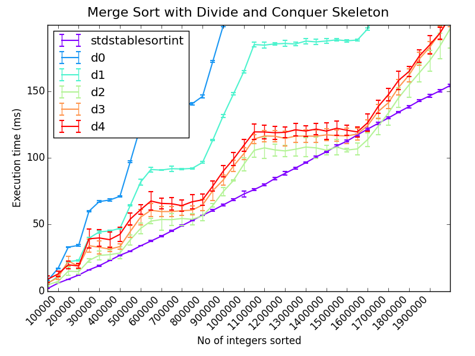
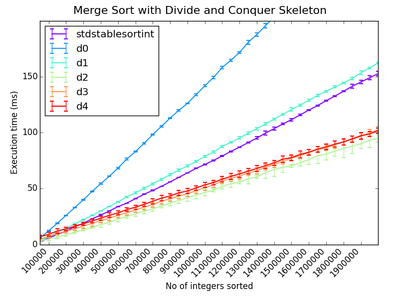
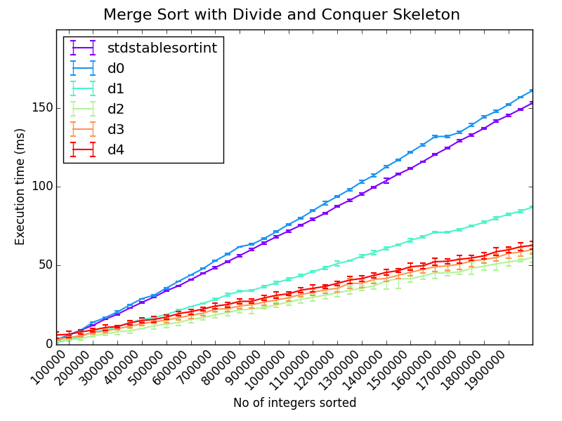

# September 2014

## Friday 12th

### Notes for next supervisor meeting:

 * Weekly (?) meetings with Pavlos
 * Need to know convenient times
 * Logbook / meeting notes:
   * Same as undergrad project: [Markdown log hosted on GitHub](https://github.com/ChrisCummins/pip-db/blob/master/Documentation/Log.md)?
 * MSc project
   * LLVM good, GCC bad
   * [Algorithmic Skeletons: Structured Management of Parallel Computation](https://www.google.co.uk/url?sa=t&rct=j&q=&esrc=s&source=web&cd=2&ved=0CCkQFjAB&url=http%3A%2F%2Fhomepages.inf.ed.ac.uk%2Fmic%2FPubs%2Fskeletonbook.ps.gz&ei=2f0WVNfmF47saNyigIAN&usg=AFQjCNGcrR6rY75gPqfz7y4Dr_Ztj48_dg&sig2=SNZO8I1r1oor05uXABraUA&bvm=bv.75097201,d.d2s&cad=rja)
     * Extended version of PhD thesis
     * "Increase raw performance by replication as well as by
       miniaturisation"
   * Similarities to HOF in functional languages
   * C++ Templates
     * What advantages over function pointers in C?
   * Compiled languages vs runtimes
     * There are some interesting lesser used languages with features
       that would simplify the task of auto parallelising.
     * E.g. Clojure: "For the concurrent programming future,
       pervasive, unmoderated mutation simply has to go".
     * Supposedly Haskell is even more "pure" and so capable of
       implicit parallelisation.

### Courses

Deadline 22/9/14, although choices are "not binding at this stage".

 * [Compiler Optimisation](http://www.inf.ed.ac.uk/teaching/courses/copt/)
   * Michael O'Boyle / Hugh Leather ?
   * 10 credits
   * Semester 2

 * [Probabilistic Modelling and Reasoning](http://www.inf.ed.ac.uk/teaching/courses/pmr/)
   * Amos Storkey
   * 10 credits
   * Semester 2

 * [Advances in Programming Languages](http://www.inf.ed.ac.uk/teaching/courses/apl/2014-2015/)
   * Ian Stark
   * 10 credits
   * Semester 1

 * [Machine Learning and Pattern Recognition](http://www.inf.ed.ac.uk/teaching/courses/mlpr/)
   * Chris Williams and Iain Murray
   * 10 credits
   * Semester 1
   * Tuesdays and Fridays, 10-10:50 am

 * [Parallel Design Patterns](http://www.epcc.ed.ac.uk/education-training/training/course-portfolio/parallel-design-patterns)

 * [Advanced Parallel Programming](http://www.epcc.ed.ac.uk/education-training/training/course-portfolio/advanced-parallel-programming)


## Monday 15th

Could we perform static analysis in JIT runtime?
[Relevant discussion](https://www.usenix.org/legacy/event/jvm02/yu/yu_html/node3.html).

**Persistent data structure:** a data structure that always preserves
the previous version of itself when modified. Thus effectively
immutable, as operations do not update the structure in-place, but
yield a new updated structure.

### TODO:

1. Decide on courses
1. Investigate MSc project options
1. Read [Hacker's guide to LLVM](http://www.aosabook.org/en/llvm.html)
1. Work through machine learning maths preliminaries
1. Work through a practical MPI tutorial
1. Read up on C++ templating
1. Concurrent programming pattern: Actor
1. Become familiar with Haskell, Scala, and Erlang
1. Take out relevant library books:
   * Mathematics for Engineers - Croft and Davison
   * Data Mining: Practical Machine Learning Tools and Techniques

### Notes from meeting with Pavlos & Hugh

Google hangout 9pm

 * The HOF component of Skeletons becomes less interesting/relevant as
   the complexity of skeletons grow. So something simple like divide
   and conquer could be implemented in a small amount of code, but
   complexity comes from the mechanics of parallelising, adding
   robustness, coordinating heterogeneous devices etc.

 * It may be more difficult to get work published for "non-standard"
   languages:
   * E.g. If the majority of published work is in C++, then an
     implementation in Clojure would be compare unfavourably in terms
     of performance.

 * Get organised about making notes on papers when reading them. There
   will be a *lot* of reading, so a good database of notes is
   essential. There are applications to help manage these.

 * It's important to get an understanding of the conferences and
   competitors in your field, so as to know *who* and *what* to keep
   an eye on.

 * **TODO:** In 2 months, create a spreadsheet of relevant competitors
   and conferences. Include paper submission deadlines, dates for
   publishing proceedings, etc.

 * **TODO:** Re-implement the memory read/write instrumentation from
   the programming assessment for LLVM, or implement something of
   comparable interest.

 * **TODO:** Implement a simple sequential divide and conquer skeleton
   in C++.

 * The reading club will restart at some point. Non-mandatory since
   MSc but relevant/useful.

 * **TODO:** At some point, I should pick a paper to critically
   analyse for Pavlos and Hugh. Same as reading club but on one-to-one
   basis.


## Tuesday 16th

There are weekly lectures for Pervasive Parallelism module on Tuesdays
and Thursdays, 15:10-16:00 in the Faculty Room South, David Hume
Tower.

Reference management software to test:

 * Mendeley 7
 * Zotero 6
 * Jabref 4
 * BibDesk 3 (only runs on Mac)
 * Endnote 1
 * Refworks 1

TODO:

 * Read The Researcher's Bible - DONE
 * Find one relevant conference / competitor and note details - DONE
 * Follow a practical tutorial on MPI
 * Find an up-to-date paper on Skeletons - DONE
 * Begin working through MLPR background maths sheet - DONE

### Notes on "[Learning from Data: Supplementary Mathematics](http://www.inf.ed.ac.uk/teaching/courses/mlpr/notes/mlpr-supplementary-maths.pdf)" (D Barber)

Scalar - a quantitity which "has magnitude but which is not related to
any definite direction in space."

Vectors - "It has magnitude and is also related to a definite
direction in space." When representing vectors as letters, they are
often underlined. In print, the are represented using either boldface
or a directional arrow above the letter.

Norm - another term for the length/magnitude of a vector.

Vector addition - using parallelogram law. Commutative and
associative.

Coplanar - in the same plane.

Position vectors - "The point *P* can be represented by the position
vector **p**, which is a vector whose initial point is the origin of
the coordinate system."

Unit vectors along the direction of the coodinate axes *X, Y, Z* are
commonly denoted as **i** = (1, 0, 0), **j** = (0, 1, 0), **k** = (0,
0, 1).

There's a bunch of mathematical symbols (esp. regarding set theory)
which I'm unfamiliar with. Should be sure to work through
[the list](http://en.wikipedia.org/wiki/List_of_mathematical_symbols).


### Notes on [The Researcher's Bible](http://homepages.inf.ed.ac.uk/bundy/how-tos/resbible.html)

 * The thesis + viva is to prove:

> that the student is capable of pursuing original research making a
> significant contribution to knowledge or understanding in the field
> of study, relating particular research projects to the general body
> of knowledge in the field, and presenting the results of the
> research in a critical and scholarly way.
> ([regulation 40](http://www.drps.ed.ac.uk/14-15/regulations/postgrad.php#Grounds))

 * American PhD students spend 5/6 years studying.
 * Read the literature and talk to fellow workers to find out what the
   state of the art is. In particular, check the further work section
   of papers for ideas for research.
 * After choosing a topic:
   * Read the literature.
   * Talk to people.
   * Tackle a simplified version of the problem.
   * Write down ideas in a working paper.
   * Give a talk to a small group.
 * "Your program must be explainable at a higher level than code, for
   it to make a real contribution to knowledge. Try to plan your
   program theoretically before going to the terminal."
 * Set aside a part of the week for reading reviews and abstracts and
   skimming papers.
 * Pick a "non-threatening, attractive task" to start each day with.
 * Do not underestimate the importance of being enthusiastic about
   your research topic.
 * "Beginning students tend to underestimate the worthiness and
   overestimate the doability of projects".
 * Do not focus on implementation and performance at the expense of
   vauge assumptions and principles.
 * Make writing a regular part of your life. Document:
   * Ideas you have
   * Documentation of programs
   * Lecture notes
   * Notes on papers
 * [Edinburgh publications](http://www.ed.ac.uk/schools-departments/informatics/research/publications/)
 * Advice for writing:
   * A paper should have a clear message that you understand and is
     repeated in the title, abstract, introduction, conclusion, and
     structure.
   * Think of your audience as intelligent, but (a) ignorant and (b)
     given to wilful misunderstanding.
   * A reader should get the main idea of the paper from the first
     page. Long rambling introductions should be pruned ruthlessly.
   * The basic framework for a scientific paper is: what
     claim/hypothesis am I making and what is the evidence for this
     claim.
   * Have a particular reader in mind to keep the technical standard
     of the paper uniform.
   * Clearly state what is new or better about what you have done.
   * A bi-directional combination of top down and bottom up writings
     styles is the most successful.
 * Advice for reading:
   * Think of the work of others as arranged in concentric circles
     around your own.
   * Outer circle - skim papers and abstracts to achieve appropriate
     level of familliarity with this circle. Set aside an hour each
     week to skim the latest arrivals.
   * Middle circle - Read some papers right through and discuss with
     others. Write a paragraph on each paper as you read it.
   * Inner circle - deep understanding, requiring several reads of a
     paper. Work through examples. Talk to the author about it. Write
     to them with a list of queries and/or criticisms. Teach it to
     others.
  * Have a succinct answer prepared for the question "what do you
    consider to be the key contributions in your thesis?"


### Notes from Ppar Lecture

3:10pm Murray Cole

Lecture Notes: http://www.inf.ed.ac.uk/teaching/courses/ppar/

 * Read ahead lecture material and course texts.
 * **14/10/14** - I give Davide Pinato's presentation about 2
     scientific papers.
 * **21/10/14** - Martin Ruefenacht presents my material about 2
     scientific papers.
 * You should aim to read 10-20 papers per week
   (abstract+conclusions).
 * **TODO:** Read through miscellaneous resources section of lecture
     slides.
 * **TODO:** Pick 2 interesting papers within the "inner circle" and
   discuss with Pavlos.
 * Read project proposals, in order to learn how to write better
   project proposals.

First presentation content:

 * Context
 * Key contribution
 * Impact
 * Critical reflection

Today's relevant conference was PLDI (see google doc).


## Wednesday 17th

Have set up Mendeley account to use for tracking notes on acadaemic
papers.

Skeletons:

> structured parallel programming abstraction that provide programmers
> with a predefined set of algorithmic templates that can be combined,
> nest and parameterized with sequential code to produce complex
> programs.
> ([Reference](http://homepages.inf.ed.ac.uk/hleather/publications/2012_autotuneparallelskeletons_ppl.pdf))

[Monte Carlo methods](http://en.wikipedia.org/wiki/Monte_Carlo) -
class of algorithms that rely on repeated random sampling to obtain
numerical results. Often used when it is difficult or impossible to
obtain a closed-form expression, or unfeasible to apply a
deterministic algorithm.

### Second Ppar lunch

Pavlos' advice on finding relevant literature:

 * Start with google scholar searches.
 * Search by keyword, rank by number of citations.
 * Once you find relevant papers, look at related reading.
 * If you have an important paper, look for other papers which cite
   it. E.g. for algorithmic skeletons, almost every paper cites
   Murray.

Pavlos is away from 2-12th October, so must organise around that.

For the machine learning courses, it may not be required to go into a
deep mathematical understanding for most uses, although it would
obviously help when things go wrong. A important field of maths is
statistics for researchers.

[Confidence interval](http://en.wikipedia.org/wiki/Confidence_interval)
- a measure of reliability of an estimate. If confidence intervals are
  constructed across many separate data analyses of repeated
  experiments, the proportion of such intervals that contain the true
  value of the parameter will match the confidence level.

### Notes on [What is a Literature Review](https://www.wiki.ed.ac.uk/pages/viewpage.action?title=What+is+a+Literature+Review&spaceKey=irrirpwiki)

> a summary and critical evaluation of all the knowledge pertaining to
> a specific research question, which has already been established by
> other researchers.

 * Identifies gaps in the field
 * Critically comments on the methods of the previous research
 * May group the research into themes or topics.
 * Start out broad, then become more specific (inverted pyramid).

```
-----------------------------
 \                         /      Broad issues
  \                       /
   \---------------------/
    \                   /         Studies which overlap
     \                 /          with your research
      \               /
       \-------------/
        \           /             Studies that are directly
         \         /              related to your investigation
          \       /
           \     /
            \   /
             \ /
              X
```

 * First briefly explain the broad issues.
 * Then narrow the focus to deal with the studies related to the
   subject area of your question.
 * Finally, hone in on research which is directly related to the
   specific research question.

[Further reading](http://www.ais.up.ac.za/med/tnm800/tnmwritingliteraturereviewlie.htm).


## Thursday 18th

 * Added skeleton LaTeX files for project proposal, based on pip-db
   report.
 * Started working through C++ template and MPI examples and programs,
   staring simple while gaining familiarity with syntax/paradigms
   (what happened to all the pointers??).

### Differences between C++ Templating engine and C pre-processor

 * There are superficial similarities between the goals of C++
   templates and some C libraries (E.g. GLib).
 * The major difference between the two is that templates are a
   *compile time* feature, whereas the pre-processor is purely textual
   substitution.
 * This means that Templates are type aware, and (to a greater or
   lesser extent) capable of performing more advanced optimisation and
   verification than would be possible purely with the
   pre-processor. E.g. "If a function is passed in as a template
   parameter, you can't tell how complex it is or transform it in any
   white box way."

Today's relevant conference was HiPEAC (see google doc).


## Friday 19th

## Notes on [Statistics Tutorial](https://explorable.com/statistics-tutorial)

```
statistical_methods(raw_data) = data_set
```

Calculations of central tendency (mean - arithmetic or geometric,
media, or mode) assume normal distribution of data.

Statistics for research involves understanding:

1. the relationship between probability and statistics.
1. the two major branches of statistics: descriptive statistics and
   inferential statistics.
1. how statistics relates to the scientific method.

[Reentrant](http://en.wikipedia.org/wiki/Reentrancy_(computing)) - A
subroutine is reentrant if it can be interrupted during its execution
and then safely called again before its previous invocations complete
execution. E.g.

[Simulated annealing](http://en.wikipedia.org/wiki/Simulated_annealing) -
A generic probabilistic metaheuristic for the global optimization
problem of locating a good approximation to the global optimum of a
given function in a large search space.


### Notes on Divide and Conquer skeleton

Some early thoughts on how I think a generic divide and conquer
template would behave:

```
User defined functions:

   bool  Dac::isIndivisble(T)  - Determine whether to split "T" or solve
   T ... DaC::split(T)         - Split a "T" into 2 or more "T" subcomponents
   T     DaC::process(T)       - The "solution" function (e.g. in merge sort,
                                 return the single element sorted list)
   T     DaC::merge(T, T, ...) - Combine 2 or more "T"s into a single T
```

The constructor for the skeleton would accept these functions as
arguments, as well as a dataset. There would need to be a getter
function for returning the processed (divided and conquered) data:

```
   DaC(isIndivisible, split, process, merge, data)
   Dac::get()
```

The getter could behave in one of two ways, depending on when we start
to process the data:

 * If the skeleton were to begin processing the data *immediately*
   upon construction, then the getter would simply return the
   processed data (if available), else block.
 * If the skeleton deferred processing of the data until the data is
   requested, then invoking the getter method would begin this
   process, and block until completion.

The former method seems much more intuitive, although it would be
simple enough to add a flag to the constructor which enabled the lazy
evaluation of data if the user desired.


### Notes from Ppar Lecture

3:10pm Hugh - How to give a conference presentation

 * Conference presentation comes *after* paper is published, but
   shouldn't be derivative of.
 * Presentation is advert for paper.
 * complicated != smart.
 * Memorise speech for first few slides and stick to a slow tempo.
 * Lead with important message, but intro sets context and should get
   audience thinking about problem.
 * Ask Murray about joining CArD mailing list.


I've implemented a simple Divide and Conquer template skeleton in C++,
will make a couple of specialisations for it on Monday (I've only got
MergeSort atm) and have a play around with it.


## Monday 22nd

I spent a little bit of time at the weekend (too eager) adapting the
divide and conquer template to a fixed depth (FDDC) design.

I need to critically consider memory allocation before going any
further, since the hacked-together implementation from Friday no-doubt
leaks memory like a sieve. Should the muscle functions be responsible
for allocating data? Possibilities include:

 * Muscle functions are responsible for allocating new memory when
   processing data, and releasing old data.
 * The skeleton is responsible for allocating *all* memory, and the
   muscle functions accept out parameters and write to them (not
   possible for `split()` unless the skeleton knows the size of the
   split data ahead of time).
 * Muscle functions operating *in-place* where possible (not possible
   for something like `split()`.

### First attempt at designing a DC skeleton

Here's the basic skeleton template (just the muscle function
declarations):

```
DC<T> {
    bool isIndivisible(T)
    T[]  split(T)
    T    solve(T)
    T    merge(T[])
}
```

And here's pseudo-code for the `divide_and_conquer()` function, which
does the actual work:

```
divide_and_conquer(T) {
    if isIndivisible(T):
        return solve(T)
    else:
        return merge(map(divide_and_conquer, split(T)))
}
```

Note that we can use the C++
[transform](http://www.cplusplus.com/reference/algorithm/transform/)
function to perform the `map(divide_and_conquer, split(T))`
transformation.


### Questions and thoughts on DaC

 * Could a `split()` operation ever produce *more* data than goes into
   it? For a merge sort, it simply splits a list in two.
 * Could a divide and conquer algorithm ever transform the *type* of
   data? For merge sort, it's `merge_sort(list<A>) : list<A>`. Could
   there be a DaC algorithm where the `solve()` function had a
   different data type for its input and output?
 * Is there a divide and conquer algorithm which *can't* be expressed
   using a fixed depth? E.g. for merge sort, `split()` always returns
   2 lists. Could there be a `split()` which returns *n* lists, where
   the value of *n* is dependent on the input data?
 * Similarly, is there any divide and conquer algorithm for which the
   `split()` function *doesn't* perform an even split? E.g. in merge
   sort, a split operation on a list of 100 items will return two
   lists, each containing 50 items. Are there split operations that
   would return lists of different length? (excluding of course when
   the input size is odd).
 * Is there a divide and conquer algorithm for which the input *T*
   *can't* be expressed using vectors? E.g. for merge sort, we use
   list<A>. Does any DaC algorithm *not* perform on
   lists/arrays/vectors?
 * Would it be useful to augment the `divide_and_conquer()` function
   with a parameter which indicates it's *depth*? E.g. adding a
   integer `depth` parameter:

```
divide_and_conquer(T, depth) {
    if isIndivisible(T):
        return solve(T)
    else:
        return merge(map(divide_and_conquer, split(T), depth++))
}
```

```
struct data {
    void  *data;
    size_t element_size;
    int    length;
};

FDDC<T> {
    bool isIndivisible(T*)
    T**  split(T*)
    T*   solve(T*)
    T*   merge(T**)
}
```

To see examine the size of individual functions in a C++ executable:

```
$ nm -CSr --size-sort a.out
0000000000400c35 00000000000001c8 T merge(vector<int>*, vector<int>*, vector<int>*)
0000000000400dfd 0000000000000130 T divide_and_conquer(vector<int>*, vector<int>*, int)
0000000000400a9f 0000000000000115 T split(vector<int>*, vector<int>*, vector<int>*)
00000000006016c0 0000000000000110 B std::cout@@GLIBCXX_3.4
0000000000400f2d 00000000000000ef T main
...
```

Testing the new dac implementation, sorting 1,000,000 integers:

```
$ valgrind --max-stackframe=4000040 ./dac
...
==544== HEAP SUMMARY:
==544==     in use at exit: 16 bytes in 1 blocks
==544==   total heap usage: 4,999,998 allocs, 4,999,997 frees, 235,611,352 bytes allocated
==544==
==544== LEAK SUMMARY:
==544==    definitely lost: 16 bytes in 1 blocks
==544==    indirectly lost: 0 bytes in 0 blocks
==544==      possibly lost: 0 bytes in 0 blocks
==544==    still reachable: 0 bytes in 0 blocks
==544==         suppressed: 0 bytes in 0 blocks
```

And the DC template implementation:

```
$ valgrind --max-stackframe=4000040 ./dc-merge-sort
...
==599== HEAP SUMMARY:
==599==     in use at exit: 0 bytes in 0 blocks
==599==   total heap usage: 2,131,044 allocs, 2,131,044 frees, 83,934,244 bytes allocated
==599==
==599== All heap blocks were freed -- no leaks are possible
```

Time comparison:

```
./dac
Time to sort  100000 integers:   34 ms
./dc-merge-sort
Time to sort  100000 integers:  606 ms
./fddc-merge-sort
Time to sort  100000 integers:  636 ms
```

DC merge sort after optimising the vector usage in `merge()`:

```
$ valgrind --max-stackframe=4000040 ./dc-merge-sort
...
==1690== HEAP SUMMARY:
==1690==     in use at exit: 0 bytes in 0 blocks
==1690==   total heap usage: 1,899,990 allocs, 1,899,990 frees, 73,281,312 bytes allocated
==1690==
==1690== All heap blocks were freed -- no leaks are possible
```

Comparison of timings as of commit 03f2b01:

```
./dac
Time to sort  200000 integers:   58 ms
Time to sort  400000 integers:   97 ms
Time to sort  600000 integers:  145 ms
Time to sort  800000 integers:  197 ms
Time to sort 1000000 integers:  268 ms
Time to sort 1200000 integers:  297 ms
Time to sort 1400000 integers:  363 ms
Time to sort 1600000 integers:  401 ms
Time to sort 1800000 integers:  505 ms
Time to sort 2000000 integers:  515 ms
./dc-merge-sort
Time to sort  200000 integers:  144 ms
Time to sort  400000 integers:  284 ms
Time to sort  600000 integers:  421 ms
Time to sort  800000 integers:  555 ms
Time to sort 1000000 integers:  706 ms
Time to sort 1200000 integers:  855 ms
Time to sort 1400000 integers:  989 ms
Time to sort 1600000 integers: 1197 ms
Time to sort 1800000 integers: 1308 ms
Time to sort 2000000 integers: 1443 ms
./fddc-merge-sort
Time to sort   25000 integers:   12 ms
Time to sort   50000 integers:   31 ms
Time to sort   75000 integers:   42 ms
Time to sort  100000 integers:   57 ms
Time to sort  125000 integers:   70 ms
Time to sort  150000 integers:   84 ms
Time to sort  175000 integers:   90 ms
Time to sort  200000 integers:  105 ms
./lib-sort
std::sort:
Time to sort  200000 integers:    8 ms
Time to sort  400000 integers:   19 ms
Time to sort  600000 integers:   30 ms
Time to sort  800000 integers:   45 ms
Time to sort 1000000 integers:   54 ms
Time to sort 1200000 integers:   61 ms
Time to sort 1400000 integers:   74 ms
Time to sort 1600000 integers:   86 ms
Time to sort 1800000 integers:   97 ms
Time to sort 2000000 integers:  107 ms
std::sort_stable:
Time to sort  200000 integers:   11 ms
Time to sort  400000 integers:   22 ms
Time to sort  600000 integers:   47 ms
Time to sort  800000 integers:   57 ms
Time to sort 1000000 integers:   63 ms
Time to sort 1200000 integers:   75 ms
Time to sort 1400000 integers:   89 ms
Time to sort 1600000 integers:  103 ms
Time to sort 1800000 integers:  117 ms
Time to sort 2000000 integers:  136 ms
```


## Tuesday 23rd

Comparing profiles of `dac` with `dc-merge-sort`:

```
$ gprof dac gmon.out | less
...
 %   cumulative   self              self     total
 time   seconds   seconds    calls  ms/call  ms/call  name
 79.23      0.98     0.98 10999990     0.00     0.00  merge(vector<int> const&, vector<int> const&, vector<int>*)
  8.89      1.09     0.11                             test_dac_sort(unsigned long)
  6.47      1.17     0.08       10     8.02   112.78  divide_and_conquer(vector<int>*, vector<int>*, int)
  4.45      1.23     0.06 10999990     0.00     0.00  split(vector<int>*, vector<int>*, vector<int>*)
  0.81      1.24     0.01 11000000     0.00     0.00  solve(vector<int>*, vector<int>*)
  0.40      1.24     0.01                             isIndivisible(vector<int>*)
...
$ gprof dc-merge-sort gmon.out | less
...
  %   cumulative   self              self     total
 time   seconds   seconds    calls  ms/call  ms/call  name
 38.59      1.33     1.33       10   133.14   325.35  DC<std::vector<int, std::allocator<int> > >::_dac(std::vector<int, std::allocator<int> >)
 34.82      2.53     1.20 10999990     0.00     0.00  DC<std::vector<int, std::allocator<int> > >::merge(std::vector<std::vector<int, std::allocator<int> >, std::allocator<std::vector<int, std::allocator<int> > >
 20.89      3.25     0.72 10999990     0.00     0.00  DC<std::vector<int, std::allocator<int> > >::split(std::vector<int, std::allocator<int> >)
```

Wheres the `dac` implementation spends most of it's time in the
(understandably) expensive `merge()` operation, the DC skeleton
implementation has a much more even distribution of execution times
across the merge, split, and recursive functions. Possible reasons for
this:

 * The DC skeleton uses `sdt::vector<int>` objects instead of a custom
   vector class, and copying operations are more expensive.
 * Values are passed and returned by value, rather than out
   parameters. This could be cause for lot of additional memory
   copying.

Interestingly, a refactoring the `dac` implementation into a
skeleton-style template class provided a modest speedup:

```
dac
Time to sort  200000 integers:   62 ms
Time to sort  400000 integers:  111 ms
Time to sort  600000 integers:  163 ms
Time to sort  800000 integers:  220 ms
Time to sort 1000000 integers:  278 ms
Time to sort 1200000 integers:  332 ms
Time to sort 1400000 integers:  391 ms
Time to sort 1600000 integers:  441 ms
Time to sort 1800000 integers:  499 ms
Time to sort 2000000 integers:  569 ms
DC<int>
Time to sort  200000 integers:   58 ms
Time to sort  400000 integers:   96 ms
Time to sort  600000 integers:  150 ms
Time to sort  800000 integers:  217 ms
Time to sort 1000000 integers:  259 ms
Time to sort 1200000 integers:  306 ms
Time to sort 1400000 integers:  352 ms
Time to sort 1600000 integers:  411 ms
Time to sort 1800000 integers:  532 ms
Time to sort 2000000 integers:  514 ms
```

To recurse using a separate thread (C++ thread lib):

```
std::thread left(&DC<T>::divide_and_conquer, this, in_left, out_left, next_depth);
```

Number of nodes (*N*) in tree of depth *d*:

```
N = 1 + 1^2 + 2^2 ... d^2
```


## Wednesday 24th

Advice from Pavlos on finding relevant conferences:

 * There are websites which collate conferences and let you perform
   key word searches on them.
 * See where relevant researchers are publishing their work (e.g. look
   up Hugh's publication list).
 * Getting a reasonable list of relevant conferences shouldn't take
   more than 3-4 hours.

Weekly meetings with Pavlos organised for Friday 12pm.

### Notes on dac parallelisation

The number of threads spawned for each parallelisation depth:

```
parallelisation_depth  thread_count  (thread_count(d)-thread_count(d-1))
0                      1
1                      3             2
2                      7             4
3                      15            8
4                      31            15  <---  (!? not a power of 2)
5                      63            32
6                      127           64
7                      255           128
8                      511           256
```

So the series is:

```
n = 1 + 1^2 + 2^2 + 3^2 + ... + d^2
```

Which means that for a 4 core machine, we'd expect the optimum
parallelisation depth to be 2.


## Thursday 25th

### Notes for meeting with Pavlos

 * Skeleton implementation:
   * Fixed degree divide and conquer skeleton using C++ templates.
   * Muscle functions operate in-place (using out functions).
      * Some memory allocated by "worker" function (lots of heap
        thrashing).
      * split() and merge() function actually do majority of the heavy
        lifting, since we don't assume to know the size of the split /
        merged data. (could we predict this?)
   * Naive multi-threading using depth limit.
      * Lock free since we allocate memory in the parent thread.
   * Example merge sort implementation.
      * Testing on example data set.
      * Results of tests:
         * Non-linear performance (why?).
 * Next week: LLVM, and picking papers for Ppar presentation
 * Is there a budget for text books?


## Friday 26th

Cooley and Tukey's 1964 paper "An Algorithm for the Machine
Calculation of Complex Fourier Series" introduced the Fast Fourier
Transform. Improved discrete Fourier transform performance from O(n^2)
to O(n log n).

### Notes from meeting with Pavlos

 * DaC skeleton:
   * The skeleton provides an *interface* for the programmer to write
     solutions, so it should allow enough flexibility for the user to
     "do what they want" within the muscle functions, which could
     include:
     * Transforming data types within `solve()`.
     * Performing uneven `split()` operations, or even returning more
       data than went in.
     * Producing variable sized results for `split()` and `merge()`.
   * "Optimising" a skeleton doesn't mean improving memory allocation,
     so much as dividing the job into work for different devices,
     servers, cores, etc (perhaps using MPI).
   * I should look at
     [eSkel](http://homepages.inf.ed.ac.uk/mic/eSkel/) for a possible
     "real" skeleton implementation to examine.
   * We can assume that all DaC algorithms operate on vectors.
   * For this simple implementation exercise, the important thing
     isn't to produce something *better* than the existing solutions,
     but to understand the faults and be able to explain what
     does/doesn't work from my own attempt, and *why*.
   * gprof provides a good starting point for profiling. The three
     factors that will affect performance are:
     1. The size of the input problem.
     1. Allocating memory.
     1. The cost of creating new threads.
   * I should investigate the non-linear performance of my merge sort,
     looking particularly at the points in which the gradient of the
     execution time changes. This is a lot of heap thrashing, so we
     can expect shifts in performance to occur around points at which
     the system spends more time allocating memory (e.g. it may the
     same amount of time to allocate 7Kb as 4Kb, but twice as long to
     allocate 8Kb).
 * There is budget for "small research related purchases". Pavlos is
   going to ask Murray if that covers textbooks. I should make a list
   of the books I need.
 * Writing an LLVM phase should not take too long, and isn't beyond
   the scope of people without compiler knowledge.
 * Pavlos will be out of contact from next Thursday, so I should chase
   up any questions before then.


### Notes from meeting with Hugh and Pavlos

 * In C++, virtual functions are stored in v tables, so when a class
   is instantiated and a virtual function invoked, the program must
   first dereference the vtable, look up the function pointer, then
   dereference this in order to execute the function. C++ templates
   support passing in functions as parameters, so it may be possible
   to optimise out these layers of redirection and get rid of the need
   for virtual muscle functions.
 * When designing a skeleton, some things to consider:
   1. How much can the compiler optimise.
   1. Ease of use for the user/caller.
   1. What do other skeleton implementations do? How does yours
      compare against those?
 * I should consider how to representation the skeleton abstraction to
   the user. For ease of use, it would be better if the DaC skeleton
   was a function call, so that the merge sort would have the same
   usage as the stdlib sort functions.
 * Merge sort should be in-place.

TODO:

 * Modify the backend of the skeleton so that it performs in-place.
 * Redesign the front-end of the skeleton so that it is a simple
   function call.

Memory usage during test program for `std::stable_sort`:

```
==6177== HEAP SUMMARY:
==6177==     in use at exit: 7,804 bytes in 1 blocks
==6177==   total heap usage: 121 allocs, 120 frees, 328,008,444 bytes allocated
```

And the same test using my merge sort:

```
==6110== HEAP SUMMARY:
==6110==     in use at exit: 6,740 bytes in 1 blocks
==6110==   total heap usage: 168,500,601 allocs, 168,500,600 frees, 8,659,562,260 bytes allocated
```

So the bottleneck is pretty clear. Make the skeleton perform in-place.


## Sunday 28th

I've revisited "Introduction to Algorithms" sections 2.3.1 (merge
sort):

 * Terminology: divide, conquer, combine (instead of split, solve,
   merge).
 * Merge sort using sentinels and array indices `left`, `mid`,
   `right`:

```
Merge(A, left, mid, right):
    n1 = mid - left + 1   // Length of left subarray
    n2 = right - mid      // Length of right subarray

    // Copy left subarray and append sentinel
    L[] = new array(n1+1)
    for (i = 0; i < n1; i++):
        L[i] = A[left + i]
    L[n1] = sentinel()

    // Copy right subarray and append sentinel
    R[] = new array(n2+1)
    for (i = 0; i < n2; i++):
        R[i] = A[right + i]
    R[n2] = sentinel()

    l = 0, r = 0
    for (i = mid; i < right; i++):
        if L[l] <= R[r]:
            A[i] = L[l++]
        else:
            A[i] = R[r++]
```

 * Terminology: *recursion case* - when the problem can be divided and
   conquered recursively, *base case* - when the problem can be solved
   directly.
 * It is often profitable to "bottom out" before the problem size
   reaches 1, resorting to insertion sort for small enough
   vectors. This could be an optimisation worth exploring in the merge
   sort skeleton.


## Monday 29th

### Merge Sort Skeleton execution times

#### 14.09.26-10.00.00 and 14.09.26-15.47.20

 * Merge sort with lots of heap thrashing, no insertion sort
   optimisation.




#### 14.09.29-11.53.00

 * In-place merge sort, no insertion sort optimisation.



#### 14.09.29-13.07.59

 * In-place merge sort, with insertion sort being used to sort lists
   of 100 elements or less.


