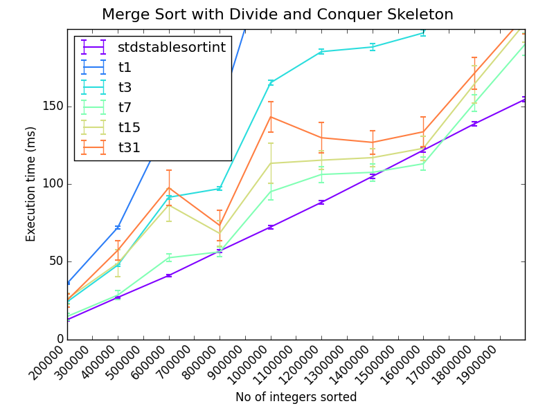

# September 2014

## Friday 12th

### Notes for next supervisor meeting:

 * Weekly (?) meetings with Pavlos
 * Need to know convenient times
 * Logbook / meeting notes:
   * Same as undergrad project: [Markdown log hosted on GitHub](https://github.com/ChrisCummins/pip-db/blob/master/Documentation/Log.md)?
 * MSc project
   * LLVM good, GCC bad
   * [Algorithmic Skeletons: Structured Management of Parallel Computation](https://www.google.co.uk/url?sa=t&rct=j&q=&esrc=s&source=web&cd=2&ved=0CCkQFjAB&url=http%3A%2F%2Fhomepages.inf.ed.ac.uk%2Fmic%2FPubs%2Fskeletonbook.ps.gz&ei=2f0WVNfmF47saNyigIAN&usg=AFQjCNGcrR6rY75gPqfz7y4Dr_Ztj48_dg&sig2=SNZO8I1r1oor05uXABraUA&bvm=bv.75097201,d.d2s&cad=rja)
     * Extended version of PhD thesis
     * "Increase raw performance by replication as well as by
       miniaturisation"
   * Similarities to HOF in functional languages
   * C++ Templates
     * What advantages over function pointers in C?
   * Compiled languages vs runtimes
     * There are some interesting lesser used languages with features
       that would simplify the task of auto parallelising.
     * E.g. Clojure: "For the concurrent programming future,
       pervasive, unmoderated mutation simply has to go".
     * Supposedly Haskell is even more "pure" and so capable of
       implicit parallelisation.

### Courses

Deadline 22/9/14, although choices are "not binding at this stage".

 * [Compiler Optimisation](http://www.inf.ed.ac.uk/teaching/courses/copt/)
   * Michael O'Boyle / Hugh Leather ?
   * 10 credits
   * Semester 2

 * [Probabilistic Modelling and Reasoning](http://www.inf.ed.ac.uk/teaching/courses/pmr/)
   * Amos Storkey
   * 10 credits
   * Semester 2

 * [Advances in Programming Languages](http://www.inf.ed.ac.uk/teaching/courses/apl/2014-2015/)
   * Ian Stark
   * 10 credits
   * Semester 1

 * [Machine Learning and Pattern Recognition](http://www.inf.ed.ac.uk/teaching/courses/mlpr/)
   * Chris Williams and Iain Murray
   * 10 credits
   * Semester 1
   * Tuesdays and Fridays, 10-10:50 am

 * [Parallel Design Patterns](http://www.epcc.ed.ac.uk/education-training/training/course-portfolio/parallel-design-patterns)

 * [Advanced Parallel Programming](http://www.epcc.ed.ac.uk/education-training/training/course-portfolio/advanced-parallel-programming)


## Monday 15th

Could we perform static analysis in JIT runtime?
[Relevant discussion](https://www.usenix.org/legacy/event/jvm02/yu/yu_html/node3.html).

**Persistent data structure:** a data structure that always preserves
the previous version of itself when modified. Thus effectively
immutable, as operations do not update the structure in-place, but
yield a new updated structure.

### TODO:

1. Decide on courses
1. Investigate MSc project options
1. Read [Hacker's guide to LLVM](http://www.aosabook.org/en/llvm.html)
1. Work through machine learning maths preliminaries
1. Work through a practical MPI tutorial
1. Read up on C++ templating
1. Concurrent programming pattern: Actor
1. Become familiar with Haskell, Scala, and Erlang
1. Take out relevant library books:
   * Mathematics for Engineers - Croft and Davison
   * Data Mining: Practical Machine Learning Tools and Techniques

### Notes from meeting with Pavlos & Hugh

Google hangout 9pm

 * The HOF component of Skeletons becomes less interesting/relevant as
   the complexity of skeletons grow. So something simple like divide
   and conquer could be implemented in a small amount of code, but
   complexity comes from the mechanics of parallelising, adding
   robustness, coordinating heterogeneous devices etc.

 * It may be more difficult to get work published for "non-standard"
   languages:
   * E.g. If the majority of published work is in C++, then an
     implementation in Clojure would be compare unfavourably in terms
     of performance.

 * Get organised about making notes on papers when reading them. There
   will be a *lot* of reading, so a good database of notes is
   essential. There are applications to help manage these.

 * It's important to get an understanding of the conferences and
   competitors in your field, so as to know *who* and *what* to keep
   an eye on.

 * **TODO:** In 2 months, create a spreadsheet of relevant competitors
   and conferences. Include paper submission deadlines, dates for
   publishing proceedings, etc.

 * **TODO:** Re-implement the memory read/write instrumentation from
   the programming assessment for LLVM, or implement something of
   comparable interest.

 * **TODO:** Implement a simple sequential divide and conquer skeleton
   in C++.

 * The reading club will restart at some point. Non-mandatory since
   MSc but relevant/useful.

 * **TODO:** At some point, I should pick a paper to critically
   analyse for Pavlos and Hugh. Same as reading club but on one-to-one
   basis.


## Tuesday 16th

There are weekly lectures for Pervasive Parallelism module on Tuesdays
and Thursdays, 15:10-16:00 in the Faculty Room South, David Hume
Tower.

Reference management software to test:

 * Mendeley 7
 * Zotero 6
 * Jabref 4
 * BibDesk 3 (only runs on Mac)
 * Endnote 1
 * Refworks 1

TODO:

 * Read The Researcher's Bible - DONE
 * Find one relevant conference / competitor and note details - DONE
 * Follow a practical tutorial on MPI
 * Find an up-to-date paper on Skeletons - DONE
 * Begin working through MLPR background maths sheet - DONE

### Notes on "[Learning from Data: Supplementary Mathematics](http://www.inf.ed.ac.uk/teaching/courses/mlpr/notes/mlpr-supplementary-maths.pdf)" (D Barber)

Scalar - a quantitity which "has magnitude but which is not related to
any definite direction in space."

Vectors - "It has magnitude and is also related to a definite
direction in space." When representing vectors as letters, they are
often underlined. In print, the are represented using either boldface
or a directional arrow above the letter.

Norm - another term for the length/magnitude of a vector.

Vector addition - using parallelogram law. Commutative and
associative.

Coplanar - in the same plane.

Position vectors - "The point *P* can be represented by the position
vector **p**, which is a vector whose initial point is the origin of
the coordinate system."

Unit vectors along the direction of the coodinate axes *X, Y, Z* are
commonly denoted as **i** = (1, 0, 0), **j** = (0, 1, 0), **k** = (0,
0, 1).

There's a bunch of mathematical symbols (esp. regarding set theory)
which I'm unfamiliar with. Should be sure to work through
[the list](http://en.wikipedia.org/wiki/List_of_mathematical_symbols).


### Notes on [The Researcher's Bible](http://homepages.inf.ed.ac.uk/bundy/how-tos/resbible.html)

 * The thesis + viva is to prove:

> that the student is capable of pursuing original research making a
> significant contribution to knowledge or understanding in the field
> of study, relating particular research projects to the general body
> of knowledge in the field, and presenting the results of the
> research in a critical and scholarly way.
> ([regulation 40](http://www.drps.ed.ac.uk/14-15/regulations/postgrad.php#Grounds))

 * American PhD students spend 5/6 years studying.
 * Read the literature and talk to fellow workers to find out what the
   state of the art is. In particular, check the further work section
   of papers for ideas for research.
 * After choosing a topic:
   * Read the literature.
   * Talk to people.
   * Tackle a simplified version of the problem.
   * Write down ideas in a working paper.
   * Give a talk to a small group.
 * "Your program must be explainable at a higher level than code, for
   it to make a real contribution to knowledge. Try to plan your
   program theoretically before going to the terminal."
 * Set aside a part of the week for reading reviews and abstracts and
   skimming papers.
 * Pick a "non-threatening, attractive task" to start each day with.
 * Do not underestimate the importance of being enthusiastic about
   your research topic.
 * "Beginning students tend to underestimate the worthiness and
   overestimate the doability of projects".
 * Do not focus on implementation and performance at the expense of
   vauge assumptions and principles.
 * Make writing a regular part of your life. Document:
   * Ideas you have
   * Documentation of programs
   * Lecture notes
   * Notes on papers
 * [Edinburgh publications](http://www.ed.ac.uk/schools-departments/informatics/research/publications/)
 * Advice for writing:
   * A paper should have a clear message that you understand and is
     repeated in the title, abstract, introduction, conclusion, and
     structure.
   * Think of your audience as intelligent, but (a) ignorant and (b)
     given to wilful misunderstanding.
   * A reader should get the main idea of the paper from the first
     page. Long rambling introductions should be pruned ruthlessly.
   * The basic framework for a scientific paper is: what
     claim/hypothesis am I making and what is the evidence for this
     claim.
   * Have a particular reader in mind to keep the technical standard
     of the paper uniform.
   * Clearly state what is new or better about what you have done.
   * A bi-directional combination of top down and bottom up writings
     styles is the most successful.
 * Advice for reading:
   * Think of the work of others as arranged in concentric circles
     around your own.
   * Outer circle - skim papers and abstracts to achieve appropriate
     level of familliarity with this circle. Set aside an hour each
     week to skim the latest arrivals.
   * Middle circle - Read some papers right through and discuss with
     others. Write a paragraph on each paper as you read it.
   * Inner circle - deep understanding, requiring several reads of a
     paper. Work through examples. Talk to the author about it. Write
     to them with a list of queries and/or criticisms. Teach it to
     others.
  * Have a succinct answer prepared for the question "what do you
    consider to be the key contributions in your thesis?"


### Notes from Ppar Lecture

3:10pm Murray Cole

Lecture Notes: http://www.inf.ed.ac.uk/teaching/courses/ppar/

 * Read ahead lecture material and course texts.
 * **14/10/14** - I give Davide Pinato's presentation about 2
     scientific papers.
 * **21/10/14** - Martin Ruefenacht presents my material about 2
     scientific papers.
 * You should aim to read 10-20 papers per week
   (abstract+conclusions).
 * **TODO:** Read through miscellaneous resources section of lecture
     slides.
 * **TODO:** Pick 2 interesting papers within the "inner circle" and
   discuss with Pavlos.
 * Read project proposals, in order to learn how to write better
   project proposals.

First presentation content:

 * Context
 * Key contribution
 * Impact
 * Critical reflection

Today's relevant conference was PLDI (see google doc).


## Wednesday 17th

Have set up Mendeley account to use for tracking notes on acadaemic
papers.

Skeletons:

> structured parallel programming abstraction that provide programmers
> with a predefined set of algorithmic templates that can be combined,
> nest and parameterized with sequential code to produce complex
> programs.
> ([Reference](http://homepages.inf.ed.ac.uk/hleather/publications/2012_autotuneparallelskeletons_ppl.pdf))

[Monte Carlo methods](http://en.wikipedia.org/wiki/Monte_Carlo) -
class of algorithms that rely on repeated random sampling to obtain
numerical results. Often used when it is difficult or impossible to
obtain a closed-form expression, or unfeasible to apply a
deterministic algorithm.

### Second Ppar lunch

Pavlos' advice on finding relevant literature:

 * Start with google scholar searches.
 * Search by keyword, rank by number of citations.
 * Once you find relevant papers, look at related reading.
 * If you have an important paper, look for other papers which cite
   it. E.g. for algorithmic skeletons, almost every paper cites
   Murray.

Pavlos is away from 2-12th October, so must organise around that.

For the machine learning courses, it may not be required to go into a
deep mathematical understanding for most uses, although it would
obviously help when things go wrong. A important field of maths is
statistics for researchers.

[Confidence interval](http://en.wikipedia.org/wiki/Confidence_interval)
- a measure of reliability of an estimate. If confidence intervals are
  constructed across many separate data analyses of repeated
  experiments, the proportion of such intervals that contain the true
  value of the parameter will match the confidence level.

### Notes on [What is a Literature Review](https://www.wiki.ed.ac.uk/pages/viewpage.action?title=What+is+a+Literature+Review&spaceKey=irrirpwiki)

> a summary and critical evaluation of all the knowledge pertaining to
> a specific research question, which has already been established by
> other researchers.

 * Identifies gaps in the field
 * Critically comments on the methods of the previous research
 * May group the research into themes or topics.
 * Start out broad, then become more specific (inverted pyramid).

```
-----------------------------
 \                         /      Broad issues
  \                       /
   \---------------------/
    \                   /         Studies which overlap
     \                 /          with your research
      \               /
       \-------------/
        \           /             Studies that are directly
         \         /              related to your investigation
          \       /
           \     /
            \   /
             \ /
              X
```

 * First briefly explain the broad issues.
 * Then narrow the focus to deal with the studies related to the
   subject area of your question.
 * Finally, hone in on research which is directly related to the
   specific research question.

[Further reading](http://www.ais.up.ac.za/med/tnm800/tnmwritingliteraturereviewlie.htm).


## Thursday 18th

 * Added skeleton LaTeX files for project proposal, based on pip-db
   report.
 * Started working through C++ template and MPI examples and programs,
   staring simple while gaining familiarity with syntax/paradigms
   (what happened to all the pointers??).

### Differences between C++ Templating engine and C pre-processor

 * There are superficial similarities between the goals of C++
   templates and some C libraries (E.g. GLib).
 * The major difference between the two is that templates are a
   *compile time* feature, whereas the pre-processor is purely textual
   substitution.
 * This means that Templates are type aware, and (to a greater or
   lesser extent) capable of performing more advanced optimisation and
   verification than would be possible purely with the
   pre-processor. E.g. "If a function is passed in as a template
   parameter, you can't tell how complex it is or transform it in any
   white box way."

Today's relevant conference was HiPEAC (see google doc).


## Friday 19th

## Notes on [Statistics Tutorial](https://explorable.com/statistics-tutorial)

```
statistical_methods(raw_data) = data_set
```

Calculations of central tendency (mean - arithmetic or geometric,
media, or mode) assume normal distribution of data.

Statistics for research involves understanding:

1. the relationship between probability and statistics.
1. the two major branches of statistics: descriptive statistics and
   inferential statistics.
1. how statistics relates to the scientific method.

[Reentrant](http://en.wikipedia.org/wiki/Reentrancy_(computing)) - A
subroutine is reentrant if it can be interrupted during its execution
and then safely called again before its previous invocations complete
execution. E.g.

[Simulated annealing](http://en.wikipedia.org/wiki/Simulated_annealing) -
A generic probabilistic metaheuristic for the global optimization
problem of locating a good approximation to the global optimum of a
given function in a large search space.


### Notes on Divide and Conquer skeleton

Some early thoughts on how I think a generic divide and conquer
template would behave:

```
User defined functions:

   bool  Dac::isIndivisble(T)  - Determine whether to split "T" or solve
   T ... DaC::split(T)         - Split a "T" into 2 or more "T" subcomponents
   T     DaC::process(T)       - The "solution" function (e.g. in merge sort,
                                 return the single element sorted list)
   T     DaC::merge(T, T, ...) - Combine 2 or more "T"s into a single T
```

The constructor for the skeleton would accept these functions as
arguments, as well as a dataset. There would need to be a getter
function for returning the processed (divided and conquered) data:

```
   DaC(isIndivisible, split, process, merge, data)
   Dac::get()
```

The getter could behave in one of two ways, depending on when we start
to process the data:

 * If the skeleton were to begin processing the data *immediately*
   upon construction, then the getter would simply return the
   processed data (if available), else block.
 * If the skeleton deferred processing of the data until the data is
   requested, then invoking the getter method would begin this
   process, and block until completion.

The former method seems much more intuitive, although it would be
simple enough to add a flag to the constructor which enabled the lazy
evaluation of data if the user desired.


### Notes from Ppar Lecture

3:10pm Hugh - How to give a conference presentation

 * Conference presentation comes *after* paper is published, but
   shouldn't be derivative of.
 * Presentation is advert for paper.
 * complicated != smart.
 * Memorise speech for first few slides and stick to a slow tempo.
 * Lead with important message, but intro sets context and should get
   audience thinking about problem.
 * Ask Murray about joining CArD mailing list.


I've implemented a simple Divide and Conquer template skeleton in C++,
will make a couple of specialisations for it on Monday (I've only got
MergeSort atm) and have a play around with it.


## Monday 22nd

I spent a little bit of time at the weekend (too eager) adapting the
divide and conquer template to a fixed depth (FDDC) design.

I need to critically consider memory allocation before going any
further, since the hacked-together implementation from Friday no-doubt
leaks memory like a sieve. Should the muscle functions be responsible
for allocating data? Possibilities include:

 * Muscle functions are responsible for allocating new memory when
   processing data, and releasing old data.
 * The skeleton is responsible for allocating *all* memory, and the
   muscle functions accept out parameters and write to them (not
   possible for `split()` unless the skeleton knows the size of the
   split data ahead of time).
 * Muscle functions operating *in-place* where possible (not possible
   for something like `split()`.

### First attempt at designing a DC skeleton

Here's the basic skeleton template (just the muscle function
declarations):

```
DC<T> {
    bool isIndivisible(T)
    T[]  split(T)
    T    solve(T)
    T    merge(T[])
}
```

And here's pseudo-code for the `divide_and_conquer()` function, which
does the actual work:

```
divide_and_conquer(T) {
    if isIndivisible(T):
        return solve(T)
    else:
        return merge(map(divide_and_conquer, split(T)))
}
```

Note that we can use the C++
[transform](http://www.cplusplus.com/reference/algorithm/transform/)
function to perform the `map(divide_and_conquer, split(T))`
transformation.


### Questions and thoughts on DaC

 * Could a `split()` operation ever produce *more* data than goes into
   it? For a merge sort, it simply splits a list in two.
 * Could a divide and conquer algorithm ever transform the *type* of
   data? For merge sort, it's `merge_sort(list<A>) : list<A>`. Could
   there be a DaC algorithm where the `solve()` function had a
   different data type for its input and output?
 * Is there a divide and conquer algorithm which *can't* be expressed
   using a fixed depth? E.g. for merge sort, `split()` always returns
   2 lists. Could there be a `split()` which returns *n* lists, where
   the value of *n* is dependent on the input data?
 * Similarly, is there any divide and conquer algorithm for which the
   `split()` function *doesn't* perform an even split? E.g. in merge
   sort, a split operation on a list of 100 items will return two
   lists, each containing 50 items. Are there split operations that
   would return lists of different length? (excluding of course when
   the input size is odd).
 * Is there a divide and conquer algorithm for which the input *T*
   *can't* be expressed using vectors? E.g. for merge sort, we use
   list<A>. Does any DaC algorithm *not* perform on
   lists/arrays/vectors?
 * Would it be useful to augment the `divide_and_conquer()` function
   with a parameter which indicates it's *depth*? E.g. adding a
   integer `depth` parameter:

```
divide_and_conquer(T, depth) {
    if isIndivisible(T):
        return solve(T)
    else:
        return merge(map(divide_and_conquer, split(T), depth++))
}
```

```
struct data {
    void  *data;
    size_t element_size;
    int    length;
};

FDDC<T> {
    bool isIndivisible(T*)
    T**  split(T*)
    T*   solve(T*)
    T*   merge(T**)
}
```

To see examine the size of individual functions in a C++ executable:

```
$ nm -CSr --size-sort a.out
0000000000400c35 00000000000001c8 T merge(vector<int>*, vector<int>*, vector<int>*)
0000000000400dfd 0000000000000130 T divide_and_conquer(vector<int>*, vector<int>*, int)
0000000000400a9f 0000000000000115 T split(vector<int>*, vector<int>*, vector<int>*)
00000000006016c0 0000000000000110 B std::cout@@GLIBCXX_3.4
0000000000400f2d 00000000000000ef T main
...
```

Testing the new dac implementation, sorting 1,000,000 integers:

```
$ valgrind --max-stackframe=4000040 ./dac
...
==544== HEAP SUMMARY:
==544==     in use at exit: 16 bytes in 1 blocks
==544==   total heap usage: 4,999,998 allocs, 4,999,997 frees, 235,611,352 bytes allocated
==544==
==544== LEAK SUMMARY:
==544==    definitely lost: 16 bytes in 1 blocks
==544==    indirectly lost: 0 bytes in 0 blocks
==544==      possibly lost: 0 bytes in 0 blocks
==544==    still reachable: 0 bytes in 0 blocks
==544==         suppressed: 0 bytes in 0 blocks
```

And the DC template implementation:

```
$ valgrind --max-stackframe=4000040 ./dc-merge-sort
...
==599== HEAP SUMMARY:
==599==     in use at exit: 0 bytes in 0 blocks
==599==   total heap usage: 2,131,044 allocs, 2,131,044 frees, 83,934,244 bytes allocated
==599==
==599== All heap blocks were freed -- no leaks are possible
```

Time comparison:

```
./dac
Time to sort  100000 integers:   34 ms
./dc-merge-sort
Time to sort  100000 integers:  606 ms
./fddc-merge-sort
Time to sort  100000 integers:  636 ms
```

DC merge sort after optimising the vector usage in `merge()`:

```
$ valgrind --max-stackframe=4000040 ./dc-merge-sort
...
==1690== HEAP SUMMARY:
==1690==     in use at exit: 0 bytes in 0 blocks
==1690==   total heap usage: 1,899,990 allocs, 1,899,990 frees, 73,281,312 bytes allocated
==1690==
==1690== All heap blocks were freed -- no leaks are possible
```

Comparison of timings as of commit 03f2b01:

```
./dac
Time to sort  200000 integers:   58 ms
Time to sort  400000 integers:   97 ms
Time to sort  600000 integers:  145 ms
Time to sort  800000 integers:  197 ms
Time to sort 1000000 integers:  268 ms
Time to sort 1200000 integers:  297 ms
Time to sort 1400000 integers:  363 ms
Time to sort 1600000 integers:  401 ms
Time to sort 1800000 integers:  505 ms
Time to sort 2000000 integers:  515 ms
./dc-merge-sort
Time to sort  200000 integers:  144 ms
Time to sort  400000 integers:  284 ms
Time to sort  600000 integers:  421 ms
Time to sort  800000 integers:  555 ms
Time to sort 1000000 integers:  706 ms
Time to sort 1200000 integers:  855 ms
Time to sort 1400000 integers:  989 ms
Time to sort 1600000 integers: 1197 ms
Time to sort 1800000 integers: 1308 ms
Time to sort 2000000 integers: 1443 ms
./fddc-merge-sort
Time to sort   25000 integers:   12 ms
Time to sort   50000 integers:   31 ms
Time to sort   75000 integers:   42 ms
Time to sort  100000 integers:   57 ms
Time to sort  125000 integers:   70 ms
Time to sort  150000 integers:   84 ms
Time to sort  175000 integers:   90 ms
Time to sort  200000 integers:  105 ms
./lib-sort
std::sort:
Time to sort  200000 integers:    8 ms
Time to sort  400000 integers:   19 ms
Time to sort  600000 integers:   30 ms
Time to sort  800000 integers:   45 ms
Time to sort 1000000 integers:   54 ms
Time to sort 1200000 integers:   61 ms
Time to sort 1400000 integers:   74 ms
Time to sort 1600000 integers:   86 ms
Time to sort 1800000 integers:   97 ms
Time to sort 2000000 integers:  107 ms
std::sort_stable:
Time to sort  200000 integers:   11 ms
Time to sort  400000 integers:   22 ms
Time to sort  600000 integers:   47 ms
Time to sort  800000 integers:   57 ms
Time to sort 1000000 integers:   63 ms
Time to sort 1200000 integers:   75 ms
Time to sort 1400000 integers:   89 ms
Time to sort 1600000 integers:  103 ms
Time to sort 1800000 integers:  117 ms
Time to sort 2000000 integers:  136 ms
```


## Tuesday 23rd

Comparing profiles of `dac` with `dc-merge-sort`:

```
$ gprof dac gmon.out | less
...
 %   cumulative   self              self     total
 time   seconds   seconds    calls  ms/call  ms/call  name
 79.23      0.98     0.98 10999990     0.00     0.00  merge(vector<int> const&, vector<int> const&, vector<int>*)
  8.89      1.09     0.11                             test_dac_sort(unsigned long)
  6.47      1.17     0.08       10     8.02   112.78  divide_and_conquer(vector<int>*, vector<int>*, int)
  4.45      1.23     0.06 10999990     0.00     0.00  split(vector<int>*, vector<int>*, vector<int>*)
  0.81      1.24     0.01 11000000     0.00     0.00  solve(vector<int>*, vector<int>*)
  0.40      1.24     0.01                             isIndivisible(vector<int>*)
...
$ gprof dc-merge-sort gmon.out | less
...
  %   cumulative   self              self     total
 time   seconds   seconds    calls  ms/call  ms/call  name
 38.59      1.33     1.33       10   133.14   325.35  DC<std::vector<int, std::allocator<int> > >::_dac(std::vector<int, std::allocator<int> >)
 34.82      2.53     1.20 10999990     0.00     0.00  DC<std::vector<int, std::allocator<int> > >::merge(std::vector<std::vector<int, std::allocator<int> >, std::allocator<std::vector<int, std::allocator<int> > >
 20.89      3.25     0.72 10999990     0.00     0.00  DC<std::vector<int, std::allocator<int> > >::split(std::vector<int, std::allocator<int> >)
```

Wheres the `dac` implementation spends most of it's time in the
(understandably) expensive `merge()` operation, the DC skeleton
implementation has a much more even distribution of execution times
across the merge, split, and recursive functions. Possible reasons for
this:

 * The DC skeleton uses `sdt::vector<int>` objects instead of a custom
   vector class, and copying operations are more expensive.
 * Values are passed and returned by value, rather than out
   parameters. This could be cause for lot of additional memory
   copying.

Interestingly, a refactoring the `dac` implementation into a
skeleton-style template class provided a modest speedup:

```
dac
Time to sort  200000 integers:   62 ms
Time to sort  400000 integers:  111 ms
Time to sort  600000 integers:  163 ms
Time to sort  800000 integers:  220 ms
Time to sort 1000000 integers:  278 ms
Time to sort 1200000 integers:  332 ms
Time to sort 1400000 integers:  391 ms
Time to sort 1600000 integers:  441 ms
Time to sort 1800000 integers:  499 ms
Time to sort 2000000 integers:  569 ms
DC<int>
Time to sort  200000 integers:   58 ms
Time to sort  400000 integers:   96 ms
Time to sort  600000 integers:  150 ms
Time to sort  800000 integers:  217 ms
Time to sort 1000000 integers:  259 ms
Time to sort 1200000 integers:  306 ms
Time to sort 1400000 integers:  352 ms
Time to sort 1600000 integers:  411 ms
Time to sort 1800000 integers:  532 ms
Time to sort 2000000 integers:  514 ms
```

To recurse using a separate thread (C++ thread lib):

```
std::thread left(&DC<T>::divide_and_conquer, this, in_left, out_left, next_depth);
```

Number of nodes (*N*) in tree of depth *d*:

```
N = 1 + 1^2 + 2^2 ... d^2
```


## Wednesday 24th

Advice from Pavlos on finding relevant conferences:

 * There are websites which collate conferences and let you perform
   key word searches on them.
 * See where relevant researchers are publishing their work (e.g. look
   up Hugh's publication list).
 * Getting a reasonable list of relevant conferences shouldn't take
   more than 3-4 hours.

Weekly meetings with Pavlos organised for Friday 12pm.

### Notes on dac parallelisation

The number of threads spawned for each parallelisation depth:

```
parallelisation_depth  thread_count  (thread_count(d)-thread_count(d-1))
0                      1
1                      3             2
2                      7             4
3                      15            8
4                      31            15  <---  (!? not a power of 2)
5                      63            32
6                      127           64
7                      255           128
8                      511           256
```

So the series is:

```
n = 1 + 1^2 + 2^2 + 3^2 + ... + d^2
```

Which means that for a 4 core machine, we'd expect the optimum
parallelisation depth to be 2.


## Thursday 25th

### Notes for meeting with Pavlos

 * Skeleton implementation:
   * Fixed degree divide and conquer skeleton using C++ templates.
   * Muscle functions operate in-place (using out functions).
      * Some memory allocated by "worker" function (lots of heap
        thrashing).
      * split() and merge() function actually do majority of the heavy
        lifting, since we don't assume to know the size of the split /
        merged data. (could we predict this?)
   * Naive multi-threading using depth limit.
      * Lock free since we allocate memory in the parent thread.
   * Example merge sort implementation.
      * Testing on example data set.
      * Results of tests:
         * Non-linear performance (why?).
 * Next week: LLVM, and picking papers for Ppar presentation
 * Is there a budget for text books?


## Friday 26th

Cooley and Tukey's 1964 paper "An Algorithm for the Machine
Calculation of Complex Fourier Series" introduced the Fast Fourier
Transform. Improved discrete Fourier transform performance from O(n^2)
to O(n log n).

### Notes from meeting with Pavlos

 * DaC skeleton:
   * The skeleton provides an *interface* for the programmer to write
     solutions, so it should allow enough flexibility for the user to
     "do what they want" within the muscle functions, which could
     include:
     * Transforming data types within `solve()`.
     * Performing uneven `split()` operations, or even returning more
       data than went in.
     * Producing variable sized results for `split()` and `merge()`.
   * "Optimising" a skeleton doesn't mean improving memory allocation,
     so much as dividing the job into work for different devices,
     servers, cores, etc (perhaps using MPI).
   * I should look at
     [eSkel](http://homepages.inf.ed.ac.uk/mic/eSkel/) for a possible
     "real" skeleton implementation to examine.
   * We can assume that all DaC algorithms operate on vectors.
   * For this simple implementation exercise, the important thing
     isn't to produce something *better* than the existing solutions,
     but to understand the faults and be able to explain what
     does/doesn't work from my own attempt, and *why*.
   * gprof provides a good starting point for profiling. The three
     factors that will affect performance are:
     1. The size of the input problem.
     1. Allocating memory.
     1. The cost of creating new threads.
   * I should investigate the non-linear performance of my merge sort,
     looking particularly at the points in which the gradient of the
     execution time changes. This is a lot of heap thrashing, so we
     can expect shifts in performance to occur around points at which
     the system spends more time allocating memory (e.g. it may the
     same amount of time to allocate 7Kb as 4Kb, but twice as long to
     allocate 8Kb).
 * There is budget for "small research related purchases". Pavlos is
   going to ask Murray if that covers textbooks. I should make a list
   of the books I need.
 * Writing an LLVM phase should not take too long, and isn't beyond
   the scope of people without compiler knowledge.
 * Pavlos will be out of contact from next Thursday, so I should chase
   up any questions before then.


### Notes from meeting with Hugh and Pavlos

 * In C++, virtual functions are stored in v tables, so when a class
   is instantiated and a virtual function invoked, the program must
   first dereference the vtable, look up the function pointer, then
   dereference this in order to execute the function. C++ templates
   support passing in functions as parameters, so it may be possible
   to optimise out these layers of redirection and get rid of the need
   for virtual muscle functions.
 * When designing a skeleton, some things to consider:
   1. How much can the compiler optimise.
   1. Ease of use for the user/caller.
   1. What do other skeleton implementations do? How does yours
      compare against those?
 * I should consider how to representation the skeleton abstraction to
   the user. For ease of use, it would be better if the DaC skeleton
   was a function call, so that the merge sort would have the same
   usage as the stdlib sort functions.
 * Merge sort should be in-place.

TODO:

 * Modify the backend of the skeleton so that it performs in-place.
 * Redesign the front-end of the skeleton so that it is a simple
   function call.

Memory usage during test program for `std::stable_sort`:

```
==6177== HEAP SUMMARY:
==6177==     in use at exit: 7,804 bytes in 1 blocks
==6177==   total heap usage: 121 allocs, 120 frees, 328,008,444 bytes allocated
```

And the same test using my merge sort:

```
==6110== HEAP SUMMARY:
==6110==     in use at exit: 6,740 bytes in 1 blocks
==6110==   total heap usage: 168,500,601 allocs, 168,500,600 frees, 8,659,562,260 bytes allocated
```

So the bottleneck is pretty clear. Make the skeleton perform in-place.


## Sunday 28th

I've revisited "Introduction to Algorithms" sections 2.3.1 (merge
sort):

 * Terminology: divide, conquer, combine (instead of split, solve,
   merge).
 * Merge sort using sentinels and array indices `left`, `mid`,
   `right`:

```
Merge(A, left, mid, right):
    n1 = mid - left + 1   // Length of left subarray
    n2 = right - mid      // Length of right subarray

    // Copy left subarray and append sentinel
    L[] = new array(n1+1)
    for (i = 0; i < n1; i++):
        L[i] = A[left + i]
    L[n1] = sentinel()

    // Copy right subarray and append sentinel
    R[] = new array(n2+1)
    for (i = 0; i < n2; i++):
        R[i] = A[right + i]
    R[n2] = sentinel()

    l = 0, r = 0
    for (i = mid; i < right; i++):
        if L[l] <= R[r]:
            A[i] = L[l++]
        else:
            A[i] = R[r++]
```

 * Terminology: *recursion case* - when the problem can be divided and
   conquered recursively, *base case* - when the problem can be solved
   directly.
 * It is often profitable to "bottom out" before the problem size
   reaches 1, resorting to insertion sort for small enough
   vectors. This could be an optimisation worth exploring in the merge
   sort skeleton.


## Monday 29th

### Merge Sort Skeleton execution times

#### 14.09.26-10.00.00 and 14.09.26-15.47.20

 * Merge sort with lots of heap thrashing, no insertion sort
   optimisation.




#### 14.09.29-11.53.00

 * In-place merge sort, no insertion sort optimisation.


#### 14.09.29-13.07.59

 * In-place merge sort, with insertion sort being used to sort lists
   of 100 elements or less.


### 14.09.29-16.24.00

 * In-place merge sort using a *function template* skeleton, instead
   of an object orientated class based skeleton.


## Tuesday 30th

Task classification of skeletons:

 * Data-parallel skeletons
 * Task-parallel skeletons
 * Resolution skeletons

Functional classification of skeletons:

 * Coordination
 * Functional
 * Object-oriented
 * Imperative

TODO:

 * Optimise `merge()` to use only n/2 memory allocations (only copy
   left list to temporary memory).
 * Look up ITA's parallel merge algorithm.


# October 2014

## Wednesday 1st

Adam sent me a link to a
[parallel in-place merge sort](http://www.drdobbs.com/parallel/parallel-in-place-merge-sort/240169094)
implementation in C++ which could be useful for comparing against my
merge sort skeleton.

Papers *about* Skeletons:

 * Algorithmic Skeletons: Structured Management of Parallel Computation (Cole)
 * Bringing skeletons out of the closet (Cole)
 * A survey of algorithmic frameworks (Gonz)

Papers *using* Skeletons:

 * Auto-Tuning Parallel Skeletons (Collins)
 * Parallel Programming Using Skeleton Functions (Darlington)

Papers about Skeleton *implementations*:

 * Skil: an imperative language with algorithmic skeletons (Botorog)
 * Skandium: Multi-core Programming with Algorithmic Skeletons (Leyton)
 * Prototyping a Library of Algorithmic Skeletons (Javed)
 * HDC: a higher-order language for divide-and-conquer (Herrmann)
 * Flexible Skeletal Programming with eSkel (Benoit)
 * Shared Memory Multiprocessor Support for Functional Array Processing in SAC (Grelck)


### Notes from meeting with Pavlos

PPar presentation:
 * A good portion of the 15 minutes will be spent providing background
   to skeletons.
 * Start by explaining the horrors of parallel programming on modern
   hardware (heterogeneous, the requirement for both application and
   systems programming skills, etc). Present some existing solutions
   for this problem, and then introduce skeletons.
 * A good choice of papers would be one which defines the theory of
   skeletons, and one which describes a concrete
   implementation/framework.

Example usage of the STL sort function:

```
#define NUM_ELEMS 100000
int *a = get_big_array(NUM_ELEMS);

std::stable_sort(a, a + NUM_ELEMS);
```

Example usage of the Class based skeleton:

```
#define NUM_ELEMS 100000
int *a = get_big_array(NUM_ELEMS);

MergeSort<int> sort();

sort.set_data(a, a + NUM_ELEMS);
sort.set_parallelisation_depth(2);
sort.set_split_threshold(100);

sort.run();
```

Example usage of the skeleton function:

```
#define NUM_ELEMS 100000
int *a = get_big_array(NUM_ELEMS);

merge_sort(a, a + NUM_ELEMS);
```


## Thursday 2nd

The number of nodes *N* in a balanced binary tree of depth *d* can be
calculated as: `N = 2^d - 1`. So, to re-arrange with respect to *d*:

```
N = 2^d - 1
2^d = N + 1
log2(2^d) = log2(N + 1)
dlog2(2) = log2(N + 1)
d = log2(N + 1)
```


## Friday 3rd

Now that I have a working divide and conquer skeleton implemented, I'm
going to build Skandium and compare usage + execution times against
their Java skeleton framework.

 * Checked out `https://github.com/mleyton/Skandium.git` repo.
 * Imported sources into Eclipse (I couldn't figure out the build
   system that they were using, lots of strange errors about
   conflicting versions of dependencies).

### In-place Divide and Conquer

Divide and conquer algorithms tend to perform one of two tasks: either
they *solve* a problem in order to return a solution value, or they
*transform* the input data in some manner. For example, the max
subarray problem is a *solution* orientated DaC algorithm, in which
the input is an array and the output is an integer value for the
maximum value obtained in a subarray. The merge sort algorithm is an
example of a *transformation* DaC, in which the return value is a
sorted permutation of the input data. While it is possible to describe
transformation algorithms using the same terminology as solution
algorithms (in which the return data is a transformed permutation of
the input data), it is possible to optimise the transformation
algorithms by instead removing the return values and considering them
in-place.

### Notes on Max Subarray DaC

Psuedocode:

```
def max_subarray(A) {

    # is_indivisible:
    if len(A) == 1:
        # conquer:
        return A

    # divide:
    left = A[0:len(A/2)]
    right = A[len(A/2)+1:len(A)]

    # recurse:
    l = self(left)
    m = max_crossing_subarray(left, right)
    r = self(right)

    # combine:
    return max(l, m, r)
}

def max_crossing_subarray(L, R) {
    sum = 0, l = 0
    for i in reverse(L):
        sum += i
        l = max(l, sum)

    sum = 0, r = 0
    for i in R:
        sum += i
        r = max(r, sum)

    return l + r
}
```

And our divide and conquer skeleton:

```
def divide_and_conquer(T):
    if is_indivisible(T):
        return solve(T)
    else:
        return combine(map(divide_and_conquer, split(T)))
```

So mapping this to skeleton functions:

```
class Problem:
    this.left = T[]
    this.right = T[]

def is_indivisible(T):
    return len(T.right) or len(T.left) == 1

def solve(T):
    if len(T.right):
        sum = 0, l = 0
        for i in reverse(T.left):
            sum += i
            l = max(l, sum)

        sum = 0, r = 0
        for i in T.right:
            sum += i
            r = max(r, sum)

        return l + r
    else:
        return T.left[0]

def split(T):
    A = [3]
    mid = len(T.left) / 2
    A[0] = T.left[0:mid]
    A[1] = T.left[mid:]
    A[2] = {A[0], A[1]}
    return A

def combine(T[]):
    return max(T)
```


## Tuesday 7th

There are two possible areas for research in algorithmic skeletons
which appear to lacking from the existing literature:

 * **Completely *transparently parallelising* skeletons**. The amount
   of explicit parallelisation support required from the user of
   Skeletons varies from framework to framework. For example, Skandium
   offers fairly a abstracted view of computation, but still requires
   the user to set the number of threads (i.e. declare the available
   resources), and to wrap shared memory access in muscle functions
   with `synchronized` constructs. By contrast, eSkel requires
   absolute explicit control of parallelisation by building on top of
   MPI, and so would have a relatively high cost-of-entry for anyone
   who is looking to parallelise a sequential program (at a minimum,
   they would need to refactor their code to use MPI/eSkel data
   structures, and add in coordination logic for the master/slave
   processes). This leaves room for the development of a skeleton
   framework which performs the parallelisation entirely
   transparently. This would allow users to simply replace existing
   sequential constructs with their skeleton equivalent *without*
   having to concern themselves with any of the additional
   complexities such as coordinating available resources, or even
   being aware that the skeleton operates in parallel. For example, my
   simple `merge_sort()` skeleton could serve as a direct replacement
   for any call to the STL stable sort function, and would "magically"
   offer the user a ~x2.8 speedup. This ideal library of "drop-in"
   replacements would satisfy two of Cole's pragmatic skeleton
   manifesto:

     * Propagate the concept with minimal conceptual disruption.
     * Show the pay-back.

 * **Intelligent skeletons which determine *when* to
   parallelise**. Skeletons provide the necessary coordination logic
   to take a selection of muscle functions and to parallelise
   them. However, there appears to be no skeleton implementations
   which attempt to determine *when* to parallelise a muscle function
   by analysing the muscle function itself. For example, in the case
   of a merge sort skeleton, you would expect full parallelisation
   when dealing with large datasets. However, if only sorting 10
   elements, then the cost of coordinating separate threads and shared
   memory access may be greater than simply executing
   sequentially. Similarly, a divide and conquer skeleton may apply
   heuristics to the individual divide, conquer, and combine muscles
   to determine which are the most computationally expensive, and so
   which would benefit most from parallelisation. In the case of merge
   sort, the `conquer()` muscle simply returns a single element array,
   but for a max-subarray skeleton, the `conquer()` muscle can perform
   many more operations, totalling up the maximum value of two
   subarrays. In this case, an "intelligent" skeleton may decide
   (either at compile or execution time) to execute merge sort conquer
   muscle sequentially, but to parallelise the equivalent muscle for
   max-subarray.


## Thursday 9th

### Building LLVM:

1. Clone https://github.com/llvm-mirror/llvm.git.
1. Clone https://github.com/llvm-mirror/clang.git into `llvm/tools`.
1. Clone https://github.com/llvm-mirror/clang-tools-extra.git into
   `llvm/tools/clang/tools`.
1. Clone https://github.com/llvm-mirror/compiler-rt.git into
   `llvm/projects`.
1. Clone https://github.com/llvm-mirror/test-suite.git into `llvm/projects`.
1. Out of tree build: `mkdir build && cd build && ../configure &&
   make`

### Execute LLVM bitcode natively

Load kernel module:

```
mount binfmt_misc -t binfmt_misc /proc/sys/fs/binfmt_misc
```

Persistent mount with `/etc/fstab`:

```
# Execute arbitrary file formats as executables
none  /proc/sys/fs/binfmt_misc binfmt_misc defaults 0 0
```

See the Arch Wiki
[binfmt_misc](https://wiki.archlinux.org/index.php/Binfmt_misc_for_Java#Registering_the_file_type_with_binfmt_misc)
page for instructions on Java Wrappers. For native execution of LLVM
bitcode (NOTE: `/bin/lli` is system specific):

```
% echo ':llvm:M::BC::/bin/lli:' > /proc/sys/fs/binfmt_misc/register
```

To emit bitcode:

```
$ clang -emit-llvm hello.c -c -o hello.bc
$ chmod +x hello.bc
$ ./hello.bc
```

To emit bytecode:

```
$ clang -emit-llvm hello.c -S -o hello.ll
```

To compile bitcode to native assembly:

```
$ llc hello.bc -o hello.s
```

To disassemble bitcode to LLVM IR:

```
$ llvm-dis < hello.bc
```

A totally manual compilation process:

```
# Compile source code to bytecode:
$ clang -emit-llvm hello.c -S -o hello.ll
# Compile bytecode to bitcode:
$ clang -emit-llvm hello.ll -c -o hello.bc
# Compile bitcode to native assembly:
$ llc hello.bc -o hello.s
# Compile native assembly to DSO:
$ clang hello.s -c -o hello.o
# Link DSO to executable:
$ clang hello.o -o hello
```

And for multiple files:

```
# C source code to bytecode:
$ clang -emit-llvm hello.c -S -o hello.ll
$ clang -emit-llvm foo.c -S -o foo.ll
# Link:
$ clang foo.ll hello.ll -o hello
```


## Saturday 11th

The
[Microsoft Academic Search tool](http://academic.research.microsoft.com/Keyword/1231/algorithmic-skeletons?query=algorithmic%20skeletons)
has some really nice meta properties about searches, such as lists of
relevant conferences and journals, visualisations of citations, etc.


## Sunday 12th

Example Hello World LLVM pass invocation:

```
$ Debug+Asserts/bin/opt -load Debug+Asserts/lib/LLVMHello.so -stats -hello < ~/hello.bc > hello.bc
```


## Monday 13th

Pavlos' tips for critically reviewing papers:

1. The most common criticism for technical papers is errors in the
   experimental method. Was their evaluation sound? Did they compare
   their results with existing solutions?
1. For theoretical papers, the criticism usually centres around
   finding errors in the author's fundamental reasoning or argument.


## Tuesday 14th

The library has a copy of Structured Parallel Programming: Patterns
for Efficient Computation (2008) in
[PDF format](http://www.sciencedirect.com.ezproxy.is.ed.ac.uk/science/book/9780124159938). This
should be high up on my reading list.

TODO: Install `intel-tbb` on `cec`.


## Wednesday 15th

Useful reading in clang's C++ template handling:

 * [The Dreaded Two-Phase Name Lookup](http://blog.llvm.org/2009/12/dreaded-two-phase-name-lookup.html)

An experiment to see if C++ template information is carried into LLVM
bytecode. Take the following C++ program:

```
int add(int a, int b) {
  return a + b;
}

double fadd(double a, double b) {
  return a + b;
}

int main() {
  double x = add(0.0, 0.0);                // Double
  return     add(static_cast<int>(x), 0);  // Integer
}
```

When compiled with clang++ -O0, this generates the following bytecode:

```
; ModuleID = 'test.cc'
target datalayout = "e-m:e-i64:64-f80:128-n8:16:32:64-S128"
target triple = "x86_64-unknown-linux-gnu"

; Function Attrs: nounwind uwtable
define i32 @_Z3addii(i32 %a, i32 %b) #0 {
  %1 = alloca i32, align 4
  %2 = alloca i32, align 4
  call void @mcount() #1
  store i32 %a, i32* %1, align 4
  store i32 %b, i32* %2, align 4
  %3 = load i32* %1, align 4
  %4 = load i32* %2, align 4
  %5 = add nsw i32 %3, %4
  ret i32 %5
}

declare void @mcount()

; Function Attrs: nounwind uwtable
define double @_Z4fadddd(double %a, double %b) #0 {
  %1 = alloca double, align 8
  %2 = alloca double, align 8
  call void @mcount() #1
  store double %a, double* %1, align 8
  store double %b, double* %2, align 8
  %3 = load double* %1, align 8
  %4 = load double* %2, align 8
  %5 = fadd double %3, %4
  ret double %5
}

; Function Attrs: nounwind uwtable
define i32 @main() #0 {
  %1 = alloca i32, align 4
  %x = alloca double, align 8
  call void @mcount() #1
  store i32 0, i32* %1
  %2 = call i32 @_Z3addii(i32 0, i32 0)
  %3 = sitofp i32 %2 to double
  store double %3, double* %x, align 8
  %4 = load double* %x, align 8
  %5 = fptosi double %4 to i32
  %6 = call i32 @_Z3addii(i32 %5, i32 0)
  ret i32 %6
}

attributes #0 = { nounwind uwtable "less-precise-fpmad"="false" "no-frame-pointer-elim"="true" "no-frame-pointer-elim-non-leaf" "no-infs-fp-math"="false" "no-nans-fp-math"="false" "stack-protector-buffer-size"="8" "unsafe-fp-math"="false" "use-soft-float"="false" }
attributes #1 = { nounwind }

!llvm.ident = !{!0}

!0 = metadata !{metadata !"clang version 3.5.0 (tags/RELEASE_350/final)"}
```

We then refactor the two distinct `add` functions into a single
template function:

```
template<typename T>
T add(T a, T b) {
  return a + b;
}

int main() {
  float x = add(0.0, 0.0);                // Float
  return    add(static_cast<int>(x), 0);  // Integer
}
```

And compile this in the same way, generating the bytecode:

```
; ModuleID = 'test.cc'
target datalayout = "e-m:e-i64:64-f80:128-n8:16:32:64-S128"
target triple = "x86_64-unknown-linux-gnu"

; Function Attrs: uwtable
define i32 @main() #0 {
  %1 = alloca i32, align 4
  %x = alloca double, align 8
  call void @mcount() #2
  store i32 0, i32* %1
  %2 = call double @_Z3addIdET_S0_S0_(double 0.000000e+00, double 0.000000e+00)
  store double %2, double* %x, align 8
  %3 = load double* %x, align 8
  %4 = fptosi double %3 to i32
  %5 = call i32 @_Z3addIiET_S0_S0_(i32 %4, i32 0)
  ret i32 %5
}

declare void @mcount()

; Function Attrs: nounwind uwtable
define linkonce_odr double @_Z3addIdET_S0_S0_(double %a, double %b) #1 {
  %1 = alloca double, align 8
  %2 = alloca double, align 8
  call void @mcount() #2
  store double %a, double* %1, align 8
  store double %b, double* %2, align 8
  %3 = load double* %1, align 8
  %4 = load double* %2, align 8
  %5 = fadd double %3, %4
  ret double %5
}

; Function Attrs: nounwind uwtable
define linkonce_odr i32 @_Z3addIiET_S0_S0_(i32 %a, i32 %b) #1 {
  %1 = alloca i32, align 4
  %2 = alloca i32, align 4
  call void @mcount() #2
  store i32 %a, i32* %1, align 4
  store i32 %b, i32* %2, align 4
  %3 = load i32* %1, align 4
  %4 = load i32* %2, align 4
  %5 = add nsw i32 %3, %4
  ret i32 %5
}

attributes #0 = { uwtable "less-precise-fpmad"="false" "no-frame-pointer-elim"="true" "no-frame-pointer-elim-non-leaf" "no-infs-fp-math"="false" "no-nans-fp-math"="false" "stack-protector-buffer-size"="8" "unsafe-fp-math"="false" "use-soft-float"="false" }
attributes #1 = { nounwind uwtable "less-precise-fpmad"="false" "no-frame-pointer-elim"="true" "no-frame-pointer-elim-non-leaf" "no-infs-fp-math"="false" "no-nans-fp-math"="false" "stack-protector-buffer-size"="8" "unsafe-fp-math"="false" "use-soft-float"="false" }
attributes #2 = { nounwind }

!llvm.ident = !{!0}

!0 = metadata !{metadata !"clang version 3.5.0 (tags/RELEASE_350/final)"}
```

A comparison of the two sets of bytecodes:

 * In the template version, the functions appear in the order they are
instantiated; in the explicit version, the functions appear in the
order they are declared.

 * The functions instantiated from templates have a `linkonce_odr`
keyword annotation, explained
[here](http://llvm.org/docs/LangRef.html#linkage).


### Notes from meeting with Hugh and Pavlos

 * The first draft of a presentation *will* fail.
 * Typically, I'll need to supply a first draft to supervisors 3-5
   weeks before giving the presentation, in order to have adequate
   time to make modifications.

PPar slides:
 * There's no clear message. The presentation tries to cover too many
   topics and so doesn't cover any adequately.
 * Process for writing a presentation:
   * Decide on topics
   * Decide on the message
   * Sketch ideas on paper
   * Put sketches into computer
 * There's too much text. Don't use text where a diagram would
   suffice.
 * The psuedocode for DaC *doesn't* actually show how writing a
   parallelised skeleton would be hard.
 * The claim that parallel programming is hard is unsubstantiated.
 * Examples of skeletons in the "wild" include MapReduce and Intel
   TBB. Neither identify themselves as skeletons.
 * The presentation doesn't emphasise the *necessity* of skeletons.

Sloccount for intel-tbb:

```
Totals grouped by language (dominant language first):
cpp:         104704 (90.81%)
ansic:         9421 (8.17%)
asm:            441 (0.38%)
sh:             342 (0.30%)
java:           226 (0.20%)
objc:            98 (0.08%)
pascal:          68 (0.06%)

Total Physical Source Lines of Code (SLOC)                = 115,300
```

Sloccount for hadoop-common:

```
Totals grouped by language (dominant language first):
java:        827667 (96.19%)
ansic:        26658 (3.10%)
sh:            3733 (0.43%)
cpp:           1903 (0.22%)
python:         276 (0.03%)
perl:           211 (0.02%)

Total Physical Source Lines of Code (SLOC)                = 860,448
```

Sloccount for OpenMPI:

```
ansic:       664595 (87.32%)
cpp:          44461 (5.84%)
f90:          17980 (2.36%)
sh:           15848 (2.08%)
java:          7071 (0.93%)
perl:          5298 (0.70%)
python:        3202 (0.42%)
asm:           1291 (0.17%)
lex:            860 (0.11%)
fortran:        237 (0.03%)
csh:            172 (0.02%)
tcl:             39 (0.01%)
sed:             24 (0.00%)

Total Physical Source Lines of Code (SLOC)                = 761,078
```

The
[Parallel programming languages and systems](http://www.inf.ed.ac.uk/teaching/courses/ppls/)
course contains relevant notes and lecture material.


## Thursday 16th


### PPar Presentation

Topic: The direction of skeletons research

Message: Algorithmic Skeletons *are* the future of parallel programming.

Structure:

 * Writing robust parallel software is impossibly time
   consuming. (why? Provide evidence)
 * Algorithmic skeletons solve this time sink. (how?)
 * Algorithmic skeletons are *everywhere*.
 * This is how skeletons used to be designed: [1]
 * Why didn't [1] succeed?
 * This is how skeletons are designed now: [2]
 * Why does [2] succeed?
 * What pattern are we seeing?


## Notes from meeting with Hugh and Pavlos

Revised slides:

 * The opening description of the *purpose* of skeletons is a lot
   stronger, although now it's missing a high-level description of
   what skeletons actually *are*.
 * The topic of "future of skeleton research" is the weakest bit,
   since I'm not confident on it.
 * Instead, perhaps focus more on the differences between the two
   papers. What did I like about each? What didn't I like?
 * The skeleton manifesto can be dropped.


## Sunday 19th

### Reasoning about Algorithmic Skeletons

#### Claims
1. All computer hardware is parallel.
1. In order to gain continued performance improvements, programmers
   must write software for parallel hardware.
1. Writing parallel software requires prohibitive effort.
1. Common programming problems can be phrased in terms of reusable
   patterns of activities.
1. Algorithmic Skeletons are implementations of reusable patterns.
1. Algorithmic Skeletons can be parallelised.

#### Hypothesis

1. Algorithmic Skeletons can address the problem of prohibitive effort
   for parallel programming.

In order to justify this hypothesis, we require algorithmic skeletons
to:

1. Encapsulate a number of common patterns which are in *regular use*.
1. Be demonstrably *quicker* than serial or parallel implementations
   with equivalent effort.
1. Be demonstrably *easier to use* than parallel implementations with
   equivalent effort.
1. Be demonstrably *safer* to use (i.e. more robust) than parallel
   implementations with equivalent effort.

Problems with current Skeletons research:

1. They do not compare speed against *equivalent effort* parallel
   implementations. They either compare only against other skeletons
   implementations, or tuned parallelised implementations.
1. They compare themselves against different example problems, and
   often only one or two per publication.

Problems that Skeletons must address:

1. Nesting. Skeletons must be nest-able to arbitrary depths without
   problems.
1. Scalability. If Skeletons are to be widely adopted, then they must
   prove to be able to scale to realistically sized hardware.
1. Sequential performance. Similar to the scalability problem, we must
   be able to demonstrate that Skeletons will not significantly hamper
   performance when operating on only single core architectures.
1. Coordination overhead. The overhead required to orchestrate
   parallel execution must not be significant compared to the
   performance benefits of the parallelisation.
1. Error handling. Known behaviour for error conditions,
   e.g. exception handling.
1. Pattern abstraction. The appropriate granularity of abstraction
   must be chosen. For example, do we enforce all divide and conquer
   Skeletons to return a value, or do we have separate Skeletons to
   support in-place manipulation of data?

Potential innovations for Skeletons:

1. Runtime optimisations. Using instrumentation and profiling at
   runtime to further optimise execution. This could be as simple as
   determining what are the "hot" code paths and optimising for them,
   or there could be a mechanism for assigning weights to each muscle
   function and parallelising them appropriately.
1. Compiler optimisations. By using predefined patterns, it may be
   possible to further optimise performance by exploiting compile time
   (i.e. static) optimisations.

Possible MSc project idea:

Algorithmic skeletons offer flexible, generic patterns of computation,
yet their coordination logic is *inflexible*. This means that it could
be possible to invoke a skeleton in such a way that it would execute
in significantly *sub-optimal* time by simply supplying muscle
functions that do not fit with this inflexible model.

For example, in a divide and conquer skeleton, it may be assumed that
the `merge` muscle is a computationally intensive task, whereas the
`solve` muscle is comparatively cheap. The skeleton author may then
choose to parallelise execution of `merge` muscles, leaving the
`solve` muscles sequential. By instantiating this skeleton with a
computationally intensive `solve` muscle but a lightweight `merge`
muscle, the benefits of parallelising the `merge` muscle would be
negated.

The solution:

* For each *unit* of parallelism (e.g. muscle function, recursion,
  etc), assign a *weight*. The purpose of the weight is to provide an
  indicator of the amount of *work done* by a unit. This could either
  be a fixed constant value, or could depend on the size of input
  parameters.
* Use these assigned weights to determine *if* if it is profitable to
  parallelise a unit, or invoke it sequentially. A static heuristic
  could compare the weight of the unit against the cost of
  parallelistation (e.g. creating a new thread, or distributing the
  task).
* It would be easy to evaluate at compile time whether a unit will
  operate in fixed time or not.
* If the work done by a unit is constant, then the decision on whether
  to parallelise or not could be performed statically at compile time.
* If the work done depends on the size of the input parameters, then
  it could be expressed using the standard notation for time
  complexity. Decisions on whether or not to parallelise would have to
  be made at run-time.
* An alternative method of assigning weights to a function could be by
  actually measuring the system clock during run-time. This could give
  a reasonable approximation for units which are executed repeatedly,
  allowing the skeleton to build up a profile of the unit weights over
  the course of a program's lifetime.


## Tuesday 21st

Read an
[interesting blog post](http://blogs.msdn.com/b/vcblog/archive/2014/04/16/parallel-stl-democratizing-parallelism-in-c.aspx)
about Intel, NVIDIA, and Microsoft's collaborative effort to introduce
a parallelised version of the C++ STL, by each implementing their own
versions. Of particular interest is this excerpt:

> As is always the case with parallelization, not every program will
> benefit from using the Parallel STL, so don't just go sprinkling
> your STL code with par willy-nilly. You still need to find a
> bottleneck in your program that's worth parallelizing. In some
> cases, your program will need to be rewritten tobecome amenable to
> parallelism.

What we would need from a *truly* successful parallel STL is logic to
determine *when* to parallelise, so that the programmer would not have
to identify the performance bottlenecks themselves.


## Friday 24th

### Analysing performance of memory instrumentation

Sequential:
```
---------- INSTRUMENTATION ----------
Number of STORE instructions executed: 1382005059
Number of LOAD instructions executed:  1709966643
```

Parallelisation depth 2:
```
---------- INSTRUMENTATION ----------
Number of STORE instructions executed: 448304099
Number of LOAD instructions executed:  585520151
```

Why does the parallelised version require an order of magnitude fewer
stores/load? Perhaps it's a race condition in the counter increment
logic?


### 24.10.2014 meeting with Hugh and Pavlos:

 * MSc project question: furthering the existing work on auto-tuning
   skeletons by optimising static attributes, could we produce better
   results by considering dynamic attributes? Things to consider:
   * Iterative compilation is a crowded field, so the best chance of
     getting published is by performing these optimisations during
     run-time.
   * I should read some of the existing papers on run-time adaption
     (not just wrt. skeletons) to see what has already been done, and
     how + to what extent.
   * A likely approach:
     1. Instrument a set of representative skeleton programs in order
        to analyse run time behaviour.
     2. Discover a set of attributes which have the greatest effect on
        performance.
     3. Get a feel for the effect of the attributes by manually
        adjusting the benchmarks.
     4. Find the simplest way to adjust these attributes "on the fly".
 * I've completed a first attempt at instrumenting instructions in
   LLVM bitcode so that programs will print the number of load and
   store instructions executed.
   * The current implementation is not thread safe. Race conditions
     during the incrementing of counters can be negated either by
     using atomics or thread local counter. Thread local counters
     would reduce the amount of locking required.
   * LLVM has exit hooks which can replace the need to instrument
     every return instruction from `main` function.


## Sunday 26th

Control flow graphs can be visualised using
`opt -view-cfg program.bc >/dev/null`.


## Monday 27th

Useful high-level topics to become familiar with:

 * [Adaptive optimisation](http://en.wikipedia.org/wiki/Adaptive_optimization)
 * [Profile-guided optimisation](http://en.wikipedia.org/wiki/Profile-guided_optimization)
 * [Hot spot](http://en.wikipedia.org/wiki/Hot_spot_(computer_programming))
 * [Profiling](http://en.wikipedia.org/wiki/Profiling_(computer_programming))
 * [Hypervisor](http://en.wikipedia.org/wiki/Hypervisor)


## Tuesday 28th

Date for MSc research proposal presentation: **21st November**. Adam
will be presenting my slides.


## Wednesday 29th

List of
[Profile-Guided Optimization](http://llvm.org/OpenProjects.html#profileguided)
projects in LLVM.


## Friday 31st

#### Reading list from this week:

* A. Collins, C. Fensch, H. Leather, and M. Cole, *MaSiF: Machine
  learning guided auto-tuning of parallel skeletons,* 20th
  Annu. Int. Conf. High Perform. Comput., pp. 186195, Dec. 2013.
  * Auto-tuning tool that selects best static parameters for
    skeletons.
  * Reduced search space with PCA.
  * Offline kNN ML training.
* Z. Wang and M. F. P. O. Boyle, *Mapping Parallelism to Multi-cores:
  A Machine Learning Based Approach,* in ACM Sigplan Notices, 2009,
  no. 15, pp. 7584.
  * Auto-tuning tool that maps MPI programs to hardware.
  * Uses profiling runs to gather dynamic features.
  * Offline kNN ML training.
  * Results have been bested by [1].
* G. Contreras and M. Martonosi, *Characterizing and improving the
  performance of Intel Threading Building Blocks,* in Workload
  Characterization, 2008. IISWC 2008. IEEE International Symposium on,
  2008, pp. 5766.
  * Profiling TBB on benchmarks using profiling runs.
* U. Dastgeer, J. Enmyren, and C. W. Kessler, *Auto-tuning SkePU: a
  multi-backend skeleton programming framework for multi-GPU
  systems,* in Proceedings of the 4th International Workshop on
  Multicore Software Engineering, 2011, pp. 2532.
  * Generating execution plans SkePU, which selects static features
    such as CPU / GPU, num of workers etc.
  * Offline ML training (no method given).
* G. Fursin, C. Miranda, O. Temam, E. Yom-tov, E. Bonilla, J. Thomson,
  H. Leather, C. Williams, and M. O. Boyle, *MILEPOST GCC: machine
  learning based research compiler,* in GCC Summit, 2008.
  * Setting compiler heuristics based on profiling runs.
  * Offline ML training.
* K. D. Cooper, A. Grosul, T. J. Harvey, S. Reeves, D. Subramanian,
  L. Torczon, and T. Waterman, *ACME: adaptive compilation made
  efficient,* ACM SIGPLAN Not., vol. 40, no. 7, pp. 6977, 2005.
  * Setting compilation flags for a program using hill climbing,
  genetic algos + 2 others.
  * Simulates execution in order to reduce number of profiling runs.
  * Front-end GUI for twiddling parameters.
* P. Prabhu, *Safe Programmable Speculative Parallelism,* in
  Proceedings of Programming Language Design and Implementation
  (PLDI), 2010.
  * C# library which adds language constructs for programmer level
    speculative parallelism.
* Z. Wang and M. F. P. O. Boyle, *Partitioning Streaming Parallelism
  for Multi-cores: A Machine Learning Based Approach,* in Proceedings
  of the 19th international conference on Parallel architectures and
  compilation techniques, 2010, pp. 307318.
  * Auto-tuning partitions for StreamIt programs.
  * Generates 3k random partitions and then tries to find closest to
    "ideal".
  * Offline kNN ML training.
* K. Asanovic, J. Wawrzynek, D. Wessel, K. Yelick, R. Bodik,
  J. Demmel, T. Keaveny, K. Keutzer, J. Kubiatowicz, N. Morgan,
  D. Patterson, and K. Sen, *A view of the parallel computing
  landscape,* Commun. ACM, vol. 52, no. 10, p. 56, Oct. 2009.


#### Notes from meeting with Hugh and Pavlos 31.10.2014

 * TODO: By next week, have a firm idea of research proposal, and a
   set of proposal presentation slides; OR back-out and have a
   contingency plan.
 * TODO: Have a look through relevant publications by:
   * Alexander Collins
   * Grigori Fursin (run-time adaption)
   * Chris Williams (ML)
 * A reasonable metric is to aim for 5 papers per hour. This means
   being very selective about which sections
 * There was talk of developing run-time adaption for PetaBricks.


# November 2014

## Sunday 2nd

A list of the tunable parameters and program features used in:

> A. Collins, C. Fensch, H. Leather, and M. Cole, MaSiF: Machine
> learning guided auto-tuning of parallel skeletons, 20th
> Annu. Int. Conf. High Perform. Comput., pp. 186195, Dec. 2013.

For TBB:

```
Tunable parameters:
threads                  1 - (1.5 x core-count)
grainsize                1 - 2^16
partitioner              {auto,affinit,simple}_partitioner
allocator                {std::,tbb_,zero_,cache_aligned_,scalable_}allocator,

Features:
skeleton_used            parallel_for, parallel_reduce
data_structure_read      blocked_range,shared_array,concurrent_vector
data_structure_written   atomic_variable,concurrent_vector,shared_{variable,array}
time complexity*
```

For FastFlow:

```
Tunable parameters:
numworkers               1 - (1.5 x core-count)
buffertype               bounded or undounded
buffersize               1 - 2^20
batchsize                1 - 2^20
cachealign               64,128,256

Features:
skeleton_used            farm,farm-with-feedback
collector_thread         yes,no
number_of_tasks_created*
size_of_task*
```

A list of the tunable parameters and program features used in:

> U. Dastgeer, J. Enmyren, and C. W. Kessler, Auto-tuning SkePU: a
> multi-backend skeleton programming framework for multi-GPU systems,
> in Proceedings of the 4th International Workshop on Multicore
> Software Engineering, 2011, pp. 2532.

```
Tunable parameters:
problem_size_range       1 - infinity
backend                  CPU,OMP,GPU_backend
no_of_threads            only available for OMP backend
grid_size                only available for GPU backends
block_size               only available for GPU backends

Features:
problem_size*
copy_up_time             only available for GPU backends
copy_down_time           only available for GPU backends
kernel_execution_time    only available for GPU backends
total_time               only available for OMP backend
overhead_time            only available for OMP backend
```

## Monday 3rd

#### Notes from meeting with Alex

* They did look into applying MaSiF at runtime by modifying FastFlow
  to add a separate monitoring thread and using sampling
  profiling. The performance benefits they experienced **did not**
  outweigh the overhead of performing the dynamic parameter
  tuning. Possible reasons for this include:
  * Benchmarks that didn't suit the benefits of dynamic optimisation.
    * Small compute kernels.
    * Short-, not long-running programs.
  * Optimising parameters at run-time was expensive. The overhead of
    determining whether or not a parameter set was optimal or not was
    relatively low - performance overhead was negligible when the
    runtime decided not to make any changes.
* Don't underestimate the importance of good, widely accepted
  benchmarks when performing experiments.
* It could be worth talking to Michel Steuwer and Christoph Dubach
  about the work they've been doing on SkelCL.


SkelCL is an interesting algorithmic skeleton library which targets
hetergeous systems by compiling skeletons for execution on multiple
GPUs using OpenCL. Since OpenCL programs are compiled at runtime from
strings, it is by its very nature dynamically compiled. If OpenCL
compilation exposes options for optimising compiled kernels, then
perhaps this could be an interesting optimisation space to search at
runtime? Advantages that make SkelCL a viable platform for
experimenting include that it is open source (GPL), actively
developed, and the primary author Michel is at Edinburgh.


# Tuesday 4th

A list of the benchmarks, targets, and datasets for
[Parboil](http://impact.crhc.illinois.edu/Parboil/parboil.aspx):

```
BENCHMARK, TARGETS, DATASETS
bfs, base  cuda  cuda_base  omp_base  opencl_base  opencl_nvidia, 1M  NY  SF  UT
cutcp, base  cuda  cuda_base  omp_base  opencl_base  opencl_nvidia, large  small
histo, base  cuda  cuda_base  cuda-base  omp_base  opencl_base  opencl_nvidia  threaded, default  large
lbm, cpu  cuda  cuda_base  omp_cpu  opencl_base  opencl_nvidia, long  short
mri-gridding, base  cuda  cuda-base  omp_base  opencl_base  opencl_nvidia, mrig_small.tgz  small
mri-q, cpu  cuda  omp_base  opencl  opencl_nvidia, large  small
sad, base  cpu  cuda  cuda_base  opencl_base  opencl_nvidia, default  large
sgemm, base  cuda  cuda_base  omp_base  opencl_base  opencl_nvidia, medium  small
spmv, cpu   cuda_base      cuda_tex  opencl_ati      opencl_base    opencl_tex cuda  cuda_base_tex  omp_base  opencl_ati_vec  opencl_nvidia  opencl_tex_nvidia, large  medium  small
stencil, cpu  cuda  cuda_base  cuda_fermi  omp_base  opencl_base  opencl_fermi  opencl_nvidia, default  small
tpacf, base  cuda  cuda_base  omp_base  opencl_base  opencl_nvidia, large  medium  small
```

The benchmarks can be ran with the command:

```
./parboil <benchmark> <target> <dataset>
```

Considerations for proposing a SkelCL dynamic auto-tuner:

1. What features and attributes can I select, and at what level
   (i.e. individual muscles, whole program, etc.)?
   * Compilation space: Optimisation flags and levels.
   * Device space: Number of threads to execute, distribution of work.
   * Skeleton space: What kind of muscle function is it.
1. How am I going to exploit the *structure* provided by skeletons?
1. Why is a *dynamic* approach better than static?
   * No offline training phase.
   * Can use runtime features (i.e. the contents and behaviour of
     muscle functions and input data).
1. What is the current state of the art? How is my solution novel?


#### Notes from meeting with Hugh and Pavlos 4.11.2014

* Notes from my meeting with Alex:
  * They did look doing autotuning FastFlow at runtime by adding a
    separate monitoring thread which used sampling profiling, and did
    the re-optimising heavy-lifting.
  * The results weren't positive. The overhead of performing the
    re-optimising was greater than the benefits of the optimisations.
  * The actual overhead of profiling and comparing current
    configuration against training data was relatively small.
  * They attributed the poor performance to short-, not long-running
    benchmarks, which don't offer adequate time to converge on optimal
    configurations.
  * TODO: Find out exactly *what* optimisations they did, and how. Get
    a better understanding of why they weren't successful, and what I
    can do differently.
* SkelCL:
  * Written by Michel in 2011, and actively developed.
  * Targets heterogeneous devices, and compiles OpenCL kernels at
    runtime from source strings.
  * There's a compilation space associated with OpenCL, in additional
    to the usual skel-specific params.
    * I should contact Alberto Magni. He has been working on PTX,
      which is a bytecode IR for GPU programming with an LLVM backend.
  * I should re-read Grigori's paper on continuous compilation which
    suggests that optimisation parameters are insensitive to datasets.
  * The general idea isn't novel (it's a re-hash of iterative
    compilation). In order to generate 10 months work and not 2 weeks
    work, I'll need to come up with some extra challenges and
    opportunities for *innovation*. These could include:
    * Extracting features from datasets. This isn't possible using
      offline training. Note this isn't necessarily a trivial task -
      even something as simple as the number of elements in a dataset
      may be expensive to compute if dealing with arbitrarily nested
      structures.
    * Splitting long-running skeletons into epochs and changing the
      behaviour of the compiled kernel between them. This would be a
      more interesting engineering challenge than simply recompiling
      the same kernel with different params between invocations.
    * Using the additional structure of skeletons as features for a ML
      model. This could be a simple as having different models for
      different skeletons.
    * Supporting arbitrary nesting of skeletons. How do we distribute
      nested skeletons amongst available resources?


## Wednesday 5th

Goals for today:
* Make two graphs plotting the effects of two distinct optimisation
  parameters on a skeleton's runtime, and show how they interact.
* Meet with Michel to discuss SkelCL autotuning.
* Create rough sketches for PPar slides.

Notes from meeting with Michel and Adam:
* Currently, SkelCL maps work items to threads directly.
* NVIDIA and ATI have different memory hierarchies, which means memory
  access patterns need to be specialised for the underlying hardware.
* Relevant related work is Alberto's Thread coarsening paper, which
  takes a compiler-level approach to mapping work items to
  threads. Performing this optimisation at the library level should
  provide advantages since we have a higher-level overview of the
  code.
* Some input data and kernels produce irregular loads,
  e.g. calculating Mandelbrot sets (The pixels which aren't in the set
  can be calculated quickly, the pixels which are in the set require
  expensive computations).
* Build script for Arch Linux.


## Saturday 8th

The brilliantly named "Stats Make Me Cry" blog has a
[good post](http://www.statsmakemecry.com/smmctheblog/the-time-for-reproducible-research-is-now)
about the importance of reproducible research, and some related
reading resources. It's nice to see "Literate Programming" crop up
again. The blog has a bunch of other good posts as well, including one
about the importance of
[submitting early drafts](http://www.statsmakemecry.com/smmctheblog/the-worst-mistake-made-on-a-dissertation-is.html).


## Tuesday 11th

A list of papers read since Oct 31, organised by amount of time spent
reading them.

< 5 min

1. K. D. Cooper, M. W. Hall, and K. Kennedy, **Procedure Cloning,**
   in Computer Languages, 1992., Proceedings of the 1992 International
   Conference on, 1992, pp. 96105.
1. W. F. Ogilvie, P. Petoumenos, Z. Wang, and H. Leather, **Active
   learning accelerated automatic heuristic construction for parallel
   program mapping,** Proc. 23rd Int. Conf. Parallel
   Archit. Compil. - PACT 14, pp. 481482, 2014.
1. P. Diniz and M. Rinard, **Dynamic Feedback: An Effective Technique
   for Adaptive Computing,** in ACM SIGPLAN Notices, 1997, pp. 7184.
1. F. Chang and V. Karamcheti, **A Framework for Automatic Adaptation
   of Tunable Distributed Applications,** Cluster Comput., vol. 4,
   no. 1, pp. 4962, 2001.
1. I. Chung, J. K. Hollingsworth, and H. Server, **Active Harmony:
   Towards Automated Performance Tuning,** in Proceedings of the 2002
   ACM/IEEE conference on Supercomputing, 2002, pp. 111.
1. T. J. Edler von Koch and B. Franke, **Limits of Region-Based
   Dynamic Binary Parallelization,** ACM SIGPLAN Not., vol. 48,
   no. 7, pp. 1322, 2013.
1. G. Karsai, A. Ledeczi, J. Sztipanovits, G. Peceli, G. Simon, and
   T. Kovacshazy, **An Approach to Self-adaptive Software Based on
   Supervisory Control,** Self-adaptive Softw. Appl., pp. 2438,
   2003.
1. V. Bhat, M. Parashar, M. Khandekar, N. Kandasamy, and
   S. Abdelwahed, **Enabling Self-Managing Applications using
   Model-based Online Control Strategies,** in 2006 IEEE
   International Conference on Autonomic Computing, 2006, pp. 1524.
1. J. Enmyren and C. Kessler, **SkePU: a multi-backend skeleton
   programming library for multi-GPU systems,** in Proceedings of the
   fourth international workshop on High-level parallel programming
   and applications, 2010, pp. 514.
1. J. A. Stratton, C. Rodrigues, I. Sung, N. Obeid, L. Chang,
   N. Anssari, G. D. Liu, and W. W. Hwu, **Parboil: A Revised
   Benchmark Suite for Scientific and Commercial Throughput
   Computing,** Cent. Reliab. High-Performance Comput., 2012.
1. H. Hoffmann, S. Sidiroglou, S. Misailovic, A. Agarwal, M. Rinard,
   and M. Carbin, **Dynamic Knobs for Power-Aware Computing,** 2010.

5-12 min

1. G. Fursin, R. Miceli, A. Lokhmotov, M. Gerndt, A. Malony,
   Z. Chamski, D. Novillo, D. Del Vento, and M. Baboulin,
   **Collective Mind: towards practical and collaborative
   auto-tuning,** Sci. Program., vol. 22, no. 4, pp. 209329, 2014.
1. A. W. Memon and G. Fursin, **Crowdtuning: systematizing
   auto-tuning using predictive modeling and crowdsourcing,**. in
   PARCO mini-symposium onApplication Autotuning for HPC
   (Architectures)', 2013.
1. M. Namolaru, A. Cohen, G. Fursin, A. Zaks, and A. Freund,
   **Practical aggregation of semantical program properties for machine
   learning based optimization,** Proc. 2010
   Int. Conf. Compil. Archit. Synth. Embed. Syst. - CASES 10, p. 197,
   2010.
1. Y. Chen, S. Fang, Y. Huang, L. Eeckhout, G. Fursin, O. Temam, and
   C. Wu, **Deconstructing iterative optimization,** ACM
   Trans. Archit. Code Optim., vol. 9, no. 3, pp. 130, Sep. 2012.
1. A. Collins, D. Grewe, S. Lee, and A. Susnea, **NOVA: A Functional
   Language for Data Parallelism,** 2013.
1. J. Jim and G. Fursin, **Predictive Runtime Code Scheduling for
   Heterogeneous Architectures,** in High Performance Embedded
   Architectures and Compilers, 2009, pp. 1933.
1. G. Fursin, A. Cohen, M. O. Boyle, O. Temam, and A. P. Method, **A
   Practical Method For Quickly Evaluating Program Optimizations,**
   High Perform. Embed. Archit. Compil., pp. 2946, 2005.
1. J. Auslander, M. Philipose, C. Chambers, S. J. Eggers, and
   B. N. Bershad, **Fast, effective dynamic compilation,** in ACM
   SIGPLAN Notices, 1996, pp. 149159.
1. V. Bala and E. Duesterwald, **Dynamo: A Transparent Dynamic
   Optimization System,** in ACM SIGPLAN Notices, 2000, pp. 112.
1. J. Ansel and C. Chan, **PetaBricks,** XRDS Crossroads, ACM
   Mag. Students, vol. 17, no. 1, p. 32, Sep. 2010.
1. J. Ansel, C. Chan, Y. L. Wong, M. Olszewski, Q. Zhao, A. Edelman,
   and S. Amarasinghe, **PetaBricks: A Language and Compiler for
   Algorithmic Choice,** in ACM SIGPLAN Conference on Programming
   Language Design and Implementation, 2009, vol. 44, no. 6,
   pp. 3849.
1. M. J. Voss and R. Eigenmann, **High-Level Adaptive Program
   Optimization with ADAPT,** in ACM SIGPLAN Notices, 2001,
   pp. 93102.
1. W. F. Ogilvie, P. Petoumenos, Z. Wang, and H. Leather, **Fast
   Automatic Heuristic Construction Using Active Learning,** in
   LCPC14, 2014.
1. C.-K. Luk, S. Hong, and H. Kim, **Qilin: Exploiting Parallelism on
   Heterogeneous Multiprocessors with Adaptive Mapping Categories and
   Subject Descriptors,** in Microarchitecture, 2009. MICRO-42. 42nd
   Annual IEEE/ACM International Symposium on, 2009, pp. 4555.
1. C. Chan, J. Ansel, Y. L. Wong, S. Amarasinghe, and A. Edelman,
   **Autotuning multigrid with PetaBricks,** in ACM/IEEE Conference on
   Supercomputing, 2009.
1. C. Dubach, **Using Machine-Learning to Efficiently Explore the
   Architecture / Compiler Co-Design Space,** Univeristy of
   Edinburgh, 2009.
1. S. Rul, H. Vandierendonck, J. D. Haene, and K. De Bosschere, **An
   Experimental Study on Performance Portability of OpenCL Kernels,**
   in 2010 Symposium on Application Accelerators in High Performance
   Computing (SAAHPC10), 2010, pp. 46.
1. Y. Dotsenko, S. S. Baghsorkhi, B. Lloyd, and N. K. Govindaraju,
   **Auto-tuning of fast fourier transform on graphics processors,**
   ACM SIGPLAN Not., vol. 46, no. 8, pp. 257266, 2011.
1. J. Fang, A. L. Varbanescu, and H. Sips, **An Auto-tuning Solution
   to Data Streams Clustering in OpenCL,** in Computational Science
   and Engineering (CSE), 2011 IEEE 14th International Conference on,
   2011, pp. 587594.
1. M. Steuwer and S. Gorlatch, **SkelCL: Enhancing OpenCL for
   High-Level Programming of Multi-GPU Systems,** Parallel
   Comput. Technol., pp. 258272, 2013.

12-30 min

1. G. Fursin, C. Miranda, S. Pop, A. Cohen, and O. Temam, **Practical
   Run-time Adaptation with Procedure Cloning to Enable Continuous
   Collective Compilation,** in Proceedings of the GCC Developers
   Summit, 2007, pp. 3946.
1. M. Tartara and S. Crespi Reghizzi, **Continuous learning of
   compiler heuristics,** ACM Trans. Archit. Code Optim., vol. 9,
   no. 4, pp. 125, Jan. 2013.
1. J. Ansel and U. O. Reilly, **SiblingRivalry: Online Autotuning
   Through Local Competitions,** in International Conference on
   Compilers Architecture and Synthesis for Embedded Systems, 2012.
1. M. Steuwer and S. Gorlatch, **High-level Programming for Medical
   Imaging on Multi-GPU Systems Using the SkelCL Library,** Procedia
   Comput. Sci., vol. 18, pp. 749758, Jan. 2013.

> 30 min

1. D. Nuzman, R. Eres, S. Dyshel, and M. Zalmanovici, **JIT
   Technology with C / C ++ : Feedback-Directed Dynamic Recompilation
   for Statically Compiled Languages,** ACM Trans. Arch. Code
   Optim.}, vol. 10, no. 4, p. 59, 2013.

## Wednesday 12th

Goal for today:
* Create slides for methodology / evaluation. 4 minutes of content ~=
  8 slides.

Methodology:
* When presenting methodology, skip over the stuff which has been done
  before, and focus on how I am going to do things differently.
* Data gathering: identifying a set of parameters and features that
  influence the performance of SkelCL skeletons.
* Develop models that relates tunable parameters to performance.
* Implement a dynamic optimiser which creates and uses these model
  online.

Evaluation:
* Find, or rewrite, a set of benchmarks that my solution can be
  compared against which target the same hardware.
* Perhaps compare results against *hand tuned* solution.

Hugh's suggestions for presentation slides:
1. Be exact and clear about the things that I am proposing to do which
   **have not been done before**.
1. Why are the challenges challenging? The audience should **want** to
   see the results of my research.

## Friday 14th

Goals for today:
* Re-read Fursins' paper on Continuous Optimisation.
* Write a statistically rigorous implementation of the `time` program,
  which will execute a given command a number of times and report
  variance between runs and confidence intervals.


## Saturday 15th

Adam sent me a link to an interesting blog post about
[Linear vs Binary Search](https://schani.wordpress.com/2010/04/30/linear-vs-binary-search/).


## Monday 17th

I spent the weekend hacking on a small tool
[srtime](https://github.com/ChrisCummins/srtime) for performing
statistically rigorous program performance evaluation. Perhaps the
next step would be a "performance evaluation tool (PET)" project which
provides an API which wraps this timer and allows users to specify
variants which can be iterated over and timed?


## Tuesday 18th

I have been given the opportunity to write a survey paper on automatic
parallelisation, due March / April time. I should let my supervisors
know this week whether I will take up the offer or not.

[Thrust](http://thrust.github.io/) is a parallel algorithms library in
the style of the C++ STL. It's intended for high performance
heterogeneous programming. It provides host and device container
types, and requires the user to manually copy to and from devices.


## Wednesday 19th

I have discovered [plot.ly](https://plot.ly), a web interface for
creating nice simple 2D plots. This will come in handy for quickly
creating nice "modern" looking plots.


## Friday 21st

The proposal presentation went well, and there was some good questions
at the end. Murray raised a very interesting point - clarifying
whether the "persistent data" part of my dynamic optimiser proposal
meant storing data at a per-program or per-skeleton level. I should be
clear in the proposal to emphasise that the data collected captures a
bit of context about the skeleton call and is applicable to all future
skeleton calls, irrespective of the program. This is a key advantage
over current dynamic optimisers, which tailor their optimisations to
the host procress.


## Monday 24th

Notes from meeting with Pavlos:

* Important deadlines: 1000 word summary of research (due Wednesday);
  6 page research proposal (due next Friday).
* All effort this week (and last) has been focused on the research
  proposal. Currently it's just a ~2000 word brain dump.
* Method section for research proposal doesn't have to be
  ultra-specific. Pose various ideas for how you will approach the
  problem.
* Reference counts for research proposals is generally pretty low. ~12
  ref for 6 pages, almost always < 20 ref for an 8 page paper.
* Yes to the offer of writing an auto parallelisation survey
  paper. The biggest time sink will be the background reading. Pavlos,
  Hugh and Zheng will help with draft reviews.
* My reading over the past 10 days has been quite low (averaging about
  3 papers / day). I will try to keep my
  [reading list](https://github.com/ChrisCummins/msc-thesis/blob/master/docs/ReadingLog.md)
  up to date, but sometimes forget (I'm keeping all my papers & notes
  tracked with Mendeley). If you're reading for a specific purpose
  (e.g. finding relevant citations for a paper), you can generally
  decide whether a paper is worth reading in the first 20 seconds.
* TODO: Send Pavlos & Hugh my research summary *tomorrow*.
* TODO: Send Pavlos & Hugh my first draft research proposal by
  *Friday* (earlier is better).
* TODO: Send Pavlos 3-4 papers that I thought were interesting.
* Pavlos is going to send me a list of sub-topics and important papers
  for the auto parallelisation survey in the next ~2.5 weeks.

New term: **register spilling**. Moving a variable from a register to
main memory is called *spilling*. The reverse operation is called
*filling*. Compilers use multiple factors to decide which variables to
spill: execution time, code space, and data space.

There is a very interesting look book about parallel programming,
available freely online:
[Is Parallel Programming Hard, And, If So, What Can You Do About It?](https://www.kernel.org/pub/linux/kernel/people/paulmck/perfbook/perfbook-1c-e1.pdf).


## Tuesday 25th

I've been looking for quantifiable examples of the decreasing rate of
improvement of single-core performance in modern CPUs. The best I
could find was this blog post:
[A Look Back at Single-Threaded CPU Performance](http://preshing.com/20120208/a-look-back-at-single-threaded-cpu-performance/).


## Wednesday 26th

Pavlos has reviewed my 1000 word research summary. Apart from some
grammatical errors, the biggest criticism was a weak ending. The
conclusion needs to end with a "this research will change the world"
statement.

I notice that textlint reports extensive use of the passive voice in
my research summary. Many of the sentences seem to flow quite
naturally, for example:

"Effective searching of these spaces can only be performed by
collecting empirical data rather than building predictive models."

Rephrasing into the active voice puts an unnatural emphasis on the
actor (in this case: "we"):

"We can effectively search these spaces only by collecting empirical
data rather than building predictive models."

I found a good blog post on the use of passive voice in scientific
writing,
[The Value of the Passive Voice](http://www.biomedicaleditor.com/passive-voice.html).
It identifies three cases where the passive voice may be preferred to
the active:

1. The performer is unknown, irrelevant, or obvious
1. The performer is less important than the action
1. The recipient is the main topic

They have a related article,
["Hedging" in Scientific Writing](http://www.biomedicaleditor.com/hedging.html),
which describes the overuse of cautious language in scientific
writing.


## Thursday 27th

I have attempted to articulate two scenarios in which I believe the
performance of a dynamic autotuner for Algorithmic Skeletons will
exceed the current state of the art:

1. A dynamic autotuner will provide improved performance over a
   "general case" implementation. This is especially important for
   Algorithmic Skeletons since they present a generic library
   interface where the author cannot infer many properties about the
   type of input data *or* input algorithms (muscle functions).
1. A dynamic autotuner will provide improved performance over a
   statically tuned piece of code for *varying* data inputs.

----

I have been trying to decompose my title "Dynamic autotuning of
Algorithmic Skeletons" in terms of where the two topics "Dynamic
autotuning" and "Algorithmic Skeletons" fit within the big picture. I
think it's interesting that I place both topics at the 5th tier down,
and that the third topic in both hierarchies shares a common theme of
automation:

Pervasive Parallelism -> Parallel software -> Automatic
parallelisation -> Library level -> Algorithmic Skeletons

Computational performance -> Program optimisation -> Automatic
optimisation -> Parameter tuning -> Dynamic autotuning

----

A short note on language use: general advice is that while "optimum"
and "optimal" may be used interchangeably when used as an adjective,
only "optimum" may be used as a noun. As a result, it may be more
clear to use only "optimum" as a noun, and "optimal" as an adjective.


## Friday 28th

The goal of today is to get a first draft of my project proposal
completed and sent to Pavlos and Hugh for an initial critique.


# December 2014


## Monday 1st

The [PPar course page](http://www.inf.ed.ac.uk/teaching/courses/ppar/)
lists 12 criteria that will be used to evaluate the project
proposal. Based on my first draft, the following six points need
further addressing before submission:

* Sound approach: the proposed solution is well-founded and has a
  reasonable chance of success.
* Originality: it is clear which concepts and ideas originate from the
  student and which are borrowed from the literature and from the
  discussions with the supervisor.
* Capable of execution: the student has the necessary skills
  (programming or otherwise) to successfully complete the project in
  the allocated timeframe.
* Well-defined tasks and deliverables: each of the tasks in the plan
  is well defined with clear inputs and deliverables with a clear role
  to plan in delivering the final dissertation. The decomposition of
  the proposed problem/issue into subtasks is sound in the sense that
  it constitutes a plan that has a high chance of succeeding and
  producing deliverables that can be combined to support a passable
  MSc dissertation. It is also clear that there are no missing tasks -
  ensure adequate planning for writing up. Clear milestones are
  identified for each task.
* Resources are attainable: the sources for any required equipment,
  funding and human effort are identified. It should be clear that the
  student will be capable of providing the necessary human effort.
* Evaluation: The proposal contains a concrete plan for evaluating the
  proposed work, including description of appropriate benchmark
  datasets, evaluation measures, gold-standard judgements and
  baselines to compare against.

Challenges:
* Overhead: dynamic compilation, machine learning.
* Convergence time: focused search, dimensionality reduction, search
  space bounding.
* Evaluation: selecting representative benchmarks, stochastic systems.

----

Notes on first draft review with Pavlos:
* The abstract and conclusion need to sell the work better.
* The methodology is a little vague, and the evaluation a little too
  specific.
* The background section should cover a piece of related work
  paragraph by paragraph:
  * "[author] did [USP] in [paper], but did not cover [use case]"
  * "[author] achieved [USP] in [paper], but only for [use case]"
  * "The [USP] from [paper] can be applied successfully to [use case]"
* Once the proposal is done, I should focus my effort on background
  reading. I should aim to get through 40 - 50 papers before
  Christmas.


## Wednesday 3rd

Hugh's comments on my proposal draft is that it's too dense and needs
pictures and graphs. A paper has two narratives: the potentially
boring words, and the pictures. The pictures narrative must stand up
without requiring the words (the captions must be
self-contained). Also, the Gantt chart item labels are not specific.


## Thursday 4th

Online machine learning:
1. Receive an instance
1. Predict the label of the instance
1. Receive the true label of the instance

The goal is to minimise some performance characteristic: e.g. the
difference RMSE between predicted labels and true labels.

The difficult of online machine learning for skeletons is in balancing
three potentially conflicting desires:

1. To delivery configurations that provide the best performance.
2. To search the space as widely as possible.
3. To gain confidence in data points through repeated execution.

A model-based approach:
```
MBest(P,C)  # Predicted best configuration
PTBest(P,C) # Predicted time for best configuration
CTBest(P,C) # Confidence in predicted time for best configuration

Rand(P,C)   # Random new configuration
PTRand(P,C) # Predicted time for random configuration
CTRand(P,C) # Confidence in predicted time for random configuration
```


## Friday 5th

Hugh suggested I mark my own research proposal.


## Monday 8th

A list of papers read since Nov 14, organised by amount of time spent
reading them.

###### < 5 min

1. M. Aldinucci, S. Campa, M. Danelutto, P. Kilpatrick, and
   M. Torquati, **Targeting Distributed Systems in FastFlow,** in
   Euro-Par 2012: Parallel Processing Workshops, 2013, pp. 4756.
1. C. Bienia, S. Kumar, J. P. Singh, and K. Li, **The PARSEC
   Benchmark Suite: Characterization and Architectural
   Implications,** in Proceedings of the 17th international
   conference on Parallel architectures and compilation techniques,
   2008, pp. 7281.
1. C. Bienia and K. Li, **PARSEC 2.0: A New Benchmark Suite for
   Chip-Multiprocessors,** in Proceedings of the 5th Annual Workshop
   on Modeling, Benchmarking and Simulation, 2009.
1. W. Baek, **Green: A Framework for Supporting Energy-Conscious
   Programming using Controlled Approximation,** ACM Sigplan Not.,
   vol. 45, no. 6, pp. 198209, 2010.
1. I. Bhm, T. J. K. Edler von Koch, S. C. Kyle, B. Franke, and
   N. Topham, **Generalized just-in-time trace compilation using a
   parallel task farm in a dynamic binary translator,** in
   Proceedings of the 32nd ACM SIGPLAN conference on Programming
   language design and implementation - PLDI 11, 2011, pp. 7485.
1. C. Dubach, P. Cheng, D. F. Bacon, and S. J. Fink, **Compiling a
   High-Level Language for GPUs (via Language Support for
   Architectures and Compilers),** in Proceedings of the 33rd ACM
   SIGPLAN Symposium on Programming Language Design and Implementation
   (PLDI), 2012.
1. G. H. Botorog and H. Kuchen, **Efficient Parallel Programming with
   Algorithmic Skeletons,** in Euro-Par96 Parallel Processing, 1996,
   pp. 718731.
1. C. Dubach, J. Cavazos, B. Franke, G. Fursin, M. F. P. OBoyle, and
   O. Temam, **Fast compiler optimisation evaluation using
   code-feature based performance prediction,** in Proceedings of the
   4th international conference on Computing frontiers - CF 07, 2007,
   pp. 131142.
1. Q. Yi and S. Antonio, **POET: A Scripting Language For Applying
   Parameterized Source-to-source Program,** Softw. Pract. Exp.,
   vol. 42, no. 6, pp. 675706, 2012.
1. P. Ciechanowicz and H. Kuchen, **Enhancing Mueslis Data Parallel
   Skeletons for Multi-core Computer Architectures,** in High
   Performance Computing and Communications (HPCC), 2010 12th IEEE
   International Conference on, 2010, pp. 108113.
1. K. Matsuzaki, H. Iwasaki, K. Emoto, and Z. Hu, **A Library of
   Constructive Skeletons for Sequential Style of Parallel
   Programming,** in Proceedings of the 1st international conference
   on Scalable information systems, 2006, vol. 1, p. 13.
1. H. Jordan, P. Thoman, J. J. Durillo, S. Pellegrini,
   P. Gschwandtner, T. Fahringer, and H. Moritsch, **A
   multi-objective auto-tuning framework for parallel codes,** in
   2012 International Conference for High Performance Computing,
   Networking, Storage and Analysis, 2012, pp. 112.
1. T. B. Jablin, P. Prabhu, J. a. Jablin, N. P. Johnson, S. R. Beard,
   and D. I. August, **Automatic CPU-GPU communication management and
   optimization,** ACM SIGPLAN Not., vol. 46, no. 6, pp. 142151,
   Aug. 2012.
1. R. Clint Whaley, A. Petitet, and J. J. Dongarra, **Automated
   empirical optimizations of software and the ATLAS project,**
   Parallel Comput., vol. 27, no. 1, pp. 335, Jan. 2001.
1. G. Keramidas, P. Petoumenos, and S. Kaxiras, **Cache Replacement
   Based on Reuse-Distance Prediction Pavlos Petoumenos Stefanos
   Kaxiras,** in Computer Design, 2007. ICCD 2007. 25th International
   Conference on, 2007, pp. 245250.


###### 5-12 min

1. M. Aldinucci, C. S. Svizzera, M. Danelutto, P. Kilpatrick, and
   M. Torquati, **Targeting heterogeneous architectures via macro
   data flow,** Parallel Process. Lett., vol. 22, no. 02, pp. 112,
   2012.
1. Q. Yi and R. C. Whaley, **Automated transformation for
   performance-critical kernels,** in Proceedings of the 2007
   Symposium on Library-Centric Software Design, 2007, pp. 109119.
1. O. Trachsel and T. R. Gross, **Variant-based Competitive Parallel
   Execution of Sequential Programs,** in Proceedings of the 7th ACM
   international conference on Computing frontiers, 2010, pp. 197206.
1. S. Campanoni, G. Agosta, S. C. Reghizzi, and P. Milano, **A
   parallel dynamic compiler for CIL bytecode,** ACM Sigplan Not.,
   vol. 43, no. 4, pp. 1120, 2008.
1. P. Du, R. Weber, P. Luszczek, S. Tomov, G. Peterson, and
   J. Dongarra, **From CUDA to OpenCL: Towards a performance-portable
   solution for multi-platform GPU programming,** Parallel Comput.,
   vol. 38, no. 8, pp. 391407, 2012.
1. M. Dezani-ciancaglini and U. De Liguoro, **Sessions and Session
   Types: An Overview,** Web Serv. Form. Methods, pp. 128, 2010.
1. C. Dubach, T. M. Jones, E. V. Bonilla, G. Fursin, and
   M. F. P. OBoyle, **Portable compiler optimisation across embedded
   programs and microarchitectures using machine learning,** in
   Proceedings of the 42nd Annual IEEE/ACM International Symposium on
   Microarchitecture - Micro-42, 2009, pp. 7888.
1. F. Agakov, E. Bonilla, J. Cavazos, B. Franke, G. Fursin,
   M. F. P. OBoyle, J. Thomson, M. Toussaint, and C. K. I. Williams,
   **Using Machine Learning to Focus Iterative Optimization,** in
   Proceedings of the International Symposium on Code Generation and
   Optimization, 2006, pp. 295305.
1. R. Auler, E. Borin, P. De Halleux, and M. Moskal, **Addressing
   JavaScript JIT engines performance quirks : A crowdsourced adaptive
   compiler,** in Compiler Construction, 2014, pp. 218237.
1. A. Bundy, **The Need for Hypothesis in
   Informatics,** 2014. [Online]. Available:
   http://www.inf.ed.ac.uk/teaching/courses/irm/notes/hypotheses.html.
1. A. Bundy, **The Nature of Informatics,** 2014. [Online]. Available:
   http://www.inf.ed.ac.uk/teaching/courses/irm/notes/nature.html.
1. G. Fursin and O. Temam, **Collective optimization,** High
   Perform. Embed. Archit. Compil., pp. 3449, Dec. 2009.
1. Q. Yi, K. Seymour, H. You, R. Vuduc, and D. Quinlan, **POET:
   Parameterized Optimization for Empirical Tuning,** in Parallel and
   Distributed Processing Symposium, 2007. IPDPS 2007. IEEE
   International, 2007, pp. 18.
1. U. Dastgeer, L. Li, and C. Kessler, **Adaptive Implementation
   Selection in the SkePU Skeleton Programming Library,**
   Adv. Parallel Process. Technol., pp. 170183, 2013.
1. K. Yotov, P. Wu, X. Li, G. Ren, M. Cibulskis, G. DeJong,
   M. Garzaran, D. Padua, K. Pingali, and P. Stodghill, **A
   comparison of empirical and model-driven optimization,** in
   Proceedings of the ACM SIGPLAN 2003 conference on Programming
   language design and implementation - PLDI 03, 2003, pp. 6376.

###### 12-30 min

1. A. Georges, D. Buytaert, and L. Eeckhout, **Statistically rigorous
   java performance evaluation,** ACM SIGPLAN Not., vol. 42, no. 10,
   p. 57, Oct. 2007.
1. A. Bundy, **Empirical methods,** 2014. [Online]. Available:
   http://www.inf.ed.ac.uk/teaching/courses/irm/notes/empirical.html.
1. J. Lau, M. Arnold, M. Hind, and B. Calder, **Online Performance
   Auditing: Using Hot Optimizations Without Getting Burned,** ACM
   SIGPLAN Not., vol. 41, no. 6, pp. 239251, 2006.
1. J. Hunter and M. Droettboom, **matplotlib,** in The Architecture
   of Open Source Applications, vol. 2, no. Volume 2, 2014, pp. 114.

###### > 30 min

1. G. Fursin, A. Cohen, M. O. Boyle, O. Temam, and A. P. Method, **A
   Practical Method For Quickly Evaluating Program Optimizations,**
   High Perform. Embed. Archit. Compil., pp. 2946, 2005.
1. K. Flautner, S. Reinhardt, and T. Mudge, **"Automatic performance
   setting for dynamic voltage scaling,"** in Proceedings of the 7th
   annual international conference on Mobile computing and
   networking - MobiCom '01, 2001, pp. 260-271.

#### "Space Explorer", an (optimisation) space simulator

Evaluating a set of parameters would generate an `Instance`, with an
associated `Reward`.

```
Parameters : {p_1, p_2}
Reward : R
Instance : {Parameters, Reward}
```

Instances would be stored in a `History`, which would be passed to a
`Predict` kernel in order to select the next action. The `Evaluate`
function would "run" this prediction and generate the reward.

```
History : {Instance_1, Instance_2, ... Instance_n}
Data : {}

Predict : History, Data -> Parameters
Evaluate : Parameters -> Reward
```


## Friday 13th

Notes for supervisor meeting:

* Project plan self-assessment
  * Unclear writing style.
  * Structural problems raised by last-minute (re)writes.
  * Needed to finish a week earlier to allow for proof reading from
    "fresh".

* SkelCL
  * Common-denominator activity: crash course in OpenCL programming
    and SkelCL codebase (not large, < 1k SLOC).
  * Modify SkelCL to allow configurable mapping of threads, and
    configurable OpenCL compiler invocation.
  * Establish the "experimental setup". Run a whole bunch of
    benchmarks and try to enumerate a search space.

* Space Explorer
  * Visualising search algorithms over random "terrain".
  * Low cost way for trying out different approaches.
  * Could be adapted into a more a full-on "simulator"? Import
    enumerated search space, evaluate multiple algorithms, report
    fitness.


## Saturday 14th

* Project plan:
  * *Final draft* should have been finished a week earlier to allow
    for minor structural revisions.
  * For future pieces of work, get drafts of sections out the door
    earlier, rather than waiting to review an entire first draft in
    one go. Structure meetings in the same way, so have the high level
    discussions early.
  * Pavlos has my self-assessed project plan.
* SkelCL:
  * My proposed work plan is to first get familiar with SkelCL (< 1k
    SLOC) and modify it to enable runtime setting of two parameters
    (OpenCL compilation options & mapping of items to threads).
  * Next will be exploratory experiments to try and enumerate an
    optimisation space.
  * I'll need to consider what benchmarks to run, and whether it's
    worth porting a benchmark suite to use SkelCL.
* "Space Explorer":
  * There's no real science to be done in writing an "iterative
    compilation simulator", and user requirements would be too broad
    to write a single tool rather than a toolkit. Related work at
    Edinburgh which may be of interest: "Colo".
  * A standard approach for iterative compilation research is (when
    possible) to fully enumerate the optimisation space and then trial
    a few different search techniques in order to demonstrate theirs
    is the most successful.
* Online ML:
  * Start with a pretty broad investigation of works using Online ML.
  * Charles Sutton is the resident ML guru who may be able to help me
    if I can condense my problem down to a simple mathematical
    explanation.
* Pavlos has given me SSH access to his server with a
  [GTX 690](http://www.geforce.co.uk/hardware/desktop-gpus/geforce-gtx-690).
  I'll need to check with him about availability.
* There is budget for buying dedicated hardware. It's stored in 19"
  racks. Height is a consideration (1U preferable). The offer expires
  in a year.
* Some things which may be worth reading about:
  * No free lunch theorem
  * Tournament selection
  * Fitness proportionate selection
  * Roulette selection
  * Genetic programming
* Anechoic chambers are *strange*.


# January 2015

## Monday 5th

A new year, it's time to do some research! I'm feeling a little
overwhelmed by the size of the challenge. I've split it into 4
separate sets of tasks, based on the broad areas of knowledge, which
I'll need to perform concurrently:

* **GPGPU Programming**: Practical OpenCL programming and GPU
  programming principles.
* **SkelCL**: Become familiar with the SkelCL codebase and its
  usage. Write a ~1000 word summary of how it works and the areas for
  improvement.
* **Machine Learning**: Read lots of papers about practical
  applications of online machine learning for optimisation.
* **Search Algorithms**: Develop a genetic algorithm back-end for
  Space Explorer.


## Tuesday 6th

Some relevant advice about
[how to study](http://www.reddit.com/r/AskReddit/comments/2b0yf8/good_students_how_do_you_go_about_getting_good/cj0qre2?context=3).

I've been reflecting on my
[undergrad FYP](https://github.com/ChrisCummins/pip-db), and what made
it such a productive successful project. I can boil it down to two key
points:

* **Accountability**: every single task that I had to perform was
  categorised using GitHub's issue tracker, allowing me a constant
  visual reminder of the list of things which still needed doing, and
  giving a rough indication of the amount of work (i.e. number of
  issues) remaining. In addition, I made sure that I always had
  something to talk about at my weekly 30 minute weekly meeting with
  my supervisor.
* **Early success**: by this time last year I already had a
  feature-complete, working prototype, allowing the last 4 months of
  work to be focused on innovation and refining the solution. Getting
  something "out the door" at an early stage is incredibly reassuring
  and motivating.

For this project, I will use GitHub issues in the same way to ensure
accountability, along with at-least fortnightly meetings with Pavlos,
Hugh, or both. The early success will be achieved at the end of the M1
milestone by completing exploratory experiments.


## Wednesday 7th

Mendeley reports that I have read **167** of my 276 documents and
papers. My goal by 7/1/2016 is to read 500 academic papers or works,
raising this value to **667**.


## Sunday 11th

Feedback from PPar proposal:

1. The methodology part of the proposal is not as clear as it should
   be. More information would be useful especially regarding how the
   online machine learning and the auto-tuner are going to work.
1. The motivation section does not discuss enough how the example
   motivates the proposed research. Also, a less trivial example would
   make the significance of the proposed research more clear.
1. The work plan is too short and doesn't define its tasks and
   deliverables very clearly. While some of this information can be
   found in other sections of the proposal and especially the
   methodology section, it would be better to have it restated clearly
   and explicitly in the work plan section.

All of the comments seem entirely fair and justified. A quick recap on
my own thoughts on how I can overcome these shortcomings in future
work:

* Organise supervisor meetings to discuss high-level structure and
  ideas *before* starting writing.
* Get the first draft out of the door *earlier*, and ensure
  supervisors know what sections that I need feedback on most.
* *Start* with the motivation section. This makes intuitive sense, as
  a solid motivation underpins all good research. Starting with the
  motivation section would have also highlighted the uncertainties in
  my methodology, causing me to iron out those details early in the
  writing process.
* Don't underestimate the value of a proper work plan. Don't just
  throw in an arbitrary Gantt chart.


## Monday 12th

**N-body simulations**

N-body simulations are dynamic particle simulations, usually under of
physical forces (e.g. n-body problem). For example, in gravitational
N-body simulations, the equations of motion of a system of N particles
under the influence of their mutual gravitational forces are
integrated numerically without any simplifying
approximations. Typically, such simulations require O(N^2)
computational time. The Particle mesh and tree optimisation methods
can reduce this computational complexity to O(NlogN) or less, by
reducing the number of required calculations through approximation.


## Tuesday 13th

TODO:
* Write an overview of SkelCL directory structure - DONE.
* Build a "Hello, World!" SkelCL example - DONE.
* Update Gantt chart - DONE.
* Pull upstream SkelCL changes - DONE.
* Add OpenCL location arguments to configure script - DONE.
* Read an Online Machine Learning paper.
* Add test coverage report to SkelCL.

Even though this is a one-developer project, I should still use GitHub
Pull Requests to provide a basic code review process and to allow a
bit of cool off time between hacking and merging. My workflow is now:

1. Create an issue on [Issue Tracker](https://github.com/ChrisCummins/msc-thesis/issues).
1. Create a local working branch: `git flow feature start <ISSUE-NUMBER>`.
1. Publish working branch: `git flow feature publish`.
1. Write and commit patch to address issue. All commit messages must
   end with the line `Issue #<ISSUE-NUMBER>`.
1. Submit [pull request](https://github.com/ChrisCummins/msc-thesis/pulls).
1. Wait...
1. At next 'merge window', review pull requests and merge as required.


## Wednesday 14th

Michel has pushed a change to SkelCL to enable installing headers and
compiled libraries into a user specified path:

```
$ cd build
$ cmake ..
$ ccmake . # TUI for configuring options. Set CMAKE_INSTALL_PREFIX.
$ make
$ sudo make install
```

**Backus-Naur Form (BNF)**

One of the two main notiations for context-free grammars. Describes
the syntax of languages used in computing. A BNF specification is a
set of derivation rules:

```
<symbol> ::= __expresion__
```


## Thursday 15th

The drivers on Pavlos' server are from Nvidia's site, version 340.65.


## Firday 16th

I need to install autoconf (minimum version 2.65) and automake
(minimum version 1.11) on Pavlos' server to build `msc-thesis`. I
don't have sudo permission.


## Monday 19th

TODO:
* Test `exercises/skelcl` and `exercises/opencl` on Pavlos' server.
* Update Makefile.am in `wip/8` skelcl dir.

A list of papers read since Dec 8, organised by amount of time spent
reading them.

###### < 5 min

1. K. E. Coons, B. Robatmili, M. E. Taylor, B. a. Maher, D. Burger,
   and K. S. McKinley, Feature selection and policy optimization for
   distributed instruction placement using reinforcement learning, in
   Proceedings of the 17th international conference on Parallel
   architectures and compilation techniques - PACT 08, 2008,
   pp. 3242.
1. J. Peters, S. Vijayakumar, and S. Schaal, Natural Actor Critic,
   Neurocomputing, vol. 71, no. 7, pp. 11801190, 2008.
1. M. Frigo and S. G. Johnson, FFTW: An adaptive software
   architecture for the FFT, in Acoustics, Speech and Signal
   Processing, 1998. Proceedings of the 1998 IEEE International
   Conference on, 1998, pp. 13811384.
1. H. Hoffmann, M. Maggio, D. Marco, A. Leva, and A. Agarwal, SEEC: A
   Framework for Self-aware Management of Multicore Resources, 2011.
1. C. W. Fletcher, R. Harding, O. Khan, and S. Devadas, A framework
   to accelerate sequential programs on homogeneous multicores, in
   Very Large Scale Integration (VLSI-SoC), 2013 IFIP/IEEE 21st
   International Conference on, 2013, pp. 344347.

###### 5-12 min

1. S. Whiteson and P. Stone, Adaptive Job Routing and Scheduling,
   Eng. Appl. Artif. Intell., vol. 17, no. 7, pp. 855869, 2004.
1. E. Hielscher, A. Rubinsteyn, and D. Shasha, Locality Optimization
   for Data Parallel Programs, arXiv Prepr. arXiv1304.1835, vol. 1,
   Apr. 2013.
1. G. Fursin and O. Temam, Collective Optimization: A Practical
   Collaborative Approach, ACM Trans. Archit. Code Optim., vol. 7,
   no. 4, p. 20, 2010.

###### 12-30 min

1. D. Hill and M. R. Marty, Amdahls Law in the Multicore Era,
   IEEE Comput., vol. 41, no. 7, pp. 3338, 2007.
1. G. Fursin, J. Cavazos, M. O. Boyle, and O. Temam, MiDataSets:
   Creating the Conditions for a More Realistic Evaluation of
   Iterative Optimization, High Perform. Embed. Archit. Compil.,
   pp. 245260, 2007.

###### > 30 min

1. J. Eastep, D. Wingate, and A. Agarwal, Smart Data Structures: An
   Online Machine Learning Approach to Multicore Data Structures, in
   Proceedings of the 8th ACM International Conference on Autonomic
   Computing, 2011, pp. 1120.a
1. E. Iped, O. Mutlu, J. F. Martinez, and R. Caruana, Self-Optimizing
   Memory Controllers: A Reinforcement Learning Approach, in Computer
   Architecture, 2008. ISCA08. 35th International Symposium on, 2008,
   no. June, pp. 3950.
1. R. Atre, A. Jannesari, "The Basic Building Blocks of Parallel
   Tasks".
1. B. Zhao et. al. "Dependence-Based Code Transformation for
   Coarse-Grained Parallelism".

#### Notes on work on Pavlos' server

[Documentation for NVidia drivers](http://us.download.nvidia.com/XFree86/Linux-x86_64/340.65/README/index.html).

Packages installed:
* autoconf
* autotools-dev
* clang
* cmake-curses-gui
* cpp-4.9
* gcc-4.9
* libasan1
* libcilkrts5
* libclang-3.3-dev
* libclang-common-3.3-dev
* libclang-common-dev
* libclang1-3.3
* libffi-dev
* libgcc-4.9-dev
* libgl1-mesa-dev
* libglu1-mesa-dev
* libllvm3.3
* python3-numpy
* python3-scipy
* liblsan0
* libltdl-dev
* libtool
* libubsan
* llvm-3.0
* llvm-3.0-dev
* llvm-3.0-runtime
* llvm-3.3
* llvm-3.3-dev
* llvm-3.3-runtime
* mesa-common-dev
* python3
* python3-minimal
* python3-pkg-resources
* python3-setuptools
* python3.2
* python3.2-minimal
* zsh

I've added `~/.local/bin` to `$PATH` for local builds of required packages.

Configuring `automake-1.14`:

```
./configure --prefix=/home/chris/.local
```

Configuring `msc-thesis`:

```
./configure --with-opencl-lib=/usr/lib --with-opencl-headers=/home/chris/.local/include CC=clang CXX=clang++
```

Configuring `msc-thesis/llvm`:

```
./configure CC=gcc-4.9 CXX=g++-4.8 --enable-optimized
```

The compiled LLVM really does not want to play nice.

```
$ clang++ -print-search-dirs

/usr/bin
/usr/lib/gcc/x86_64-linux-gnu/4.6/../../../../x86_64-pc-linux-gnu/bin

/usr/bin/../lib/clang/3.0
/usr/lib/gcc/x86_64-linux-gnu/4.6
/usr/lib/gcc/x86_64-linux-gnu/4.6/../../../x86_64-linux-gnu
/lib/x86_64-linux-gnu
/lib/../lib64
/usr/lib/x86_64-linux-gnu
/usr/lib/gcc/x86_64-linux-gnu/4.6/../../../x86_64-linux-gnu
/usr/lib/gcc/x86_64-linux-gnu/4.6/../../..
/lib/x86_64-linux-gnu
/lib
/usr/lib/x86_64-linux-gnu
/usr/lib
```

```
$ ../../llvm/Release+Asserts/bin/clang++ -print-search-dirs

/home/chris/msc-thesis/exercises/algos/../../llvm/Release+Asserts/bin
/home/chris/msc-thesis/llvm/Release+Asserts/bin
/usr/lib/gcc/x86_64-linux-gnu/4.9/../../../../x86_64-linux-gnu/bin

/home/chris/msc-thesis/llvm/Release+Asserts/bin/../lib/clang/3.6.0
/usr/lib/gcc/x86_64-linux-gnu/4.9
/usr/lib/gcc/x86_64-linux-gnu/4.9/../../../x86_64-linux-gnu
/lib/x86_64-linux-gnu
/lib/../lib64
/usr/lib/x86_64-linux-gnu
/usr/lib/gcc/x86_64-linux-gnu/4.9/../../..
/home/chris/msc-thesis/llvm/Release+Asserts/bin/../lib
/lib
/usr/lib
```

```
$ echo | gcc -xc++ -E -v -                                                                                                                                                                                 13:47:16
Using built-in specs.
COLLECT_GCC=gcc
COLLECT_LTO_WRAPPER=/usr/lib/gcc/x86_64-linux-gnu/4.6/lto-wrapper
Target: x86_64-linux-gnu
Configured with: ../src/configure -v --with-pkgversion='Ubuntu/Linaro 4.6.4-1ubuntu1~12.04' --with-bugurl=file:///usr/share/doc/gcc-4.6/README.Bugs --enable-languages=c,c++,fortran,objc,obj-c++ --prefix=/usr --program-suffix=-4.6 --enable-shared --enable-linker-build-id --with-system-zlib --libexecdir=/usr/lib --without-included-gettext --enable-threads=posix --with-gxx-include-dir=/usr/include/c++/4.6 --libdir=/usr/lib --enable-nls --with-sysroot=/ --enable-clocale=gnu --enable-libstdcxx-debug --enable-libstdcxx-time=yes --enable-gnu-unique-object --enable-plugin --enable-objc-gc --disable-werror --with-arch-32=i686 --with-tune=generic --enable-checking=release --build=x86_64-linux-gnu --host=x86_64-linux-gnu --target=x86_64-linux-gnu
Thread model: posix
gcc version 4.6.4 (Ubuntu/Linaro 4.6.4-1ubuntu1~12.04)
COLLECT_GCC_OPTIONS='-E' '-v' '-mtune=generic' '-march=x86-64'
 /usr/lib/gcc/x86_64-linux-gnu/4.6/cc1plus -E -quiet -v -imultilib . -imultiarch x86_64-linux-gnu -D_GNU_SOURCE - -mtune=generic -march=x86-64 -fstack-protector
ignoring nonexistent directory "/usr/local/include/x86_64-linux-gnu"
ignoring nonexistent directory "/usr/lib/gcc/x86_64-linux-gnu/4.6/../../../../x86_64-linux-gnu/include"
#include "..." search starts here:
#include <...> search starts here:
 /usr/include/c++/4.6
 /usr/include/c++/4.6/x86_64-linux-gnu/.
 /usr/include/c++/4.6/backward
 /usr/lib/gcc/x86_64-linux-gnu/4.6/include
 /usr/local/include
 /usr/lib/gcc/x86_64-linux-gnu/4.6/include-fixed
 /usr/include/x86_64-linux-gnu
 /usr/include
End of search list.
# 1 "<stdin>"
# 1 "<built-in>"
# 1 "<command-line>"
# 1 "<stdin>"
COMPILER_PATH=/usr/lib/gcc/x86_64-linux-gnu/4.6/:/usr/lib/gcc/x86_64-linux-gnu/4.6/:/usr/lib/gcc/x86_64-linux-gnu/:/usr/lib/gcc/x86_64-linux-gnu/4.6/:/usr/lib/gcc/x86_64-linux-gnu/
LIBRARY_PATH=/usr/lib/gcc/x86_64-linux-gnu/4.6/:/usr/lib/gcc/x86_64-linux-gnu/4.6/../../../x86_64-linux-gnu/:/usr/lib/gcc/x86_64-linux-gnu/4.6/../../../../lib/:/lib/x86_64-linux-gnu/:/lib/../lib/:/usr/lib/x86_64-linux-gnu/:/usr/lib/../lib/:/usr/lib/gcc/x86_64-linux-gnu/4.6/../../../:/lib/:/usr/lib/
COLLECT_GCC_OPTIONS='-E' '-v' '-mtune=generic' '-march=x86-64'
```

```
$ echo | clang -xc++ -E -v -                                                                                                                                                                               13:47:16
Ubuntu clang version 3.0-6ubuntu3 (tags/RELEASE_30/final) (based on LLVM 3.0)
Target: x86_64-pc-linux-gnu
Thread model: posix
 "/usr/bin/clang" -cc1 -triple x86_64-pc-linux-gnu -E -disable-free -disable-llvm-verifier -main-file-name - -mrelocation-model static -mdisable-fp-elim -masm-verbose -mconstructor-aliases -munwind-tables -target-cpu x86-64 -target-linker-version 2.22 -momit-leaf-frame-pointer -v -resource-dir /usr/bin/../lib/clang/3.0 -fmodule-cache-path /var/tmp/clang-module-cache -internal-isystem /usr/include/c++/4.6 -internal-isystem /usr/include/c++/4.6/x86_64-linux-gnu -internal-isystem /usr/include/c++/4.6/backward -internal-isystem /usr/local/include -internal-isystem /usr/bin/../lib/clang/3.0/include -internal-externc-isystem /usr/include/x86_64-linux-gnu -internal-externc-isystem /usr/include -fdeprecated-macro -ferror-limit 19 -fmessage-length 213 -fgnu-runtime -fobjc-runtime-has-arc -fobjc-runtime-has-weak -fobjc-fragile-abi -fcxx-exceptions -fexceptions -fdiagnostics-show-option -fcolor-diagnostics -o - -x c++ -
clang -cc1 version 3.0 based upon llvm 3.0 hosted on x86_64-pc-linux-gnu
ignoring nonexistent directory "/usr/bin/../lib/clang/3.0/include"
ignoring nonexistent directory "/usr/include/c++/4.6//x86_64-linux-gnu/64"
ignoring nonexistent directory "/usr/bin/../lib/clang/3.0/include"
ignoring duplicate directory "/usr/include/c++/4.6"
ignoring duplicate directory "/usr/include/c++/4.6/backward"
ignoring duplicate directory "/usr/include/c++/4.6"
ignoring duplicate directory "/usr/include/c++/4.6/x86_64-linux-gnu"
ignoring duplicate directory "/usr/include/c++/4.6/backward"
ignoring duplicate directory "/usr/include/c++/4.6"
ignoring duplicate directory "/usr/include/c++/4.6/x86_64-linux-gnu"
ignoring duplicate directory "/usr/include/c++/4.6/backward"
ignoring duplicate directory "/usr/local/include"
ignoring duplicate directory "/usr/include/x86_64-linux-gnu"
ignoring duplicate directory "/usr/include/x86_64-linux-gnu"
ignoring duplicate directory "/usr/include/x86_64-linux-gnu"
ignoring duplicate directory "/usr/include"
#include "..." search starts here:
#include <...> search starts here:
 /usr/include/c++/4.6
 /usr/include/c++/4.6/x86_64-linux-gnu
 /usr/include/c++/4.6/backward
 /usr/local/include
 /usr/include/x86_64-linux-gnu
 /usr/include
 /usr/include/clang/3.0/include/
 /usr/lib/gcc/x86_64-linux-gnu/4.6/include/
 /usr/lib/gcc/x86_64-linux-gnu/4.6/include-fixed/
End of search list.
# 1 "<stdin>"
# 1 "<stdin>" 1
# 1 "<built-in>" 1
# 1 "<built-in>" 3
# 138 "<built-in>" 3
# 1 "<command line>" 1
# 1 "<built-in>" 2
# 1 "<stdin>" 2
```

```
$ echo | Release+Asserts/bin/clang -xc++ -E -v -                                                                                                                                                           13:47:16
clang version 3.6.0
Target: x86_64-unknown-linux-gnu
Thread model: posix
Found candidate GCC installation: /usr/lib/gcc/i686-linux-gnu/4.6
Found candidate GCC installation: /usr/lib/gcc/i686-linux-gnu/4.6.4
Found candidate GCC installation: /usr/lib/gcc/i686-linux-gnu/4.9
Found candidate GCC installation: /usr/lib/gcc/i686-linux-gnu/4.9.2
Found candidate GCC installation: /usr/lib/gcc/x86_64-linux-gnu/4.6
Found candidate GCC installation: /usr/lib/gcc/x86_64-linux-gnu/4.6.4
Found candidate GCC installation: /usr/lib/gcc/x86_64-linux-gnu/4.8
Found candidate GCC installation: /usr/lib/gcc/x86_64-linux-gnu/4.8.1
Found candidate GCC installation: /usr/lib/gcc/x86_64-linux-gnu/4.9
Found candidate GCC installation: /usr/lib/gcc/x86_64-linux-gnu/4.9.2
Selected GCC installation: /usr/lib/gcc/x86_64-linux-gnu/4.9
Candidate multilib: .;@m64
Selected multilib: .;@m64
 "/home/chris/msc-thesis/llvm/Release+Asserts/bin/clang" -cc1 -triple x86_64-unknown-linux-gnu -E -disable-free -main-file-name - -mrelocation-model static -mthread-model posix -mdisable-fp-elim -fmath-errno -masm-verbose -mconstructor-aliases -munwind-tables -fuse-init-array -target-cpu x86-64 -target-linker-version 2.22 -v -dwarf-column-info -resource-dir /home/chris/msc-thesis/llvm/Release+Asserts/bin/../lib/clang/3.6.0 -internal-isystem /usr/lib/gcc/x86_64-linux-gnu/4.9/../../../../include/c++ -internal-isystem /usr/lib/gcc/x86_64-linux-gnu/4.9/../../../../include/c++/x86_64-linux-gnu -internal-isystem /usr/lib/gcc/x86_64-linux-gnu/4.9/../../../../include/c++/backward -internal-isystem /usr/local/include -internal-isystem /home/chris/msc-thesis/llvm/Release+Asserts/bin/../lib/clang/3.6.0/include -internal-externc-isystem /usr/include/x86_64-linux-gnu -internal-externc-isystem /include -internal-externc-isystem /usr/include -fdeprecated-macro -fdebug-compilation-dir /home/chris/msc-thesis/llvm -ferror-limit 19 -fmessage-length 213 -mstackrealign -fobjc-runtime=gcc -fcxx-exceptions -fexceptions -fdiagnostics-show-option -o - -x c++ -
clang -cc1 version 3.6.0 based upon LLVM 3.6.0svn default target x86_64-unknown-linux-gnu
ignoring nonexistent directory "/usr/lib/gcc/x86_64-linux-gnu/4.9/../../../../include/c++/x86_64-linux-gnu"
ignoring nonexistent directory "/usr/lib/gcc/x86_64-linux-gnu/4.9/../../../../include/c++/backward"
ignoring nonexistent directory "/include"
#include "..." search starts here:
#include <...> search starts here:
 /usr/lib/gcc/x86_64-linux-gnu/4.9/../../../../include/c++
 /usr/local/include
 /home/chris/msc-thesis/llvm/Release+Asserts/bin/../lib/clang/3.6.0/include
 /usr/include/x86_64-linux-gnu
 /usr/include
End of search list.
# 1 "<stdin>"
# 1 "<built-in>" 1
# 1 "<built-in>" 3
# 318 "<built-in>" 3
# 1 "<command line>" 1
# 1 "<built-in>" 2
# 1 "<stdin>" 2
```


## Thursday 22nd

Meeting with Michel @ 4pm. Questions:
 * How to see `LOG_DEBUG_INFO` output?
 * What are "detail" and "Stirling" directories?
 * Any existing benchmarks?
 * Mapping items to threads
 * Compiler optimisation flags

TODO: Look through the paper's that have cited SkelCL papers:
* [paper 1](http://scholar.google.co.uk/scholar?cites=13253042717318334763&as_sdt=2005&sciodt=0,5&hl=en)
* [paper 2](http://scholar.google.co.uk/scholar?cites=11230371144014982582&as_sdt=2005&sciodt=0,5&hl=en)
* [paper 3](http://scholar.google.co.uk/scholar?cites=11230371144014982582&as_sdt=2005&sciodt=0,5&hl=en)
* [paper 4](http://scholar.google.co.uk/scholar?cites=7183249435400786017&as_sdt=2005&sciodt=0,5&hl=en)
* [paper 5](http://scholar.google.co.uk/scholar?cites=14508132928289698598&as_sdt=2005&sciodt=0,5&hl=en)
* [paper 6](http://scholar.google.co.uk/scholar?cites=14508132928289698598&as_sdt=2005&sciodt=0,5&hl=en)
* [paper 7](http://scholar.google.co.uk/scholar?cites=607833590153704299&as_sdt=2005&sciodt=0,5&hl=en)

Looking at the implementation of the simplest
[Map](https://github.com/ChrisCummins/skelcl/blob/ae14347ba48bad8a93327ef6db357e0182003d85/include/SkelCL/detail/MapDef.h#L170)
skeleton, it seems like it would be fairly straightforward to
introduce a mapping between elements and work items. This could be a
good starting point for creating a tunable know for optimising.


#### Notes from meeting with Michel

* Logging is enabled pragmatically using `pvsutil` library (named
  after Michel's previous research group PVS). See
  `examples/mandelbrot/main.cpp`:
```
pvsutil::defaultLogger.setLoggingLevel(pvsutil::Logger::Severity::DebugInfo);
```
   Severity levels are defined in
   [Logger.h](https://github.com/ChrisCummins/skelcl/blob/ae14347ba48bad8a93327ef6db357e0182003d85/libraries/pvsutil/include/pvsutil/Logger.h#L56).

* For benchmarks, look up a paper in the 2014 Micro journal about
  creating a benchmark suite for heterogeneous parallelism using
  patterns based programming. Also ask Murray about some possible
  similar work he was involved in.
* Changing the mapping of items to threads is pretty
  straightforward. It'll involve changing the SkelCL kernel definition
  and the calling code.
* Setting OpenCL compiler options could be interesting. There's a
  single point of compilation for all kernels in `Program::build()`.
* stooling means "simple tooling", and encapsulates LLVM and provides
  an API for performing the limited AST manipulation used in SkelCL
  (changing the name and arguments of user functions and skeleton
  definitions so that they match.


## Wednesday 28th

#### Notes from hacking on SkelCL's Map implementation

The aim is to change the behaviour of SkelCL's map skeleton so that
each work item processes more than one element of the data
structure. This will provide coarse grained control over the number of
threads spawned, by enabling an *N* to *1* relationship between
elements in the dataset and the number of work items. This is the
default Map kernel:

```
__kernel void SCL_MAP(
    const __global SCL_TYPE_0*  SCL_IN,
          __global SCL_TYPE_1*  SCL_OUT,
    const unsigned int          SCL_ELEMENTS)
{
  if (get_global_id(0) < SCL_ELEMENTS) {
    SCL_OUT[get_global_id(0)] = SCL_FUNC(SCL_IN[get_global_id(0)]);
  }
}
```

And this is my modified version. I have added a `PARITION_SIZE`
parameter to support different numbers of partitions:

```
__kernel void SCL_MAP(
    const __global SCL_TYPE_0*  SCL_IN,
          __global SCL_TYPE_1*  SCL_OUT,
    const unsigned int          SCL_ELEMENTS,
    const unsigned int          PARTITION_SIZE)
{
  size_t i = get_global_id(0);

  while (i < SCL_ELEMENTS) {
    SCL_OUT[i] = SCL_FUNC(SCL_IN[i]);
    i += PARTITION_SIZE;
  }
}
```

I wonder if the cost of this extra branching and conditional logic
will exceed the threading overhead of having a single thread per
element.

So the additional argument support has broken. Here's the output of my
`map.cc` test on upstream SkelCL:


```
[==DeviceList.cpp:90   000.001s  INFO] 1 OpenCL platform(s) found
[==DeviceList.cpp:101  000.001s  INFO] 1 device(s) for OpenCL platform `Intel(R) OpenCL' found
[======Device.cpp:117  000.140s  INFO] Using device `Intel(R) Core(TM) i5-4570 CPU @ 3.20GHz' with id: 0
[==DeviceList.cpp:122  000.140s  INFO] Using 1 OpenCL device(s) in total
[=====Program.cpp:91   000.140s DINFO] Program instance created with source:


int func(int x, int foo) { return x * foo; }

typedef float SCL_TYPE_0;
typedef float SCL_TYPE_1;

__kernel void SCL_MAP(
    const __global SCL_TYPE_0*  SCL_IN,
          __global SCL_TYPE_1*  SCL_OUT,
    const unsigned int          SCL_ELEMENTS)
{
  if (get_global_id(0) < SCL_ELEMENTS) {
    SCL_OUT[get_global_id(0)] = SCL_FUNC(SCL_IN[get_global_id(0)]);
  }
}


[=====Program.cpp:230  000.178s DINFO] Create cl::Program for device 0 with source:
#define skelcl_get_device_id() 0


int SCL_FUNC(int x, int foo) { return x * foo; }

typedef int SCL_TYPE_0;
typedef int SCL_TYPE_1;

__kernel void SCL_MAP(
    const __global SCL_TYPE_0*  SCL_IN,
          __global SCL_TYPE_1*  SCL_OUT,
    const unsigned int          SCL_ELEMENTS, int foo)
{
  if (get_global_id(0) < SCL_ELEMENTS) {
    SCL_OUT[get_global_id(0)] = SCL_FUNC(SCL_IN[get_global_id(0)], foo);
  }
}


[========MapDef.h:81   000.200s DINFO] Create new Map object (0x7fff94bff200)
[=====VectorDef.h:101  000.200s DINFO] Created new Vector object (0x7fff94bff250) with size: 100, deviceBuffersCreated: false, hostBufferUpToDate: true, deviceBuffersUpToDate: false, hostBuffer: 0x2c95cc0
[=====VectorDef.h:147  000.200s DINFO] Created new Vector object (0x7fff94bff3b0) by copying (0x7fff94bff250) with size: 100, deviceBuffersCreated: false, hostBufferUpToDate: true, deviceBuffersUpToDate: false, hostBuffer: 0x2248c30
[ 1 2 3 4 5 6 7 8 9 10 11 12 13 14 15 16 17 18 19 20 ... ]
[=====VectorDef.h:203  000.200s DINFO] Vector object (0x7fff94bff3b0) with size: 100, deviceBuffersCreated: false, hostBufferUpToDate: true, deviceBuffersUpToDate: false, hostBuffer: 0x2248c30 destroyed
[=====VectorDef.h:85   000.200s DINFO] Created new Vector object (0x7fff94bff2b0) with size: 0, deviceBuffersCreated: false, hostBufferUpToDate: true, deviceBuffersUpToDate: true, hostBuffer: 0
[=====VectorDef.h:512  000.200s DINFO] Vector object (0x7fff94bff250) assigned new distribution, now with size: 100, deviceBuffersCreated: false, hostBufferUpToDate: true, deviceBuffersUpToDate: false, hostBuffer: 0x2c95cc0
[DeviceBuffer.cpp:95   000.200s DINFO] Created new DeviceBuffer object (0x7fff94bfef30) with device: 0, size: 100, flags: 1, buffer: 0x1630f48
[DeviceBuffer.cpp:124  000.200s DINFO] Created new DeviceBuffer object (0x7fff94bff018) by moving with device: 0, size: 100, flags: 1, buffer: 0x1630f48
[DeviceBuffer.cpp:163  000.200s DINFO] Empty DeviceBuffer object (0x7fff94bfef30) destroyed
[DeviceBuffer.cpp:124  000.200s DINFO] Created new DeviceBuffer object (0x7fff94bfefd8) by moving with device: 0, size: 100, flags: 1, buffer: 0x1630f48
[DeviceBuffer.cpp:124  000.200s DINFO] Created new DeviceBuffer object (0x2c32cc8) by moving with device: 0, size: 100, flags: 1, buffer: 0x1630f48
[DeviceBuffer.cpp:163  000.200s DINFO] Empty DeviceBuffer object (0x7fff94bfefd8) destroyed
[DeviceBuffer.cpp:163  000.200s DINFO] Empty DeviceBuffer object (0x7fff94bff018) destroyed
[======Device.cpp:193  000.200s DINFO] Enqueued write buffer for device 0 (size: 400, clBuffer: 0x1630f48, deviceOffset: 0, hostPointer: 0x2c95cc0, hostOffset: 0)
[=====VectorDef.h:567  000.201s DINFO] Started data upload to 1 devices (size: 100)
[=====VectorDef.h:296  000.201s DINFO] Vector object (0x7fff94bff2b0) resized, now with size: 100, deviceBuffersCreated: false, hostBufferUpToDate: true, deviceBuffersUpToDate: false, hostBuffer: 0x2248c30
[=====VectorDef.h:512  000.201s DINFO] Vector object (0x7fff94bff2b0) assigned new distribution, now with size: 100, deviceBuffersCreated: false, hostBufferUpToDate: true, deviceBuffersUpToDate: false, hostBuffer: 0x2248c30
[DeviceBuffer.cpp:95   000.201s DINFO] Created new DeviceBuffer object (0x7fff94bfef80) with device: 0, size: 100, flags: 1, buffer: 0x17071e8
[DeviceBuffer.cpp:124  000.201s DINFO] Created new DeviceBuffer object (0x7fff94bff068) by moving with device: 0, size: 100, flags: 1, buffer: 0x17071e8
[DeviceBuffer.cpp:163  000.201s DINFO] Empty DeviceBuffer object (0x7fff94bfef80) destroyed
[DeviceBuffer.cpp:124  000.201s DINFO] Created new DeviceBuffer object (0x7fff94bff028) by moving with device: 0, size: 100, flags: 1, buffer: 0x17071e8
[DeviceBuffer.cpp:124  000.201s DINFO] Created new DeviceBuffer object (0x17079c8) by moving with device: 0, size: 100, flags: 1, buffer: 0x17071e8
[DeviceBuffer.cpp:163  000.201s DINFO] Empty DeviceBuffer object (0x7fff94bff028) destroyed
[DeviceBuffer.cpp:163  000.201s DINFO] Empty DeviceBuffer object (0x7fff94bff068) destroyed
[======Device.cpp:161  000.201s DINFO] Kernel for device 0 enqueued with global range: { 256 }, local: { 256 }, offset: {  }
[========MapDef.h:165  000.201s DINFO] Map kernel started
[=====VectorDef.h:617  000.201s DINFO] Data on devices marked as modified
[======Device.cpp:323  000.201s DINFO] Enqueued copy buffer for device 0 (from: 0x17071e8, to: 0x224b208, size: 400, fromOffset: 0, toOffset: 0)
[DeviceBuffer.cpp:110  000.201s DINFO] Created new DeviceBuffer object (0x14d9ff8) by copying (0x17079c8) with device: 0, size: 100, flags: 1, buffer: 0x224b208
[=====VectorDef.h:147  000.201s DINFO] Created new Vector object (0x7fff94bff410) by copying (0x7fff94bff2b0) with size: 100, deviceBuffersCreated: true, hostBufferUpToDate: false, deviceBuffersUpToDate: true, hostBuffer: 0x14d9e30
[======Device.cpp:259  000.201s DINFO] Enqueued read buffer for device 0 (size: 400, clBuffer: 0x224b208, deviceOffset: 0, hostPointer: 0x14d9e30, hostOffset: 0)
[=====VectorDef.h:599  000.202s DINFO] Started data download from 1 devices (size: 100)
[ 2 4 6 8 10 12 14 16 18 20 22 24 26 28 30 32 34 36 38 40 ... ]
[=====VectorDef.h:203  000.202s DINFO] Vector object (0x7fff94bff410) with size: 100, deviceBuffersCreated: true, hostBufferUpToDate: true, deviceBuffersUpToDate: true, hostBuffer: 0x14d9e30 destroyed
[DeviceBuffer.cpp:165  000.202s DINFO] DeviceBuffer object (0x14d9ff8) destroyed
[=====VectorDef.h:203  000.202s DINFO] Vector object (0x7fff94bff2b0) with size: 100, deviceBuffersCreated: true, hostBufferUpToDate: false, deviceBuffersUpToDate: true, hostBuffer: 0x2248c30 destroyed
[DeviceBuffer.cpp:165  000.202s DINFO] DeviceBuffer object (0x17079c8) destroyed
[=====VectorDef.h:203  000.202s DINFO] Vector object (0x7fff94bff250) with size: 100, deviceBuffersCreated: true, hostBufferUpToDate: true, deviceBuffersUpToDate: true, hostBuffer: 0x2c95cc0 destroyed
[DeviceBuffer.cpp:165  000.202s DINFO] DeviceBuffer object (0x2c32cc8) destroyed
```

And on my development branch:

```
[==DeviceList.cpp:90   000.001s  INFO] 1 OpenCL platform(s) found
[==DeviceList.cpp:101  000.001s  INFO] 1 device(s) for OpenCL platform `Intel(R) OpenCL' found
[======Device.cpp:117  000.150s  INFO] Using device `Intel(R) Core(TM) i5-4570 CPU @ 3.20GHz' with id: 0
[==DeviceList.cpp:122  000.151s  INFO] Using 1 OpenCL device(s) in total
[=====Program.cpp:91   000.151s DINFO] Program instance created with source:


int func(int x, int foo) { return x * foo; }

typedef float SCL_TYPE_0;
typedef float SCL_TYPE_1;

__kernel void SCL_MAP(
    const __global SCL_TYPE_0*  SCL_IN,
          __global SCL_TYPE_1*  SCL_OUT,
    const unsigned int          SCL_ELEMENTS,
    const unsigned int          PARTITION_SIZE)
{
  if (get_global_id(0) < SCL_ELEMENTS) {
    SCL_OUT[get_global_id(0)] = SCL_FUNC(SCL_IN[get_global_id(0)]);
  }
}


[=====Program.cpp:230  000.189s DINFO] Create cl::Program for device 0 with source:
#define skelcl_get_device_id() 0


int SCL_FUNC(int x, int foo) { return x * foo; }

typedef int SCL_TYPE_0;
typedef int SCL_TYPE_1;

__kernel void SCL_MAP(
    const __global SCL_TYPE_0*  SCL_IN,
          __global SCL_TYPE_1*  SCL_OUT,
    const unsigned int          SCL_ELEMENTS,
    const unsigned int          PARTITION_SIZE, int foo)
{
  if (get_global_id(0) < SCL_ELEMENTS) {
    SCL_OUT[get_global_id(0)] = SCL_FUNC(SCL_IN[get_global_id(0)], foo);
  }
}


[========MapDef.h:82   000.211s DINFO] Create new Map object (0x7ffff1b40e10)
[=====VectorDef.h:101  000.211s DINFO] Created new Vector object (0x7ffff1b40e60) with size: 100, deviceBuffersCreated: false, hostBufferUpToDate: true, deviceBuffersUpToDate: false, hostBuffer: 0x2387c40
[=====VectorDef.h:147  000.211s DINFO] Created new Vector object (0x7ffff1b40fc0) by copying (0x7ffff1b40e60) with size: 100, deviceBuffersCreated: false, hostBufferUpToDate: true, deviceBuffersUpToDate: false, hostBuffer: 0x2d56200
[ 1 2 3 4 5 6 7 8 9 10 11 12 13 14 15 16 17 18 19 20 ... ]
[=====VectorDef.h:203  000.211s DINFO] Vector object (0x7ffff1b40fc0) with size: 100, deviceBuffersCreated: false, hostBufferUpToDate: true, deviceBuffersUpToDate: false, hostBuffer: 0x2d56200 destroyed
[=====VectorDef.h:85   000.211s DINFO] Created new Vector object (0x7ffff1b40ec0) with size: 0, deviceBuffersCreated: false, hostBufferUpToDate: true, deviceBuffersUpToDate: true, hostBuffer: 0
[=====VectorDef.h:512  000.212s DINFO] Vector object (0x7ffff1b40e60) assigned new distribution, now with size: 100, deviceBuffersCreated: false, hostBufferUpToDate: true, deviceBuffersUpToDate: false, hostBuffer: 0x2387c40
[DeviceBuffer.cpp:95   000.212s DINFO] Created new DeviceBuffer object (0x7ffff1b40b40) with device: 0, size: 100, flags: 1, buffer: 0x175bef8
[DeviceBuffer.cpp:124  000.212s DINFO] Created new DeviceBuffer object (0x7ffff1b40c28) by moving with device: 0, size: 100, flags: 1, buffer: 0x175bef8
[DeviceBuffer.cpp:163  000.212s DINFO] Empty DeviceBuffer object (0x7ffff1b40b40) destroyed
[DeviceBuffer.cpp:124  000.212s DINFO] Created new DeviceBuffer object (0x7ffff1b40be8) by moving with device: 0, size: 100, flags: 1, buffer: 0x175bef8
[DeviceBuffer.cpp:124  000.212s DINFO] Created new DeviceBuffer object (0x2d563f8) by moving with device: 0, size: 100, flags: 1, buffer: 0x175bef8
[DeviceBuffer.cpp:163  000.212s DINFO] Empty DeviceBuffer object (0x7ffff1b40be8) destroyed
[DeviceBuffer.cpp:163  000.212s DINFO] Empty DeviceBuffer object (0x7ffff1b40c28) destroyed
[======Device.cpp:193  000.212s DINFO] Enqueued write buffer for device 0 (size: 400, clBuffer: 0x175bef8, deviceOffset: 0, hostPointer: 0x2387c40, hostOffset: 0)
[=====VectorDef.h:567  000.212s DINFO] Started data upload to 1 devices (size: 100)
[=====VectorDef.h:296  000.212s DINFO] Vector object (0x7ffff1b40ec0) resized, now with size: 100, deviceBuffersCreated: false, hostBufferUpToDate: true, deviceBuffersUpToDate: false, hostBuffer: 0x17710c0
[=====VectorDef.h:512  000.212s DINFO] Vector object (0x7ffff1b40ec0) assigned new distribution, now with size: 100, deviceBuffersCreated: false, hostBufferUpToDate: true, deviceBuffersUpToDate: false, hostBuffer: 0x17710c0
[DeviceBuffer.cpp:95   000.212s DINFO] Created new DeviceBuffer object (0x7ffff1b40b90) with device: 0, size: 100, flags: 1, buffer: 0x15c8b98
[DeviceBuffer.cpp:124  000.212s DINFO] Created new DeviceBuffer object (0x7ffff1b40c78) by moving with device: 0, size: 100, flags: 1, buffer: 0x15c8b98
[DeviceBuffer.cpp:163  000.212s DINFO] Empty DeviceBuffer object (0x7ffff1b40b90) destroyed
[DeviceBuffer.cpp:124  000.212s DINFO] Created new DeviceBuffer object (0x7ffff1b40c38) by moving with device: 0, size: 100, flags: 1, buffer: 0x15c8b98
[DeviceBuffer.cpp:124  000.212s DINFO] Created new DeviceBuffer object (0x1847348) by moving with device: 0, size: 100, flags: 1, buffer: 0x15c8b98
[DeviceBuffer.cpp:163  000.212s DINFO] Empty DeviceBuffer object (0x7ffff1b40c38) destroyed
[DeviceBuffer.cpp:163  000.212s DINFO] Empty DeviceBuffer object (0x7ffff1b40c78) destroyed
[========MapDef.h:146  000.212s DINFO] Number of elements: 100, partitions: 2, partition size: 50, local size: 256, global size: 256
[======Device.cpp:147  000.212s ERROR] OpenCL error: CL_INVALID_KERNEL_ARGS (code: -52) clEnqueueNDRangeKernel
[1]    19576 abort (core dumped)  ./map
```

I tracked down the issue, which was caused by an incorrect index to
the `setArg()` function. Map partitioning support is now complete, and
ready to test.

I've started adding an API for setting OpenCL compiler
flags. Documentation for available options is:

https://www.khronos.org/registry/cl/sdk/1.1/docs/man/xhtml/clBuildProgram.html


## Thursday 29th

TODO:
 * EaC p527
 * Mathematical symbols


# February 2015


## Sunday 1st

A video on [game development](http://youtu.be/UvCri1tqIxQ) recommends
that beginner developers aim for a "Minimum Viable Product" which can
be created in 3 weeks. I think this could be applied usefully to me by
specifying a "Minimum Viable Project", with a 3 week completion:

#### Minimum Viable Project, due 22/2/15

The aim is to develop a working prototype of a SkelCL autotuner, which
can be used as a platform for improving beyond the state of the art of
iterative compilation. Requirements:

1. A set of (i.e. 3+) benchmarks for SkelCL which are "thesis ready" -
   i.e. based on some reputable existing benchmark suite.
1. A modified version of SkelCL which has "tunable knobs", and an API
   for tuning them.
1. A mechanism for iterating through the space of SkelCL's tunable
   knobs, collecting execution times of the benchmarks for each
   configuration.
1. Preliminary results which contain a (partial) enumeration of this
   search space.

If I can meet those four requirements within the 3 weeks, then that
will give me a good feel for the optimisation space of SkelCL, and a
codebase to begin hacking on in order to implement my dynamic
autotuner.

Additionally, some extra learning goals to focus my background
reading:

1. I should have a good understanding of the memory architecture of
   GPUs.
1. I should be able to describe the advantages and disadvantages of
   several approaches to the searching problem, from a range of
   different approaches: Online/Offline ML, GAs, search algorithms
   etc.
1. I should have a solid feel of the state of the art of optimising
   GPGPU programs.


## Monday 2nd

TODO:
* Look up GPU courses at Edinburgh.
* Look up Compiler Techniques lecture notes.
* Read through EaC (the entire second half is examinable).


## Tuesday 3rd

#### Graph colouring

Graph colouring is a special case of graph labelling, such that no two
adjacent vertices/edges share the same colour (vertex colouring or
edge colouring).

#### Deterministic finite automaton (DFA)

A FSM is a DFA if:

* each of its transitions is uniquely determined by its source state
  and input symbol, and
* reading an input symbols is required for each state transition.

A nondeterministic finit auotomaton (NFA) doesn't obey these
restrictions. Every DFA is also an NFA.


## Thursday 5th

Added `chris::(start|stop)Timer()` functions to SkelCL. To run a
benchmark and report only times:

```
$ ./benchmark 2>&1 | grep -E 'Timer\[.*\] [0-9]+' | sed -r 's/.*Timer\[(.+)\] ([0-9]+).*/\1\t\2/' | column -t'
Program::build  14
exec            1714
```

#### Notes from meeting with Hugh and Pavlos

* Look further into the MICRO paper where they skeletonized Rodinia,
  there's probably something of use in there. Perhaps contact authors,
  if code not available online?
* Compare against not just SkelCL, but viable competitors, e.g. SkePU.
* Lit review paper: Coharvey & John - Wrapper Selection.
* Read Section 5 of book Hugh lent me.


## Tuesday 10th

To get GitHub pages local development server running again, change the
version of `safe_yaml` in `Gemfile.lock` to 1.0.4.

For pacman system updrade, remove `yaourt` and `package-query`,
upgrade, then reinstall.


## Friday 13th

Assessing the Rodinia 3.0 source code.

```
file=$(mktemp)
count() {
    local c=$(find $1 -type f -name '*.'$2 | xargs sloccount 2>/dev/null | \
                     grep 'Total Physical Source Lines of Code (SLOC)' | \
                     awk '{print $9}' | tr -d ',')
    if [ -n "$c" ]; then
        echo $c
    else
        echo 0
    fi
}
cd opencl
echo "BENCHMARK C C++ HEADER OPENCL TOTAL" > $file
for d in $(find . -maxdepth 1 -type d); do
    c=$(count $d c)
    cpp=$(count $d cpp)
    h=$(count $d h)
    cl=$(count $d cl)
    total=$((c+cpp+h+cl))

    echo -n "$(echo $d | sed 's/^.\///' | sed 's/^.$/TOTAL/') " >> $file
    echo "$c $cpp $h $cl $total" >> $file
done

column -t $file
rm $file
```

Rodinia SLOC:
```
BENCHMARK       C      C++   HEADER  OPENCL  TOTAL
TOTAL           36306  6768  9154    6674    58902
cfd             0      315   1208    244     1767
hotspot         272    0     50      94      416
backprop        390    187   42      66      685
srad            1356   0     84      277     1717
lud             390    228   44      126     788
hybridsort      1018   0     696     281     1995
nn              0      1228  161     18      1407
b+tree          2473   0     337     181     2991
heartwall       2549   0     410     1776    4735
gaussian        132    1375  145     41      1693
leukocyte       24529  0     3317    478     28324
pathfinder      0      391   44      93      528
bfs             0      225   822     46      1093
nw              311    0     0       139     450
particlefilter  0      2015  0       634     2649
kmeans          1132   206   839     48      2225
dwt2d           0      791   33      565     1389
streamcluster   0      777   1591    60      2428
lavaMD          571    0     97      217     885
myocyte         1225   0     40      1290    2555
```

SkePU SLOC:
```
BENCHMARK  C  C++  HEADER  OPENCL  TOTAL
TOTAL      0  961  12164   27      13152
examples   0  961  128     27      1116
include    0  0    12036   0       12036
```

#### Notes from meeting with Hugh and Pavlos

* Benchmarks:
  * "Locality-aware mapping of nested parallel patterns on GPUs" uses
    an IR which compiles down to CUDA. Not clear whether this IR is
    generated or hand-rolled.
  * I should email *all* authors of paper about IR source code.
  * Rodinia is a sizeable code base and it would be an expensive port
    to SkelCL (I'd need to sift through the code, identify the
    patterns, *then* skeletonise it).
  * Talk to Michel about getting the datasets and benchmarks used in
    his publications (which?).
  * Are there any skeleton lirbaries which have benchmark suites?
    Intel TBB?
* Tunable knobs:
  * First set of results show no correlation between my tunable knobs
    and execution time. Most likely because:
    * I am running on Intel's OpenCL without a powerful GPU or PCI
      memory bottlenecks.
    * The "benchmark" had a trivial compute kernel, so is likely
      insensitive to optimisation.
* I wrote up my understanding of SkelCL, I could turn that into a
  section of thesis' background chapter.
* Hugh has sent me the email trail for the auto parallelisation paper.
* I'm not tied down to SkelCL. If another skeleton library has
  significant benefits over it, I can switch. If so, I should know by
  the end of the month if that's what I'm going to do.

TODO:
* Re-run my SkelCL experiment on Pavlos' server.
* Email nested GPU paper folks.
* Ask Michel about dataset and benchmarks.
* Build SkePU and run examples.
* Add partition logic to *all* Map and Reduce kernels.
* Email Usman about SkePU downloads.
* Port example programs from SkePU to SkelCL.


## Tuesday 17th

I've collected the first set of data from Pavlos' server running the
simple Map partition / OpenCL flags exploration. The results are
stored in `benchmarks/results/ps-sk` (where `ps` = Pavlos' server, `sk` =
small kernel).


## Wednesday 18th

#### SkelCL application studies

The programs used, and the papers they're used in:

* Mandelbrot set [1,6]
* LM OSEM [1,2,7]
* Matrix multiply [3]
* Gaussian blur [4]
* Canny edge detection [4]
* Sobel edge detection [5,6]

[1] M. Steuwer, P. Kegel, and S. Gorlatch, SkelCL - A Portable
Skeleton Library for High-Level GPU Programming, in Parallel and
Distributed Processing Workshops and Phd Forum (IPDPSW), 2011 IEEE
International Symposium on, 2011, pp. 11761182.

[2] M. Steuwer, P. Kegel, and S. Gorlatch, Towards High-Level
Programming of Multi-GPU Systems Using the SkelCL Library, in
Parallel and Distributed Processing Symposium Workshops & PhD Forum
(IPDPSW), 2012 IEEE 26th International, 2012, pp. 18581865.

[3] M. Steuwer, M. Friese, S. Albers, and S. Gorlatch, Introducing
and implementing the allpairs skeleton for programming multi-GPU
Systems, Int. J. Parallel Program., vol. 42, pp. 601618, 2014.

[4] S. Breuer, M. Steuwer, and S. Gorlatch, Extending the SkelCL
Skeleton Library for Stencil Computations on Multi-GPU Systems,
HiStencils 2014, pp. 2330, 2014.

[5] Steuwer, Michel, et al. "Using the SkelCL library for high-level
GPU programming of 2d applications." Euro-Par 2012: Parallel
Processing Workshops. Springer Berlin Heidelberg, 2013.

[6] M. Steuwer and S. Gorlatch, SkelCL: Enhancing OpenCL for
High-Level Programming of Multi-GPU Systems, Parallel
Comput. Technol., vol. 7979, pp. 258272, 2013.

[7] M. Steuwer and S. Gorlatch, High-level Programming for Medical
Imaging on Multi-GPU Systems Using the SkelCL Library, Procedia
Comput. Sci., vol. 18, pp. 749758, Jan. 2013.


## Friday 20th

Bosch, R., & Trick, M. (2005). Integer Programming. In Search
methodologies (pp. 6995). Springer:

> In a linear program, there are variables, constraints, and an
> objective function. The variables, or decisions, take on numerical
> values. Constraints are used to limit the values to a feasible
> region. These constraints must be linear in the decision
> variables. The objective function then defines which particu- lar
> assignment of feasible values to the variables is optimal: it is the
> one that maximizes (or minimizes, depending on the type of the
> objective) the objec- tive function. The objective function must
> also be linear in the variables.
>
> ...
>
> Integer programming adds additional constraints to linear
> programming. An integer program begins with a linear program, and
> adds the requirement that some or all of the variables take on
> integer values. This seemingly innocu- ous change greatly increases
> the number of problems that can be modeled, but also makes the
> models more difficult to solve.

**FourierMotzkin elimination**: an algorithm for eliminating
  variables from a system of linear inequalities.

**Fermat's Last Theorem**: no three integers *a, b, c* can satisfy the
equation *a^n b^n = c^n* for any *n > 2*, where *abc != 0*.

**Diophantine equation**: a polynomial equation in two or more
  unknowns such that only the integer solutions are
  searched. Examples: *ax + by = 1* (linear Diophantine equation),
  *x^n + y^n = z^n*.

#### SkelCL benchmarks:

Gaussian blur, Mandelbrot set, and Matrix multiply are in the GitHub
repository. Canny and Sobel edge detection are in the private
bitbucket repo, 'stencilMutliGPU' branch. They may need some tweaking
to merge with the GitHub version. There's also an FDTD
application. The LM OSEM application is closed-source.

Add upstream bitbucket repo:
```
git remote add private git@bitbucket.org:skelcl/skelcl.git
```


## Monday 23rd

Benchmarks successfully imported from SkelCL codebase:

* ~~CannyEdgeDetection~~
* DotProduct
* ~~FiniteDifferenceTimeDomain~~
* GameOfLife
* GaussianBlur
* HeatSimulation
* MandelbrotSet
* MatrixMultiply
* SAXPY

I still need to copy across the Sobel algorithm implementation.

The Canny edge detection algorithm fails:

```
$ ./benchmark
[=======Chris.cpp:58   000.000s  INFO] Using Chris' modifications
[==DeviceList.cpp:90   000.001s  INFO] 1 OpenCL platform(s) found
[==DeviceList.cpp:101  000.001s  INFO] 1 device(s) for OpenCL platform `Intel(R) OpenCL' found
[======Device.cpp:117  000.134s  INFO] Using device `Intel(R) Core(TM) i5-4570 CPU @ 3.20GHz' with id: 0
[==DeviceList.cpp:122  000.134s  INFO] Using 1 OpenCL device(s) in total
[1]    6197 floating point exception (core dumped)  ./benchmark
```

FDTD also fails: (note this also requires the Stencil headers. How should I proceed merging against master?)

```
$ ./benchmark                                                                                   12:14:44
[=======Chris.cpp:58   000.000s  INFO] Using Chris' modifications
[==DeviceList.cpp:90   000.001s  INFO] 1 OpenCL platform(s) found
[==DeviceList.cpp:101  000.001s  INFO] 1 device(s) for OpenCL platform `Intel(R) OpenCL' found
[======Device.cpp:117  000.142s  INFO] Using device `Intel(R) Core(TM) i5-4570 CPU @ 3.20GHz' with id: 0
[==DeviceList.cpp:122  000.142s  INFO] Using 1 OpenCL device(s) in total
#define Pr 1.000000e+13f
#define eps_r 4.000000e+00f
#define eps_b 1.000000e+00f
#define abs_cell_size 32
#define array_size 2048
#define array_size_2 1024
#define log_2 6.931472e-01f
#define pi 3.141593e+00f
#define dt_r 1.667820e-17f
#define k 1.192011e-03f
#define a1 1.580421e+04f
#define a2 -1.530277e-03f
#define omega_a2 1.421223e+31f
#define Nges 3.311000e+24f
#define dt_tau10 1.667820e-05f
#define dt_tau32 1.667820e-04f
#define dt_tau21 1.667820e-07f
#define sqrt_eps0_mu0 2.654419e-03f
#define c 2.997924e+08f
#define src_x 50
#define src_y 50
#define idx_x (get_global_id(0))
#define idx_y (get_global_id(1))


data_t motionEquation(data_t N, data_t_matrix_t mE)
{
	if (N.w > 0.0f)
	{
		data_t E = get(mE, idx_y, idx_x);

		float N0 = (Nges - (N.x + N.y + N.z));
		N.x = (1.0f - dt_tau32)  * N.x + ((N0 < 0.0f) ? 0.0f : N0) * (N.w * dt_r);
		N.y = (1.0f - dt_tau21)  * N.y + N.x * dt_tau32 + a1 * (E.z * E.w);
		N.z = (1.0f - dt_tau10)  * N.z + N.y * dt_tau21 - a1 * (E.z * E.w);

		E.w = a2 * E.w - omega_a2 * E.x * dt_r + k * (N.z - N.y) * E.z * dt_r;

		E.x = E.x + E.w * dt_r;

		set(mE, idx_y, idx_x, E);
	}
	return N;
}

[1]    6407 abort (core dumped)  ./benchmark
```


## Tuesday 24th

Notes from meeting with Michel:
* Stefan Breuer implemented the Stencil skeleton for his masters
  project. It differs from the existing MapOverlap by adding support
  for iterations, and it doesn't add padding elements to the edges of
  datasets. Michel will send me a copy of his thesis.
* My first goal should be to get all of the benchmarks in the
`stencilMultiGPU` branch working correctly.
* The FDTD example program may require additional datasets.

Only the Stencil skeletons require pointers to `input_matrix_t'. Map
overlap passes by value.

Notes for meeting with Hugh and Pavlos tomorrow:

* AutoPar paper:
  * Adam's interested in joining.
  * Can we get a copy of
    [this book](https://books.google.co.uk/books?id=PEnln_iwipgC&lpg=PR9&ots=JPjwPt-aQf&lr&pg=PP1#v=onepage&q&f=false)?
* Benchmarks:
  * List of SkelCL benchmarks:
    * CannyEdgeDetection
    * DotProduct
    * ~~FiniteDifferenceTimeDomain~~
    * GameOfLife
    * GaussianBlur
    * HeatSimulation
    * MandelbrotSet
    * MatrixMultiply
    * SAXPY
    * ~~SobelEdgeDetection~~
  * LM OSEM is not publicly available.
* SkelCL:
  * There are competing implementations with MapOverlap and
    Stencil. They have identical interfaces but different
    implementations. Potential room for tuning?

To run all SkelCL example programs (from `build/examples` directory):

```
set -e
for d in $(find . -maxdepth 1 -type d -exec basename {} \; | grep -Ev '(\.|CMake)' | sort); do
    cd $d
    echo $(tput bold)$d$(tput sgr0)
    ./$d
    cd ..
done
```


## Wednesday 25th

HyouJoon Lee (first author of "Locality-Aware Mapping of Nested
Parallel Patterns on GPUs") has sent me the source code for their port
of the Rodinia benchmarks: Backprop, BFS, Hostpot, LUD, Mandel, NN,
Pathfinder, and SRAD to the
[Delite](https://github.com/stanford-ppl/Delite) framework.

TODO:
* Examine Delite implementations of Rodinia benchmarks.
* Add in plumbing to run SkelCL examples and collect timings.
* Adjust benchmark parameters to something reasonable.
* Compare runtimes of MapOverlap vs Stencil benchmarks.
* Read Stencil thesis.

Notes from meeting with Hugh, Pavlos, and Adam:
* AutoPar paper:
  * First step is to get a really thorough understanding of auto
    parallelisation. What are the techniques? Who has done what? Who
    was the first person to try <X>?
  * Lookup: Uniform Transformation List
  * DEADLINE: Complete a shallow survey draft for END OF MARCH.
* Research:
  * I need to get some data *pronto*.
  * Set myself a personal deadline.
* Print out a copy of the survey paper for Hugh.


# March 2015


## Monday 2nd

#### Data distributions for vectors & matrices in SkelCL
For multi-GPU systems, data can be distributed using:
* single: Store entire structure on single GPU.
* copy: Copy entire structure to each GPU.
* block: Each GPU stores a contiguous, disjoint chunk of the structure.
* overlap: Same as block, but with additional overlapping border
  elements (in the case of matrices, overlap rows).

**Forward substitution** Given an expression `v = <expr>`, *forward
  substitution* replaces some or all occurrences of *v* with the
  expression. This can be combined with loop unrolling to increase
  possible parallelism.

#### Plan for first SkelCL experiment:

Hardware:
* TBD. To test multi-GPUs, I'll need at least 1 machine with at least
  2 GPUs. Preferably more in order to compare different architectures.

Benchmarks:
* Real world programs
  * Canny edge detection
  * Sobel edge detection
  * Game of Life
  * Gaussian blur
  * Heat simulation
  * Mandelbrot set
  * FDTD
* Standard algorithms
  * SAXPY
  * Matrix multiply
  * Dot product

Independent variables:
* Execution device: CPU, GPU, how many GPUs?
* For multi GPUs: data distribution, size of overlap.
* Hardware properties: Number of cores, memory bandwidth.
* Skeleton: type of pattern used.
* Program properties: size of user functions, code properties
  (i.e. num of branches, load/stores).

Dependent variables:
* Time: total, subtotals/ratios for: time spent uploading and
  downloading data, and time spent executing job.


## Tuesday 3rd

Started implementing some basic Python plumbing to run experiment
E1. My goal is to run it overnight tomorrow on Pavlos' server, and
have preliminary results examined on Thursday, ready for evaluation on
different hardware over the weekend.


## Wednesday 4th

Goal for today is to prep and run all benchmarks. I've refactored 3
benchmarks so far: canny, GoL, and FDTD. JSON schema for results file:

```
{
  <prog>: {
    <options>: {
      <id>: [<t1>, <t2>, <t3>]
    }
  }
}
```


## Friday 6th

Notes from meeting with Hugh and Pavlos:
* I need to ask Michel about SkelCL:
  * What heuristics are there?
  * At which points did he make *decisions* about how something should
    be implemented? I.e. in what places are there hard-coded values
    which could influence performance?
  * How much change would be required to implement nested skeletons?
* TODO: Make a list of tunable parameters by WEDNESDAY 11th.

TODO:
* Identify 3 *new* (to me) tunable parameters for SkelCL.
* Read PORPLE paper.


## Monday 9th

Notes from meeting with Michel:

* Haskell's
  [accelerate](http://hackage.haskell.org/package/accelerate) is a
  nice a neat little DSL for expressing data parallel vector
  operations on GPUs using a CUDA backend.
* Nesting of skeletons would not be supported in SkelCL without a
  major rewrite of the architecture. As it stands, SkelCL is never
  aware of the program outside of the immediate scope (i.e. a Map
  skeleton is not aware that another map operation follows).
* It is possible to tune for divergent hardware by twiddling the
  global & local sizes.
* Tuning for vectorisation on the CPU is a big
  possibility. I.e. coalescing read/write operations.
* Alberto Magni has published 3 papers on thread coarsening using a
  transformation pass for OpenCL functions in LLVM.
* It's worth taking a look at and getting my head around
  [NVIDIA's CUDA GPU Occupancy calculator](https://www.google.co.uk/url?sa=t&rct=j&q=&esrc=s&source=web&cd=1&cad=rja&uact=8&ved=0CCIQFjAA&url=http%3A%2F%2Fdeveloper.download.nvidia.com%2Fcompute%2Fcuda%2FCUDA_Occupancy_calculator.xls&ei=Se_9VKuFI6uP7AaAxIG4Cg&usg=AFQjCNG_VhxwvgVBBUZnnincdbTyvYLrKQ&sig2=TEZ93PDSLOIxXTaJxT4vOg).
  Currently there compiler isn't smart enough to optimise the values
  for you.
* NVIDIA architecture:
  * No cache on earlier generations, so local memory is *very*
    effective.
  * With newer generations, additional caches makes exploiting local
    memory less important.
* Tunable knob: The AllPairs Skeleton has three integer parameters
  which control the allocation of local memory for Columns, Rows, and
  Segments. Currently there are hardcoded values for the two
  implementations of AllPairs (see `AllPairsDef.h:87`,
  `AllPairsDef.h:103`). It is a trade-off between exploiting data
  locality and potential parallelism. Increasing the local memory
  allocated per work item decreases the number of threads that can be
  executed concurrently, but reduces memory access times.
* Stencil: local memory, array access patterns. See
  `StencilKernelNearest.cl`.
* Reduce: reduction trees.
  * NVIDIA has 6 implementations. SkelCL's is effective, but can tune
    for DATA SIZE.

TODO:
* Look at the NVIDIA CUDA GPU Occupancy Calculator at home.


## Tuesday 10th

* I opened a ticket with computing support to request a GPU for my
  self managed machine
  ([this one](http://www.novatech.co.uk/products/components/nvidiageforcegraphicscards/nvidiagtx750series/gv-n750oc-2gl.html)).
* I read through the AllPairs, Stencil, and Reduce skeleton source
  code, trying to translate the comments from my meeting with Michel
  yesterday into tangible tunable knobs to begin evaluating.
* The iterations between swaps using Stencils is currently a
  [static constant](https://bitbucket.org/skelcl/skelcl/src/bf83f6c82db8a311b77b2ab998cf47c6b790559b/include/SkelCL/detail/StencilDef.h?at=chris/benchmarks-refactor#cl-378).
* I've complete a *very* preliminary list of tunable knobs for
  SkelCL. The aim is to get something concrete determined for Friday's
  meeting so as to start collecting data.
* On page 79 of Stefan's thesis, there is a direct comparison of
  multi-GPU performance of MapOverlap and Stencil for iterative game
  of life problem. GoL using 4x GPU produces a *slowdown* with
  MapOverlap, but a 3x speedup with Stencil? Since the user code is
  essentially the same, this could be a nice motivating example of why
  the suitability of Skeleton implementations is heavily dependent on
  the use case.


## Wednesday 11th

* I talked with Pavlos and he suggested collecting some exploratory
  results for the existing tunable knobs across different input sizes.
* Since the stencil operation is iterative, this could be a good
  opportunity for doing online intra-operation tuning. For example, if
  a stencil operates for 1 million iterations, the autotuner could
  stop execution every 1000 iterations and tune performance?


## Thursday 12th

Notes for next meeting with Hugh and Pavlos:
* Poster presentation.
* GPU

## Friday 13th

Notes from meeting with Hugh and Pavlos:
* Organise another meeting with Michel to focus not on low hanging
  fruit, but to creatively approach tuning Stencils.
* Extend the max parameter values of the `e2`, and focus on a fixed
  input size.
* Spec some testing hardware:
  * Spec up a rack of 5 machines.
  * Ideally, use the same mobo/CPU for each, just change the GPU(s).
* Hugh is away for the next 2 weeks.


## Monday 16th

TODO:
* Run `e3` on Pavlos' server.


## Tuesday 17th

Call graphs:

* Directed graphs that show relationships between subroutines in a
  program.
* Each vertex represents a procedure. Each edge (f, g) indicates that
  procedure f calls procedure g.
* A cycle in a graph indicates recursive procedure calls.
* A *dynamic* call graph is a record of an execution of a program. A
  static call graph represents every possible run of a program.
* For languages with dynamic dispatch, computing the static call graph
  requires accurate alias analysis results.

Affine transformation:

* Any transformation that preserves collinearity, where collinearity
  means that for any set of points P1..Pn, n>=2, there exists a single
  straight line L which passes through each point.
* Examples: rotation, expansion, reflection, translation.

Polytope:

* An *n* dimensional geometric object with flat sides.

Polyhedral model:

* A mathematical framework for loop nest optimisation which treats
  each loop iteration within nested loops as lattice points inside
  polytopes.
* Affine or non-affine transformations (e.g. tiling) are applied to
  these polytopes.

TODO:
* Organise meeting with Michel.
* Request external SSH access to cec.
* Read up on Unimodular and Polyhedral transformation frameworks.

## Wednesday 18th

* Cell microprocessor:
  * A multi-core microprocessor which combines a general purpose core
    with several coprocessing elements for vector processing and other
    purposes.
  * Developed by Sony and used in the PS3.
  * Has an explicitly managed memory hierarchy.
  * Heterogeneous parallelism.

Types of cache misses:
* Compulsory misses: aka cold misses. Caused by the first reference to
  a location in memory that has not been requested before. Unaffected
  by cache size and associativity. Can be helped by prefetching and
  increasing the cache block sizes (essentially prefetching).
* Capacity misses: Caused by the finite size of the cache, and
  regardless of associativity or block size. The miss rate can give an
  indication of temporal locality of a particular reference stream.
* Conflict misses: Caused by a request for an entry that the cache has
  previously evicted.

Auto-tuning stencil operations for GPGPUs:
* What has been done:
  * S. Kamil, C. Chan, L. Oliker, J. Shall, and S. Williams, An
    auto-tuning framework for parallel multicore stencil
    computations, Proc. 2010 IEEE Int. Symp. Parallel
    Distrib. Process. IPDPS 2010, 2010.
    * An auto-tuner which accepts as input a Fortran 95 stencil
      expression, and generates parallel implementations in Fortran,
      C, or CUDA. Targets memory bound stencil operations using 3 FDTD
      kernels, tested on 4 different architectures.
    * Does not cover performance portability across different GPUs.
    * The CUDA code generator only uses global memory (!). No
      exploitation of temporal locality.
    * Their "strategy engines" do not perform a directed search. They
      just enumerate a subset of the optimisation space, compile and
      run each option *once*, and then report the lowest time. No
      statistical certainty, no directed search.
  * L. Berkeley, K. Datta, M. Murphy, V. Volkov, S. Williams, and
    J. Carter, Stencil computation optimization and auto-tuning on
    state-of-the-art multicore architectures, in Proceedings of the
    2008 ACM/IEEE conference on Supercomputing, 2008, p. 4.
    * An application-specific auto-tuner for 3D stencil
      problems.
    * Problems are decomposed into core blocks, sufficiently small to
      avoid last level cache capacity misses. These are then
      decomposed to thread blocks, designed to exploit common locality
      threads may have within a shared cache or loca lmemory. Thread
      blocks are then decomposed to register blocks, designed to take
      advantage of data level parallelism provided by available
      registers. Data allocation is optimised on NUMA systems.
    * The performance evaluation considers speedups of various
      optimisations with and without consideration for host/device
      transfer overhead.


## Thursday 19th

Types of padding in SkelCL:
* Neutral
* Nearest
* Nearest initial

The SkelCL Stencil Skeleton:
* Written by Stefan Breuer.
* Files:
  * `include/SkelCL/Stencil.h` - Stencil class and public header.
  * `include/SkelCL/StencilInfo.h` - class for describing stencil extents.
  * `include/SkelCL/StencilShare.h` - appears to be a pointless copy
of `StencilInfo.h` (introduced in commit
[202e334](https://bitbucket.org/skelcl/skelcl/commits/202e33423cf9fa002607c77bf04a245c73a708a4)).
* How it works:
  * Events are enqueued in `execute()` function, see
    `StencilDef.h:334`.
  * Problem decomposition is performed using *fixed size* local groups of 32x4

Notes for meeting with Michel:
* Stencil:
  * What is the benefit of choosing iterations between swaps
    (`StencilDef.h:378`), chosen dynamically?
  * What is going on with the local/global sizes? (`StencilDef.h:240`)
  * Are there any differences between
    `StencilKernel(Nearest|NearestInitial|Neutral).cl` aside from
    border handling?
  * Possible bug in stencil padding? Examples:
    * `exercises/skelcl/stencil.cc`
    * Gaussian blur output.
* Measuring execution time.
* Extracting features from user kernels. E.g. number of floating point
  operations, number of integer operations, number of branch points,
  number of registers (?).
* Recommendations for testing hardware?

On global and local work sizes in OpenCL:

> In general you can choose global_work_size as big as you want, while
> local_work_size is constraint by the underlying device/hardware, so
> all query results will tell you the possible dimensions for
> local_work_size instead of the global_work_size. the only constraint
> for the global_work_size is that it must be a multiple of the
> local_work_size (for each dimension).

Notes from meeting with Michel:
* The `Stencil` class is a container for `StencilInfo`. Stencil
  operations are added using `Stencil::add()` which creates a new
  `StencilInfo` object behind the scenes. This could be refactored.
* If `north == 0 && west == 0 && south == 0 && east == 0`, the Stencil
  is a map.
* There is a bug in Michel's reformatted implementation of
  `StencilKernelNeutral`.


## Friday 20th

Notes from meeting with Pavlos:
* DEADLINE MONDAY: Write a short report of the progress I've made so
  far, what parameters I'm looking at, initial results, etc.

TODO:
* Identify what is spamming my filesystem.
* Request access to 2 or 3 different CArD servers for running SkelCL
  experiments.


## Monday 23rd

I traced the problem with my free disk space being swallowed up. When
a SkelCL example program crashes, it produces a large core dump file
in `/var/lib/systemd/coredump`, on the order of ~20 MB each. Because
of my iterative compilation scripts selecting illegal parameter
values, thousands of these core dumps had been created. Pavlos' server
doesn't appear to have the same problem.

SGEMM: BLAS naming convention for Single precision, General Matrix
Multiply.

Notes on debugging `StencilKernelNeutral.cl`:

```
Given a Matrix of 3x3, with border region of 1,1,1,1, and a local size
of 32x4:

SCL_EAST = 1
SCL_COLS = 3
SCL_L_COL = get_local_id(0)
SCL_L_COL_COUNT=32


if (SCL_L_COL >= SCL_L_COL_COUNT - SCL_EAST) {
    // 1 .. SCL_EAST
    size_t offset = SCL_EAST - (SCL_L_COL_COUNT - SCL_L_COL) + 1 - ((SCL_L_COL_COUNT - SCL_COLS) % SCL_L_COL_COUNT);

    size_t lcolID = localIndex(0, offset);
    size_t gcolID = globalIndex(0, offset);

    SCL_LOCAL_TMP[lcolID] = (SCL_COL >= SCL_COLS - SCL_EAST) ? neutral : SCL_TMP[gcolID];
}
```


## Tuesday 24th

I contacted Alberto, Thibaut, and William about borrowing access to
their machines to run SkelCL exploratory experiments on. I now have
SSH access to `tim`, `monza`, and `whz5`.

TODO:
* Setup SSH key for all machines.
* Clone `msc-thesis` and build SkelCL for all.
* Test run the example programs.

From "Advanced Copmiler Design and Implementation" (Muchnick, 1997):

> Transformations that are not unimodular: loop fusion, distribution,
> and tiling.

`finger`:
* User information lookup.
*

OpenSUSE essentials:
* `cnf <command>` to lookup a package.
* `sudo zypper install <package>` to install.

Log:
* whz5: Installed git, finger, htop, and SkelCL dependencies. Built
  LLVM from source using a modified version of the
  `installDependenciesArchLinux.sh` script.
* whz5: Built msc-thesis and verified correct behaviour of all example
  programs.
* tim: Installed SkelCL dependencies and built LLVM from source using
  script from whz5.
* monza: Installed SkelCL dependencies and built LLVM from source using
  script from whz5.


## Thursday 26th

On `monza`, the stencil kernel is crashing when performing inter-GPU
swaps:

```
$ ./HeatEquation --device-count 1
<ok>
$ ./HeatEquation --device-count 2 -i 1 -S 1
<ok>
$ ./HeatEquation --device-count 2 -i 2 -S 2
<ok>
$ ./HeatEquation --device-count 2 -i 2 -S 1
<snip>
*** Error in `./HeatEquation': malloc(): smallbin double linked list corrupted: 0x00000000027fd0f0 ***
======= Backtrace: =========
/lib64/libc.so.6(+0x7ac56)[0x7fab783dac56]
/lib64/libc.so.6(+0x7bc6a)[0x7fab783dbc6a]
/usr/lib64/libamdocl64.so(+0x4a5d78)[0x7fab74e91d78]
/usr/lib64/libamdocl64.so(+0x4a5e94)[0x7fab74e91e94]
/usr/lib64/libamdocl64.so(+0x51c837)[0x7fab74f08837]
/usr/lib64/libamdocl64.so(+0x510c53)[0x7fab74efcc53]
/usr/lib64/libamdocl64.so(+0x511832)[0x7fab74efd832]
/usr/lib64/libamdocl64.so(+0x51197a)[0x7fab74efd97a]
/usr/lib64/libamdocl64.so(+0x4be258)[0x7fab74eaa258]
/usr/lib64/libamdocl64.so(+0x4c711b)[0x7fab74eb311b]
/usr/lib64/libamdocl64.so(+0x4b7a06)[0x7fab74ea3a06]
/usr/lib64/libamdocl64.so(+0x4c711b)[0x7fab74eb311b]
/usr/lib64/libamdocl64.so(+0x4b2005)[0x7fab74e9e005]
/usr/lib64/libamdocl64.so(+0x4b227a)[0x7fab74e9e27a]
/usr/lib64/libamdocl64.so(+0x52de1c)[0x7fab74f19e1c]
/usr/lib64/libamdocl64.so(+0x52e112)[0x7fab74f1a112]
/usr/lib64/libamdocl64.so(+0x4b4cc6)[0x7fab74ea0cc6]
/usr/lib64/libamdocl64.so(+0x4b56c5)[0x7fab74ea16c5]
/usr/lib64/libamdocl64.so(+0x4cd451)[0x7fab74eb9451]
/usr/lib64/libamdocl64.so(+0x4cabac)[0x7fab74eb6bac]
/lib64/libpthread.so.0(+0x7e0f)[0x7fab7814be0f]
/lib64/libc.so.6(clone+0x6d)[0x7fab784490dd]
======= Memory map: ========
00400000-00463000 r-xp 00000000 08:05 3315396246                         /home/s1469829/src/msc-thesis/skelcl/build/examples/HeatEquation/HeatEquation
00662000-00663000 r--p 00062000 08:05 3315396246                         /home/s1469829/src/msc-thesis/skelcl/build/examples/HeatEquation/HeatEquation
00663000-00664000 rw-p 00063000 08:05 3315396246                         /home/s1469829/src/msc-thesis/skelcl/build/examples/HeatEquation/HeatEquation
00c0c000-018e1000 rw-p 00000000 00:00 0                                  [heap]
7fab64000000-7fab64a77000 rw-p 00000000 00:00 0
7fab64a77000-7fab68000000 ---p 00000000 00:00 0
7fab6c000000-7fab6cbfa000 rw-p 00000000 00:00 0
7fab6cbfa000-7fab70000000 ---p 00000000 00:00 0
7fab71ebc000-7fab71f3c000 rw-s 294e8000 00:05 12775                      /dev/ati/card1
7fab71f3c000-7fab71fbc000 rw-s 294e7000 00:05 12774                      /dev/ati/card0
7fab71fbc000-7fab7203c000 rw-s 294e6000 00:05 12774                      /dev/ati/card0
7fab7203c000-7fab720bc000 rw-s 294e5000 00:05 12775                      /dev/ati/card1
7fab720bc000-7fab7213c000 rw-s 294e4000 00:05 12775                      /dev/ati/card1
7fab7213c000-7fab721bc000 rw-s 294e3000 00:05 12774                      /dev/ati/card0
7fab721bc000-7fab7223c000 rw-s 294e2000 00:05 12774                      /dev/ati/card0
7fab7223c000-7fab722bc000 rw-s 294e1000 00:05 12775                      /dev/ati/card1
7fab722bc000-7fab722fc000 rw-s 294e0000 00:05 12775                      /dev/ati/card1
7fab722fc000-7fab726fd000 rw-p 00000000 00:00 0
7fab726fd000-7fab7273d000 rw-s 294df000 00:05 12774                      /dev/ati/card0
7fab72795000-7fab72796000 rw-p 00000000 00:00 0
7fab72796000-7fab72816000 rw-s 294f2000 00:05 12774                      /dev/ati/card0
7fab72816000-7fab72916000 rw-s 294f1000 00:05 12774                      /dev/ati/card0
7fab72916000-7fab72a16000 rw-s 294f0000 00:05 12774                      /dev/ati/card0
7fab72a16000-7fab72a1e000 rw-s 294ef000 00:05 12774                      /dev/ati/card0
7fab72a1e000-7fab72a26000 rw-s 294ee000 00:05 12774                      /dev/ati/card0
7fab72a26000-7fab72aa6000 rw-s 294ed000 00:05 12774                      /dev/ati/card0
7fab72aa6000-7fab72b26000 rw-s 294ec000 00:05 12774                      /dev/ati/card0
7fab72b26000-7fab72b32000 rw-s 294eb000 00:05 12774                      /dev/ati/card0
7fab72b32000-7fab72b3e000 rw-s 294ea000 00:05 12774                      /dev/ati/card0
7fab72b3e000-7fab72b4e000 rw-s 294dd000 00:05 12775                      /dev/ati/card1
7fab72b4e000-7fab72b5e000 rw-s 294dc000 00:05 12775                      /dev/ati/card1
7fab72b5e000-7fab72b60000 rw-s 294db000 00:05 12775                      /dev/ati/card1
7fab72b60000-7fab72b62000 rw-s 294da000 00:05 12775                      /dev/ati/card1
7fab72b62000-7fab72b68000 rw-s 294d9000 00:05 12775                      /dev/ati/card1
7fab72b68000-7fab72b6e000 rw-s 294d8000 00:05 12775                      /dev/ati/card1
7fab72b6e000-7fab72b7e000 rw-s 294d6000 00:05 12775                      /dev/ati/card1
7fab72b7e000-7fab72b8e000 rw-s 294d5000 00:05 12775                      /dev/ati/card1
7fab72b8e000-7fab72b94000 rw-s 294d2000 00:05 12775                      /dev/ati/card1
7fab72b94000-7fab72c14000 rw-s 294d0000 00:05 12775                      /dev/ati/card1
7fab72c14000-7fab72c94000 rw-s 294cf000 00:05 12775                      /dev/ati/card1
7fab72c94000-7fab72c95000 ---p 00000000 00:00 0
7fab72c95000-7fab72cd5000 rw-p 00000000 00:00 0                          [stack:29422]
7fab72cd5000-7fab72ce5000 rw-s 294cd000 00:05 12774                      /dev/ati/card0
7fab72ce5000-7fab72cf5000 rw-s 294cc000 00:05 12774                      /dev/ati/card0
7fab72cf5000-7fab72d75000 rw-s 294c0000 00:05 12774                      /dev/ati/card0
7fab72d75000-7fab72df5000 rw-s 294bf000 00:05 12774                      /dev/ati/card0
7fab72df5000-7fab72df6000 ---p 00000000 00:00 0
7fab72df6000-7fab72e36000 rw-p 00000000 00:00 0                          [stack:29421]
7fab72e36000-7fab72e76000 rw-s 294be000 00:05 12775                      /dev/ati/card1
7fab72e76000-7fab72e78000 rw-s 294bd000 00:05 12775                      /dev/ati/card1
7fab72e78000-7fab72e7a000 rw-s 294bc000 00:05 12775                      /dev/ati/card1
7fab72e7a000-7fab72e80000 rw-s 294bb000 00:05 12775                      /dev/ati/card1
7fab72e80000-7fab72e86000 rw-s 294ba000 00:05 12775                      /dev/ati/card1
7fab72e86000-7fab73586000 rw-s 0001c000 00:05 12775                      /dev/ati/card1
7fab73586000-7fab73c86000 rw-s 00006000 00:05 12774                      /dev/ati/card0
7fab73c86000-7fab73d26000 r-xp 00000000 08:03 139367310                  /usr/lib64/fglrx/fglrx-libGL.so.1.2
7fab73d26000-7fab73e26000 ---p 000a0000 08:03 139367310                  /usr/lib64/fglrx/fglrx-libGL.so.1.2
7fab73e26000-7fab73e5a000 rwxp 000a0000 08:03 139367310                  /usr/lib64/fglrx/fglrx-libGL.so.1.2
7fab73e5a000-7fab73e77000 rwxp 00000000 00:00 0
7fab73e77000-7fab73e79000 r-xp 00000000 08:03 1152406                    /usr/lib64/libXinerama.so.1.0.0
7fab73e79000-7fab74078000 ---p 00002000 08:03 1152406                    /usr/lib64/libXinerama.so.1.0.0
7fab74078000-7fab74079000 r--p 00001000 08:03 1152406                    /usr/lib64/libXinerama.so.1.0.0
7fab74079000-7fab7407a000 rw-p 00002000 08:03 1152406                    /usr/lib64/libXinerama.so.1.0.0
7fab7407a000-7fab7408b000 r-xp 00000000 08:03 632224                     /usr/lib64/libXext.so.6.4.0
7fab7408b000-7fab7428a000 ---p 00011000 08:03 632224                     /usr/lib64/libXext.so.6.4.0
7fab7428a000-7fab7428b000 r--p 00010000 08:03 632224                     /usr/lib64/libXext.so.6.4.0
7fab7428b000-7fab7428c000 rw-p 00011000 08:03 632224                     /usr/lib64/libXext.so.6.4.0
7fab7428c000-7fab7428f000 r-xp 00000000 08:03 391825                     /usr/lib64/libXau.so.6.0.0
7fab7428f000-7fab7448e000 ---p 00003000 08:03 391825                     /usr/lib64/libXau.so.6.0.0
7fab7448e000-7fab7448f000 r--p 00002000 08:03 391825                     /usr/lib64/libXau.so.6.0.0
7fab7448f000-7fab74490000 rw-p 00003000 08:03 391825                     /usr/lib64/libXau.so.6.0.0
7fab74490000-7fab744ae000 r-xp 00000000 08:03 586597                     /usr/lib64/libxcb.so.1.1.0
7fab744ae000-7fab746ae000 ---p 0001e000 08:03 586597                     /usr/lib64/libxcb.so.1.1.0
7fab746ae000-7fab746af000 r--p 0001e000 08:03 586597                     /usr/lib64/libxcb.so.1.1.0
7fab746af000-7fab746b0000 rw-p 0001f000 08:03 586597                     /usr/lib64/libxcb.so.1.1.0
7fab746b0000-7fab747e6000 r-xp 00000000 08:03 507762                     /usr/lib64/libX11.so.6.3.0
7fab747e6000-7fab749e6000 ---p 00136000 08:03 507762                     /usr/lib64/libX11.so.6.3.0
7fab749e6000-7fab749e7000 r--p 00136000 08:03 507762                     /usr/lib64/libX11.so.6.3.0
7fab749e7000-7fab749ec000 rw-p 00137000 08:03 507762                     /usr/lib64/libX11.so.6.3.0
7fab749ec000-7fab770e1000 r-xp 00000000 08:03 1215768                    /usr/lib64/libamdocl64.so
7fab770e1000-7fab772e0000 ---p 026f5000 08:03 1215768                    /usr/lib64/libamdocl64.so
7fab772e0000-7fab77608000 rw-p 026f4000 08:03 1215768                    /usr/lib64/libamdocl64.so
7fab77608000-7fab77b20000 rw-p 00000000 00:00 0
7fab77b20000-7fab77b22000 rw-s 294d4000 00:05 12775                      /dev/ati/card1
7fab77b22000-7fab77b24000 rw-s 294d3000 00:05 12775                      /dev/ati/card1
7fab77b24000-7fab77b25000 rw-s 0001b000 00:05 12775                      /dev/ati/card1
7fab77b25000-7fab77b65000 rw-s 0001a000 00:05 12775                      /dev/ati/card1
7fab77b65000-7fab77b67000 rw-s 00018000 00:05 12775                      /dev/ati/card1
7fab77b67000-7fab77c0f000 r-xp 00000000 08:03 1215769                    /usr/lib64/libatiadlxx.so
7fab77c0f000-7fab77d0e000 ---p 000a8000 08:03 1215769                    /usr/lib64/libatiadlxx.so
7fab77d0e000-7fab77d11000 rw-p 000a7000 08:03 1215769                    /usr/lib64/libatiadlxx.so
7fab77d11000-7fab77d26000 rw-p 00000000 00:00 0
7fab77d26000-7fab77d2d000 r-xp 00000000 08:03 134299365                  /lib64/librt-2.17.so
7fab77d2d000-7fab77f2c000 ---p 00007000 08:03 134299365                  /lib64/librt-2.17.so
7fab77f2c000-7fab77f2d000 r--p 00006000 08:03 134299365                  /lib64/librt-2.17.so
7fab77f2d000-7fab77f2e000 rw-p 00007000 08:03 134299365                  /lib64/librt-2.17.so
7fab77f2e000-7fab77f43000 r-xp 00000000 08:03 134607188                  /lib64/libz.so.1.2.7
7fab77f43000-7fab78142000 ---p 00015000 08:03 134607188                  /lib64/libz.so.1.2.7
7fab78142000-7fab78143000 r--p 00014000 08:03 134607188                  /lib64/libz.so.1.2.7
7fab78143000-7fab78144000 rw-p 00015000 08:03 134607188                  /lib64/libz.so.1.2.7
7fab78144000-7fab7815b000 r-xp 00000000 08:03 134299361                  /lib64/libpthread-2.17.so
7fab7815b000-7fab7835a000 ---p 00017000 08:03 134299361                  /lib64/libpthread-2.17.so
7fab7835a000-7fab7835b000 r--p 00016000 08:03 134299361                  /lib64/libpthread-2.17.so
7fab7835b000-7fab7835c000 rw-p 00017000 08:03 134299361                  /lib64/libpthread-2.17.so
7fab7835c000-7fab78360000 rw-p 00000000 00:00 0
7fab78360000-7fab78504000 r-xp 00000000 08:03 134299326                  /lib64/libc-2.17.so
7fab78504000-7fab78703000 ---p 001a4000 08:03 134299326                  /lib64/libc-2.17.so
7fab78703000-7fab78707000 r--p 001a3000 08:03 134299326                  /lib64/libc-2.17.so
7fab78707000-7fab78709000 rw-p 001a7000 08:03 134299326                  /lib64/libc-2.17.so
7fab78709000-7fab7870d000 rw-p 00000000 00:00 0
7fab7870d000-7fab78722000 r-xp 00000000 08:03 134719868                  /lib64/libgcc_s.so.1
7fab78722000-7fab78921000 ---p 00015000 08:03 134719868                  /lib64/libgcc_s.so.1
7fab78921000-7fab78922000 r--p 00014000 08:03 134719868                  /lib64/libgcc_s.so.1
7fab78922000-7fab78923000 rw-p 00015000 08:03 134719868                  /lib64/libgcc_s.so.1
7fab78923000-7fab78a20000 r-xp 00000000 08:03 134299334                  /lib64/libm-2.17.so
7fab78a20000-7fab78c1f000 ---p 000fd000 08:03 134299334                  /lib64/libm-2.17.so
7fab78c1f000-7fab78c20000 r--p 000fc000 08:03 134299334                  /lib64/libm-2.17.so
7fab78c20000-7fab78c21000 rw-p 000fd000 08:03 134299334                  /lib64/libm-2.17.so
7fab78c21000-7fab78d09000 r-xp 00000000 08:03 602779                     /usr/lib64/libstdc++.so.6.0.17
7fab78d09000-7fab78f08000 ---p 000e8000 08:03 602779                     /usr/lib64/libstdc++.so.6.0.17
7fab78f08000-7fab78f10000 r--p 000e7000 08:03 602779                     /usr/lib64/libstdc++.so.6.0.17
7fab78f10000-7fab78f12000 rw-p 000ef000 08:03 602779                     /usr/lib64/libstdc++.so.6.0.17
7fab78f12000-7fab78f27000 rw-p 00000000 00:00 0
7fab78f27000-7fab78f2a000 r-xp 00000000 08:03 134299332                  /lib64/libdl-2.17.so
7fab78f2a000-7fab79129000 ---p 00003000 08:03 134299332                  /lib64/libdl-2.17.so
7fab79129000-7fab7912a000 r--p 00002000 08:03 134299332                  /lib64/libdl-2.17.so
7fab7912a000-7fab7912b000 rw-p 00003000 08:03 134299332                  /lib64/libdl-2.17.so
7fab7912b000-7fab7b210000 r-xp 00000000 08:05 3304872013                 /home/s1469829/src/msc-thesis/skelcl/libraries/llvm/install/lib/libclang.so.3.3
7fab7b210000-7fab7b410000 ---p 020e5000 08:05 3304872013                 /home/s1469829/src/msc-thesis/skelcl/libraries/llvm/install/lib/libclang.so.3.3
7fab7b410000-7fab7b470000 r--p 020e5000 08:05 3304872013                 /home/s1469829/src/msc-thesis/skelcl/libraries/llvm/install/lib/libclang.so.3.3
7fab7b470000-7fab7b49c000 rw-p 02145000 08:05 3304872013                 /home/s1469829/src/msc-thesis/skelcl/libraries/llvm/install/lib/libclang.so.3.3
7fab7b49c000-7fab7b49f000 rw-p 00000000 00:00 0
7fab7b49f000-7fab7b731000 r-xp 00000000 08:05 142117060                  /home/s1469829/src/msc-thesis/skelcl/build/libraries/stooling/src/libstooling.so
7fab7b731000-7fab7b931000 ---p 00292000 08:05 142117060                  /home/s1469829/src/msc-thesis/skelcl/build/libraries/stooling/src/libstooling.so
7fab7b931000-7fab7b935000 r--p 00292000 08:05 142117060                  /home/s1469829/src/msc-thesis/skelcl/build/libraries/stooling/src/libstooling.so
7fab7b935000-7fab7b939000 rw-p 00296000 08:05 142117060                  /home/s1469829/src/msc-thesis/skelcl/build/libraries/stooling/src/libstooling.so
7fab7b939000-7fab7b93a000 rw-p 00000000 00:00 0
7fab7b93a000-7fab7b963000 r-xp 00000000 08:05 3315396252                 /home/s1469829/src/msc-thesis/skelcl/build/libraries/pvsutil/src/libpvsutil.so
7fab7b963000-7fab7bb62000 ---p 00029000 08:05 3315396252                 /home/s1469829/src/msc-thesis/skelcl/build/libraries/pvsutil/src/libpvsutil.so
7fab7bb62000-7fab7bb63000 r--p 00028000 08:05 3315396252                 /home/s1469829/src/msc-thesis/skelcl/build/libraries/pvsutil/src/libpvsutil.so
7fab7bb63000-7fab7bb65000 rw-p 00029000 08:05 3315396252                 /home/s1469829/src/msc-thesis/skelcl/build/libraries/pvsutil/src/libpvsutil.so
7fab7bb65000-7fab7bd12000 r-xp 00000000 08:03 134771727                  /lib64/libcrypto.so.1.0.0
7fab7bd12000-7fab7bf11000 ---p 001ad000 08:03 134771727                  /lib64/libcrypto.so.1.0.0
7fab7bf11000-7fab7bf2c000 r--p 001ac000 08:03 134771727                  /lib64/libcrypto.so.1.0.0
7fab7bf2c000-7fab7bf37000 rw-p 001c7000 08:03 134771727                  /lib64/libcrypto.so.1.0.0
7fab7bf37000-7fab7bf3b000 rw-p 00000000 00:00 0
7fab7bf3b000-7fab7bf41000 r-xp 00000000 08:03 923614                     /usr/lib64/libOpenCL.so.1
7fab7bf41000-7fab7c141000 ---p 00006000 08:03 923614                     /usr/lib64/libOpenCL.so.1
7fab7c141000-7fab7c142000 rw-p 00006000 08:03 923614                     /usr/lib64/libOpenCL.so.1
7fab7c142000-7fab7c1de000 r-xp 00000000 08:05 142117092                  /home/s1469829/src/msc-thesis/skelcl/build/src/libSkelCL.so
7fab7c1de000-7fab7c3de000 ---p 0009c000 08:05 142117092                  /home/s1469829/src/msc-thesis/skelcl/build/src/libSkelCL.so
7fab7c3de000-7fab7c3df000 r--p 0009c000 08:05 142117092                  /home/s1469829/src/msc-thesis/skelcl/build/src/libSkelCL.so
7fab7c3df000-7fab7c3e3000 rw-p 0009d000 08:05 142117092                  /home/s1469829/src/msc-thesis/skelcl/build/src/libSkelCL.so
7fab7c3e3000-7fab7c404000 r-xp 00000000 08:03 136968132                  /lib64/ld-2.17.so
7fab7c404000-7fab7c40a000 rw-s 294d1000 00:05 12775                      /dev/ati/card1
7fab7c40a000-7fab7c40c000 rw-s 294cb000 00:05 12774                      /dev/ati/card0
7fab7c40c000-7fab7c40e000 rw-s 294ca000 00:05 12774                      /dev/ati/card0
7fab7c40e000-7fab7c414000 rw-s 294c9000 00:05 12774                      /dev/ati/card0
7fab7c414000-7fab7c41a000 rw-s 294c8000 00:05 12774                      /dev/ati/card0
7fab7c41a000-7fab7c45a000 rw-s 294b5000 00:05 12774                      /dev/ati/card0
7fab7c45a000-7fab7c49a000 rw-s 00004000 00:05 12774                      /dev/ati/card0
7fab7c49a000-7fab7c4a9000 r-xp 00000000 08:03 1215773                    /usr/lib64/libatiuki.so.1.0
7fab7c4a9000-7fab7c5a9000 ---p 0000f000 08:03 1215773                    /usr/lib64/libatiuki.so.1.0
7fab7c5a9000-7fab7c5b7000 rw-p 0000f000 08:03 1215773                    /usr/lib64/libatiuki.so.1.0
7fab7c5b7000-7fab7c5b8000 rw-p 00000000 00:00 0
7fab7c5b9000-7fab7c5c9000 rw-s 294c6000 00:05 12774                      /dev/ati/card0
7fab7c5c9000-7fab7c5d9000 rw-s 294c5000 00:05 12774                      /dev/ati/card0
7fab7c5d9000-7fab7c5db000 rw-s 294c4000 00:05 12774                      /dev/ati/card0
7fab7c5db000-7fab7c5df000 rw-p 00000000 00:00 0
7fab7c5e0000-7fab7c5e2000 rw-s 294c3000 00:05 12774                      /dev/ati/card0
7fab7c5e2000-7fab7c5e8000 rw-s 294c2000 00:05 12774                      /dev/ati/card0
7fab7c5e8000-7fab7c5ee000 rw-s 294c1000 00:05 12774                      /dev/ati/card0
7fab7c5ee000-7fab7c5f0000 rw-s 294b4000 00:05 12774                      /dev/ati/card0
7fab7c5f0000-7fab7c5f2000 rw-s 294b3000 00:05 12774                      /dev/ati/card0
7fab7c5f2000-7fab7c5f8000 rw-s 294b2000 00:05 12774                      /dev/ati/card0
7fab7c5f8000-7fab7c5fe000 rw-s 294b1000 00:05 12774                      /dev/ati/card0
7fab7c5fe000-7fab7c5ff000 rw-s 00005000 00:05 12774                      /dev/ati/card0
7fab7c5ff000-7fab7c601000 rw-s 00002000 00:05 12774                      /dev/ati/card0
7fab7c602000-7fab7c604000 rw-p 00000000 00:00 0
7fab7c604000-7fab7c605000 r--p 00021000 08:03 136968132                  /lib64/ld-2.17.so
7fab7c605000-7fab7c606000 rw-p 00022000 08:03 136968132                  /lib64/ld-2.17.so
7fab7c606000-7fab7c607000 rw-p 00000000 00:00 0
7fffc40ab000-7fffc40cc000 rw-p 00000000 00:00 0                          [stack]
7fffc41ff000-7fffc4200000 r-xp 00000000 00:00 0                          [vdso]
ffffffffff600000-ffffffffff601000 r-xp 00000000 00:00 0                  [vsyscall]
```

```
$ ./GameOfLife --device-count 1
<ok>
$ ./GameOfLife --device-count 2 -i 1 -S 1
<ok>
$ ./GameOfLife --device-count 2 -i 2 -S 2
<ok>
$ ./GameOfLife --device-count 2 -i 2 -S 1
<snip>
Segmentation fault
```

Note that this errors do not occur on `tim`. It may be an issue with
the OpenCL driver (AMD vs NVIDIA). Benchmarks perform fine on `tim`,
for device counts 1-4.

Notes from meeting with Pavlos:
* First priority is to be able to record accurate timings for stencil
  compilation and execution times.
* Then, collect preliminary results of tuning a limited range of
  parameters across all Stencil benchmarks, architectures, and problem
  sizes.
* Skeleton fusion could be profitable. I can test this by hand using
  the CannyEdgeDetection program.
* No meeting tomorrow.


## Sunday 29th

TODO:
* Make a list of target GPUs
* Test multi-GPU skeletons on monza - DONE
* Graph results of e5 - DONE
* Write-up autopar reading
* Add "deferred" dependent variables - DONE
* Add post-exec independent variables - DONE
* Use a single line for queue/run/submit printouts - DONE
* Exclude benchmark and hostname from var checksum - DONE

Results awaiting processing:
* florence
* whz5
* monza

Devices I need to collect `e5` data from:
* cec
* dhcp-90-060


## Monday 30th

Notes from meeting with Hugh and Pavlos:
* My short-term goal is to explore and define the optimisation space,
  DEADLINE April 13th. After that, start looking at how I will go
  about tuning this space, such as feature extraction.
* Given that I think my progress has been slow for these first two
  months, I should think about why this is the case, and chat with
  Pavlos about how I can prevent this situation from recurring, e.g.
  what "early warning signs" I could communicate to him.
* Pavlos told me about
  [persistence mode](http://docs.nvidia.com/deploy/driver-persistence/index.html#persistence-mode)
  for NVIDIA drivers, which reduces SkelCL benchmark time by
  ~500ms. Just run `sudo nvidia-smi -pm ENABLED`.


Notes on optimising jsoncache size

```
Memory usage (kB), Real elapsed time

Unlimited cache
14914256 0:15.29
14914896 0:15.26

Max cache size 50
5888384 0:15.53
5897120 0:16.12

Mac cache size 20
4291056 0:15.63

Mac cache size 10
2996880 0:15.55

Mac cache size 2
1982640 0:15.42
```

Conclusion: Maximum cache size has little bearing on execution time,
but a large impact on peak memory usage.

TODO:
* Increase GPU time of Canny and Heat equations. DONE
* Implement fused/unrolled hacks and test.


## Tuesday 31st

TODO:
* Step through a single SkelCL program and check that all time is
  accounted for. DONE
* Make a table of "break even points" for each hardware and program.

Notes on profiling GameOfLife:
* By manually inserting timestamped printouts, I can see there's a
  significant fraction (>30%) of runtime which is left unaccounted for
  by the existing profiling.
* I've added timers around the `prepare(Input|Output)` calls.

Calculating the runtimes by hand:

```
[========main.cpp:116  001.003s  INFO] PROF: start: skeleton
[====StencilDef.h:169  001.116s  PROF] Stencil<Tout(Tin)>[0x7ffff172c820] prepare 112 ms
[========main.cpp:119  001.398s  INFO] PROF: end: skeleton
[====Skeleton.cpp:93   001.398s  PROF] Stencil<Tout(Tin)>[0x7ffff172c820][0] 34.4765 ms
[====Skeleton.cpp:93   001.398s  PROF] Stencil<Tout(Tin)>[0x7ffff172c820][1] 34.1638 ms
[====Skeleton.cpp:93   001.398s  PROF] Stencil<Tout(Tin)>[0x7ffff172c820][2] 25.3092 ms
[====Skeleton.cpp:93   001.398s  PROF] Stencil<Tout(Tin)>[0x7ffff172c820][3] 25.8585 ms
[====Skeleton.cpp:93   001.398s  PROF] Stencil<Tout(Tin)>[0x7ffff172c820][4] 25.1351 ms
[====Skeleton.cpp:93   001.398s  PROF] Stencil<Tout(Tin)>[0x7ffff172c820][5] 24.9954 ms
[====Skeleton.cpp:93   001.398s  PROF] Stencil<Tout(Tin)>[0x7ffff172c820][6] 25.1056 ms
[====Skeleton.cpp:93   001.398s  PROF] Stencil<Tout(Tin)>[0x7ffff172c820][7] 25.6446 ms
[====Skeleton.cpp:93   001.398s  PROF] Stencil<Tout(Tin)>[0x7ffff172c820][8] 25.35 ms
[====Skeleton.cpp:93   001.398s  PROF] Stencil<Tout(Tin)>[0x7ffff172c820][9] 25.9302 ms
[=====MatrixDef.h:310  002.438s  PROF] Matrix[0x7ffff172c8a0][0] dl 7.85752
```

* Elapsed time (recorded by hand): 395 ms
* Elapsed time (recorded by profiler): 392 ms

```
Event ms   % total
prep  112  28
run   271  67
ul    16   4
dl    8    2
```

**Output** of a single iteration of `GameOfLife` on `tim`, using a single GPU:

```
[==DeviceList.cpp:90   003.844s  INFO] 1 OpenCL platform(s) found
[==DeviceList.cpp:101  003.844s  INFO] 4 device(s) for OpenCL platform `NVIDIA CUDA' found
[======Device.cpp:118  003.873s  INFO] Using device `GeForce GTX 590' with id: 0
[==DeviceList.cpp:107  003.873s  INFO] Skip device `GeForce GTX 590' not machting given criteria for device selection.
[==DeviceList.cpp:107  003.873s  INFO] Skip device `GeForce GTX 590' not machting given criteria for device selection.
[==DeviceList.cpp:107  003.873s  INFO] Skip device `GeForce GTX 590' not machting given criteria for device selection.
[==DeviceList.cpp:122  003.873s  INFO] Using 1 OpenCL device(s) in total
[======SkelCL.cpp:56   003.873s  PROF] skelcl::init() time 737 ms
[=====Program.cpp:212  004.200s  PROF] skelcl::Program::build() 0 ms
[========main.cpp:122  004.200s  INFO] -> stencil
[====StencilDef.h:169  005.002s  PROF] Stencil<Tout(Tin)>[0x7fffbfb09560] prepare 802 ms
[====StencilDef.h:361  005.003s  PROF] Stencil<Tout(Tin)>[0x7fffbfb09560][0] global[10016][10000] local[32][4] tile[34][6][4]
[========main.cpp:125  005.719s  INFO] <- stencil
[====Skeleton.cpp:93   005.719s  PROF] Stencil<Tout(Tin)>[0x7fffbfb09560][0] 57.610048 ms
[====Skeleton.cpp:93   005.719s  PROF] Stencil<Tout(Tin)>[0x7fffbfb09560][1] 57.604544 ms
[====Skeleton.cpp:93   005.719s  PROF] Stencil<Tout(Tin)>[0x7fffbfb09560][2] 57.610816 ms
[====Skeleton.cpp:93   005.719s  PROF] Stencil<Tout(Tin)>[0x7fffbfb09560][3] 57.610688 ms
[====Skeleton.cpp:93   005.719s  PROF] Stencil<Tout(Tin)>[0x7fffbfb09560][4] 57.603360 ms
[====Skeleton.cpp:93   005.719s  PROF] Stencil<Tout(Tin)>[0x7fffbfb09560][5] 57.594944 ms
[====Skeleton.cpp:93   005.719s  PROF] Stencil<Tout(Tin)>[0x7fffbfb09560][6] 57.595584 ms
[====Skeleton.cpp:93   005.719s  PROF] Stencil<Tout(Tin)>[0x7fffbfb09560][7] 57.593824 ms
[====Skeleton.cpp:93   005.719s  PROF] Stencil<Tout(Tin)>[0x7fffbfb09560][8] 57.597216 ms
[====Skeleton.cpp:93   005.719s  PROF] Stencil<Tout(Tin)>[0x7fffbfb09560][9] 57.594144 ms
[======SkelCL.cpp:89   013.770s  INFO] SkelCL terminating. Freeing all resources.
Grid size:    10000 x 10000
Elapsed time: 1765 ms
Output:       data/grid.txt
[=====MatrixDef.h:300  013.770s  PROF] Matrix[0x7fffbfb095e0][0] ul 121.632064 ms
[=====MatrixDef.h:300  013.770s  PROF] Matrix[0x7fffbfb095e0][0] dl 121.368608 ms
```

* Elapsed time (recorded by hand): 1519 ms
* Kernel exec time: 580 ms
* Elapsed time (recorded by profiler): 1503  ms

**And with 2 GPUs:**

```
[==DeviceList.cpp:90   003.869s  INFO] 1 OpenCL platform(s) found
[==DeviceList.cpp:101  003.869s  INFO] 4 device(s) for OpenCL platform `NVIDIA CUDA' found
[======Device.cpp:118  003.897s  INFO] Using device `GeForce GTX 590' with id: 0
[======Device.cpp:118  003.920s  INFO] Using device `GeForce GTX 590' with id: 1
[==DeviceList.cpp:107  003.920s  INFO] Skip device `GeForce GTX 590' not machting given criteria for device selection.
[==DeviceList.cpp:107  003.920s  INFO] Skip device `GeForce GTX 590' not machting given criteria for device selection.
[==DeviceList.cpp:122  003.920s  INFO] Using 2 OpenCL device(s) in total
[======SkelCL.cpp:56   003.920s  PROF] skelcl::init() time 784 ms
[=====Program.cpp:212  004.249s  PROF] skelcl::Program::build() 0 ms
[========main.cpp:122  004.249s  INFO] -> stencil
[====StencilDef.h:169  005.055s  PROF] Stencil<Tout(Tin)>[0x7fff9e1046a0] prepare 806 ms
[====StencilDef.h:361  005.055s  PROF] Stencil<Tout(Tin)>[0x7fff9e1046a0][0] global[10016][10004] local[32][4] tile[34][6][4]
[====StencilDef.h:361  005.056s  PROF] Stencil<Tout(Tin)>[0x7fff9e1046a0][1] global[10016][10004] local[32][4] tile[34][6][4]
[========main.cpp:125  005.531s  INFO] <- stencil
[====Skeleton.cpp:93   005.531s  PROF] Stencil<Tout(Tin)>[0x7fff9e1046a0][0] 33.367232 ms
[====Skeleton.cpp:93   005.531s  PROF] Stencil<Tout(Tin)>[0x7fff9e1046a0][1] 31.653440 ms
[====Skeleton.cpp:93   005.531s  PROF] Stencil<Tout(Tin)>[0x7fff9e1046a0][2] 33.357728 ms
[====Skeleton.cpp:93   005.532s  PROF] Stencil<Tout(Tin)>[0x7fff9e1046a0][3] 31.655488 ms
[====Skeleton.cpp:93   005.532s  PROF] Stencil<Tout(Tin)>[0x7fff9e1046a0][4] 33.371584 ms
[====Skeleton.cpp:93   005.532s  PROF] Stencil<Tout(Tin)>[0x7fff9e1046a0][5] 31.658336 ms
[====Skeleton.cpp:93   005.532s  PROF] Stencil<Tout(Tin)>[0x7fff9e1046a0][6] 33.375840 ms
[====Skeleton.cpp:93   005.532s  PROF] Stencil<Tout(Tin)>[0x7fff9e1046a0][7] 31.656896 ms
[====Skeleton.cpp:93   005.532s  PROF] Stencil<Tout(Tin)>[0x7fff9e1046a0][8] 33.385632 ms
[====Skeleton.cpp:93   005.532s  PROF] Stencil<Tout(Tin)>[0x7fff9e1046a0][9] 31.664672 ms
[====Skeleton.cpp:93   005.532s  PROF] Stencil<Tout(Tin)>[0x7fff9e1046a0][10] 33.380960 ms
[====Skeleton.cpp:93   005.532s  PROF] Stencil<Tout(Tin)>[0x7fff9e1046a0][11] 31.660352 ms
[====Skeleton.cpp:93   005.532s  PROF] Stencil<Tout(Tin)>[0x7fff9e1046a0][12] 33.382240 ms
[====Skeleton.cpp:93   005.532s  PROF] Stencil<Tout(Tin)>[0x7fff9e1046a0][13] 31.668448 ms
[====Skeleton.cpp:93   005.532s  PROF] Stencil<Tout(Tin)>[0x7fff9e1046a0][14] 33.379584 ms
[====Skeleton.cpp:93   005.532s  PROF] Stencil<Tout(Tin)>[0x7fff9e1046a0][15] 31.666592 ms
[====Skeleton.cpp:93   005.532s  PROF] Stencil<Tout(Tin)>[0x7fff9e1046a0][16] 33.383232 ms
[====Skeleton.cpp:93   005.532s  PROF] Stencil<Tout(Tin)>[0x7fff9e1046a0][17] 31.675808 ms
[====Skeleton.cpp:93   005.532s  PROF] Stencil<Tout(Tin)>[0x7fff9e1046a0][18] 33.381632 ms
[====Skeleton.cpp:93   005.532s  PROF] Stencil<Tout(Tin)>[0x7fff9e1046a0][19] 31.667392 ms
[======SkelCL.cpp:89   012.637s  INFO] SkelCL terminating. Freeing all resources.
Grid size:    10000 x 10000
Elapsed time: 1530 ms
Output:       data/grid.txt
[=====MatrixDef.h:300  012.637s  PROF] Matrix[0x7fff9e104720][0] ul 60.937920 ms
[=====MatrixDef.h:300  012.637s  PROF] Matrix[0x7fff9e104720][1] ul 60.861408 ms
[=====MatrixDef.h:300  012.637s  PROF] Matrix[0x7fff9e104720][0] dl 60.500928 ms
[=====MatrixDef.h:300  012.637s  PROF] Matrix[0x7fff9e104720][1] dl 60.540000 ms
```

* Kernel + download time (recorded by hand): 1282 ms

* Total upload time: 122 ms
* Kernel exec time: 650 ms
* Total download time: 122 ms
* Prepare + Kernel + download time: 1578 ms
* Prepare + (Kernel + download time) / num_devices: 1192 ms
* Prepare + Kernel / num_devices + download time: 1253 ms

**And with 4 GPUs:**

```
[==DeviceList.cpp:90   003.540s  INFO] 1 OpenCL platform(s) found
[==DeviceList.cpp:101  003.540s  INFO] 4 device(s) for OpenCL platform `NVIDIA CUDA' found
[======Device.cpp:118  003.563s  INFO] Using device `GeForce GTX 590' with id: 0
[======Device.cpp:118  003.586s  INFO] Using device `GeForce GTX 590' with id: 1
[======Device.cpp:118  003.610s  INFO] Using device `GeForce GTX 590' with id: 2
[======Device.cpp:118  003.641s  INFO] Using device `GeForce GTX 590' with id: 3
[==DeviceList.cpp:122  003.641s  INFO] Using 4 OpenCL device(s) in total
[======SkelCL.cpp:56   003.641s  PROF] skelcl::init() time 819 ms
[========main.cpp:102  003.641s  INFO] start transfer
[========main.cpp:104  003.790s  INFO] end transfer
[=====Program.cpp:212  004.074s  PROF] skelcl::Program::build() 39 ms
[========main.cpp:124  004.074s  INFO] -> stencil
[====StencilDef.h:169  004.832s  PROF] Stencil<Tout(Tin)>[0x7fffb1d0bb80] prepare 757 ms
[====StencilDef.h:361  004.833s  PROF] Stencil<Tout(Tin)>[0x7fffb1d0bb80][0] global[10016][10004] local[32][4] tile[34][6][4]
[====StencilDef.h:361  004.833s  PROF] Stencil<Tout(Tin)>[0x7fffb1d0bb80][1] global[10016][10004] local[32][4] tile[34][6][4]
[====StencilDef.h:361  004.834s  PROF] Stencil<Tout(Tin)>[0x7fffb1d0bb80][2] global[10016][10004] local[32][4] tile[34][6][4]
[====StencilDef.h:361  004.834s  PROF] Stencil<Tout(Tin)>[0x7fffb1d0bb80][3] global[10016][10004] local[32][4] tile[34][6][4]
[========main.cpp:127  005.202s  INFO] <- stencil
[====Skeleton.cpp:93   005.202s  PROF] Stencil<Tout(Tin)>[0x7fffb1d0bb80][0] 21.239264 ms
[====Skeleton.cpp:93   005.202s  PROF] Stencil<Tout(Tin)>[0x7fffb1d0bb80][1] 20.139552 ms
[====Skeleton.cpp:93   005.202s  PROF] Stencil<Tout(Tin)>[0x7fffb1d0bb80][2] 21.253632 ms
[====Skeleton.cpp:93   005.202s  PROF] Stencil<Tout(Tin)>[0x7fffb1d0bb80][3] 21.248416 ms
[====Skeleton.cpp:93   005.202s  PROF] Stencil<Tout(Tin)>[0x7fffb1d0bb80][4] 21.239648 ms
[====Skeleton.cpp:93   005.202s  PROF] Stencil<Tout(Tin)>[0x7fffb1d0bb80][5] 20.145984 ms
[====Skeleton.cpp:93   005.202s  PROF] Stencil<Tout(Tin)>[0x7fffb1d0bb80][6] 21.260672 ms
[====Skeleton.cpp:93   005.202s  PROF] Stencil<Tout(Tin)>[0x7fffb1d0bb80][7] 21.255552 ms
[====Skeleton.cpp:93   005.202s  PROF] Stencil<Tout(Tin)>[0x7fffb1d0bb80][8] 21.248928 ms
[====Skeleton.cpp:93   005.202s  PROF] Stencil<Tout(Tin)>[0x7fffb1d0bb80][9] 20.153344 ms
[====Skeleton.cpp:93   005.202s  PROF] Stencil<Tout(Tin)>[0x7fffb1d0bb80][10] 21.265472 ms
[====Skeleton.cpp:93   005.202s  PROF] Stencil<Tout(Tin)>[0x7fffb1d0bb80][11] 21.266176 ms
[====Skeleton.cpp:93   005.202s  PROF] Stencil<Tout(Tin)>[0x7fffb1d0bb80][12] 21.256128 ms
[====Skeleton.cpp:93   005.202s  PROF] Stencil<Tout(Tin)>[0x7fffb1d0bb80][13] 20.167808 ms
[====Skeleton.cpp:93   005.202s  PROF] Stencil<Tout(Tin)>[0x7fffb1d0bb80][14] 21.276256 ms
[====Skeleton.cpp:93   005.203s  PROF] Stencil<Tout(Tin)>[0x7fffb1d0bb80][15] 21.272288 ms
[====Skeleton.cpp:93   005.203s  PROF] Stencil<Tout(Tin)>[0x7fffb1d0bb80][16] 21.264800 ms
[====Skeleton.cpp:93   005.203s  PROF] Stencil<Tout(Tin)>[0x7fffb1d0bb80][17] 20.166176 ms
[====Skeleton.cpp:93   005.203s  PROF] Stencil<Tout(Tin)>[0x7fffb1d0bb80][18] 21.285728 ms
[====Skeleton.cpp:93   005.203s  PROF] Stencil<Tout(Tin)>[0x7fffb1d0bb80][19] 21.273184 ms
[====Skeleton.cpp:93   005.203s  PROF] Stencil<Tout(Tin)>[0x7fffb1d0bb80][20] 21.265088 ms
[====Skeleton.cpp:93   005.203s  PROF] Stencil<Tout(Tin)>[0x7fffb1d0bb80][21] 20.170304 ms
[====Skeleton.cpp:93   005.203s  PROF] Stencil<Tout(Tin)>[0x7fffb1d0bb80][22] 21.285440 ms
[====Skeleton.cpp:93   005.203s  PROF] Stencil<Tout(Tin)>[0x7fffb1d0bb80][23] 21.273696 ms
[====Skeleton.cpp:93   005.203s  PROF] Stencil<Tout(Tin)>[0x7fffb1d0bb80][24] 21.265792 ms
[====Skeleton.cpp:93   005.203s  PROF] Stencil<Tout(Tin)>[0x7fffb1d0bb80][25] 20.170464 ms
[====Skeleton.cpp:93   005.203s  PROF] Stencil<Tout(Tin)>[0x7fffb1d0bb80][26] 21.278688 ms
[====Skeleton.cpp:93   005.203s  PROF] Stencil<Tout(Tin)>[0x7fffb1d0bb80][27] 21.277568 ms
[====Skeleton.cpp:93   005.203s  PROF] Stencil<Tout(Tin)>[0x7fffb1d0bb80][28] 21.266176 ms
[====Skeleton.cpp:93   005.203s  PROF] Stencil<Tout(Tin)>[0x7fffb1d0bb80][29] 20.172512 ms
[====Skeleton.cpp:93   005.203s  PROF] Stencil<Tout(Tin)>[0x7fffb1d0bb80][30] 21.286752 ms
[====Skeleton.cpp:93   005.203s  PROF] Stencil<Tout(Tin)>[0x7fffb1d0bb80][31] 21.275232 ms
[====Skeleton.cpp:93   005.203s  PROF] Stencil<Tout(Tin)>[0x7fffb1d0bb80][32] 21.265920 ms
[====Skeleton.cpp:93   005.203s  PROF] Stencil<Tout(Tin)>[0x7fffb1d0bb80][33] 20.170784 ms
[====Skeleton.cpp:93   005.203s  PROF] Stencil<Tout(Tin)>[0x7fffb1d0bb80][34] 21.283648 ms
[====Skeleton.cpp:93   005.203s  PROF] Stencil<Tout(Tin)>[0x7fffb1d0bb80][35] 21.275072 ms
[====Skeleton.cpp:93   005.203s  PROF] Stencil<Tout(Tin)>[0x7fffb1d0bb80][36] 21.268000 ms
[====Skeleton.cpp:93   005.203s  PROF] Stencil<Tout(Tin)>[0x7fffb1d0bb80][37] 20.170496 ms
[====Skeleton.cpp:93   005.203s  PROF] Stencil<Tout(Tin)>[0x7fffb1d0bb80][38] 21.283104 ms
[====Skeleton.cpp:93   005.203s  PROF] Stencil<Tout(Tin)>[0x7fffb1d0bb80][39] 21.277152 ms
[======SkelCL.cpp:89   012.514s  INFO] SkelCL terminating. Freeing all resources.
Grid size:    10000 x 10000
Elapsed time: 1414 ms
Output:       data/grid.txt
[=====MatrixDef.h:300  012.514s  PROF] Matrix[0x7fffb1d0bc00][0] ul 30.463648 ms
[=====MatrixDef.h:300  012.514s  PROF] Matrix[0x7fffb1d0bc00][1] ul 30.461408 ms
[=====MatrixDef.h:300  012.514s  PROF] Matrix[0x7fffb1d0bc00][2] ul 31.241760 ms
[=====MatrixDef.h:300  012.514s  PROF] Matrix[0x7fffb1d0bc00][3] ul 31.098400 ms
[=====MatrixDef.h:300  012.515s  PROF] Matrix[0x7fffb1d0bc00][0] dl 30.121312 ms
[=====MatrixDef.h:300  012.515s  PROF] Matrix[0x7fffb1d0bc00][1] dl 30.142304 ms
[=====MatrixDef.h:300  012.515s  PROF] Matrix[0x7fffb1d0bc00][2] dl 30.182208 ms
[=====MatrixDef.h:300  012.515s  PROF] Matrix[0x7fffb1d0bc00][3] dl 30.109312 ms
```

* Kernel + download time (recorded by hand): 1128 ms

* Total upload time: 122 ms
* Kernel exec time: 840 ms
* Total download time: 122 ms
* Prepare time: 757 ms
* Prepare + Kernel + download time: 1719 ms
* Prepare + (Kernel + download time) / num_devices: 998 ms
* Prepare + Kernel / num_devices + download time: 1089 ms

OK so those numbers don't add. How about swapping time? I'll add a
timer to `StencilDistribution::swap()` and see if that accounts for
the missing time.

```
[==DeviceList.cpp:90   003.691s  INFO] 1 OpenCL platform(s) found
[==DeviceList.cpp:101  003.691s  INFO] 4 device(s) for OpenCL platform `NVIDIA CUDA' found
[======Device.cpp:118  003.716s  INFO] Using device `GeForce GTX 590' with id: 0
[======Device.cpp:118  003.744s  INFO] Using device `GeForce GTX 590' with id: 1
[======Device.cpp:118  003.769s  INFO] Using device `GeForce GTX 590' with id: 2
[======Device.cpp:118  003.794s  INFO] Using device `GeForce GTX 590' with id: 3
[==DeviceList.cpp:122  003.794s  INFO] Using 4 OpenCL device(s) in total
[======SkelCL.cpp:56   003.794s  PROF] skelcl::init() time 809 ms
[========main.cpp:102  003.794s  INFO] start transfer
[========main.cpp:104  003.952s  INFO] end transfer
[=====Program.cpp:212  004.198s  PROF] skelcl::Program::build() 0 ms
[========main.cpp:124  004.198s  INFO] -> stencil
[====StencilDef.h:169  005.005s  PROF] Stencil<Tout(Tin)>[0x7fff80802b80] prepare 807 ms
[====StencilDef.h:361  005.006s  PROF] Stencil<Tout(Tin)>[0x7fff80802b80][0] global[10016][10004] local[32][4] tile[34][6][4]
[====StencilDef.h:361  005.006s  PROF] Stencil<Tout(Tin)>[0x7fff80802b80][1] global[10016][10004] local[32][4] tile[34][6][4]
[====StencilDef.h:361  005.007s  PROF] Stencil<Tout(Tin)>[0x7fff80802b80][2] global[10016][10004] local[32][4] tile[34][6][4]
[====StencilDef.h:361  005.007s  PROF] Stencil<Tout(Tin)>[0x7fff80802b80][3] global[10016][10004] local[32][4] tile[34][6][4]
[StencilDistributionDef.h:98   005.029s  PROF] swap 21 ms
[StencilDistributionDef.h:98   005.051s  PROF] swap 21 ms
[StencilDistributionDef.h:98   005.073s  PROF] swap 21 ms
[StencilDistributionDef.h:98   005.095s  PROF] swap 21 ms
[StencilDistributionDef.h:98   005.117s  PROF] swap 21 ms
[StencilDistributionDef.h:98   005.139s  PROF] swap 21 ms
[StencilDistributionDef.h:98   005.160s  PROF] swap 21 ms
[StencilDistributionDef.h:98   005.182s  PROF] swap 21 ms
[StencilDistributionDef.h:98   005.204s  PROF] swap 21 ms
[========main.cpp:127  005.376s  INFO] <- stencil
[====Skeleton.cpp:93   005.376s  PROF] Stencil<Tout(Tin)>[0x7fff80802b80][0] 21.239904 ms
[====Skeleton.cpp:93   005.376s  PROF] Stencil<Tout(Tin)>[0x7fff80802b80][1] 20.138496 ms
[====Skeleton.cpp:93   005.376s  PROF] Stencil<Tout(Tin)>[0x7fff80802b80][2] 21.242752 ms
[====Skeleton.cpp:93   005.376s  PROF] Stencil<Tout(Tin)>[0x7fff80802b80][3] 21.247104 ms
[====Skeleton.cpp:93   005.376s  PROF] Stencil<Tout(Tin)>[0x7fff80802b80][4] 21.245184 ms
[====Skeleton.cpp:93   005.376s  PROF] Stencil<Tout(Tin)>[0x7fff80802b80][5] 20.140640 ms
[====Skeleton.cpp:93   005.377s  PROF] Stencil<Tout(Tin)>[0x7fff80802b80][6] 21.257280 ms
[====Skeleton.cpp:93   005.377s  PROF] Stencil<Tout(Tin)>[0x7fff80802b80][7] 21.251584 ms
[====Skeleton.cpp:93   005.377s  PROF] Stencil<Tout(Tin)>[0x7fff80802b80][8] 21.254400 ms
[====Skeleton.cpp:93   005.377s  PROF] Stencil<Tout(Tin)>[0x7fff80802b80][9] 20.148640 ms
[====Skeleton.cpp:93   005.377s  PROF] Stencil<Tout(Tin)>[0x7fff80802b80][10] 21.266336 ms
[====Skeleton.cpp:93   005.377s  PROF] Stencil<Tout(Tin)>[0x7fff80802b80][11] 21.253344 ms
[====Skeleton.cpp:93   005.377s  PROF] Stencil<Tout(Tin)>[0x7fff80802b80][12] 21.265248 ms
[====Skeleton.cpp:93   005.377s  PROF] Stencil<Tout(Tin)>[0x7fff80802b80][13] 20.160384 ms
[====Skeleton.cpp:93   005.377s  PROF] Stencil<Tout(Tin)>[0x7fff80802b80][14] 21.271616 ms
[====Skeleton.cpp:93   005.377s  PROF] Stencil<Tout(Tin)>[0x7fff80802b80][15] 21.265664 ms
[====Skeleton.cpp:93   005.377s  PROF] Stencil<Tout(Tin)>[0x7fff80802b80][16] 21.269248 ms
[====Skeleton.cpp:93   005.377s  PROF] Stencil<Tout(Tin)>[0x7fff80802b80][17] 20.161664 ms
[====Skeleton.cpp:93   005.377s  PROF] Stencil<Tout(Tin)>[0x7fff80802b80][18] 21.272544 ms
[====Skeleton.cpp:93   005.377s  PROF] Stencil<Tout(Tin)>[0x7fff80802b80][19] 21.274144 ms
[====Skeleton.cpp:93   005.377s  PROF] Stencil<Tout(Tin)>[0x7fff80802b80][20] 21.270816 ms
[====Skeleton.cpp:93   005.377s  PROF] Stencil<Tout(Tin)>[0x7fff80802b80][21] 20.168448 ms
[====Skeleton.cpp:93   005.377s  PROF] Stencil<Tout(Tin)>[0x7fff80802b80][22] 21.272416 ms
[====Skeleton.cpp:93   005.377s  PROF] Stencil<Tout(Tin)>[0x7fff80802b80][23] 21.273824 ms
[====Skeleton.cpp:93   005.377s  PROF] Stencil<Tout(Tin)>[0x7fff80802b80][24] 21.264960 ms
[====Skeleton.cpp:93   005.377s  PROF] Stencil<Tout(Tin)>[0x7fff80802b80][25] 20.164032 ms
[====Skeleton.cpp:93   005.377s  PROF] Stencil<Tout(Tin)>[0x7fff80802b80][26] 21.270528 ms
[====Skeleton.cpp:93   005.377s  PROF] Stencil<Tout(Tin)>[0x7fff80802b80][27] 21.273696 ms
[====Skeleton.cpp:93   005.377s  PROF] Stencil<Tout(Tin)>[0x7fff80802b80][28] 21.270080 ms
[====Skeleton.cpp:93   005.377s  PROF] Stencil<Tout(Tin)>[0x7fff80802b80][29] 20.167744 ms
[====Skeleton.cpp:93   005.377s  PROF] Stencil<Tout(Tin)>[0x7fff80802b80][30] 21.272000 ms
[====Skeleton.cpp:93   005.378s  PROF] Stencil<Tout(Tin)>[0x7fff80802b80][31] 21.275584 ms
[====Skeleton.cpp:93   005.378s  PROF] Stencil<Tout(Tin)>[0x7fff80802b80][32] 21.266752 ms
[====Skeleton.cpp:93   005.378s  PROF] Stencil<Tout(Tin)>[0x7fff80802b80][33] 20.164096 ms
[====Skeleton.cpp:93   005.378s  PROF] Stencil<Tout(Tin)>[0x7fff80802b80][34] 21.274720 ms
[====Skeleton.cpp:93   005.378s  PROF] Stencil<Tout(Tin)>[0x7fff80802b80][35] 21.275520 ms
[====Skeleton.cpp:93   005.378s  PROF] Stencil<Tout(Tin)>[0x7fff80802b80][36] 21.267424 ms
[====Skeleton.cpp:93   005.378s  PROF] Stencil<Tout(Tin)>[0x7fff80802b80][37] 20.171392 ms
[====Skeleton.cpp:93   005.378s  PROF] Stencil<Tout(Tin)>[0x7fff80802b80][38] 21.278656 ms
[====Skeleton.cpp:93   005.378s  PROF] Stencil<Tout(Tin)>[0x7fff80802b80][39] 21.276128 ms
[======SkelCL.cpp:89   012.732s  INFO] SkelCL terminating. Freeing all resources.
Grid size:    10000 x 10000
Elapsed time: 1426 ms
Output:       data/grid.txt
[=====MatrixDef.h:300  012.732s  PROF] Matrix[0x7fff80802c00][0] ul 30.460128 ms
[=====MatrixDef.h:300  012.732s  PROF] Matrix[0x7fff80802c00][1] ul 30.417728 ms
[=====MatrixDef.h:300  012.732s  PROF] Matrix[0x7fff80802c00][2] ul 31.078464 ms
[=====MatrixDef.h:300  012.732s  PROF] Matrix[0x7fff80802c00][3] ul 31.206016 ms
[=====MatrixDef.h:300  012.732s  PROF] Matrix[0x7fff80802c00][0] dl 30.179808 ms
[=====MatrixDef.h:300  012.732s  PROF] Matrix[0x7fff80802c00][1] dl 30.244928 ms
[=====MatrixDef.h:300  012.732s  PROF] Matrix[0x7fff80802c00][2] dl 30.161056 ms
[=====MatrixDef.h:300  012.732s  PROF] Matrix[0x7fff80802c00][3] dl 30.109888 ms
```

* Kernel + download time (recorded by hand): 1167 ms

* Total upload time: 122 ms
* Kernel exec time: 840 ms
* Total download time: 122 ms
* Prepare time: 807 ms
* Swap time: 189 ms
* Swap + Prepare time: 996 ms
* (Kernel + download) / num_devices: 249
* Prepare + Kernel + swap + download time: 1958 ms
* Prepare + swap + (Kernel + download time) / num_devices: 1236 ms

Still not exactly right (now I'm overshooting by ~60 ms). Let's try a
non-Stencil application and see what I get.

**Output of MandelbrotSet with 4 GPUs:**

```
[==DeviceList.cpp:90   000.720s  INFO] 1 OpenCL platform(s) found
[==DeviceList.cpp:101  000.721s  INFO] 4 device(s) for OpenCL platform `NVIDIA CUDA' found
[======Device.cpp:118  000.745s  INFO] Using device `GeForce GTX 590' with id: 0
[======Device.cpp:118  000.770s  INFO] Using device `GeForce GTX 590' with id: 1
[======Device.cpp:118  000.796s  INFO] Using device `GeForce GTX 590' with id: 2
[======Device.cpp:118  000.820s  INFO] Using device `GeForce GTX 590' with id: 3
[==DeviceList.cpp:122  000.820s  INFO] Using 4 OpenCL device(s) in total
[======SkelCL.cpp:56   000.820s  PROF] skelcl::init() time 820 ms
[=====Program.cpp:212  000.899s  PROF] skelcl::Program::build() 0 ms
[========main.cpp:110  000.899s  INFO] -> map
[========MapDef.h:587  001.061s  PROF] Map<Tout(IndexPoint)>[0x7fffef5fa700] prepare 161 ms
[========main.cpp:113  001.161s  INFO] <- map
[=====MatrixDef.h:300  006.542s  PROF] Matrix[0x7fffef5fa770][0] dl 14.478112 ms
[=====MatrixDef.h:300  006.542s  PROF] Matrix[0x7fffef5fa770][1] dl 14.503072 ms
[=====MatrixDef.h:300  006.542s  PROF] Matrix[0x7fffef5fa770][2] dl 14.464544 ms
[=====MatrixDef.h:300  006.542s  PROF] Matrix[0x7fffef5fa770][3] dl 14.532448 ms
[====Skeleton.cpp:93   006.543s  PROF] Map<Tout(IndexPoint)>[0x7fffef5fa700][0] 21.174848 ms
[====Skeleton.cpp:93   006.543s  PROF] Map<Tout(IndexPoint)>[0x7fffef5fa700][1] 25.868128 ms
[====Skeleton.cpp:93   006.543s  PROF] Map<Tout(IndexPoint)>[0x7fffef5fa700][2] 32.123648 ms
[====Skeleton.cpp:93   006.543s  PROF] Map<Tout(IndexPoint)>[0x7fffef5fa700][3] 34.116544 ms
Iterations:   100
Image size:   8000 x 8000
Elapsed time: 5723 ms
Output:       data/mandelbrot.ppm
```

* Kernel + download time (recorded by hand): 262 ms

* Total upload time: 0 ms
* Kernel exec time: 113 ms
* Total download time: 59 ms
* Prepare time: 161 ms
* (Kernel + download) / num_devices: 87 ms
* Prepare + Kernel + download time: 333 ms
* Prepare + (Kernel + download time) / num_devices: 248 ms

**Output of MandelbrotSet with 2 GPUs:**

```
[==DeviceList.cpp:90   000.722s  INFO] 1 OpenCL platform(s) found
[==DeviceList.cpp:101  000.722s  INFO] 4 device(s) for OpenCL platform `NVIDIA CUDA' found
[======Device.cpp:118  000.751s  INFO] Using device `GeForce GTX 590' with id: 0
[======Device.cpp:118  000.777s  INFO] Using device `GeForce GTX 590' with id: 1
[==DeviceList.cpp:107  000.777s  INFO] Skip device `GeForce GTX 590' not machting given criteria for device selection.
[==DeviceList.cpp:107  000.777s  INFO] Skip device `GeForce GTX 590' not machting given criteria for device selection.
[==DeviceList.cpp:122  000.777s  INFO] Using 2 OpenCL device(s) in total
[======SkelCL.cpp:56   000.777s  PROF] skelcl::init() time 777 ms
[=====Program.cpp:212  000.855s  PROF] skelcl::Program::build() 0 ms
[========main.cpp:110  000.855s  INFO] -> map
[========MapDef.h:587  001.018s  PROF] Map<Tout(IndexPoint)>[0x7fff0a22b1a0] prepare 163 ms
[========main.cpp:113  001.174s  INFO] <- map
[=====MatrixDef.h:300  006.628s  PROF] Matrix[0x7fff0a22b210][0] dl 29.107584 ms
[=====MatrixDef.h:300  006.628s  PROF] Matrix[0x7fff0a22b210][1] dl 29.009760 ms
[====Skeleton.cpp:93   006.629s  PROF] Map<Tout(IndexPoint)>[0x7fff0a22b1a0][0] 48.569568 ms
[====Skeleton.cpp:93   006.629s  PROF] Map<Tout(IndexPoint)>[0x7fff0a22b1a0][1] 62.580448 ms
Iterations:   100
Image size:   8000 x 8000
Elapsed time: 5852 ms
Output:       data/mandelbrot.ppm
```

* Kernel + download time (recorded by hand): 319 ms

* Total upload time: 0 ms
* Kernel exec time: 112 ms
* Total download time: 58 ms
* Prepare time: 163 ms
* (Kernel + download) / num_devices: 85 ms
* Prepare + Kernel + download time: 333 ms
* Prepare + (Kernel + download time) / num_devices: 248 ms

*Hmm.*

Notes on analysing e5 plots:
* For low iteration counts, the lower build and prep times make
  MapOverlap more protifable than Stencil. As the iteration count
  increases, this is quickly amortised by the huge communication costs
  associated with performing an iterative MapOverlap skeleton.
* The point at which the Stencil skeleton becomes faster than
  MapOverlap for on `cec` for Game of Life is **4 iterations**. For
  HeatEquation, **3 iterations**.
* Multi-GPU performance of the Stencil kernel is *aggressively*
  unstable. Segmentation faults are common on `monza` when using
  `--device-count 2`.


# April 2015

## Wednesday 1st

Ran `e5` overnight on tim, monza, cec, and whz5. Tim ran out of HDD
space this morning. It looks like there's a fair amount of contention
for space:

```
s1469829@tim:/home> (for d in $(ls); do sudo du -h -s $d; done) | sort -h
60K	s1050857
15M	cdubach
69M	s1042579
71M	s1104617
72M	s1469829
210M	ayamaguc
245M	s1153015
564M	s0898672
651M	s0966855
656M	s1139243
935M	cfensch
2.8G	s1142769
3.3G	v1bbroc2
3.5G	zwang4
5.0G	s1212328
5.7G	v1jarnau
11G	s1152011
20G	s1158370
38G	s1151734
44G	v1msteuw
51G	s0841430
77G	helter_home
```

A nice blog extract about immutability:

> There is one important argument in favor of using immutable objects:
> It dramatically simplifies concurrent programming. Think about it,
> why does writing proper multithreaded programming is a hard task?
> Because it is hard to synchronize threads access to resources
> (objects or others OS resources). Why it is hard to synchronize
> these accesses? Because it is hard to guarantee that there wont be
> race conditions between the multiple write accesses and read
> accesses done by multiple threads on multiple objects. What if there
> are no more write accesses? In other words, what if the state of the
> objects accessed by threads, doesnt change? There is no more need
> for synchronization!

Segfaults during SkelCL benchmarking:

* monza: GameOfLife and HeatEquation, when device-count and iterations
  are both > 1.


## Thursday 2nd

Experimental results:
* MapOverlap vs Stencil performance for GameOfLife and HeatEquation on
  5 devices.
  * Show best speedup.
* C, R, S parameters for AllPairs skeleton with MatrixMultiply.


## Friday 3rd

TODO:
* Fix summary timings for multi-GPU systems. DONE
* Plot speedup of MapOverlap over Stencil. DONE
* Create fused CannyEdgeDetection kernel and test.
* Write a report of MapOverlap vs Stencil results.

The `benchlib` scripts that I have written are starting to get a
little unwieldy. The "job description" dictionaries are not very
flexible, for example, I cannot easily specify different ranges of
values for different devices. The problem is that the "job
descriptions" are declarative and coarse grained. It may be useful
over time to make the library a little more procedural. For example,
add separate commands to profile a program, build a benchmark, graph a
set of results, etc.


## Monday 6th

TODO:
* Count number of floating point and integer operations in stencil
  kernels and compute theoretical maximum throughput for a given GPU.


## Tuesday 7th

TODO:
* Coarse-grained exploration of the space for:
  * Number of iterations between swaps.
  * AllPairs R,C,S parameters. DONE
  * Stencil local sizes. DONE

When considering the effect of border size on program performance,
it's probably more useful to consider the *ratio* of border size to
data size.


## Friday 10th

Notes from meeting with Hugh and Pavlos:
* I haven't got any data yet to support tuning different values across
  *programs*. I should have a look at programs using very different
  kernels and halo regions.
* Progress has been slow. Think about why this is the case (is the
  problem me, or the project?). Come up with some ways for how to
  improve this for the next 3 1/2 years.
* Have a chat with Alberto about compilation of OpenCL programs with
  LLVM.
* How does Intel's OpenCL driver work? Do programs execute on the CPU
  or integrated GPU?

A high level overview of the Autotuner I am proposing:

```
[D, Arch, h, k] -> [NumIter, Wg]

D       = Input problem
Arch    = Architecture
h       = Halo size
k       = Kernel

NumIter = Number of iterations to switch between MapOverlap and Stencil
Wg      = Workgroup size
```

So far, I have demonstrated that `D` and `Arch` are both highly
influential on the optimal parameter values for `NumIter` and
`Wg`. However, I haven't shown that `h` and `k` have a significant
effect. This is either because:
* They have little effect.
* OR due to the relative same-iness of the available benchmarks. They
  all use similar halo sizes, and the kernels are similar in
  computational complexity.

In order to test whether `h` and `k` are significant, I should
generate four test stencils with the following properties:
1. A large halo size and a simple kernel.
1. A small halo size and a simple kernel.
1. A large halo size and a complex kernel.
1. A large halo size and a complex kernel.

If those show that `h` and `k` are significant, I build a system to
automatically generate stencil benchmarks. This should take ~2 weeks.

Next meeting is on Monday. I'm going to prepare a self-aggrandising
presentation and review of my past 6 months' work, and identify the
challenges and how I'm going to overcome them.


TODO:
* Create (Simple|Complex)(Small|Big) tests.
* Lookup how Intel's OpenCL implementation works.
* Lookup how SkelCL compiles stencils.


* Loops
* If/else branches
* Bitwise instructions
* Numerical instructions
* Costly builtins: sqrt(), cos(), sin(), pow()
* Data types


## Monday 13th

I have a `SimpleBig` example program for SkelCL, which has two
kernels: "simple" and "complex". They are specified with a command
line argument, and the size of the border region is defined at compile
time. Using this program, I have collected performance data over a
range of work group sizes, border sizes, and both simple and complex
kernels.

TODO:
* Build two autotuners using the SimpleBig test data:
  * The first, performing a search of the space.
  * The second, using an offline machine learning model.
* Start writing thesis.


## Friday 17th

IPP presentation (20 minutes):

* Objectives
  * Demonstrate dynamic autotuning of algorithmic skeletons
    * Targeting heterogeneous parallelism: SkelCL
* Background
  * Why is GPU programming hard?
* Related work

* Progress so far
  * Benchmarks
  * Tunable parameters
  * Optimisation space exploration
  * `SimpleBig` results
* Plans for remainder of project


## Monday 20th

What I've done for the past 5 months:

* Read about GPU parallelism
* Read through and become familiar with SkelCL source code
* Read literature about autotuning and GPU skeleton programming
* Discover tunable params in SkelCL
* Write benchmarking scripts for SkelCL
* Run exploratory tests on SkelCL tunable params
* Added profiling to SkelCL

Tunable params:

* AllPairs C,R,S
* Reduce global size
* Stencil vs Map Overlap "n iterations"
* Stencil local size
* Execution device / count

Optimisation targets:

* Memory utilisation vs. number of active threads:
  * Stencil local size, AllPairs C,R,S
* Kernel complexity vs communication costs:
  * MapOverlap vs Stencil
* Problem decomposition
  * Stencil local size
* Redundant compilation vs communication
  * Number of swaps (TODO)

Objectives:

* Build a dynamic autotuner for algorithmic skeletons - DONE
* Identify a set of one or more tunable parameters in SkelCL:
  constants or heuristics for which there is no single optimal
  value. - DONE
* Modify SkelCL so that these tunable parameters can be set with an
  "auto" backend. - DONE
* Create a set of representative benchmarks to test these parameter
  values. - DONE
* Create an autotuner which can determine these values dynamically. -
  NOT DONE

Methodology:

* Measuring performance of SkelCL programs:
  * Sequential tasks: CPU time.
  * Device "Hw" times for OpenCL events.
  * Actually very hard to measure "total" time, because it's so
    asynchronous.
  * GRAPH showing statistical soundness after "n" iterations.
* Offline enumeration of space:
  * Python benchmarking
  * Testing hardware

Plan for remaining time:

* Solve for a "simple" case of Stencil work group size.
* Test rigorously with automatically generated test cases.
* Once done, apply solution to other parameters.
* TODO: GANTT CHART.

Conclusions:

* Things I could have done better:
  * Tackle "simple" cases first, then scale up.
  * My approach was to do one big block each for:
    * benchmarks
    * parameters
    * tuning
  * This is basically imitating the structure of typical iterative
    compilation literature: identify target application(s), enumerate
    the optimisation space, describe iterative search approach.
  * For the remainder of the project (& PhD phase), use a workflow
    with small, depth first iterations. Write working papers to better
    communicate with supervision team.
  * Also, make sure to have convincing preliminary results by the
    planning stage. I.e. one small demonstration of my idea.
* Things I think I've done well:
  * Methodology for collecting statistically sound data is
    good. A numbers-first approach.
  * Non ad-hoc approach to collecting benchmarking information (I'll
    package it up once thesis is done).

Different approaches to tuning:

* Offline ML: enumerate the space with python scripts, label data and
  shove into an offline machine learning model.
* Offline search: search the space with python scripts, pick best
  values, and set them.
* Online search/ML: enumerate the space "on the fly", either by
  picking a new point for each program run/skeleton call, or by
  splitting iterative stencils into epochs.
  * Epoch-driven tuning of stencils: Instead of dispatching "n" jobs
    immediately, dispatch "n/2", block until jobs completed, set new
    tunable values and then dispatch remaining "n/2".

Approach to ML:

* Overview:

Stencil WG size:

> [**a**,**h**, **k**, **d**] -> [c,r]

Num iterations between Stencil/MapOverlap, num iterations between swaps:

>[**a**,**h**, **k**, **d**] -> [n_m, n_s]

AllPairs:

> [**a**,**h**, **k**, **d**] -> [c,r,s]

Reduce global size:

> [**a**,**h**, **k**, **d**] -> [s]

Execution device/count:

> [**a**,**h**, **k**, **d**] -> [e_d, e_c]

Where:

* **a** is a feature vector describing the execution devices.
* **h** is a vector: `{h1, h2, h3, h4}` describing the north, south,
  east, and west halo sizes.
* **k** is a feature vector describing the kernel function (e.g. some
  measure of complexity, memory access patterns).
* **d** is a feature vector describing the input problem (e.g. number
  of elements, data types).

Simplified ML attributes:

```
Host        {florence, dhcp-90-060, cec, ...}
Device      {GeForce GTX TITAN, Intel i5-2430M, ...}
DevType     {CPU,GPU}
DevCount    NUMERIC
BorderNorth NUMERIC
BorderSouth NUMERIC
BorderEast  NUMERIC
BorderWest  NUMERIC
DataWidth   NUMERIC
DataHeight  NUMERIC
Complexity  {0,1}
LocalSize   {4x4,4x32,4x64,32x4,32x32,32x64,64x4,64x32,64x64}
```

## Tuesday 21st

I've gathered data for Stencil work group size performance using
differing input sizes in addition to the existing differing halo size
& kernel complexity. Looking through the results, it doesn't look like
there is appreciable difference between the two problem sizes
investigated: 1024, and 2048.

## Wendesday 22nd

I've exported the data from e14 to an arff file, and found that the
J48 decision tree classifier correctly classifies 76.5714% of
instances using the simplified ML attributes described in Monday's log
entry. Decision tree:

DevType = GPU
|   BorderEast <= 10: 64x4 (70.0/14.0)
|   BorderEast > 10
|   |   Hostname = monza: 64x4 (8.0)
|   |   Hostname = whz5: 32x32 (8.0)
|   |   Hostname = tim
|   |   |   Complexity = 0
|   |   |   |   BorderNorth <= 20: 64x4 (4.0)
|   |   |   |   BorderNorth > 20: 32x32 (4.0)
|   |   |   Complexity = 1: 32x32 (13.0)
DevType = CPU
|   BorderNorth <= 20
|   |   BorderSouth <= 10
|   |   |   Hostname = cec
|   |   |   |   BorderNorth <= 1: 64x4 (4.0)
|   |   |   |   BorderNorth > 1: 64x32 (8.0/5.0)
|   |   |   Hostname = monza: 32x32 (6.0)
|   |   |   Hostname = florence
|   |   |   |   DataWidth <= 1024: 64x32 (6.0/2.0)
|   |   |   |   DataWidth > 1024: 64x64 (6.0/1.0)
|   |   BorderSouth > 10
|   |   |   Hostname = cec
|   |   |   |   Complexity = 0: 32x64 (6.0)
|   |   |   |   Complexity = 1
|   |   |   |   |   BorderNorth <= 10: 32x4 (2.0)
|   |   |   |   |   BorderNorth > 10
|   |   |   |   |   |   BorderEast <= 10: 32x64 (2.0/1.0)
|   |   |   |   |   |   BorderEast > 10: 64x32 (2.0)
|   |   |   Hostname = monza: 4x64 (4.0/1.0)
|   |   |   Hostname = florence
|   |   |   |   Complexity = 0
|   |   |   |   |   BorderNorth <= 10: 4x64 (2.0)
|   |   |   |   |   BorderNorth > 10
|   |   |   |   |   |   BorderEast <= 10: 64x32 (2.0/1.0)
|   |   |   |   |   |   BorderEast > 10: 4x32 (2.0)
|   |   |   |   Complexity = 1: 32x64 (6.0/1.0)
|   BorderNorth > 20
|   |   Hostname = cec: 64x4 (4.0)
|   |   Hostname = monza: 4x64 (2.0)
|   |   Hostname = florence: 64x4 (4.0)

A nice quote from a page about
[reporting project status](http://www.projectsmart.co.uk/how-to-report-status-on-a-project.php):

> There is enormous value in a project manager who can report status
> without narrative.

According to the page, the three most important messages to convey in
a status report are:

* Overall
* Milestones
* Issues


## Thursday 23rd

Notes from going through slides with Pavlos:
* Detailed profiling information is not needed early on in the
  presentation. If needed, put it near the end.
* For the stencil slides, explain each term in detail. Don't expect
  the audience to remember the terminology after the slides.
* I can explain the scripting at a higher level of detail than
  provided.
* Implementation is not the main focus. The results are.
* For the results section, "uniform" is not the right word.
* The most important bullet point in the presentation is: 95% of
  oracle.
* Add content about the research which didn't pay off, for example,
  the other params.


## Friday 24th

Notes from intermediate progress presentation:
* Have a chat with Thibaut about his research.
* Read PATUS paper.
* When reporting speedups, show the *median* value in addition to
  mean.
* Progress seems fair, results are good.

Questions to answer:
* How do I position my work in the landscape of prior research? There
  has been lots of research into autotuning Stencils. One possible
  angle would be show how training on synthetic benchmarks provides
  good results when applied to real world problems.
* What real world problems do stencils solve, and how does my
  autotuner improve their performance?
* How does SkelCL compare against competitors? I.e. SkePU.

Feedback from supervisors:

> Chris gave a clear presentation on the progress of his project. He
> covered the project goals, their current status, preliminary
> results, and his plans for achieving the remaining goals. All
> supervisors agree that his progress is satisfactory and that he has
> a clear plan about what needs to be done in the next 4 months. The
> supervisors recommend to Chris that he expands his autotuning system
> so that it covers more parameters. Using synthetic benchmarks for
> developing and training his autotuner is an excellent idea. The
> supervising team thinks that Chris could dedicate a part of his
> thesis to evaluate the usefulness of synthetic benchmarks for
> learning. Beyond synthetic benchmarks, the evaluation part should
> also use real applications to test the effectiveness of
> autotuning. He should contact Thibaut Lutz to discuss with him about
> such applications. Evaluation should also incorporate comparisons
> with other skeleton frameworks targeted at GPUs. The supervising
> team believes that Chris should provide in his thesis a more
> complete discussion of autotuning parameters, including also
> parameters which don't affect significantly the performance of the
> application or which affect it in a consistent or easily predictable
> manner. Finally, his thesis should show that he has awareness of
> other stencil tuning work, particularly the "PATUS" framework.


## Monday 27th

Notes from meeting with Michel:
* Typical real world image processing applications do not use large
  stencil sizes.
* There's no "magic" in determining the maximum work group size for a
  kernel. It's just a calculation based on the number of registers
  used, amount of local memory allocated, and the static hardware
  limit. This can be queried at runtime.
* The `clinfo` program lists a number of attributes describing the
  platforms and CL devices. I could turn those into features for the
  training set, remove the "hostname" attribute, and see how that
  affects classification importance.
* I should read through an NVIDIA whitepaper to get a decent
  understanding of how the SMX architecture works. AMD publishes
  similar papers.
* For extracting features from kernels, I can use the LLVM API to
  query compiled OpenCL IR. I should talk to Thibault and Alberto
  about this, as they have both done similar things and are familiar
  with the idiosyncrasies of the library.
* Additional tuning parameters for Stencils could include different
  implementation strategies. For example, switching between MapOverlap
  and Stencil. Additionally, I could launch work items for the entire
  *tile size* and then have the work items in the border region
  perform the loading of items from global to local memory. This could
  be faster for simple problems than launching only the *work group
  size* number of work items and then having some of them load the
  additional tile elements.
* Michel is very keen to integrate autotuning into SkelCL. I should
  meet with him again soon to discuss how we could go about this, as
  it will heavily influence the implementation.


## Tuesday 28th

Some of the simplifications made for the `e14` autotuning experiment:
* The autotuner selects only one of 9 possible work group sizes.
* Only two types of kernel are considered (simple or complex).
* There's no feature extraction from input kernels: they are
  explicitly labelled simple or complex.
* There's no feature extraction from hardware: devices are identified
  by hostname, and device type + count.
* The autotuner is trained using synthetic benchmarks, but not
  validated on real programs.
* I selected the best performing of three different classifiers:
  decision tree, Naive Bayes, and SMV. I don't understand what causes
  the difference in classification accuracy.

Notes on debugging the missing Nvidia driver problem in `whz5`:
* The problem: `FATAL: Module nvidia not found.` when trying to run an
  OpenCL application.
* The cause: there's no `nvidia.ko` file:
```
$ find /lib/modules/`uname -r`/kernel/ -type f | grep nvidia
/lib/modules/3.7.10-1.45-desktop/kernel/drivers/video/nvidia/nvidiafb.ko
/lib/modules/3.7.10-1.45-desktop/kernel/drivers/net/ethernet/nvidia/forcedeth.ko
```

On tim:

```
$ find /lib/modules/`uname -r`/kernel/ -type f | grep nvidia
/lib/modules/3.7.10-1.40-desktop/kernel/drivers/net/ethernet/nvidia/forcedeth.ko
/lib/modules/3.7.10-1.40-desktop/kernel/drivers/video/nvidia/nvidiafb.ko
/lib/modules/3.7.10-1.40-desktop/kernel/drivers/video/nvidia.ko
```

* Following the CArD wiki nvidia installations.
* Skipping the step about blacklisting nouveau, as there is already a
  file containing this rule:
  `/etc/modprobe.d/nvidia-installer-disable-nouveau.conf`.
* Checking OpenSUSE version: 12.3 Dartmouth (`/etc/os-release`).
* Downloading NVIDIA's OpenSUSE 13.2 Linuz x86 network installer RPM:
  `http://developer.download.nvidia.com/compute/cuda/repos/opensuse132/x86_64/cuda-repo-opensuse132-7.0-28.x86_64.rpm`
* Installing driver:

```
$ sudo rpm -i cuda-repo-opensuse132-7.0-28.x86_64.rpm
warning: cuda-repo-opensuse132-7.0-28.x86_64.rpm: Header V3 DSA/SHA1 Signature, key ID 5c37d3be: NOKEY
```

* Package is now installed:

```
$ sudo rpm -q cuda-repo-opensuse132
cuda-repo-opensuse132-7.0-28.x86_64
```

```
# Adding NVIDIA repo:
$ sudo zypper ar -f ftp://download.nvidia.com/opensuse/13.2/ nvidia
Repository 'nvidia' successfully added
Enabled: Yes
Autorefresh: Yes
GPG check: Yes
URI: ftp://download.nvidia.com/opensuse/13.2/

# Checking NVIDIA device:
$ sudo /sbin/lspci | grep VGA
04:00.0 VGA compatible controller: NVIDIA Corporation Device 1005 (rev a1)

# Installing NVIDIA package:
sudo zypper install x11-video-nvidiaG03

New repository or package signing key received:
Key ID: D88C3D385C37D3BE
Key Name: cudatools <cudatools@nvidia.com>
Key Fingerprint: 889BEE522DA690103C4B085ED88C3D385C37D3BE
Key Created: Fri 12 Apr 2013 22:10:59 BST
Key Expires: (does not expire)
Repository: cuda

Do you want to reject the key, trust temporarily, or trust always? [r/t/a/? shows all options] (r): t
Building repository 'cuda' cache ...................................................................[done]
Retrieving repository 'nvidia' metadata ---------------------------------------------------------------[|]

New repository or package signing key received:
Key ID: F5113243C66B6EAE
Key Name: NVIDIA Corporation <linux-bugs@nvidia.com>
Key Fingerprint: 9B763D49D8A5C892FC178BACF5113243C66B6EAE
Key Created: Thu 15 Jun 2006 17:13:18 BST
Key Expires: (does not expire)
Repository: nvidia

Do you want to reject the key, trust temporarily, or trust always? [r/t/a/? shows all options] (r): t
Retrieving repository 'nvidia' metadata ............................................................[done]
Building repository 'nvidia' cache .................................................................[done]
Loading repository data...
Warning: Repository 'openSUSE-12.3-Update' appears to be outdated. Consider using a different mirror or server.
Reading installed packages...
Resolving package dependencies...

The following NEW packages are going to be installed:
  cuda-drivers gpu-deployment-kit kernel-default-devel libXext6-32bit nvidia-computeG03
  nvidia-gfxG03-kmp-default nvidia-glG03 nvidia-uvm-gfxG03-kmp-default x11-video-nvidiaG03

9 new packages to install.
Overall download size: 106.6 MiB. After the operation, additional 356.5 MiB will be used.
Continue? [y/n/? shows all options] (y): y
<snip>
```

* Rebooted.
* Retried `clinfo`. It still fails, but with a different error:

```
FATAL: Module nvidia not found.
FATAL: Module nvidia_uvm not found.
mknod: missing operand after '0'
Try 'mknod --help' for more information.

# Installing additional package listed on CArD wiki:
$ sudo zypper install nvidia-uvm-gfxG03-kmp-desktop
Loading repository data...
Warning: Repository 'openSUSE-12.3-Update' appears to be outdated. Consider using a different mirror or server.
Reading installed packages...
Resolving package dependencies...

The following NEW packages are going to be installed:
  nvidia-gfxG03-kmp-desktop nvidia-uvm-gfxG03-kmp-desktop

2 new packages to install.
Overall download size: 8.7 MiB. After the operation, additional 42.7 MiB will be used.
Continue? [y/n/? shows all options] (y): y
```

* Rebooted.
* Hooray! Now `clinfo` works.


## Wednesday 29th

Testing classifier performance with different feature sets:

```
# J48 performance with HOST_ATTR
Correctly Classified Instances         130               74.2857 %
Incorrectly Classified Instances        45               25.7143 %

# J48 performance with HOST_ATTR and DEV_ATTR
Correctly Classified Instances         131               74.8571 %
Incorrectly Classified Instances        44               25.1429 %

# J48 performance with HOST_ATTR and DEV_ATTR, without hostname
Correctly Classified Instances         131               74.8571 %
Incorrectly Classified Instances        44               25.1429 %

# J48 performance with DEV_ATTR, without hostname
Correctly Classified Instances         131               74.8571 %
Incorrectly Classified Instances        44               25.1429 %

# J48 performance without *any* host features
Correctly Classified Instances          89               50.8571 %
Incorrectly Classified Instances        86               49.1429 %

# J48 performance without *only* dev_count
Correctly Classified Instances          79               45.1429 %
Incorrectly Classified Instances        96               54.8571 %
```

I should add a derived `cout` which describes the OpenCL devices which
were used in a particular testcase.


# May 2015

## Monday 7th

**Multigrid methods:** a group of algorithms used for solving
  differential equations. E.g. smoothing, restriction, interpolation.

**Simplex:** a generalisation of a triangle to arbitrary
  dimensions. The *k-simplex* is a k-dimensional polytope which is the
  convex hull of it's k+1 vertices. It is the smallest convex set
  containing the given vertices. E.g. a 2-simplex is a triangle.

**Nelder-Mead method, or downhill simplex method:** a numerical method
  used to find the minimum or maximum of an objective function in a
  high-dimensional space. In *n* dimensions, it maintains a set of
  *n+1* test points arranged as a simplex. It then extrapolates the
  behaviour of the objective function measured at each test point, in
  order to find a new test point and to replace of the old test points
  with the new one. The simplest approach is to replace the worst
  point with a point reflected through the centroid of the remaining
  *n* points.

Detailed notes of first read of PATUS:

* PATUS consists of a DSL for expressing stencil codes, a C code
  generator, and an autotuner for exploring the optimisation space,
  using blocking and vectorisation strategies.
* Pro: Supports arbitrarily high dimensional grids.
* They introduce *2* new DSLs without comment on why they were
  needed. This is a huge price of entry for anyone who actually wants
  to *use* PATUS to solve problems, and a decision that I think they
  could have justified better.
* They provide nice and concise explanations of stencil codes and the
  types of optimisation methods used by other autotuners (ATLAS,
  FLAME, FFTW, SPIRAL). However, they *barely* explain their own,
  saying only that they perform *either* an exhaustive, multi-run
  Powell, Nelder Mead, or evolutionary algorithms.
* Their evaluation uses 6 benchmarks, and 3 architectures. Only 1 of
  those is a GPU. It would have been nice to shown performance across
  GPU architectures.
* From the perspective of autotuning, the paper comes as across quite
  weak:
  * They do not present an "oracle" performance, so we can't compare
    the quality of their autotuner compared to it.
  * They don't show how the optimal tunable parameter values vary
    across results, so they don't demonstrate how autotuning is
    *necessary* (maybe there's one single value which works well for
    all results?).
  * They do not give any indication of convergence time of their
    autotuner.
  * They do not report the number of different combinations that their
    autotuner tries.


## Friday 8th

Today I'm going to evaluate the performance of the e14 autotuner when
tested against four *unseen* example programs. For this I need to:

* Modify e14 to separate training and test harnesses.
* Create separate training and test arff files.
* Evaluate using Weka.
* Evaluate classifier performance.

I've been thinking about how to evaluate the performance of the e14
autotuner. In the literature, the success of autotuners is usually
compared against either the oracle performance, or a "human
expert". While comparing against the performance of a human expert is
nice, it seems too dependent on picking the right expert. It would be
nice to compare the average performance that can be achieved by
picking the *best* single work group size, along with combinations of
different work group sizes. For example, an expert may have two or
three work group sizes which they know to work well over different
problems. The method would be:

* For each of the *scenarios* (a combination of device and program and
  problem size), calculate the relative performance of the 9 different
  work group sizes.
* For each of the 9 different work group sizes, calculate the *average*
  relative performance across all scenarios.
* Report the *average* performance for the work group size which
  provides the best speedup across scenarios.
* Report an *average* of the speedup achieved by using combinations of
  any two pairs of work group sizes.
* Report for three, four, five, etc work group sizes. When the number
  of work group sizes is 9, the performance is 100% of oracle.

**Evaluating the performance of e14:*

```
On training set:

ORACLE      2.560 MIN 1.000 MAX 10.679
PREDICTION  2.478 MIN 0.699 MAX 10.679
Prediction performance is 95.90% of oracle.
Default values were optimal for 1.71% of cases.

On test set (i.e. all unseen data):

ORACLE      3.325 MIN 1.028 MAX 15.626
PREDICTION  2.682 MIN 0.000 MAX 11.483
Prediction performance is 82.38% of oracle.
Default values were optimal for 0.00% of cases.
```

NOTE that this has the shortcoming that I've *manually* labelled all
of the test programs as having complexity 0. This will need to be
replaced with feature extraction through OpenCL/LLVM.

Notes on e14 performance profiling:

* Profiler output captured using: `python2.7 -m cProfile -s tottime
  ./e14 > e14.prof`.
* Regexp functions dominate the total execution time. In particular,
  calls to `search()`. While each call executes very quickly, there
  are ~90 million of them, so culling the amount of regexp searching
  could seriously improve program performance.
* The second most time consuming functions are the `post()` callbacks
  on `DerivedVariable` types, especially the `SkeletonEventTimings`,
  `PrepareTimes`, and `ContainerEventTimes` classes. Since each of
  those iterate over the entire program output line by line, an
  optimisation could be made to coalesce those loops.

Notes from meeting with Pavlos:
* The evaluation of SkelCL against other skeleton libraries could
  easily be very time consuming. Get a rough estimate of the required
  time before committing. For the purpose of the thesis, it may be
  sufficient to just port 1 benchmark.
* Have there been any follow-up papers about PATUS?
* I could manually prune the set of OpenCL features. Aim for a small
  set of features.
* I should run a small experiment to see if alternate loading strategy
  is profitable.
* I should focus on adding *more features*. < 3 isn't enough. OpenCL
  optimisations would be a good idea.

TODO(Monday):
* Read through Weka primer. Invoke J48 from the command line.
* Have a look through PATUS source code. Test a benchmark.
* Build a *small* experiment to test alternative border loading
  strategy.
* Read Google's Python style guide.


## Monday 11th

Time to refactor the stencil kernels! Line counts before...

```
  191 StencilKernelNearest.cl
  191 StencilKernelNearestInitial.cl
  176 StencilKernelNeutral.cl
  558 total
```

After...

```
217 StencilKernel.cl
```


## Tuesday 12th

To compile OpenCL to LLVM IR:

```
clang -Dcl_clang_storage_class_specifiers -isystem libclc/generic/include -include clc/clc.h -target nvptx64-nvidia-nvcl -xcl test.cl -emit-llvm -S -o test.ll
```

Notes from meeting with Alberto:

* Once you're compiled LLVM bitcode from OpenCL file, use the `opt`
  program and use the `InstCount.cpp` pass (flag: `-instcount`) to get
  static instruction counts.
* Instcount does not distinguish loads from different address spaces.
* To do this programatically, you could implement an LLVM instruction
  visitor which could internally store counters for the different
  instruction types.
* Bruno has been looking into dynamic instruction counting using a
  tool which creates a fake OpenCL device to evaluate code (i.e. a
  simulator).

```
# Compile bitcode
clang++ test.cc -emit-llvm -c -o test.bc
# Run instcount
opt -stats -analyze -instcount test.bc
```

```
~/src/msc-thesis/llvm/Release+Asserts/bin/clang -Dcl_clang_storage_class_specifiers -isystem libclc/generic/include -include clc/clc.h -target nvptx64-nvidia-nvcl -xcl -emit-llvm -c integrate_eom_kernel.cl -o integrate_eom_kernel.bc
~/src/msc-thesis/llvm/Release+Asserts/bin/opt -analyze -stats -instcount integrate_eom_kernel.bc
```

Example output:

```
Printing analysis 'Counts the various types of Instructions' for function 'getData':
Printing analysis 'Counts the various types of Instructions' for function 'func':
===-------------------------------------------------------------------------===
                          ... Statistics Collected ...
===-------------------------------------------------------------------------===

 2 instcount - Number of AShr insts
18 instcount - Number of Add insts
 6 instcount - Number of Br insts
10 instcount - Number of Call insts
 2 instcount - Number of FAdd insts
 1 instcount - Number of FDiv insts
 1 instcount - Number of FMul insts
 1 instcount - Number of FPToSI insts
 5 instcount - Number of GetElementPtr insts
 3 instcount - Number of ICmp insts
 5 instcount - Number of Load insts
 6 instcount - Number of Mul insts
12 instcount - Number of PHI insts
 2 instcount - Number of Ret insts
 1 instcount - Number of SDiv insts
 4 instcount - Number of SExt insts
 2 instcount - Number of Shl insts
 3 instcount - Number of Sub insts
 1 instcount - Number of Trunc insts
 3 instcount - Number of ZExt insts
 8 instcount - Number of basic blocks
88 instcount - Number of instructions (of all types)
20 instcount - Number of memory instructions
 2 instcount - Number of non-external functions
```

For each benchmark, I've recorded the static instruction counts for
the *user functions*, and derived ratios of each type of instruction
(and number of functions and basic blocks) by dividing each value by
the total number of instructions. For example:

```
"CannyEdgeDetection": {
    "instructions (of all types)": 589,
    "ratio AShr insts": 0.042444821731748725,
    "ratio Add insts": 0.2563667232597623,
    "ratio Alloca insts": 0,
    "ratio And insts": 0.003395585738539898,
    "ratio Br insts": 0.044142614601018676,
    "ratio Call insts": 0.21731748726655348,
    "ratio FAdd insts": 0.006791171477079796,
    "ratio FCmp insts": 0.023769100169779286,
    "ratio FDiv insts": 0.001697792869269949,
    "ratio FMul insts": 0.0050933786078098476,
    "ratio FPExt insts": 0,
    "ratio FPToSI insts": 0.0050933786078098476,
    "ratio FSub insts": 0.010186757215619695,
    "ratio GetElementPtr insts": 0.06112054329371817,
    "ratio ICmp insts": 0.01867572156196944,
    "ratio InsertValue insts": 0,
    "ratio Load insts": 0.100169779286927,
    "ratio Mul insts": 0.05602716468590832,
    "ratio Or insts": 0.006791171477079796,
    "ratio PHI insts": 0.025466893039049237,
    "ratio Ret insts": 0.01697792869269949,
    "ratio SDiv insts": 0.001697792869269949,
    "ratio SExt insts": 0.010186757215619695,
    "ratio SIToFP insts": 0.008488964346349746,
    "ratio SRem insts": 0,
    "ratio Select insts": 0.003395585738539898,
    "ratio Shl insts": 0.042444821731748725,
    "ratio Store insts": 0,
    "ratio Sub insts": 0.022071307300509338,
    "ratio Trunc insts": 0.001697792869269949,
    "ratio UDiv insts": 0,
    "ratio Xor insts": 0,
    "ratio ZExt insts": 0.008488964346349746,
    "ratio basic blocks": 0.06112054329371817,
    "ratio memory instructions": 0.37860780984719866,
    "ratio non-external functions": 0.01697792869269949
},
```

After removing the prior "Complexity" feature from the arff dataset, I
added these new values as features. Here is the J48 classifier
performance of this new training set:

```
# 10 fold classification:
Correctly Classified Instances         114               65.1429 %
Incorrectly Classified Instances        61               34.8571 %

# Tested against unseen data:
Correctly Classified Instances          15               71.4286 %
Incorrectly Classified Instances         6               28.5714 %
```

And after building the classifier:

```
# Tested against training data:
ORACLE      2.571 MIN 1.000 MAX 10.679
PREDICTION  2.478 MIN 0.699 MAX 10.679
Prediction performance is 95.34% of oracle.
Default values were optimal for 1.71% of cases.

# Tested against unseen data:
ORACLE      3.325 MIN 1.028 MAX 15.626
PREDICTION  2.682 MIN 0.000 MAX 11.483
Prediction performance is 82.38% of oracle.
Default values were optimal for 0.00% of cases.
```

Detailed results for classifier:

```
Host      Device  Program         Predicted  Oracle  Predicted-Speedup  Oracle-Speedup  Difference  Difference(%)
florence  CPU     [1,1,1,1]       64x16      64x16   1.5997             1.5997          0.0000      0.0%
florence  CPU     [5,5,5,5]       16x32      64x32   1.0013             1.0338          0.0325      3.1%
florence  CPU     [10,10,10,10]   64x16      64x16   1.0237             1.0237          0.0000      0.0%
florence  CPU     [20,20,20,20]   4x32       4x32    1.0000             1.0000          0.0000      0.0%
florence  CPU     [30,30,30,30]   16x32      16x32   1.0442             1.0442          0.0000      0.0%
florence  CPU     [1,10,30,30]    4x64       4x64    1.0022             1.0022          0.0000      0.0%
florence  CPU     [20,10,20,10]   4x64       64x32   1.0122             1.0512          0.0390      3.7%
florence  CPU     [1,1,1,1]       64x64      64x32   1.5649             1.6168          0.0519      3.2%
florence  CPU     [5,5,5,5]       64x4       64x64   0.9934             1.0544          0.0611      5.8%
florence  CPU     [10,10,10,10]   64x64      64x64   1.0711             1.0711          0.0000      0.0%
florence  CPU     [20,20,20,20]   4x32       4x32    1.0000             1.0000          0.0000      0.0%
florence  CPU     [30,30,30,30]   64x4       64x4    1.0246             1.0246          0.0000      0.0%
florence  CPU     [1,10,30,30]    4x64       4x64    1.0080             1.0080          0.0000      0.0%
florence  CPU     [20,10,20,10]   4x64       32x64   1.0084             1.0580          0.0496      4.7%
florence  CPU     [1,1,1,1]c      64x16      64x16   1.0695             1.0695          0.0000      0.0%
florence  CPU     [5,5,5,5]c      16x32      32x64   1.1272             1.1328          0.0056      0.5%
florence  CPU     [10,10,10,10]c  64x16      32x32   1.1992             1.1997          0.0004      0.0%
florence  CPU     [20,20,20,20]c  32x64      32x64   1.2136             1.2136          0.0000      0.0%
florence  CPU     [30,30,30,30]c  16x32      32x16   1.1039             1.2742          0.1703      13.4%
florence  CPU     [1,10,30,30]c   32x64      32x64   1.2454             1.2454          0.0000      0.0%
florence  CPU     [20,10,20,10]c  32x64      16x64   1.2429             1.2438          0.0009      0.1%
florence  CPU     [1,1,1,1]c      64x64      64x64   1.0953             1.0953          0.0000      0.0%
florence  CPU     [5,5,5,5]c      64x4       64x64   1.1234             1.2179          0.0945      7.8%
florence  CPU     [10,10,10,10]c  64x64      64x64   1.3118             1.3118          0.0000      0.0%
florence  CPU     [20,20,20,20]c  32x64      32x64   1.1949             1.1949          0.0000      0.0%
florence  CPU     [30,30,30,30]c  64x4       64x4    1.2903             1.2903          0.0000      0.0%
florence  CPU     [1,10,30,30]c   32x64      32x64   1.1557             1.1557          0.0000      0.0%
florence  CPU     [20,10,20,10]c  32x64      32x64   1.2714             1.2714          0.0000      0.0%
cec       CPU     [1,1,1,1]       64x4       64x4    3.0214             3.0214          0.0000      0.0%
cec       CPU     [5,5,5,5]       32x16      64x16   5.5747             5.6440          0.0693      1.2%
cec       CPU     [10,10,10,10]   64x16      64x64   6.0798             6.1748          0.0950      1.5%
cec       CPU     [20,20,20,20]   16x16      16x32   6.2440             6.2829          0.0389      0.6%
cec       CPU     [30,30,30,30]   32x16      16x16   6.2143             6.2324          0.0181      0.3%
cec       CPU     [1,10,30,30]    16x32      16x32   5.9810             5.9810          0.0000      0.0%
cec       CPU     [20,10,20,10]   32x64      32x64   6.4765             6.4765          0.0000      0.0%
cec       CPU     [1,1,1,1]       64x4       64x4    3.0254             3.0254          0.0000      0.0%
cec       CPU     [5,5,5,5]       32x16      64x16   5.5633             5.7251          0.1618      2.8%
cec       CPU     [10,10,10,10]   64x16      64x16   6.1325             6.1325          0.0000      0.0%
cec       CPU     [20,20,20,20]   16x16      16x16   6.3424             6.3424          0.0000      0.0%
cec       CPU     [30,30,30,30]   32x16      32x16   6.2484             6.2484          0.0000      0.0%
cec       CPU     [1,10,30,30]    16x32      16x32   6.0503             6.0503          0.0000      0.0%
cec       CPU     [20,10,20,10]   32x64      32x64   6.4880             6.4880          0.0000      0.0%
cec       CPU     [1,1,1,1]c      64x4       64x4    3.7884             3.7884          0.0000      0.0%
cec       CPU     [5,5,5,5]c      32x16      16x32   4.4748             4.5000          0.0252      0.6%
cec       CPU     [10,10,10,10]c  16x32      64x16   4.9536             5.0010          0.0473      0.9%
cec       CPU     [20,20,20,20]c  64x16      64x16   5.9181             5.9181          0.0000      0.0%
cec       CPU     [30,30,30,30]c  32x16      32x16   6.4974             6.4974          0.0000      0.0%
cec       CPU     [1,10,30,30]c   16x4       16x4    5.2252             5.2252          0.0000      0.0%
cec       CPU     [20,10,20,10]c  32x64      32x64   5.4497             5.4497          0.0000      0.0%
cec       CPU     [1,1,1,1]c      64x4       64x4    3.8158             3.8158          0.0000      0.0%
cec       CPU     [5,5,5,5]c      32x16      64x64   4.4669             4.4813          0.0144      0.3%
cec       CPU     [10,10,10,10]c  16x32      64x16   4.9914             5.0367          0.0452      0.9%
cec       CPU     [20,20,20,20]c  64x16      64x16   5.6998             5.6998          0.0000      0.0%
cec       CPU     [30,30,30,30]c  32x16      32x16   6.5488             6.5488          0.0000      0.0%
cec       CPU     [1,10,30,30]c   16x4       16x4    5.2625             5.2625          0.0000      0.0%
cec       CPU     [20,10,20,10]c  32x64      32x32   5.3492             5.4252          0.0760      1.4%
whz5      1xGPU   [1,1,1,1]       64x4       64x4    5.7573             5.7573          0.0000      0.0%
whz5      1xGPU   [5,5,5,5]       64x16      64x4    1.6998             2.8342          1.1344      40.0%
whz5      1xGPU   [10,10,10,10]   64x4       64x16   2.0224             2.1318          0.1094      5.1%
whz5      1xGPU   [20,20,20,20]   32x16      32x16   2.7445             2.7445          0.0000      0.0%
whz5      1xGPU   [30,30,30,30]   64x16      64x16   9.7705             9.7705          0.0000      0.0%
whz5      1xGPU   [20,10,20,10]   32x16      32x16   2.0838             2.0838          0.0000      0.0%
whz5      1xGPU   [1,1,1,1]       64x4       64x4    4.9631             4.9631          0.0000      0.0%
whz5      1xGPU   [5,5,5,5]       64x16      64x4    1.6490             2.4555          0.8065      32.8%
whz5      1xGPU   [10,10,10,10]   64x4       64x16   1.8047             1.8984          0.0937      4.9%
whz5      1xGPU   [20,20,20,20]   32x16      32x16   2.8375             2.8375          0.0000      0.0%
whz5      1xGPU   [30,30,30,30]   64x16      64x16   10.6786            10.6786         0.0000      0.0%
whz5      1xGPU   [20,10,20,10]   32x16      32x16   1.8474             1.8474          0.0000      0.0%
whz5      1xGPU   [1,1,1,1]c      64x4       64x4    3.7935             3.7935          0.0000      0.0%
whz5      1xGPU   [5,5,5,5]c      64x16      16x16   1.6344             1.7414          0.1070      6.1%
whz5      1xGPU   [10,10,10,10]c  16x16      64x16   1.7843             1.8229          0.0387      2.1%
whz5      1xGPU   [20,20,20,20]c  32x16      32x16   4.4627             4.4627          0.0000      0.0%
whz5      1xGPU   [30,30,30,30]c  64x16      64x16   8.2285             8.2285          0.0000      0.0%
whz5      1xGPU   [20,10,20,10]c  32x16      32x16   2.1979             2.1979          0.0000      0.0%
whz5      1xGPU   [1,1,1,1]c      64x4       64x4    3.7525             3.7525          0.0000      0.0%
whz5      1xGPU   [5,5,5,5]c      64x16      16x16   1.3533             1.4451          0.0919      6.4%
whz5      1xGPU   [10,10,10,10]c  16x16      64x16   1.8799             1.9132          0.0333      1.7%
whz5      1xGPU   [20,20,20,20]c  32x16      16x32   4.4442             4.5205          0.0763      1.7%
whz5      1xGPU   [30,30,30,30]c  64x16      64x16   8.2882             8.2882          0.0000      0.0%
whz5      1xGPU   [20,10,20,10]c  32x16      32x16   2.3124             2.3124          0.0000      0.0%
tim       1xGPU   [1,1,1,1]       64x4       64x4    7.1922             7.1922          0.0000      0.0%
tim       2xGPU   [1,1,1,1]       64x4       64x4    6.1051             6.1051          0.0000      0.0%
tim       3xGPU   [1,1,1,1]       64x4       64x4    5.1397             5.1397          0.0000      0.0%
tim       4xGPU   [1,1,1,1]       64x4       64x4    4.8066             4.8066          0.0000      0.0%
tim       1xGPU   [5,5,5,5]       32x32      64x4    0.6990             2.2554          1.5564      69.0%
tim       2xGPU   [5,5,5,5]       32x32      64x4    0.7100             2.2176          1.5076      68.0%
tim       3xGPU   [5,5,5,5]       32x32      64x4    0.7132             2.1015          1.3883      66.1%
tim       4xGPU   [5,5,5,5]       32x32      64x4    0.7286             2.1274          1.3989      65.8%
tim       1xGPU   [10,10,10,10]   64x4       64x4    1.4005             1.4005          0.0000      0.0%
tim       2xGPU   [10,10,10,10]   64x4       64x4    1.4165             1.4165          0.0000      0.0%
tim       3xGPU   [10,10,10,10]   64x4       64x4    1.4013             1.4013          0.0000      0.0%
tim       4xGPU   [10,10,10,10]   64x4       64x4    1.4338             1.4338          0.0000      0.0%
tim       1xGPU   [20,20,20,20]   64x4       64x4    1.2462             1.2462          0.0000      0.0%
tim       2xGPU   [20,20,20,20]   64x4       64x4    1.2679             1.2679          0.0000      0.0%
tim       3xGPU   [20,20,20,20]   64x4       64x4    1.2736             1.2736          0.0000      0.0%
tim       4xGPU   [20,20,20,20]   64x4       64x4    1.2907             1.2907          0.0000      0.0%
tim       1xGPU   [30,30,30,30]   32x32      32x32   3.4070             3.4070          0.0000      0.0%
tim       2xGPU   [30,30,30,30]   32x32      32x32   3.4220             3.4220          0.0000      0.0%
tim       3xGPU   [30,30,30,30]   32x32      32x32   3.4667             3.4667          0.0000      0.0%
tim       4xGPU   [30,30,30,30]   32x32      32x32   3.4204             3.4204          0.0000      0.0%
tim       1xGPU   [20,10,20,10]   64x4       64x4    1.2696             1.2696          0.0000      0.0%
tim       2xGPU   [20,10,20,10]   64x4       64x4    1.2823             1.2823          0.0000      0.0%
tim       3xGPU   [20,10,20,10]   64x4       64x4    1.2797             1.2797          0.0000      0.0%
tim       4xGPU   [20,10,20,10]   64x4       64x4    1.2986             1.2986          0.0000      0.0%
tim       1xGPU   [1,1,1,1]c      64x4       64x4    2.6657             2.6657          0.0000      0.0%
tim       2xGPU   [1,1,1,1]c      64x4       64x4    2.6436             2.6436          0.0000      0.0%
tim       3xGPU   [1,1,1,1]c      64x4       64x4    2.4908             2.4908          0.0000      0.0%
tim       4xGPU   [1,1,1,1]c      64x4       64x4    2.5382             2.5382          0.0000      0.0%
tim       1xGPU   [5,5,5,5]c      32x32      64x4    0.9065             1.0735          0.1669      15.6%
tim       2xGPU   [5,5,5,5]c      32x32      64x4    0.9170             1.0961          0.1791      16.3%
tim       3xGPU   [5,5,5,5]c      32x32      64x4    0.9287             1.0936          0.1649      15.1%
tim       4xGPU   [5,5,5,5]c      32x32      64x4    0.9341             1.1232          0.1891      16.8%
tim       1xGPU   [10,10,10,10]c  64x4       4x64    0.9505             1.0003          0.0498      5.0%
tim       2xGPU   [10,10,10,10]c  64x4       4x64    0.9671             1.0003          0.0333      3.3%
tim       3xGPU   [10,10,10,10]c  64x4       4x64    0.9735             1.0156          0.0422      4.2%
tim       4xGPU   [10,10,10,10]c  64x4       4x32    0.9792             1.0000          0.0208      2.1%
tim       1xGPU   [20,20,20,20]c  32x32      32x32   1.1525             1.1525          0.0000      0.0%
tim       2xGPU   [20,20,20,20]c  32x32      32x32   1.1758             1.1758          0.0000      0.0%
tim       3xGPU   [20,20,20,20]c  32x32      32x32   1.1773             1.1773          0.0000      0.0%
tim       4xGPU   [20,20,20,20]c  32x32      32x32   1.1933             1.1933          0.0000      0.0%
tim       1xGPU   [30,30,30,30]c  32x32      32x32   2.0943             2.0943          0.0000      0.0%
tim       2xGPU   [30,30,30,30]c  32x32      32x32   2.1185             2.1185          0.0000      0.0%
tim       3xGPU   [30,30,30,30]c  32x32      32x32   2.1585             2.1585          0.0000      0.0%
tim       4xGPU   [30,30,30,30]c  32x32      32x32   2.1261             2.1261          0.0000      0.0%
tim       1xGPU   [20,10,20,10]c  64x4       64x4    1.1508             1.1508          0.0000      0.0%
tim       2xGPU   [20,10,20,10]c  64x4       64x4    1.0900             1.0900          0.0000      0.0%
tim       3xGPU   [20,10,20,10]c  64x4       64x4    1.0486             1.0486          0.0000      0.0%
tim       4xGPU   [20,10,20,10]c  64x4       64x4    1.0538             1.0538          0.0000      0.0%
tim       4xGPU   [20,20,20,20]c  32x32      32x32   1.1792             1.1792          0.0000      0.0%
tim       1xGPU   [30,30,30,30]c  32x32      32x32   2.2804             2.2804          0.0000      0.0%
tim       2xGPU   [30,30,30,30]c  32x32      32x32   2.2836             2.2836          0.0000      0.0%
tim       3xGPU   [30,30,30,30]c  32x32      32x32   2.3299             2.3299          0.0000      0.0%
tim       4xGPU   [30,30,30,30]c  32x32      32x32   2.2827             2.2827          0.0000      0.0%
tim       1xGPU   [20,10,20,10]c  64x4       4x64    0.9999             1.0031          0.0032      0.3%
tim       2xGPU   [20,10,20,10]c  64x4       64x4    1.0104             1.0104          0.0000      0.0%
monza     1xGPU   [1,1,1,1]       64x4       64x4    1.9208             1.9208          0.0000      0.0%
monza     CPU     [1,1,1,1]       64x16      64x16   1.1259             1.1259          0.0000      0.0%
monza     1xGPU   [5,5,5,5]       64x4       64x4    1.6624             1.6624          0.0000      0.0%
monza     CPU     [5,5,5,5]       4x64       64x16   0.9999             1.0301          0.0303      2.9%
monza     1xGPU   [10,10,10,10]   64x4       64x4    1.5662             1.5662          0.0000      0.0%
monza     CPU     [10,10,10,10]   64x16      32x32   1.0066             1.0081          0.0016      0.2%
monza     1xGPU   [20,20,20,20]   64x4       16x16   1.1996             1.6515          0.4519      27.4%
monza     CPU     [20,20,20,20]   16x64      16x64   1.0034             1.0034          0.0000      0.0%
monza     1xGPU   [30,30,30,30]   64x4       16x16   2.5918             2.7561          0.1643      6.0%
monza     CPU     [30,30,30,30]   4x64       4x64    1.0022             1.0022          0.0000      0.0%
monza     1xGPU   [1,10,30,30]    64x4       16x16   1.6378             2.1739          0.5361      24.7%
monza     1xGPU   [20,10,20,10]   64x4       16x16   1.0072             1.3154          0.3082      23.4%
monza     CPU     [20,10,20,10]   4x64       4x64    1.0056             1.0056          0.0000      0.0%
monza     1xGPU   [1,1,1,1]       64x4       16x4    1.4948             3.0601          1.5653      51.2%
monza     CPU     [1,1,1,1]       64x16      64x16   1.3231             1.3231          0.0000      0.0%
monza     1xGPU   [5,5,5,5]       64x4       64x4    1.7634             1.7634          0.0000      0.0%
monza     CPU     [5,5,5,5]       4x64       64x16   1.0125             1.0576          0.0452      4.3%
monza     1xGPU   [10,10,10,10]   64x4       64x4    1.8049             1.8049          0.0000      0.0%
monza     CPU     [10,10,10,10]   64x16      32x32   1.0117             1.0147          0.0029      0.3%
monza     1xGPU   [20,20,20,20]   64x4       16x16   1.2566             1.8305          0.5738      31.3%
monza     CPU     [20,20,20,20]   16x64      16x64   1.0039             1.0039          0.0000      0.0%
monza     1xGPU   [30,30,30,30]   64x4       16x16   2.6435             2.7686          0.1252      4.5%
monza     CPU     [30,30,30,30]   4x64       4x64    1.0023             1.0023          0.0000      0.0%
monza     1xGPU   [1,10,30,30]    64x4       16x16   1.6847             2.4998          0.8151      32.6%
monza     1xGPU   [20,10,20,10]   64x4       16x16   1.0423             1.3426          0.3003      22.4%
monza     CPU     [20,10,20,10]   4x64       32x32   1.0065             1.0082          0.0017      0.2%
monza     1xGPU   [1,1,1,1]c      64x4       4x16    0.7681             1.0441          0.2760      26.4%
monza     1xGPU   [5,5,5,5]c      64x4       16x4    1.0894             1.1029          0.0135      1.2%
monza     1xGPU   [10,10,10,10]c  64x4       16x16   1.0519             1.0673          0.0154      1.4%
monza     1xGPU   [20,20,20,20]c  64x4       16x16   1.2336             1.4186          0.1850      13.0%
monza     1xGPU   [30,30,30,30]c  64x4       64x4    2.1877             2.1877          0.0000      0.0%
monza     1xGPU   [1,10,30,30]c   64x4       16x16   1.4344             1.5881          0.1536      9.7%
monza     1xGPU   [20,10,20,10]c  64x4       16x16   1.1364             1.1552          0.0187      1.6%
monza     1xGPU   [1,1,1,1]c      64x4       64x4    1.7687             1.7687          0.0000      0.0%
monza     1xGPU   [5,5,5,5]c      64x4       64x4    1.1127             1.1127          0.0000      0.0%
monza     1xGPU   [10,10,10,10]c  64x4       16x16   1.0103             1.0192          0.0089      0.9%
monza     1xGPU   [20,20,20,20]c  64x4       16x16   1.1803             1.3606          0.1803      13.3%
monza     1xGPU   [30,30,30,30]c  64x4       64x4    2.0167             2.0167          0.0000      0.0%
monza     1xGPU   [1,10,30,30]c   64x4       16x16   1.3701             1.5979          0.2279      14.3%
monza     1xGPU   [20,10,20,10]c  64x4       16x16   1.1505             1.1638          0.0133      1.1%
```

```
Host      Device  Program       Predicted  Oracle  Predicted-Speedup  Oracle-Speedup  Difference  Difference(%)
florence  CPU     GaussianBlur  64x4       32x64   0.0000             2.3079          2.3079      100.0%
florence  CPU     FDTD          64x16      64x4    1.1322             1.1426          0.0104      0.9%
florence  CPU     GameOfLife    64x16      64x16   1.5940             1.6759          0.0819      4.9%
cec       CPU     GaussianBlur  32x16      32x16   11.4833            15.6264         4.1431      26.5%
cec       CPU     FDTD          64x4       64x4    1.2471             1.2471          0.0000      0.0%
cec       CPU     GameOfLife    64x4       64x4    2.6004             2.7159          0.1155      4.3%
whz5      1xGPU   GaussianBlur  64x16      64x4    1.0215             1.4058          0.3843      27.3%
whz5      1xGPU   FDTD          64x4       32x4    2.5669             2.6020          0.0351      1.3%
whz5      1xGPU   GameOfLife    64x4       64x4    5.7595             5.9227          0.1632      2.8%
tim       1xGPU   GameOfLife    64x4       64x4    6.7478             6.7478          0.0000      0.0%
tim       2xGPU   GameOfLife    64x4       64x4    5.7988             5.7988          0.0000      0.0%
tim       3xGPU   GameOfLife    64x4       32x4    0.0000             3.3799          3.3799      100.0%
tim       4xGPU   GameOfLife    64x4       64x4    4.6277             4.6277          0.0000      0.0%
monza     1xGPU   GaussianBlur  64x4       64x4    1.4676             2.0055          0.5379      26.8%
monza     2xGPU   GaussianBlur  64x4       64x4    1.5082             2.0365          0.5283      25.9%
monza     CPU     GaussianBlur  4x64       64x16   1.0020             1.0283          0.0263      2.6%
monza     1xGPU   FDTD          64x4       64x4    1.5885             1.5885          0.0000      0.0%
monza     2xGPU   FDTD          64x4       64x4    1.3579             1.3579          0.0000      0.0%
monza     CPU     FDTD          64x16      64x4    1.2089             1.2424          0.0335      2.7%
monza     1xGPU   GameOfLife    64x4       64x4    2.4860             4.2186          1.7326      41.1%
monza     CPU     GameOfLife    64x16      64x16   1.1232             1.1569          0.0337      2.9%
```

TODO:
* Why don't I have more experimental data? Check to see what e14 is
  doing and ensure all test harnesses are instantiated correctly.


## Wednesday 13th

TODO:
* Collect e14 test data from additional benchmarks (see above).
* Evaluate e14 results *in detail*.
* Create high level system diagram of e14.
* Create violin plots for PPar conf slides.

Notes from meeting with Michel:
* Refactored Stencil code now works, the issue was I wasn't marking
  the output buffer as dirty after completion.
* The `out()` wrapper is used to differentiate overloaded method
  prototypes when working with variable number of arguments.
* The name "Pipeline" invokes pipelined parallelism, so we should use
  "Sequence" to be clear.
* Both the `Stencil()` and `StencilSequence()` skeletons .
* There should be
```
Stencil<float(float)> s(std::ifstream { "./Stencil2D.cl" },
                        StencilShape(South(1), North(1), East(1), West(1)),
                        Padding(padding::NEUTRAL, 255), "func")
```
* Grigori Fursin has worked extensively on collective autotuning.

IDEA: **Omnitune**. Using DBUS to communicate with a deamon process
that would act as the autotuner "brain". It would listen for messages
`requestWgSize(features : String[])`, and respond *quickly* with a
`wgSize()`. It could also listen for `addDatapoint(features :
String[], wgSize: int[], runtime: double)` messages and update the
model/classifier accordingly.

TODO:
* Test python dbus interface.
* Test C++ dbus interface.
* Test pythoon<->C++ dbus comms.
* Implement SkelCL omnitune client send.
* Implement omnitune proxy.
* Implement omnitune server.

Omnitune DBus Interface:

```
# Get a new workgroup size.
org.omnitune.SkelCLProxy.requestWgSize(void) : (int,int)

# Add a new *result* datapoint.
org.omnitune.SkelCLProxy.addData(double) : void
```

"The Brain" interface:

```
# Check if classifier has been updated.
classifierIsUpdated(string) : bool

# Retrieve classifier (as python string to exec (!)).
getClassifier(void): string

# Add a new datapoint.
addData(string[]) : void
```


## Saturday 16th

TODO(PPar conf slides):
* Make violin plot of e14 predictions.
* Make system diagram.

Results of `eval_e14`:

```
stat 	 min 	 median 	 mean 	 max
all Speedup16x16 	 0 	 1.0854713033 	 1.55828653481 	 9.43838190814
all Speedup16x32 	 0 	 0.0 	 1.27325574662 	 9.65971863813
all Speedup16x4 	 0 	 0.952327051582 	 1.3618317312 	 8.71286535315
all Speedup16x64 	 0 	 0.0 	 1.12962412286 	 9.77903560736
all Speedup32x16 	 0 	 0.0 	 1.43095607465 	 11.4833360312
all Speedup32x32 	 0 	 1.00265004534 	 1.55994811398 	 11.3802437917
all Speedup32x4 	 0 	 1.209919249 	 2.05291771872 	 10.5382353359
all Speedup32x64 	 0 	 0.0 	 0.837045661611 	 10.9078150679
all Speedup4x16 	 0 	 0.952881469728 	 0.639590117185 	 1.52378622991
all Speedup4x32 	 0 	 1.0 	 0.994897959184 	 1.0
all Speedup4x4 	 0 	 0.544966864767 	 0.618377582611 	 1.31492010586
all Speedup4x64 	 0 	 0.99624292047 	 0.961342508908 	 1.99420118325
all Speedup64x16 	 0 	 0.0 	 1.35100848331 	 12.4961587626
all Speedup64x32 	 0 	 0.0 	 0.843778929728 	 13.3741322489
all Speedup64x4 	 0 	 1.32832554162 	 2.25425756611 	 12.3979582335
all Speedup64x64 	 0 	 0.0 	 0.418777527127 	 11.7888917488
all diff (mean) 	 -1.06355185034 	 0.885527609585 	 1.29440665124 	 7.5152127686
all diff (oracle) 	 -3.37994511812 	 0.0 	 -0.100836398291 	 0.00777305698174
all diff (valid) 	 -1.70168296055 	 0.345147101232 	 0.831266927916 	 6.78521099233
all mean 	 0.0 	 0.710105821294 	 1.20536852366 	 8.47537769421
all mean (valid) 	 0 	 1.1427778926 	 1.66850824698 	 8.47537769421
all num scenarios 	 196 	 196 	 196 	 196
all num valid 	 0 	 9.0 	 10.1683673469 	 16
all predicted 	 0 	 1.45100292907 	 2.4997751749 	 11.4833360312
all ratio (oracle) 	 0.0 	 1.0 	 0.947925306493 	 1.0078183724
training Speedup16x16 	 0 	 1.02958330484 	 1.52699930115 	 6.34242383322
training Speedup16x32 	 0 	 0 	 1.27279136363 	 6.40794950144
training Speedup16x4 	 0 	 0.917219392096 	 1.30503995656 	 6.15091664609
training Speedup16x64 	 0 	 0 	 1.14286464747 	 8.27747836375
training Speedup32x16 	 0 	 0 	 1.40449154977 	 7.40490742813
training Speedup32x32 	 0 	 1.01465520579 	 1.59355315488 	 6.4163166359
training Speedup32x4 	 0.770913468216 	 1.18582595729 	 2.0117483828 	 6.47729328634
training Speedup32x64 	 0 	 0 	 0.855246537221 	 6.48797507645
training Speedup4x16 	 0 	 0.9426111168 	 0.607753675234 	 1.52378622991
training Speedup4x32 	 1.0 	 1.0 	 1.0 	 1.0
training Speedup4x4 	 0 	 0.482974296585 	 0.605944152335 	 1.31492010586
training Speedup4x64 	 0 	 0.9985013196 	 0.976614431438 	 1.99420118325
training Speedup64x16 	 0 	 0 	 1.31259547586 	 10.6785537991
training Speedup64x32 	 0 	 0 	 0.846763612258 	 6.4491368266
training Speedup64x4 	 0.768140778226 	 1.31229008186 	 2.19895799049 	 7.19224726638
training Speedup64x64 	 0 	 0 	 0.380049200666 	 6.17482878116
training diff (mean) 	 0.0149447854154 	 0.89076976348 	 1.28782383395 	 7.5152127686
training diff (oracle) 	 -1.56526929226 	 0.0 	 -0.0931598782123 	 0.0
training diff (valid) 	 -0.443616417734 	 0.345891947727 	 0.806278418734 	 6.78521099233
training mean 	 0.313279156234 	 0.658272550006 	 1.19008833948 	 4.67021532263
training mean (valid) 	 0.826851923881 	 1.14257020232 	 1.6716337547 	 4.84152228757
training num scenarios 	 175 	 175 	 175 	 175
training num valid 	 5 	 8 	 10.0114285714 	 16
training predicted 	 0.698953784586 	 1.43381658546 	 2.47791217343 	 10.6785537991
training ratio (oracle) 	 0.309903077416 	 1.0 	 0.953397581073 	 1.0
test Speedup16x16 	 0 	 1.25484244399 	 1.81901348197 	 9.43838190814
test Speedup16x32 	 0 	 0.994284353349 	 1.27712560484 	 9.65971863813
test Speedup16x4 	 0 	 1.40681904181 	 1.8350965199 	 8.71286535315
test Speedup16x64 	 0 	 0.575002114966 	 1.01928641777 	 9.77903560736
test Speedup32x16 	 0 	 1.12792607502 	 1.65149378198 	 11.4833360312
test Speedup32x32 	 0 	 0.96273858488 	 1.27990610652 	 11.3802437917
test Speedup32x4 	 0 	 1.37132050914 	 2.39599551806 	 10.5382353359
test Speedup32x64 	 0 	 0 	 0.68537169819 	 10.9078150679
test Speedup4x16 	 0 	 0.959974544615 	 0.904893800106 	 1.24258319174
test Speedup4x32 	 0 	 1.0 	 0.952380952381 	 1.0
test Speedup4x4 	 0 	 0.742686854839 	 0.72198950158 	 1.16319711879
test Speedup4x64 	 0 	 0.832838785378 	 0.834076487824 	 1.22188619996
test Speedup64x16 	 0 	 1.13220398046 	 1.67111687874 	 12.4961587626
test Speedup64x32 	 0 	 0 	 0.818906575316 	 13.3741322489
test Speedup64x4 	 0 	 1.47616208604 	 2.715087363 	 12.3979582335
test Speedup64x64 	 0 	 0 	 0.741513580973 	 11.7888917488
test diff (mean) 	 -1.06355185034 	 0.777578875185 	 1.34926346198 	 5.06110742467
test diff (oracle) 	 -3.37994511812 	 0 	 -0.164807398948 	 0.00777305698174
test diff (valid) 	 -1.70168296055 	 0.344311189684 	 1.03950450443 	 4.67187248084
test mean 	 0.0 	 0.865785105465 	 1.33270339182 	 8.47537769421
test mean (valid) 	 0 	 1.24421541361 	 1.64246234937 	 8.47537769421
test num scenarios 	 21 	 21 	 21 	 21
test num valid 	 0 	 13 	 11.4761904762 	 16
test predicted 	 0 	 1.50819018918 	 2.6819668538 	 11.4833360312
test ratio (oracle) 	 0.0 	 1.0 	 0.902323018323 	 1.0078183724
```


## Monday 18th

It looks like the `e14` script caused an unplanned reboot on `tim`. I
left the script running on Saturday evening, and the output today
looks like:

```
<snip>
Beginning test harness 9 of 8503

Preparing testcase Hostname: tim, Benchmark: SimpleBig, BorderSize: [20, 10, 20, 10], StencilLocalSizeC: 48, StencilLocalSizeR: 8, Complexity: --complex, Size: -w 2048 -h 2048, Device type: --device-type GPU, Device count: --device-count 4 ...
Setting BorderSize: [20, 10, 20, 10] ...
Setting StencilLocalSizeC: 48 ...
Setting StencilLocalSizeR: 8 ...
Building SimpleBig ...
[ 25%] Built target stooling
[ 46%] Built target pvsutil
[ 97%] Built target SkelCL
[100%] Building CXX object examples/SimpleBig/CMakeFiles/SimpleBig.dir/main.cpp.o
Linking CXX executable SimpleBig
[100%] Built target SimpleBig
Sampling testcase Hostname: tim, Benchmark: SimpleBig, BorderSize: [20, 10, 20, 10], StencilLocalSizeC: 48, StencilLocalSizeR: 8, Complexity: --complex, Size: -w 2048 -h 2048, Device type: --device-type GPU, Device count: --device-count 4 ... 3.4 s
Sampling testcase Hostname: tim, Benchmark: SimpleBig, BorderSize: [20, 10, 20, 10], StencilLocalSizeC: 48, StencilLocalSizeR: 8, Complexity: --complex, Size: -w 2048 -h 2048, Device type: --device-type GPU, Device count: --device-count 4 ... 3.4 s
Sampling testcase Hostname: tim, Benchmark: SimpleBig, BorderSize: [20, 10, 20, 10], StencilLocalSizeC: 48, StencilLocalSizeR: 8, Complexity: --complex, Size: -w 2048 -h 2048, Device type: --device-type GPU, Device count: --device-count 4 ... packet_write_wait: Connection to 129.215.197.113: Broken pipe
```

Running `e14` again causes this error:

```
<snip>
Beginning test harness 1 of 8497

Preparing testcase Hostname: tim, Benchmark: SimpleBig, BorderSize: [20, 10, 20, 10], StencilLocalSizeC: 48, StencilLocalSizeR: 16, Complexity: --complex, Size: -w 2048 -h 2048, Device type: --device-type GPU, Device count: --device-count 2 ...
Setting BorderSize: [20, 10, 20, 10] ...
Setting StencilLocalSizeC: 48 ...
Setting StencilLocalSizeR: 16 ...
Building SimpleBig ...
[ 25%] Built target stooling
[ 46%] Built target pvsutil
[ 97%] Built target SkelCL
[100%] Building CXX object examples/SimpleBig/CMakeFiles/SimpleBig.dir/main.cpp.o
Linking CXX executable SimpleBig
/usr/lib64/gcc/x86_64-suse-linux/4.7/../../../../lib64/crt1.o: In function `_start':
/home/abuild/rpmbuild/BUILD/glibc-2.17/csu/../sysdeps/x86_64/start.S:119: undefined reference to `main'
collect2: error: ld returned 1 exit status
make[3]: *** [examples/SimpleBig/SimpleBig] Error 1
make[2]: *** [examples/SimpleBig/CMakeFiles/SimpleBig.dir/all] Error 2
make[1]: *** [examples/SimpleBig/CMakeFiles/SimpleBig.dir/rule] Error 2
make: *** [examples/SimpleBig/CMakeFiles/SimpleBig.dir/rule] Error 2
fatal: make SimpleBig
Error 2.
```

Weirdly, the contents of files: `examples/SimpleBig/main.cpp` and
`include/SkelCL/detail/StencilKnobs.h` have both been erased (they're
now empty). If I restore those files then `e14` starts to run again.

Here's a
[great article](http://rayli.net/blog/data/top-10-data-mining-algorithms-in-plain-english/)
containing plain English explanations of 10 data mining
algorithms. Some great explanations of SVMs, kNN, NaiveBayes, and
others.

TODO:
* Pen and paper design of poster.
* Pen and paper design of PPar slides.
* Test `detail::Padding` patch.
* Plot and evaluate all e14 data.
* Implement async exec (issue #54).


## Tuesday 19th

Notes from meeting with Hugh and Pavlos:

* TODO: Pen and paper draft of poster design.
* Violin plots look suspicious. Why does shape extend below 0, and
  well above the maximum? Use a scatter plot to verify data, and
  perhaps try box plots.
* I need to cross-validate my results. Never test classifier on
  training data.
* For plot "Distribution of speedups", are there are results beyond
  the limit of the x axis?
* Plot "clustering of parameter values" doesn't seem to reflect the
  data. It would be simple enough to just plot all of the values on a
  grid, not using clustering.
* Plot speedup against ZeroR.
* Make three of four different block diagrams of the autotuner and get
  supervisors to pick their favourite.
* As well as testing the classifier on unseen *programs*, I should
  also test the classifier against unseen *architectures*.
* Is it possible to predict the *runtime* of a kernel? If so, we could
  use regressors to perform classification:

Definitions:
* **k** Kernel features (e.g. instruction counts, stencil size).
* **h** Hardware features (e.g. local mem size, num devices).
* **d** Data features (e.g. num elements, data type).
* **c** Configurable parameter values (aka. workgroup size).
* **r** Runtime.
* **s** Speedup over baseline values of **c**.

Two regression models:

Predict *runtime*:

(**k**,**h**,**d**,**c**) -> *r*

Predict *speedup*:

(**k**,**h**,**d**,**c**) -> *s*

```
GET_PARAM_VALUES(**k**, **h**, **d**):
  IF no control flow:
    FOR ALL **c**:
      predict runtime(**k**, **h**, **d**, **c**)
    return **c** with lowest expected runtime *r*
  ELSE:
    *cb* = baseline parameter values
    evaluate **cb**, measuring runtime *rb*
    *C* = set of all possible values of **c**
    WHILE not converged:
      FOR **c** in C:
        predict runtime(**k**, **h**, **d**, **c**)
      return **c** with highest expected speedup *s*
      evaluate **c**, measuring runtime *r*
      IF measured speedup *rb*/*r* is close to predicted speedup *s*:
        converged = true
      ELSE:
        remove **c** from set C
    END WHILE
```

Working with `python-weka-wrapper`:

* Packages installed `python-weka-wrapper`, `Pygraphviz`.
* To plot graphs, you need
  [PIL](http://www.pythonware.com/products/pil/). Download the latest
  release, symlink some missing headers using `sudo ln -s
  /usr/include/freetype2 /usr/include/freetype`, then run `sudo
  python2 ./setup.py install`.


## Wednesday 20th

Started reading an excellent article about
[Lisp](http://www.defmacro.org/ramblings/lisp.html). I stopped at the
"C Macros Reloaded" section. Will continue tomorrow.


## Thursday 21st

I read an
[interesting article](https://news.ycombinator.com/item?id=6398650)
bashing Hadoop for "big" data handling (the conclusion was that most
data is best stored in simple SQL tables, and in RAM). I should
checkout out the [Pandas](http://pandas.pydata.org/) library for
Python data processing.


## Friday 22nd

Packages installed on florence: `libclc`, `python-pyopencl`,
`python2-pyopencl`.


## Saturday 23rd

Installing omnitune on wzh5:

```
# Install python pre-reqs
sudo zypper install \
    python-distribute \
    python-devel \
    python-numpy-devel \
    gtkmm3-devel

# Install OpenCL headers
sudo cp -Rv ~/src/msc-thesis/skelcl/include/CL /usr/include

# Install libclc
wget ftp://ftp.pbone.net/mirror/ftp5.gwdg.de/pub/opensuse/repositories/home:/pontostroy:/X11/openSUSE_Factory/x86_64/libclc-devel-0.0.1-42.4.x86_64.rpm
sudo rpm -i libclc-devel-0.0.1-42.4.x86_64.rpm

# Install labm8
cd ~/src/
git clone git@github.com:ChrisCummins/labm8.git
cd labm8
sudo python2 ./setup.py install
sudo python2 ./setup.py test

# Install omnitune
cd ~/src/msc-thesis/skelcl
git reset --hard HEAD
git checkout wip/stencil-refactor
cd ..
git reset --hard HEAD
git pull --rebase
cd omnitune
sudo python2 ./setup.py install
sudo python2 ./setup.py test
```


## Sunday 24th

Planned prototype for data collection:

```
AddStencilRunTimeData(device_name, device_count,      \
                      north, south, east, west,       \
                      data_width, data_height, source \
                      wg_r, wg_c, max_wgsize, runtime)
```

Kcache schema:

```
kernel_checksum              TEXT
instruction_count            INTEGER
ratio_AShr_insts             REAL
ratio_Add_insts              REAL
ratio_Alloca_insts           REAL
ratio_And_insts              REAL
ratio_Br_insts               REAL
ratio_Call_insts             REAL
ratio_FAdd_insts             REAL
ratio_FCmp_insts             REAL
ratio_FDiv_insts             REAL
ratio_FMul_insts             REAL
ratio_FPExt_insts            REAL
ratio_FPToSI_insts           REAL
ratio_FSub_insts             REAL
ratio_GetElementPtr_insts    REAL
ratio_ICmp_insts             REAL
ratio_InsertValue_insts      REAL
ratio_Load_insts             REAL
ratio_Mul_insts              REAL
ratio_Or_insts               REAL
ratio_PHI_insts              REAL
ratio_Ret_insts              REAL
ratio_SDiv_insts             REAL
ratio_SExt_insts             REAL
ratio_SIToFP_insts           REAL
ratio_SRem_insts             REAL
ratio_Select_insts           REAL
ratio_Shl_insts              REAL
ratio_Store_insts            REAL
ratio_Sub_insts              REAL
ratio_Trunc_insts            REAL
ratio_UDiv_insts             REAL
ratio_Xor_insts              REAL
ratio_ZExt_insts             REAL
ratio_basic_blocks           REAL
ratio_memory_instructions    REAL
ratio_non-external_function  REAL
```

Dcache schema:

```
host                           TEXT
address_bits                   NUMERIC
double_fp_config               NUMERIC
endian_little                  NUMERIC
execution_capabilities         NUMERIC
extensions                     TEXT
global_mem_cache_size          NUMERIC
global_mem_cache_type          NUMERIC
global_mem_cacheline_size      NUMERIC
global_mem_size                NUMERIC
host_unified_memory            NUMERIC
image2d_max_height             NUMERIC
image2d_max_width              NUMERIC
image3d_max_depth              NUMERIC
image3d_max_height             NUMERIC
image3d_max_width              NUMERIC
image_support                  NUMERIC
local_mem_size                 NUMERIC
local_mem_type                 NUMERIC
max_clock_frequency            NUMERIC
max_compute_units              NUMERIC
max_constant_args              NUMERIC
max_constant_buffer_size       NUMERIC
max_mem_alloc_size             NUMERIC
max_parameter_size             NUMERIC
max_read_image_args            NUMERIC
max_samplers                   NUMERIC
max_work_group_size            NUMERIC
max_work_item_dimensions       NUMERIC
max_work_item_sizes_0          NUMERIC
max_work_item_sizes_1          NUMERIC
max_work_item_sizes_2          NUMERIC
max_write_image_args           NUMERIC
mem_base_addr_align            NUMERIC
min_data_type_align_size       NUMERIC
name                           TEXT    PRIMARY KEY
native_vector_width_char       NUMERIC
native_vector_width_double     NUMERIC
native_vector_width_float      NUMERIC
native_vector_width_half       NUMERIC
native_vector_width_int        NUMERIC
native_vector_width_long       NUMERIC
native_vector_width_short      NUMERIC
preferred_vector_width_char    NUMERIC
preferred_vector_width_double  NUMERIC
preferred_vector_width_float   NUMERIC
preferred_vector_width_half    NUMERIC
preferred_vector_width_int     NUMERIC
preferred_vector_width_long    NUMERIC
preferred_vector_width_short   NUMERIC
queue_properties               NUMERIC
single_fp_config               NUMERIC
type                           NUMERIC
vendor                         TEXT
vendor_id                      NUMERIC
version                        TEXT
```


## Monday 25th

I left `SimpleBig` spinning last night on `florence` and `cec`,
collecting runtimes by systematically enumerating the optimisation
space. Notes:

* The current method of selecting the next parameter values to use by
  enumerating the entire optimisation space does not scale. On
  florence, it's taking over 2s just to select which param values to
  use next:

```
[DEBUG ] RequestTrainingStencilParams(Intel(R), 1, [1, 1, 1, 1], 1024, 1024, f9c9cc2a, 4096) -> (48, 4) [2.329s] (79.8%)
```

* The full dataset for the enumeration of the parameter space of a
  *single* benchmark on `cec` is ~4.3M, at 34076 rows. That's 255 runs
  of each different set of parameter values. This could obviously be
  reduced by using fewer samples.


## Wednesday 27th

Installing omnitune on `dhcp-90-060`:

```
# System packages
sudo apt-get install libgtkmm-3.0-dev
```


## Thursday 28th

Three things I'd like to investigate for my thesis:

* Programatically generating stencil codes for training.
* Using linear regression to predict speedup and runtime for online
  learning.
* Applying omnitune to other skeleton libraries.


## Friday 29th

LLVM instruction counts features:

* AShr - Arithmetic shift right
* Add - integer add
* Alloca - Allocate memory on stack
* And - bitwise AND
* Br - control flow to diff basic block in current function
* Call - function call
* FAdd - floating point add
* FCmp - fp comparison
* FDiv - fp division
* FMul - fp mult
* FPExt -
* FPToSI -
* FSub
* GetElementPtr
* ICmp
* InsertValue
* Load
* Mul
* Or
* PHI
* Ret
* SDiv
* SExt
* SIToFP
* SRem
* Select
* Shl
* Store
* Sub
* Trunc
* UDiv
* Xor
* ZExt
* basic_blocks
* memory
* non_external_function

Proposed schema for SQL backend:

```
kernels:
        id                              text primary key
        north                           int
        south                           int
        east                            int
        west                            int
        max_wg_size                     int
        source                          text

devices:
        id                              text primary key
        name                            text
        count                           int
        address_bits                    integer
        double_fp_config                integer
        endian_little                   integer
        execution_capabilities          integer
        extensions                      text
        global_mem_cache_size           integer
        global_mem_cache_type           integer
        global_mem_cacheline_size       integer
        global_mem_size                 integer
        host_unified_memory             integer
        image2d_max_height              integer
        image2d_max_width               integer
        image3d_max_depth               integer
        image3d_max_height              integer
        image3d_max_width               integer
        image_support                   integer
        local_mem_size                  integer
        local_mem_type                  integer
        max_clock_frequency             integer
        max_compute_units               integer
        max_constant_args               integer
        max_constant_buffer_size        integer
        max_mem_alloc_size              integer
        max_parameter_size              integer
        max_read_image_args             integer
        max_samplers                    integer
        max_work_group_size             integer
        max_work_item_dimensions        integer
        max_work_item_sizes_0           integer
        max_work_item_sizes_1           integer
        max_work_item_sizes_2           integer
        max_write_image_args            integer
        mem_base_addr_align             integer
        min_data_type_align_size        integer
        native_vector_width_char        integer
        native_vector_width_double      integer
        native_vector_width_float       integer
        native_vector_width_half        integer
        native_vector_width_int         integer
        native_vector_width_long        integer
        native_vector_width_short       integer
        preferred_vector_width_char     integer
        preferred_vector_width_double   integer
        preferred_vector_width_float    integer
        preferred_vector_width_half     integer
        preferred_vector_width_int      integer
        preferred_vector_width_long     integer
        preferred_vector_width_short    integer
        queue_properties                integer
        single_fp_config                integer
        type                            integer
        vendor                          text
        vendor_id                       text
        version                         text

data:
        id                              text primary key
        width                           int
        height                          int
        tin                             text
        tout                            text

params:
        id                              text primary key
        wg_c                            int
        wg_r                            int

scenarios:
        id                              text primary key
        host                            text
        device                          text
        kernel                          text
        data                            text

runtimes:
        scenario                        text
        params                          text
        runtime                         real

mean_runtimes:
        scenario                        text
        params                          text
        runtime                         text
```

Pseudo-code for the proxy is then:

```
RequestTrainingStencilParams():
        kernel_id = checksum(kernel)
        device_id = checksum(device_name, device_count)
        data_id   = checksum(data_width, data_height, tin, tout)

        if kernel_id not in kernels:
           insert_new_row(kernels, extract_features(kernel))
        if device_id not in devices:
           insert_new_row(devices, extract_features(device))
        if data_id not in data:
           insert_new_row(data, extract_features(data))

        return next param value

AddTrainingData():
        kernel_id = checksum(kernel)
        device_id = checksum(device_name, device_count)
        data_id   = checksum(data_width, data_height, tin, tout)
        params_id = checksum(wg_c, wg_r)

        scenario_id = checksum(host, device, kernel, data)
        if scenario_id not in scenarios:
           insert_new_row(scenarios, (scenario_id, host, device, kernel, data))

        insert_new_row(runtimes, (scenario_id, runtime))
```

Pseudo-code to evaluate the results is then:

```

get_best_params(scenario):
    "select wg_c,wg_r from params where id=( \
        SELECT params FROM runtimes WHERE scenario="<scenario>" AND \
        runtime=(
            SELECT MIN(runtime) FROM runtimes WHERE scenario="<scenario>"
        )
     );

get_zero_r():
        for each scenario:
            params = get_best_params()
```


# June 2015

## Monday 1st

Read a great blog post complaining about the lack of "mainstream"
autotuning:
[Where are the self-tuning systems?](https://00f.net/2015/06/01/self-tuning-systems/). The
[HN comments](https://news.ycombinator.com/item?id=9633352) are worth
a read too.


## Sunday 7th

To select all unique (`scenario`, `params`) pairs from `runtimes`
table:

```
SELECT scenario,params FROM runtimes GROUP BY scenario,params
```

Generate (`scenario`, `params`, `num_runtimes`, `min`, `mean`, `max`)
tuples from `runtimes` tables:

```
SELECT scenario,params,COUNT(runtime),MIN(runtime),AVG(runtime), \
   MAX(runtime) FROM runtimes WHERE scenario=? AND params=?
```


## Monday 8th

MLFeatures tables:

```
kernels:

id                           text primary key
north                        integer
south                        integer
east                         integer
west                         integer
max_wg_size                  integer
instruction_count            integer
ratio_AShr_insts             real
ratio_Add_insts              real
ratio_Alloca_insts           real
ratio_And_insts              real
ratio_Br_insts               real
ratio_Call_insts             real
ratio_FAdd_insts             real
ratio_FCmp_insts             real
ratio_FDiv_insts             real
ratio_FMul_insts             real
ratio_FPExt_insts            real
ratio_FPToSI_insts           real
ratio_FSub_insts             real
ratio_GetElementPtr_insts    real
ratio_ICmp_insts             real
ratio_InsertValue_insts      real
ratio_Load_insts             real
ratio_Mul_insts              real
ratio_Or_insts               real
ratio_PHI_insts              real
ratio_Ret_insts              real
ratio_SDiv_insts             real
ratio_SExt_insts             real
ratio_SIToFP_insts           real
ratio_SRem_insts             real
ratio_Select_insts           real
ratio_Shl_insts              real
ratio_Store_insts            real
ratio_Sub_insts              real
ratio_Trunc_insts            real
ratio_UDiv_insts             real
ratio_Xor_insts              real
ratio_ZExt_insts             real
ratio_basic_blocks           real
ratio_memory_instructions    real
ratio_non-external_function  real
```

Extracting feature vectors from dataset:

```
select
  width as data_width,
  height as data_height,
  tin as data_tin,
  tout as data_tout,
  north as kern_north,
  south as kern_south,
  east as kern_east,
  west as kern_west,
  instruction_count as kern_instruction_count,
  ratio_AShr_insts as kern_ratio_AShr_insts,
  ratio_Add_insts as kern_ratio_Add_insts,
  ratio_Alloca_insts as kern_ratio_Alloca_insts,
  ratio_And_insts as kern_ratio_And_insts,
  ratio_Br_insts as kern_ratio_Br_insts,
  ratio_Call_insts as kern_ratio_Call_insts,
  ratio_FAdd_insts as kern_ratio_FAdd_insts,
  ratio_FCmp_insts as kern_ratio_FCmp_insts,
  ratio_FDiv_insts as kern_ratio_FDiv_insts,
  ratio_FMul_insts as kern_ratio_FMul_insts,
  ratio_FPExt_insts as kern_ratio_FPExt_insts,
  ratio_FPToSI_insts as kern_ratio_FPToSI_insts,
  ratio_FSub_insts as kern_ratio_FSub_insts,
  ratio_GetElementPtr_insts as kern_ratio_GetElementPtr_insts,
  ratio_ICmp_insts as kern_ratio_ICmp_insts,
  ratio_InsertValue_insts as kern_ratio_InsertValue_insts,
  ratio_Load_insts as kern_ratio_Load_insts,
  ratio_Mul_insts as kern_ratio_Mul_insts,
  ratio_Or_insts as kern_ratio_Or_insts,
  ratio_PHI_insts as kern_ratio_PHI_insts,
  ratio_Ret_insts as kern_ratio_Ret_insts,
  ratio_SDiv_insts as kern_ratio_SDiv_insts,
  ratio_SExt_insts as kern_ratio_SExt_insts,
  ratio_SIToFP_insts as kern_ratio_SIToFP_insts,
  ratio_SRem_insts as kern_ratio_SRem_insts,
  ratio_Select_insts as kern_ratio_Select_insts,
  ratio_Shl_insts as kern_ratio_Shl_insts,
  ratio_Store_insts as kern_ratio_Store_insts,
  ratio_Sub_insts as kern_ratio_Sub_insts,
  ratio_Trunc_insts as kern_ratio_Trunc_insts,
  ratio_UDiv_insts as kern_ratio_UDiv_insts,
  ratio_Xor_insts as kern_ratio_Xor_insts,
  ratio_ZExt_insts as kern_ratio_ZExt_insts,
  ratio_basic_blocks as kern_ratio_basic_blocks,
  ratio_memory_instructions as kern_ratio_memory_instructions,
  ratio_non_external_functions as kern_ratio_non_external_functions,
  max_wg_size as kern_max_wg_size,
  count as dev_count,
  address_bits as dev_address_bits,
  double_fp_config as dev_double_fp_config,
  endian_little as dev_endian_little,
  execution_capabilities as dev_execution_capabilities,
  extensions as dev_extensions,
  global_mem_cache_size as dev_global_mem_cache_size,
  global_mem_cache_type as dev_global_mem_cache_type,
  global_mem_cacheline_size as dev_global_mem_cacheline_size,
  global_mem_size as dev_global_mem_size,
  host_unified_memory as dev_host_unified_memory,
  image2d_max_height as dev_image2d_max_height,
  image2d_max_width as dev_image2d_max_width,
  image3d_max_depth as dev_image3d_max_depth,
  image3d_max_height as dev_image3d_max_height,
  image3d_max_width as dev_image3d_max_width,
  image_support as dev_image_support,
  local_mem_size as dev_local_mem_size,
  local_mem_type as dev_local_mem_type,
  max_clock_frequency as dev_max_clock_frequency,
  max_compute_units as dev_max_compute_units,
  max_constant_args as dev_max_constant_args,
  max_constant_buffer_size as dev_max_constant_buffer_size,
  max_mem_alloc_size as dev_max_mem_alloc_size,
  max_parameter_size as dev_max_parameter_size,
  max_read_image_args as dev_max_read_image_args,
  max_samplers as dev_max_samplers,
  max_work_group_size as dev_max_work_group_size,
  max_work_item_dimensions as dev_max_work_item_dimensions,
  max_work_item_sizes_0 as dev_max_work_item_sizes_0,
  max_work_item_sizes_1 as dev_max_work_item_sizes_1,
  max_work_item_sizes_2 as dev_max_work_item_sizes_2,
  max_write_image_args as dev_max_write_image_args,
  mem_base_addr_align as dev_mem_base_addr_align,
  min_data_type_align_size as dev_min_data_type_align_size,
  native_vector_width_char as dev_native_vector_width_char,
  native_vector_width_double as dev_native_vector_width_double,
  native_vector_width_float as dev_native_vector_width_float,
  native_vector_width_half as dev_native_vector_width_half,
  native_vector_width_int as dev_native_vector_width_int,
  native_vector_width_long as dev_native_vector_width_long,
  native_vector_width_short as dev_native_vector_width_short,
  preferred_vector_width_char as dev_preferred_vector_width_char,
  preferred_vector_width_double as dev_preferred_vector_width_double,
  preferred_vector_width_float as dev_preferred_vector_width_float,
  preferred_vector_width_half as dev_preferred_vector_width_half,
  preferred_vector_width_int as dev_preferred_vector_width_int,
  preferred_vector_width_long as dev_preferred_vector_width_long,
  preferred_vector_width_short as dev_preferred_vector_width_short,
  queue_properties as dev_queue_properties,
  single_fp_config as dev_single_fp_config,
  type as dev_type,
  vendor as dev_vendor,
  vendor_id as dev_vendor_id,
  version as dev_version,
  params as wgsize,
  runtime as runtime
from (
    select * from (
        select * from (
            select * from runtimes left join scenarios on runtimes.scenario=scenarios.id
        ) left join dataset_features on dataset=dataset_features.id
    ) left join kernel_features on kernel=kernel_features.id
) left join device_features on device=device_features.id;
```


## Tuesday 9th

* Internships: Codeplay are a really interesting and local company,
  looking for interns. A Google scholarship/internship looks great on
  your CV. Perhaps pursue one in later years of PhD. There's no reason
  not to take multiple internships. We can start thinking about this
  as soon as the MSc is over.
* Test performance of classifier on:
  * Just synthetic benchmarks.
  * Synthetic + real world benchmarks.
  * Only real world benchmarks.
* When it comes to writing papers, novelty and insight is more
  important than rigour.
* I should be focused solely on getting published papers out the
  door. When deciding whether something is worth doing, I should frame
  the question in terms of whether it can be published. If not, skip
  it.
* When collaborating on papers, only one of the collaborators can
  submit the paper as examinable material. This means that the paper
  only "counts" for one the collaborators.
* I should writing up a short results & evaluation document on the
  work I've done so far, and get my supervisors to review. If it's
  "thesis ready", then start looking at novel future work.

TODO:
* Visualise and summarise experimental data to ensure that it's
  statistically sound and covers the feature and parameter space
  sufficiently.
* Complete implementation of ML classifier in order to predict optimal
  workgroup sizes. Evaluate performance using training data from:
  synthetics, synthetics + real, and real.
* Write up the previous two points and get Hugh and Pavlos to review.


## Thursday 11th

Automation scripts for omnitune evaluation:

1. `train.py` - Training script. Run on each server to collect data.
1. `gather.py` - Gather sql databases from all servers.
1. `reduce.py` - Merge databases and create oracle tables (this takes
   a few hours!!!)
1. `eval.py` - Crunch the numbers, annotate data with labels.
1. `visualise.py` - Produce pretty plots.

Looking through the coverage plots, I need to collect more training
data from:

* whz5, GPU, synthetic - RUNNING
* monza, CPU, synthetic - RUNNING
* cec, CPU, synthetic - RUNNING
* florence, CPU, synthetic - RUNNING
* monza, 2x GPU, real


## Friday 12th

Collected data from: whz5, monza, florence, cec.

After running reduce, I should check coverage plots to make sure that
I have safe values for all devices, in order to create OneR
classifier.

This may mean having to drop the incomplete data from 2xTahiti device,
at least until multi-GPU stencils are stable enough to complete data
acquisition.


## Saturday 13th

Analysing new dataset `2015-06-12`:

* Number of params: 166
* Number of scenarios: 523
* Number of runtimes: 102570900

This should provide plenty of coverage for all scenarios, with an
expected lower bound of 1181 samples per (params,scenarios)
pair. Despite this, plotting coverage and safety heatmaps shows *no*
safe parmas for the three CPUs using synthetic benchmarks.

Given this, I conclude that the problem is not that I do not have
enough runtimes, but rather a problem with the `kernel` IDs. Any
modification to the source code creates a new `kernel` ID, which in
turn changes the `scenario` ID. I should compact the kernels table by
merging the kernels by name and shape, then use that reduced kernel
table to update the values in the `scenarios` fields of the
`runtime_stats` and `runtimes` table. The latter will talk a long
time, so I'll start with the `runtime_stats` and see if that fixes the
no OneR problem.

Some thoughts on omnitune terminology:

If **ZeroR** simply selects the majority class, we can expect the
geometric mean of performance using this classifier to 0, if that
class is invalid for any *one* or more scenarios. As a result, I
propose developing a **OneR** classifier, which selects the majority
class from the subset of classes which are legal for all
scenarios. This **OneR** classifier can then be used to provide a
baseline to compare all other classifiers against, in order to
calculate speedup over best statically chosen workgroup size.


## Monday 15th

After performing kernel translation, we *still* don't get a OneR
classifier. I.e. there still isn't a set of parameters which are valid
across *all* scenarios. Notes on analysing this:

```
> select count(*) from scenarios;
489
> select count(*) from (select distinct scenario from runtime_stats);
523
```

Hmm... there appears to be more scenarios in the `runtime_stats` table
than in the `scenarios` table, whereas it should be equal.

I'm going to have to seriously re-work the checksum logic so that
we're hashing on *features* rather than kernel *source code*.


## Tuesday 16th

TODO:
* Enumerate the list of safe params for each max wgsize.
* For each scenario, list safe params with no results.
* Run a couple of examples from "missing" datapoints.
* Eval performance of *most* safe params.
* Use as baseline for comparing speedups.

Create list of all *legal* scenario,params combinations for which I
don't have data:

```
SELECT
    kernel_names.name AS kernel,
    kernels.north,
    kernels.south,
    kernels.east,
    kernels.west,
    scenarios.dataset,
    scenarios.device,
    params.id AS params
FROM scenarios
LEFT JOIN params
LEFT JOIN runtime_stats
    ON scenarios.id=runtime_stats.scenario AND params.id=runtime_stats.params
LEFT JOIN kernels
    ON scenarios.kernel=kernels.id
LEFT JOIN kernel_names
    ON kernels.id=kernel_names.id
WHERE
    (params.wg_c * params.wg_r) < kernels.max_wg_size
    AND runtime_stats.num_samples IS NULL
```

I've decided to drop the incomplete data I've collected from monza's
dual GPU experiments, at least until I can make multi-GPU support for
SkelCL stencils stable. I'll drop the data into a temporary
`2xTahiti.db` file. Pre drop counts:

```
sqlite> select count(*) from runtimes;
10257090
sqlite> select count(*) from scenarios;
360
sqlite> select count(*) from devices;
7
```

And post drop, `oracle.db`:

```
sqlite> select count(*) from runtimes;
10087257
sqlite> select count(*) from scenarios;
315
sqlite> select count(*) from devices;
6
```

`2xTahiti.db`:

```
sqlite> select count(*) from runtimes;
169833
sqlite> select count(*) from scenarios;
45
sqlite> select count(*) from devices;
1
```

Starting work on how to implement an in-place merge:

```
SELECT
    lhs.scenario,
    lhs.params,
    (lhs.num_samples + rhs.num_samples) AS num_samples,
    CASE WHEN lhs.min < rhs.min THEN lhs.min ELSE rhs.min END AS min,
    CASE WHEN lhs.max > rhs.max THEN lhs.max ELSE rhs.max END AS max
FROM runtime_stats AS lhs
INNER JOIN rhs.runtime_stats AS rhs
    ON lhs.scenario=rhs.scenario AND lhs.params=rhs.params;
```


## Wednesday 17th

Ok so I created and ran the joblist. After reducing these results,
re-running the joblist again shows an *increase* in the size of the
resulting joblist. Something is seriously wrong. Let's fix this.

* I've noticed that the plot of param safety for whz5 is empty, and
  yet both the real and synthetic plots for whz5 show plenty of safe
  parameters.

* There is safe params for all *real* programs, so I'll create a
  dataset of just those in order to test on.


## Friday 26th

Debugging joblists:

```
Jobs for cec: 2253
Jobs ran: 592

Expected jobs remaining for cec: 1661
Actual jobs remaining for cec: 1661

OK

Re-crunch the numbers ...

Expected jobs for cec: 1661
Actual jobs for cec: 2552

HMMM !?
```


## Monday 28th

TIL to use `protect` to input files in LaTeX captions, e.g.:

```
\caption{%
  Data from: \protect\input{gen/max_oracle_param_frequency}.%
}
```

Generating one_r from a subset of scenarios:

```
SELECT DISTINCT params
FROM runtime_stats
WHERE scenario IN (<scenarios>);
```


## Wednesday 30th

Converting runtimes dataset for regression:

* Remove scenario attribute: `filters.unsupervised.attribute.Remove -R 1`
* String to nominal: `filters.unsupervised.attribute.StringToNominal
  -R first-last`
* Classify with: `weka.classifiers.functions.LinearRegression`
* Classify with: `weka.classifiers.functions.SMOreg`


# July 2015


## Monday 6th

TODO: Plot performance of different error handlers for *only* cases
where they were required.

Notes for supervisor meeting:

* Abstract due 20th.
* TODO: CPU data, classification with linear regression.
* Evaluation of classification - OneR, random, reshape.
* What is a good name for OneR?
* First draft thesis on Friday
* PhD phase?

Notes from supervisor meeting:

* Potential solution to the "invalid results" problem: have a
  classifier *per* max wg size. That way, they will *never* pick an
  invalid wgsize.
* Thesis TOC: Some of this background sounds like related work.
* Background section can be written towards the end. Go through the
  final manuscript and check that all terminology is explained in the
  background. Add sections as required.
* Proposed structure of thesis body: a chapter for autotuner,
  experiment, results.
* Make sure to indicate the relevant changeset between iterations of
  draft thesis. Address *all* comments raised. Even if I'm ignoring a
  suggestion, make sure to explicitly say so.
* Every section needs an introduction which provides "the message",
  i.e. why should the reader give a crap about the following
  text. Make sure each section has a clearly defined message.
* I'll need *around* 24 papers for the related work section.
* Review of related work section for Zhang's autotuner:
  * The "an unfortunate limitation" bit isn't really relevant.
  * The last section is pretty weakly worded.
  * As far as word count, this is about right for *closest
    competitors*. Note that this particular paper perhaps isn't that
    close of a competitor.
* For Friday, first draft of thesis. In the results section, list a
  set of questions, and then a brief summary of how I expect the
  results will answer it, and *hand drawn* visualisations. The is to
  show interesting visualisations of the data, not repetitive, same-y
  charts.


## Tuesday 7th

ML jobs key:

* **xval**: Cross-validation using both synthetic and real data.
* **synthetic_real**: Train on synthetic data, test using real data.
* **arch**: Leave-one-out validation across architectures.
* **xval_real**: Cross-validation using only real data.

TODO: Rename existing ML jobs to match key above.

Regression is taking way too long (around .5 second per test
instance). Is this because of the large number of features? It'd be
worth checking.


## Wednesday 8th

Recap of year:

* 12/9/14 First supervisor meeting


## Thursday 9th

The full `eval.py` script took 27 hours to run (!!!). By the time I've
added CPU data back in, this will be crazy.

```
unbuffer ./eval.py 2>&1  125194.46s user 386.99s system 129% cpu 26:59:17.25 total
```


## Monday 13th

`runtime_classification_results` appear broken. They are all reporting
the exact same predictions:

```
sqlite> select predicted,actual from runtime_classification_results where job="xval" and classifier="weka.classifiers.trees.RandomForest -I 100 -K 0 -S 1 -num-slots 1" limit 10;
88x4|64x4
32x24|64x4
56x4|56x4
16x16|64x4
32x24|64x4
56x16|64x16
8x24|48x4
24x8|8x24
8x88|32x16
40x16|64x4
sqlite> select predicted,actual from runtime_classification_results where job="xval" and classifier="weka.classifiers.functions.LinearRegression -S 0 -R 1.0E-8" limit 10;
88x4|64x4
32x24|64x4
56x4|56x4
16x16|64x4
32x24|64x4
56x16|64x16
8x24|48x4
24x8|8x24
8x88|32x16
40x16|64x4
sqlite> select predicted,actual from runtime_classification_results where job="xval" and classifier="weka.classifiers.rules.ZeroR" limit 10;
88x4|64x4
32x24|64x4
56x4|56x4
16x16|64x4
32x24|64x4
56x16|64x16
8x24|48x4
24x8|8x24
8x88|32x16
40x16|64x4
```

I've tracked the source of the bug to the
`(runtime|speedup)_predictions` functions in
`omnitune.skelcl.db`. They didn't filter the results by classifier, so
were runtime *all* predictions for every classifier. Simple fix, but
I'll need to re-run the entire eval script, so that's 26 hours down the pan.

TODO:

* Consider whether we need to implement a tie-breaker for runtime
  regression classification.


## Tuesday 14th

Experiment status:

* florence - Running
* cec - Completed first run.
* whz5 - Finished
* monza - Queued. Looks like the server's in use at the minute.


## Monday 20th

Notes from thesis first draft review with Hugh and Pavlos:

* TODO: Implement MySQL back-end for collective tuning.
* Explicitly state separate training from evaluation phases for
  OmniTune.
* Emphasise *collaborative* tuning to justify distributed tuning.
* Abstract: down play the number of params.
* Intro: don't put lit review as a contribution.
* GPUs are *not* heterogeneous.
* Fight for every line of listing. A listing indicates that I can't
  come up with a better way to explain an idea.
* Use pseudo-code to explain an algorithm *if it is my own*.
* Replace example applications with a stencil example.
* De-clutter any listings (import namespaces, omit all useless gumpf).
* Proposed chapter structure:
  4. What I did (including proc generation of stencils).
  5. Experimental setup
  6. Results
* Move definition of CI into background.
* Cite central limit theorem for why n >= 30.
* For statistical soundness, plot CI divided by mean. Show that it's
  below a certain threshold.
* Don't use contractions.
* Export all plots to PDF.
* TODO: read about kernel estimation & t-tests.
* Don't use line charts for plots of non-continuous functions. Use bar
  charts, and add confidence intervals.
* In the definition of *W_{safe}*, describe that coming up with a
  sensible baseline is hard, since *S* is infinite in practise.
* Use tri-surfs not heat maps.
* Replace the shit-ugly plots with a plot of slowdown for each
  scenario if we *only* use max workgroup size.
* Evaluation - don't plot accuracy and invalidity on the same plot as
  speedups, as this implies that they are comparable.
* All plot captions need a title, and more of a description.
* The "max speedups" plot is not clear. Consider plotting *slowdown*,
  and sort from best to worst.
* NEVER leave a machine idle! I should increase the size of the
  workgroup space (say, using all values between 1-100), and keep
  running until the deadline.
* Using an uneven number of samples is fine, just report the minimum
  number, and plot a fine-grained histogram of runtimes to justify the
  Gaussian distribution assumption.

Notes on poster:

* This is a one-distance poster. It's OK to add bits of small detailed
  text, as long as it doesn't clutter.
* It has *some* aspects of good poster diagram (the flow between
  centre diagram and the speech bubbles works), but it lacks a clear
  *message*.
* The section titles are not descriptive.


## Wednesday 22nd

Clang compilation fails on Pavlos' server:

```
$ echo "" | /home/chris/src/msc-thesis/skelcl/libraries/llvm/build/bin/clang -Dcl_clang_storage_class_specifiers -isystem libclc/generic/include -include clc/clc.h -target nvptx64-nvidia-nvcl -xcl -emit-llvm -c - -o -

In file included from <built-in>:134:
<command line>:2:10: fatal error: 'clc/clc.h' file not found
#include "clc/clc.h"
```

Building libclc from source:

```
# I had to add some extra includes to find cassert.h: -I/usr/include/c++/4.8 -I/usr/include/x86_64-linux-gnu/c++/4.8/

/home/chris/src/msc-thesis/skelcl/libraries/llvm/build//bin/clang++ -I/usr/include/c++/4.8 -I/usr/include/x86_64-linux-gnu/c++/4.8/ -MMD -MF utils/prepare-builtins.o.d -I/home/chris/src/msc-thesis/skelcl/libraries/llvm/include -I/home/chris/src/msc-thesis/skelcl/libraries/llvm/build/include -fPIC -fvisibility-inlines-hidden -Wall -W -Wno-unused-parameter -Wwrite-strings -Wno-missing-field-initializers -pedantic -Wno-long-long -Wno-uninitialized -Wnon-virtual-dtor -D_GNU_SOURCE -D__STDC_CONSTANT_MACROS -D__STDC_FORMAT_MACROS -D__STDC_LIMIT_MAC
```

OK fuck it this is not going to happen... I'll just copy the
"kernel_lookup" table from the oracle and skip all the faff of feature
extraction.

To get a list of list of scenarios for which params "32x4" was not legal:

```
SELECT DISTINCT scenario FROM runtime_stats WHERE scenario NOT IN (SELECT scenario FROM runtime_stats WHERE params="32x4");
```

To remove any scenarios from runtime_stats where the param "32x4" was not legal:

```
SELECT Count(*) FROM runtime_stats WHERE scenario NOT IN (SELECT DISTINCT scenario FROM runtime_stats WHERE scenario NOT IN (SELECT scenario FROM runtime_stats WHERE params="32x4"));
```

```
DELETE FROM scenarios WHERE id IN (SELECT DISTINCT scenario FROM runtime_stats WHERE scenario NOT IN (SELECT scenario FROM runtime_stats WHERE params="32x4"));
DELETE FROM runtime_stats WHERE scenario IN (SELECT DISTINCT scenario FROM runtime_stats WHERE scenario NOT IN (SELECT scenario FROM runtime_stats WHERE params="32x4"));
```

Interesting scenario plots!

```
65c60f245d242dd01c3caf21cf7618e5bbb57422 <- what the flip is that pattern?
91502cf12851f3178d7164d2a9b3552fdeafd8db <- bizarre triangular pattern
```

## Thursday 23rd

Today I'm going to take a look at implementing MySQL integration for
omnitune. I've started by installing MySQL on Pavlos' server:

```
$  sudo netstat -tap | grep mysql
tcp  0  0  localhost:mysql  *:*  LISTEN  32669/mysqld
```

To import CSV exports to MySQL:

```
for f in $(ls); do
    echo "Importing $f ..."
    mysqlimport --ignore-lines=1 --fields-terminated-by=, --local omnitune $f
done
```


Notes for next meeting with Pavlos and Hugh:

* Implementing stencil generator?
* Poster redesign.
* Review thesis structure.
* Internship?


## Monday 27th

Notes on data wrangling:

* Mounted all data in a tmpfs.
* Gathered data from cec, florence, tim, and dhcp-90-060.
* Used `2015-07-24/db/oracle.db` as previous oracle.
* Migrated all db's to version 6.
* Reduced all runtimes. Copied to
  `~/data/msc-thesis/2015-07-27/all.db`. md5sum:
  `d201f18a14277003b1887850bee608ff`


## Tuesday 28th

* DONE: Moved database to `/usr/share/omnitune/db/skelcl.db`, and data
  to `~/data/msc-thesis`.
* DONE: Implemented ramdisk helper scripts for database and data.
* DONE: Exported 1000 sets of 1000 runtimes from the dataset for
  analysing variance as a function of the number of samples. File:
  `~/data/msc-thesis/sample-runtimes.json`.
* Exploring the sample runtimes. Let's choose three sets of runtimes
  with different means:

```
In [16]: means.index(195.44022449400003)
Out[16]: 156

In [18]: means.index(100.372847552)
Out[18]: 941

In [19]: means.index(51.718092256000006)
Out[19]: 480

In [25]: indices = [941,156,480]

In [26]: for i in indices:
    sns.distplot(b[i])
    plt.title("True mean: {}".format(means[i]))
    plt.show()
```


## Wednesday 29th

Notes from meeting with Hugh and Pavlos:

* Does a workgroup size of 1x1 work?
* Is failing related only to dataset size?
* Consider producing minimal test cases for failing workgroup sizes
  and file bug reports with NVIDIA/Intel.
* Divide the space (say per-program or per-architecture) and test for
  baselines.
* The reshape() and random() error handlers *don't work* for *unseen*
  sets of features!!!
* Think about how to apply a machine learning solution to the problem
  of illegal parameters.
* Does the isolating dataset size work?
* What is the total % of *refused* parameters? ANSWER: 5%
